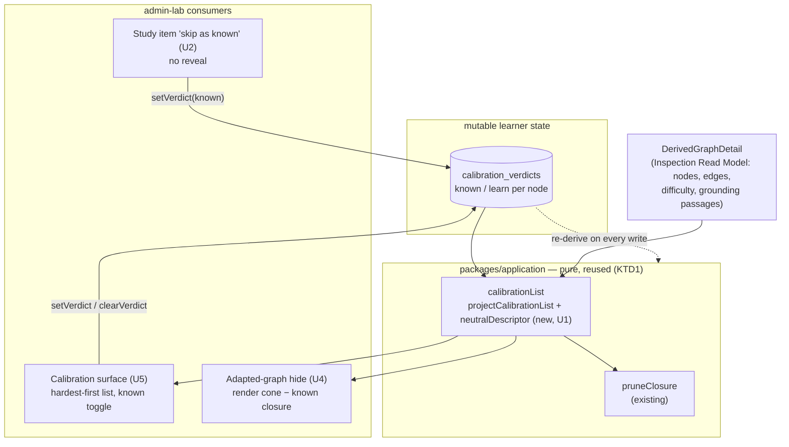

# feat: Calibration as a separate pre-study flow

## Summary

Make calibration its own optional pre-study surface: a single hardest-first list of a goal's
trusted prerequisite cone where the learner marks what they already know. Each `known` mark prunes
that concept's prerequisite closure — dropping the implied-known ancestors from the list and hiding
the whole known closure from the adapted graph. Marks are self-report only (label + neutral
descriptor, never a question or answer), so calibration can no longer leak study answers. The
intermixed reveal-then-"I knew it" card is removed, the `self_assessment` study-item type it
depended on is retired end-to-end, and a "skip as known" action on study items is a second door into
the same known set.

The whole feature is new *consumers* of one already-trusted pure core (`pruneClosure` in
`packages/application/src/calibrationClosure.ts`) plus a decisive removal of a now-redundant item
type — not new graph algorithms.

---

## Problem Frame

Calibration today is a branch of the study surface. A non-mastered concept with a `self_assessment`
item opens a card (`apps/admin-lab/src/lib/studySession.ts:62-83`, `sheetContentFor` → `calibration`
kind) that reveals the answer and then asks "did you know it?" — while the *same* concept also
carries an `option_select` study item that tests it. Calibrating a concept spoils the recall the
learner is later asked to perform. Two further gaps share that root: concepts marked known are
credited as mastered but still rendered in the adapted graph (it never shrinks as the learner
declares prior knowledge), and intrinsic difficulty is computed for every node yet drives nothing in
learner behavior even though it is exactly the signal that should decide how much calibration a
learner needs.

The fix separates the surface (a managed list, self-report only), makes difficulty *leverage* that
list (hardest-first ordering + closure pruning), and hides the known closure from the adapted graph
as projection-only compute. See origin: `docs/brainstorms/2026-06-27-calibration-pre-study-flow-requirements.md`.

---

## Requirements Traceability

**Calibration surface**

- R1. Calibration list for a goal — cone ∪ goal, each row label + neutral descriptor + known toggle, no Q/A text → U1, U5.
- R2. Order hardest-first by intrinsic difficulty → U1, U5.
- R3. Toggle records / clears a `known` verdict; verdicts mutable, per derived node, goal-independent → U5 (reuses existing `setVerdict`/`clearVerdict`).
- R4. A `known` mark hides its prerequisite-ancestors as implied-known; the marked node stays, shown known → U1, U5.
- R5. Calibration is optional; zero verdicts prune nothing → U4, U6.
- R6. Re-calibration is the same surface reopened — mark/unmark, no separate reset → U5, U6.

**Adapted-graph integration**

- R7. Adapted graph hides the full known closure, rendering only what is still to learn plus the goal → U4.
- R8. Hiding/pruning are learner-projection compute only; never mutate the published graph or Derived Graph Layer → U1, U4.

**Study-surface integration**

- R9. Each study item carries "skip as known" — records a `known` verdict, same prune-and-hide effect, reveals no answer → U2.
- R10. Remove calibration-as-a-study-branch; the intermixed reveal-then-"I knew it" card is gone → U2.

**Cleanup and trust**

- R11. Remove `self_assessment` across generation, storage, read; study items become option-select only → U3.
- R12. Neutral descriptor sourced from existing grounding, honoring provenance; no new generation pipeline → U1.
- R13. Calibration and intrinsic difficulty remain `EXPERIMENT_ONLY`; difficulty informs only ordering + closure leverage → U1, U3 (synthetic prefill).

---

## Key Technical Decisions

- **KTD1 — One pure projection module feeds every calibration surface.** A new
  `packages/application/src/calibrationList.ts` holds the pure list/closure/descriptor derivations
  and is consumed by the calibration surface (U5), the "skip as known" prune (U2), and the
  adapted-graph hide (U4). This reuses `pruneClosure` (`calibrationClosure.ts:22-30`) as the single
  definition of "known via calibration" (AGENTS rule 18) rather than re-deriving closure per surface.

- **KTD2 — Build the new projection as an application use-case, not raw UI SQL.** The origin flags
  that the *existing* study loader already crosses the Inspection Read Model seam (the architecture
  review's Candidate 2 in
  `docs/brainstorms/2026-06-27-architecture-deepening-opportunities.md`). This plan does **not** fix
  that drift, but it refuses to add more: the new list logic is a pure `application` function over
  the existing `DerivedGraphDetail` inspection read model + verdict store, so the admin-lab loader
  composes finished projections instead of issuing fresh raw SQL (ADR-0027, CONTEXT.md
  "Inspection Read Model").

- **KTD3 — Neutral descriptor = first grounding passage, bounded, provenance-labeled (resolves open
  question 1).** `DerivedGraphDetail.nodes[].grounding.passages` (`packages/ports/src/index.ts:635-646`)
  already carries `definition`/`mention` text with a `groundingOrigin` tag. The descriptor is the
  first `definition` passage (fallback first `mention`), trimmed to one sentence / ≤240 chars. A
  `document_anchored` / `source_mentioned` passage keeps the verbatim floor; an `llm_grounded`
  passage is labeled generated. No LLM call, no new pipeline (R12).

- **KTD4 — Hide is a render-time filter over a read model, classification stays whole-graph.** The
  adapted graph keeps classifying every node (readiness needs the hidden prerequisites' mastered
  state, which `composeMastery` already supplies), but renders only nodes outside the known closure.
  The goal target is never hidden even when marked known, so the surface never goes empty (R7, AE2).

- **KTD5 — "skip as known" reuses the existing verdict write; no new action or undo affordance
  (resolves open question 2).** The button calls the existing `setVerdict({ verdict: "known" })`
  (`apps/admin-lab/src/app/admin/lab/study/actions.ts:57`) with no reveal. Unmarking already lives on
  the calibration surface, which *is* the undo, so v1 adds no confirm/undo step (R6, R9, AE3).

- **KTD6 — Retire `self_assessment` decisively; keep the reserved discriminants and the citations
  table.** The `StudyItemType` union keeps its three reserved future types
  (`packages/domain-core/src/index.ts:1256-1261`) and `study_item_citations` stays (it still backs
  the option-select correct answer). Only the `self_assessment` payload, generation, schema, columns,
  and UI are removed (greenfield hard reset on the migration, AGENTS rules 8, 9, 18).

- **KTD7 — Synthetic prefill keeps verdict seeding, drops the answer-graded sample.** The
  `demo-calibrated` seed (`packages/application/src/syntheticResponses.ts`) loses its
  `SelfAssessmentItem` basis when the type goes. Its difficulty-based verdict seeding (the half that
  demonstrates calibration prefill) stays; the `self_assessment`-dependent free-text graded sample is
  removed rather than re-routed through option-select auto-grading — it is `EXPERIMENT_ONLY`
  scaffolding and the auto-grade path is already exercised live (rule 13).

---

## High-Level Technical Design

The architectural bet is **one pure core, three consumers, one mutable verdict store**. Calibration
verdicts are the only learner-state input; everything downstream is re-derived live from them.

Two derived sets fall out of one closure: the **list** hides only the *implied* ancestors
(`closure − directlyKnown`, keeping the marked node visible, R4), while the **adapted graph** hides
the *whole* closure (marked + ancestors, minus the goal, R7). Directional guidance — the exact
function signatures are an execution detail.

---

## Implementation Units

### U1. Pure calibration-list projection + neutral-descriptor helper

**Goal:** A pure `application` module that turns a goal + edges + node metadata + current verdicts
into the ordered, prune-aware calibration list, and derives the neutral descriptor from grounding —
the single core every calibration surface consumes (KTD1, KTD3).

**Requirements:** R1, R2, R4, R8, R12.

**Dependencies:** none (reuses existing `pruneClosure`).

**Files:**
- `packages/application/src/calibrationList.ts` (new) — `projectCalibrationList(...)` and `neutralDescriptor(...)`.
- `packages/application/src/calibrationList.test.ts` (new).
- `packages/application/src/index.ts` (export the new functions).

**Approach:**
- `projectCalibrationList({ targetDerivedNodeId, edges, nodes, knownVerdictNodeIds })` computes
  `cone = prerequisiteAncestors(target, trustedEdges) ∪ target`, `closure = pruneClosure(knownVerdictNodeIds ∩ cone, edges)`,
  `impliedHidden = closure − directlyKnown`. Returns rows for `cone − impliedHidden`, each
  `{ derivedNodeId, label, descriptor, difficulty, known }`, sorted difficulty desc with a stable id
  tie-break — mirroring `rankFrontier` in `adaptivePathProjection.ts:130-132`. Also returns the full
  `closure` set so U4's hide and U5's surface share one computation.
- Nodes missing a difficulty score sort last (treated as `0`), matching `classifyAdaptedNodes`
  (`adaptivePathProjection.ts:135`) and the origin's Dependencies note.
- `neutralDescriptor(passages, { maxChars: 240 })` picks the first `definition` passage (fallback
  first `mention`), trims to the first sentence or `maxChars`, and returns
  `{ text, provenance: "verbatim" | "generated" }` derived from `groundingOrigin`. Returns `null`
  when no passage exists (the row renders label-only).

**Patterns to follow:** `packages/application/src/calibrationClosure.ts` (pure, store-free, replayable
functions with the same comment register); trusted-edge filtering (`!uncertain`) exactly as
`pruneClosure` and `selectScopedFrontier` do.

**Test scenarios:**
- Covers AE1. Chain A → B → Z, mark B known: list returns Z and B (B shown `known`), A is absent (implied-known hidden).
- Hardest-first ordering: three cone nodes with descending difficulty return in that order; equal difficulty breaks by id deterministically.
- Missing-difficulty node sorts last (treated as 0), not first.
- Zero verdicts: list is the full cone ∪ goal, none marked known (R5 no-op shape).
- Goal with empty trusted cone (foundational root): list is the single goal row.
- Uncertain edges are excluded from the cone and the closure (a `known` across an uncertain edge does not hide the other side).
- `neutralDescriptor`: a `document_anchored` definition returns verbatim-tagged trimmed text; an `llm_grounded` passage returns generated-tagged text; no passages returns `null`; an over-long passage trims to ≤240 chars without splitting mid-word past the bound.

**Verification:** `tsx --test` over the new test passes; the module imports no store, clock, or port
adapter (pure), and `projectCalibrationList` is idempotent and ordering-independent in the verdict
input.

---

### U2. Reshape the study side-sheet — remove the reveal card, add "skip as known"

**Goal:** Collapse the study side-sheet to the post-calibration model: no reveal-then-"I knew it"
card (R10), and every cone/frontier study item gains a "skip as known" action that records a `known`
verdict with no answer shown (R9). This also removes the admin-lab layer's consumption of
`self_assessment`, clearing the way for U3.

**Requirements:** R9, R10. **Covers** AE3.

**Dependencies:** none structurally (reuses existing `setVerdict`); must land before U3 so the UI no
longer references `self_assessment` types when U3 deletes them.

**Files:**
- `apps/admin-lab/src/components/study/studyView.ts` — delete `StudyCardView`, `CalibrationChoice`, `verdictForChoice`, and the `calibration` `SheetContent` kind; simplify `mastered_review` to a cardless verdict-clearing review.
- `apps/admin-lab/src/components/study/StudySideSheet.tsx` — remove the `calibration`/`RecallCard` branch; add a "Skip as known" button to the `option_select` (and cardless cone-node) rendering.
- `apps/admin-lab/src/components/study/StudySession.tsx` — drop the reveal `onVerdict` wiring; add a `skipAsKnown(derivedNodeId)` handler calling `setVerdict({ verdict: "known" })`; keep `onClear`/restoration wiring.
- `apps/admin-lab/src/components/study/RecallCard.tsx` — delete.
- `apps/admin-lab/src/lib/studySession.ts` — remove `selfAssessmentItemsByNode` loading/field and the `calibration` branch in `sheetContentFor`; frontier → `option_select` or `cardless`.
- `apps/admin-lab/src/components/study/studyView.test.ts`, `apps/admin-lab/src/lib/studySession.test.ts` — update for the collapsed `SheetContent`.

**Approach:** `sheetContentFor` keeps `locked` / `mastered_review` / `option_select` / `cardless` and
drops `calibration`. The side-sheet header description loses "Reveal the answer…". "Skip as known" is
a small secondary button beside the option-select card and on a cardless cone node, so a learner can
declare prior knowledge inline without an answer ever rendering — the second door into the same
verdict set the calibration surface writes.

**Patterns to follow:** the existing `option_select` action path (`onSelect` →
`submitOptionSelect` → `revalidatePath`); the existing `clearVerdict` button shape in the
restoration card (`StudySession.tsx:218-231`).

**Test scenarios:**
- Covers AE3. "Skip as known" on a frontier option-select node records a `known` verdict and renders no answer/answer-key text at any point.
- `sheetContentFor` no longer returns a `calibration` kind for any node state; a frontier node with an option-select returns `option_select`, without one returns `cardless`.
- A mastered node with a prior `known` verdict still renders the verdict-clearing review (R7 reversal preserved) with no recall card.
- Snapshot/DOM assertion: the study side-sheet imports no `RecallCard` and exposes no "I knew it / I forgot" controls.

**Verification:** admin-lab type-checks with `RecallCard` deleted; study session still loads and
studies an option-select node; no rendered path reveals an answer before a graded submit.

---

### U3. Retire the `self_assessment` study-item type end-to-end

**Goal:** Remove `self_assessment` from generation, schema, storage, read, worker, synthetic prefill,
and the governing docs, so study items are option-select only and the answer-leak class is gone by
construction (R11). Greenfield hard reset on the migration (rules 8, 9, 18).

**Requirements:** R11, R13 (synthetic prefill stays `EXPERIMENT_ONLY`).

**Dependencies:** U2 (admin-lab no longer references the `self_assessment` types).

**Files:**
- `packages/domain-core/src/index.ts` — drop `SelfAssessmentItem` (`:1297`), `SelfAssessmentItemDraft` (`:1333`), narrow `StudyItem` (`:1314`) and `StudyItemDraft` (`:1356`) to option-select only, remove `"self_assessment"` from `StudyItemType` (`:1256`); keep `StudyItemBase`, `StudyItemCitation`, `StudyItemOption`, reserved future types, and the calibration `Verdict` types; repair comments.
- `packages/ports/src/index.ts` — remove `generate(...)` from `StudyItemGenerationPort` (`:420-429`) and the `SelfAssessmentItemDraft` import (`:10`); keep `generateOptionSelect`.
- `packages/infrastructure-litellm/src/toolSchemas.ts` — remove the `self_assessment` forced-tool schema + validator.
- `packages/infrastructure-litellm/src/studyItemGenerationAdapters.ts` (+ `.test.ts`) — remove the `generate` implementation.
- `packages/application/src/generateStudyItemBank.ts` (+ `.test.ts`) — delete generation branch (a) (`:98-130`) and `verifyCitations` if it becomes dead; node yields option-select-or-rejected.
- `packages/application/src/syntheticResponses.ts` (+ `.test.ts`) — retarget per KTD7: keep difficulty-based verdict seeding, drop the `SelfAssessmentItem` graded sample (and now-unused simulator/judge wiring).
- `packages/infrastructure-postgres/src/PostgresLearnerLoopStores.ts` (+ `.test.ts`) — remove `self_assessment` write/read mapping (`:37-43, 137-138, 161-168`); read returns option-select rows.
- `packages/infrastructure-postgres/src/migrations/0000_initial_lrnki_schema.sql` — `study_items.item_type` CHECK to option-select only (`:627`); drop `answer_key` + `self_report_prompt` columns (`:633-634`) and the type-coherence CHECK (`:641-645`); keep `study_item_citations`.
- `apps/kg-worker/src/knowledgeGraphWorker.ts` — remove the `self_assessment` filter/log (`:461, 651-652`) and update the synthetic-prefill call to the new signature.
- `apps/admin-lab/src/lib/learnerLoop.ts` — drop the `item_type = 'self_assessment'` join (`:292`).
- `apps/admin-lab/src/app/admin/lab/learner-loop/actions.ts` — remove the `item_type = 'self_assessment'` query branch (`:32`).
- `docs/adr/0026-typed-study-item-bank.md` — rewrite the self-assessment paragraph: study items are option-select only; calibration is a separate self-report surface keyed to derived nodes, not a card.
- `CONTEXT.md` — update **Study Item Bank** language (`:144-147`) to the option-select-only typed union; align calibration self-report language.

**Approach:** This is a single decisive removal (AGENTS rule 18: delete the superseded path in the
change that replaces it). After it, `SELECT DISTINCT item_type` yields only `option_select`, and the
DB cannot store an answer key. The DB is reset and re-initialized (rule 9), so no compatibility
migration is added.

**Execution note:** Land after U2 and keep the workspace type-checking at each package boundary —
remove the type's *consumers* before its *declaration* where a package would otherwise dangle.

**Test scenarios:**
- `generateStudyItemBank` produces only option-select items; a node grounding neither is a `RejectedStudyItem` with its reason; a node grounding an option-select but not previously a card is unaffected.
- `PostgresLearnerLoopStore` round-trips an option-select item with citations; inserting an item with a non-null `answer_key` is impossible (column removed) — schema-level assertion.
- Synthetic prefill seeds difficulty-based `known`/`learn` verdicts over the trusted cone (unchanged counts) and performs no `self_assessment` grading.
- `listStudyItemsForEnrichment` never returns a `self_assessment` item; `StudyItem` union is option-select only at the type boundary.
- Repo-wide: no source reference to `self_assessment` / `SelfAssessmentItem` remains (the migration, ADR-0026, and CONTEXT.md are updated in the same change).

**Verification:** full `tsc` across the workspace is green; the worker generates a study bank with
option-select items only on a real enrichment; a fresh DB init applies the edited single migration
cleanly.

---

### U4. Adapted graph hides the known closure

**Goal:** The adapted graph renders only the cone nodes still to learn plus the goal, hiding each
marked-known concept and its pruned ancestors as projection-only compute (R7, R8).

**Requirements:** R5, R7, R8. **Covers** AE1 (graph half), AE2.

**Dependencies:** U1 (closure computation).

**Files:**
- `apps/admin-lab/src/lib/studySession.ts` — reuse the already-computed `knownClosure` (`:196`) to produce a `visibleDetail` (nodes minus closure, edges among visible nodes), keeping the full-graph `classification` for readiness; never drop the goal target.
- `apps/admin-lab/src/lib/derivedGraph.ts` — `buildDerivedGraphView` / `DerivedGraphView` accept the visible node/edge set (or a `hiddenNodeIds` set) so the textual + cytoscape models stay in sync.
- `apps/admin-lab/src/components/study/StudySession.tsx` — pass the visible detail to `DerivedGraphExplorer`.
- `apps/admin-lab/src/lib/studySession.test.ts`, `apps/admin-lab/src/lib/derivedGraph.test.ts` — cover the hide.

**Approach:** Closure nodes are already mastered-via-calibration (`composeMastery`), so readiness of
the remaining nodes is correct without them on screen. The hide is a filter over the in-memory read
model (no graph or Derived Graph Layer write — R8). When the goal itself is marked known, the goal
row stays so the surface shows "the goal" rather than an empty canvas.

**Patterns to follow:** the existing neutral/adapted overlay in `buildDerivedGraphView`
(`derivedGraph.ts:191-244`); trusted-edge filtering already used for the cone.

**Test scenarios:**
- Covers AE1. Chain A → B → Z with B marked known: the adapted graph omits both A and B and renders Z.
- Covers AE2. Zero verdicts: every cone concept renders and the full path to the goal is present (no-op hide).
- Goal marked known: the goal node still renders (never empty), with no orphan edges to hidden nodes.
- Edges incident to a hidden node are dropped from both the cytoscape and textual models (no dangling endpoints).
- Hiding does not change `classification.stateByNode` for visible nodes (readiness computed over the whole graph).

**Verification:** on a real calibrated learner the adapted graph shrinks as marks are added and grows
back on unmark; no write port is imported by the loader path (structural R8 guarantee preserved).

---

### U5. Calibration surface — loader, route, and list

**Goal:** A separate, optional calibration surface for a chosen goal: the hardest-first list of the
goal's cone with per-row known toggles, implied-known ancestors hidden, reusing the existing verdict
write actions (R1–R6).

**Requirements:** R1, R2, R3, R4, R6. **Covers** AE4, AE5.

**Dependencies:** U1 (projection).

**Files:**
- `apps/admin-lab/src/lib/calibrationSession.ts` (new) — read-only loader composing `getEnrichmentDetail` + `PostgresCalibrationVerdictStore.listForLearner` + `projectCalibrationList` (U1) into a finished list view (KTD2).
- `apps/admin-lab/src/app/admin/lab/study/[learnerStateRef]/calibrate/page.tsx` (new) — server route reading `enrichmentId` + `target` query params; renders the list or a not-found.
- `apps/admin-lab/src/components/study/CalibrationList.tsx` (new) — client list; each row shows label, neutral descriptor (provenance-labeled), difficulty, and a known toggle calling the existing `setVerdict` / `clearVerdict` actions, each `revalidatePath`-ing the calibrate route.
- `apps/admin-lab/src/lib/calibrationSession.test.ts` (new) — loader composition + hide behavior.

**Approach:** Mirrors the study-session loader/route/driver triad but read-only over the list
projection — no graded path. Toggling on writes `known`; toggling off `clear`s the verdict (R3, R6);
the server re-derives the list so implied-known ancestors disappear/return live (R4, AE4). Because
verdicts persist per derived node independent of the session's goal, a node marked known under one
goal already appears known when the surface is opened for another goal whose cone includes it (AE5)
— no new persistence, the existing `calibration_verdicts` store carries it.

**Patterns to follow:** `apps/admin-lab/src/app/admin/lab/study/[learnerStateRef]/page.tsx` (server
load → client driver, `force-dynamic`); `GoalPicker.tsx` (client list with server-action links);
reuse `actions.ts` `setVerdict` / `clearVerdict` verbatim.

**Test scenarios:**
- Covers AE4. Mark B known (hides A), then unmark B: both A and B return to the list; A was never individually unmarkable while implied-known (it carried no row).
- Covers AE5. A `known` verdict recorded under goal Z appears pre-marked when the loader builds goal Y's list whose cone includes that node.
- The list renders hardest-first with each row's neutral descriptor and no question/answer text (R1, R2).
- Toggling a row on then off issues exactly one `setVerdict(known)` then one `clearVerdict` for that node.
- A foundational-root goal renders a single-row list (the goal itself).
- Loader returns `undefined` for an unknown enrichment/target (route → not-found), matching the study loader's absence contract.

**Verification:** opening `/admin/lab/study/<ref>/calibrate?enrichmentId=…&target=…` lists the cone
hardest-first; marking a hard concept visibly drops its easy prerequisites; reopening the surface
later shows persisted marks.

---

### U6. Optional calibration entry from study start and session

**Goal:** Wire calibration as an *optional* pre-study step — reachable from goal selection and
re-openable from the study session — so a learner may calibrate, skip, or re-calibrate at any time
(R5, R6; F1 "calibrate then study", F3 "re-calibrate").

**Requirements:** R5, R6.

**Dependencies:** U5 (the calibrate route exists).

**Files:**
- `apps/admin-lab/src/app/admin/lab/study/StudyStartForm.tsx` — after a goal + learner are chosen, offer "Open calibration (optional)" → the calibrate route alongside "Start studying" → the session route.
- `apps/admin-lab/src/app/admin/lab/study/page.tsx` — copy update reflecting the separate optional calibration step (the current text claims calibration happens "on the goal's graph in the next screen").
- `apps/admin-lab/src/components/study/StudySession.tsx` — a "Re-calibrate" link back to the calibrate route (R6, F3 re-entry).

**Approach:** Pure navigation + copy; both destinations carry the same `enrichmentId` + `target` +
`learnerStateRef`. No new state. Skipping calibration goes straight to study with zero verdicts (the
no-op path, R5).

**Patterns to follow:** the existing `router.push` query-param navigation in `StudyStartForm.tsx:19-24`;
the "New session" link in the session page header.

**Test scenarios:**
- Test expectation: light — assert "Open calibration" links to the calibrate route and "Start studying" to the session route, both preserving `enrichmentId`/`target`/learner ref.
- The session page exposes a "Re-calibrate" link to the calibrate route for the current goal + learner.
- Skipping calibration (straight to study) renders the full cone (zero-verdict no-op, consistent with U4 AE2).

**Verification:** from goal selection a learner can reach calibration, mark a few concepts, return to
study and see a shrunken adapted graph; and can re-open calibration from the session to correct a mark.

---

## Scope Boundaries

### Deferred to follow-up work

- **Candidate 2 study-projection refactor.** Moving the *existing* `studySession.ts` raw-SQL learner
  projection behind a use-case + Inspection Read port
  (`docs/brainstorms/2026-06-27-architecture-deepening-opportunities.md`). This plan builds its new
  projection clean (KTD2) but does not migrate the existing loader.
- **Synthetic graded prefill via option-select auto-grade.** KTD7 drops the graded sample; re-adding
  it through the auto-grade path is a separate, optional scaffolding improvement.

### Deferred for later (origin)

- Adaptive / sequential one-at-a-time probing (probe hardest, descend on "don't know") — revisit if
  the list proves insufficient.
- Individually unmarking a transitively-implied (hidden) prerequisite without unmarking its dependent
  (AE4 documents the v1 path).
- Flow-state remediation (logging wrong answers to propose easier related concepts) — the
  `struggledNodes` / `suggestRestorations` seam already exists for it.
- A two-column Known / To-learn shuttle UI — a single-list toggle is chosen instead.

### Outside this product's identity (origin)

- Promoting intrinsic difficulty or introducing learner modeling (IRT/KT/population) out of
  `EXPERIMENT_ONLY` (ADR-0024). Difficulty informs only list ordering and closure leverage.

---

## Open Questions (resolved during planning)

- **Neutral descriptor field + length bound** → resolved by KTD3: first `definition` passage (fallback
  `mention`) from `node.grounding.passages`, one sentence / ≤240 chars, provenance-labeled.
- **"Skip as known" undo/confirm affordance** → resolved by KTD5: none in v1; the calibration surface
  is the undo.

---

## System-Wide Impact

- **Database (reset):** `study_items` loses `answer_key`, `self_report_prompt`, and the
  `self_assessment` discriminant; the single initial migration is edited in place and the dev DB is
  re-initialized (rules 8, 9). No production data to preserve (greenfield).
- **Worker:** the study-item generation operation produces option-select items only; the synthetic
  prefill seed changes signature (verdict-only).
- **Admin Lab learner:** the study flow gains a separate calibration surface and an inline "skip as
  known"; the adapted graph now shrinks with declared knowledge. No auth/identity change (learner ref
  stays mocked).
- **Canonical docs:** ADR-0026 and CONTEXT.md "Study Item Bank" are updated in the same change as the
  type removal (rule 18); ADR-0024/0027 are unchanged (referenced, not amended).

---

## Risks & Dependencies

- **Cross-package compile coupling during U3.** Removing a type referenced across seven packages can
  leave intermediate red states. Mitigation: U2 strips admin-lab's references first; U3 removes
  consumers before the declaration within each package; keep `tsc` green at each boundary
  (Execution note on U3).
- **Hidden-edge dangling endpoints (U4).** Filtering nodes without filtering incident edges would
  leave orphan edges. Mitigation: filter nodes and their incident edges together; explicit test.
- **Descriptor provenance leak (U1).** A generated passage mislabeled as verbatim would violate the
  grounding contract. Mitigation: provenance is derived from `groundingOrigin`, asserted in tests
  (R12, CONTEXT.md "Grounding Provenance").
- **Difficulty drives behavior for the first time (ordering + leverage).** Stays `EXPERIMENT_ONLY`
  (R13); no promotion to a calibrated learner-modeling signal.

---

## Real-Use Validation

Per AGENTS rule 14, after U4–U6 land, apply `.agents/skills/real-use-quality-evaluation/SKILL.md` on
a real enrichment: pick a multi-prerequisite goal, calibrate a few high-difficulty concepts, confirm
(a) the list drops their easy prerequisites, (b) the adapted graph hides the known closure and grows
back on unmark, (c) "skip as known" reveals no answer, and (d) a mark persists across a second goal
whose cone includes it. A green unit suite is not quality evidence.

---

## Sources & Research

- Intermixed calibration card / reveal path: `apps/admin-lab/src/lib/studySession.ts:62-83`, `apps/admin-lab/src/components/study/StudySideSheet.tsx:50-68`, `apps/admin-lab/src/components/study/RecallCard.tsx`.
- Pure closure core to reuse: `packages/application/src/calibrationClosure.ts` (`pruneClosure`, `composeMastery`, `struggledNodes`, `suggestRestorations`).
- Adapted-graph classification / single definition of readiness: `packages/application/src/adaptivePathProjection.ts`.
- Descriptor source (grounding passages on the read model): `packages/ports/src/index.ts:635-660`; loader exposure in `apps/admin-lab/src/lib/derivedGraph.ts`.
- Mutable verdict store + existing write actions: `packages/infrastructure-postgres/.../0000_initial_lrnki_schema.sql:713-719`, `packages/ports/src/index.ts:457-469`, `apps/admin-lab/src/app/admin/lab/study/actions.ts:54-81`.
- `self_assessment` removal surface: `packages/domain-core/src/index.ts:1247-1356`, `packages/ports/src/index.ts:410-442`, `packages/infrastructure-litellm/src/{toolSchemas,studyItemGenerationAdapters}.ts`, `packages/application/src/{generateStudyItemBank,syntheticResponses,optionSelectGuard}.ts`, `packages/infrastructure-postgres/src/PostgresLearnerLoopStores.ts`, `apps/kg-worker/src/knowledgeGraphWorker.ts`.
- Architecture context (Candidate 2, held out of scope): `docs/brainstorms/2026-06-27-architecture-deepening-opportunities.md`.
- Governing decisions: `docs/adr/0024-learner-neutral-intrinsic-difficulty.md`, `docs/adr/0026-typed-study-item-bank.md`, `docs/adr/0027-serve-inspection-through-read-model-ports.md`.
