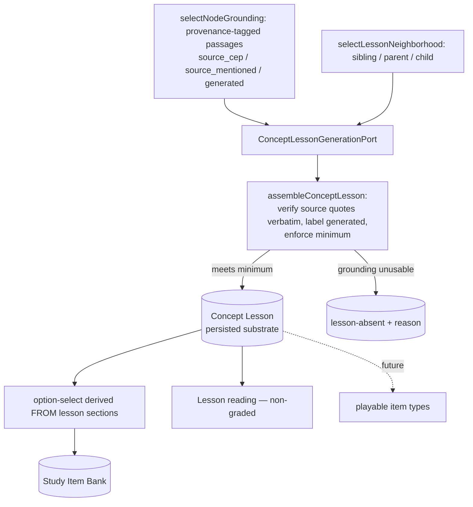
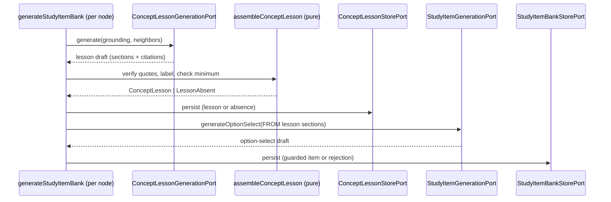

# feat: Concept Lesson — a grounded teaching substrate

## Summary

Generate one **Concept Lesson** per derived node — an ordered, source-grounded teaching artifact
(gist → intuition → definition → examples → graph-aware applications → formulas) — persist it as a
regenerable learner-neutral substrate, re-point option-select generation to derive from it, and show
it before the option-select item in the Study Session. Every section is independently optional and
honestly labeled `source`-cited or `generated`; reading is non-graded.

---

## Problem Frame

Today a learner can be *tested* but never *taught*. The system already extracts rich per-node
grounding — CEP definitions, source mentions, generated bundles — but consumes it only to manufacture
an option-select quiz; nothing surfaces the actual content of a concept to read. The teaching surface
itself is the gap (see origin: `docs/brainstorms/2026-06-29-concept-lesson-teaching-surface-requirements.md`).

The work also closes a single-source gap (AGENTS rule 18): once a lesson exists, no study-item type
should still derive independently from raw passages. The lesson becomes the substrate; option-select
becomes a mechanical projection of it.

---

## High-Level Technical Design

The Concept Lesson reuses the proven per-node asset pattern in `generateStudyItemBank.ts`: a
learner-neutral use-case walks the Derived Graph Layer's nodes, selects provenance-tagged grounding by
node kind, generates an asset behind a forced-tool schema, verifies citations, and persists through a
store port with no graph/enrichment write port in scope (R9).

**Substrate data flow** — the lesson is the single source; option-select and (future) games are
projections of it:

**Per-node one-pass sequence** inside the existing `study_items` operation (one worker run, one
operation type — no `operation_type` enum migration). Lesson generation is a new stage *before* the
option-select stage:

The Study Session integration rides the lesson down through the pure `composeStudySession` projection
into `StudySideSheet.tsx`, rendered ahead of `OptionSelectCard` for frontier nodes. Reading writes no
Response Log row (R13) — the lesson view simply has no write path.

---

## Requirements

Carried from the origin requirements doc; R-IDs preserved.

**Artifact and sections**

- R1. One Concept Lesson per derived node, keyed to `derivedNodeId`, generated alongside the Study
  Item Bank as a learner-neutral asset.
- R2. A lesson is an ordered set of typed, independently-optional sections: gist, intuition,
  definition (with notation), examples, applications, formulas/methods.
- R3. A section that cannot be produced or grounded is absent, not placeholder. A lesson is valid only
  if it meets the minimum — a gist, at least one application, and at least one substantive section
  (definition, examples, or formulas) that is source-cited where the source supports it and otherwise
  generated. A node whose grounding cannot meet the minimum is recorded lesson-absent with a reason.
- R4. Section prompts are domain-neutral and never assume a section applies.
- R5. The applications section is graph-aware: it draws on the node's sibling, parent, and child
  neighbors in the Derived Graph Layer.

**Provenance and honesty**

- R6. Each section carries grounding provenance: source-cited where source evidence supports it,
  `generated` (labeled) otherwise.
- R7. Definition, examples, and formulas are source-cited where the source has them; gist, intuition,
  analogies, and applications are `generated`.
- R8. Source citations verify verbatim against source blocks; generated sections carry no source ids
  and never present as source quotes (reuse the `StudyItemCitation` contract).

**Generation, lifecycle, substrate**

- R9. The lesson is regenerable and never mutates the asserted graph or the Derived Graph Layer; its
  generation imports no graph or enrichment write port.
- R10. Option-select generation derives from the Concept Lesson; no study-item type derives from raw
  passages once a lesson exists.
- R11. Synthesized sections are generated unconditionally this iteration and labeled `generated`;
  confidence-gating is deferred to ADR-0030.

**Study Session integration**

- R12. The Study Session shows a node's Concept Lesson before its option-select item.
- R13. Reading a lesson writes no Response Log row; only option-select grades.

**Future seams**

- R14. A section may carry an optional generated diagram descriptor; rendering descriptors into
  visuals is out of scope.
- R15. The lesson structure is game-ready — rich enough to feed future playable projections — but no
  game UX ships in this iteration.

---

## Key Technical Decisions

- KTD1. **One-pass generation in the `study_items` operation.** Lesson generation is a new stage
  *before* the option-select stage in the existing per-node loop; the lesson is persisted via its own
  store, and option-select derives from the in-memory lesson in the same pass. This keeps one worker
  run and avoids an `operation_type` enum migration. *Confirmed with the user; quality of the
  resulting items must be verified through the real-use gate (Documentation / Operational Notes).*
  Alternative considered: two separate operations (cleaner separation, but a new operation type, a
  second worker command, and a read-after-write coupling) — rejected.

- KTD2. **Reuse the existing provenance contract, do not invent one.** Lesson sections reuse
  `StudyItemGroundingProvenance` (`source_cep | source_mentioned | generated`) and `StudyItemCitation`
  (the discriminated union where `source` carries `sourceResourceId`/`sourceBlockId`/verbatim quote and
  `generated` carries `derivedNodeId`/`passageText`). This is what keeps R8 honest mechanically and
  satisfies rule 18. Verbatim verification reuses `evidenceQuoteMatches`
  (`packages/domain-core/src/index.ts:216`).

- KTD3. **Grounding selection becomes a shared module.** The per-node `selectNodeGrounding` logic
  currently private in `generateStudyItemBank.ts` is extracted so the lesson is its only consumer of
  raw passages; option-select stops calling it and reads the lesson instead (R10, rule 18).

- KTD4. **Minimum-validity reads toward R3, not the looser acceptance-example wording.** A
  minted/`llm_grounded` node's *generated* substantive section satisfies the minimum, so a node is
  recorded lesson-absent only when its grounding is entirely unusable (the existing "no usable
  grounding passages" condition). This resolves AE3's "source-grounded section" phrasing toward R3's
  stated rule. *Confirmed with the user.*

- KTD5. **Lesson rides the projection; it is not served through a read port directly.** `composeStudySession`
  gains a `lessonByNode` field built from lessons loaded by `getStudySession` through a new
  `ConceptLessonStorePort`, mirroring how study items already ride down (ADR-0027 — a projection may
  read a read model and add compute, it may not be served *through* a read port).

- KTD6. **Diagram descriptor is a thin typed seam.** R14 ships an optional `{ caption, spec }` field on
  a section, generated and domain-neutral, persisted but never rendered. Resolves origin Q3 minimally.

- KTD7. **New ADR-0031 over amending ADR-0026.** The substrate principle (lesson is the single source;
  option-select is a projection) is a durable architectural decision distinct from the typed
  study-item bank; it warrants its own ADR and a CONTEXT.md term.

---

## Implementation Units

### U1. Concept Lesson domain types and stage tag

- **Goal:** Add the `ConceptLesson` type family and the lesson generation stage tag, reusing the
  existing provenance/citation contract.
- **Requirements:** R1, R2, R6, R7, R14, R15.
- **Dependencies:** none.
- **Files:** `packages/domain-core/src/index.ts` (types + `STAGE_TAGS`),
  `packages/domain-core/src/conceptLesson.test.ts` (new).
- **Approach:** Define `ConceptLessonSectionKind` (`gist | intuition | definition | examples |
  applications | formulas`), a `ConceptLessonSection` carrying `kind`, `text`, `groundingProvenance`,
  optional `citation: StudyItemCitation`, and optional `diagram: { caption: string; spec: string }`
  (R14). Define `ConceptLesson` keyed to `derivedNodeId` + `enrichmentId` + `graphVersionId` +
  `generatingModel` + `configHash` + ordered `sections`, and `LessonAbsentNode` (`derivedNodeId`,
  `canonicalLabel`, `reason`). Reuse `StudyItemGroundingProvenance`/`StudyItemCitation` — do not
  redeclare them. Add `STAGE_TAGS.conceptLessonGeneration = "concept-lesson-generation"`. Edit with
  `grep -a` — this file carries a NUL byte and plain grep reports it binary.
- **Patterns to follow:** the `StudyItem`/`StudyItemBase` block at
  `packages/domain-core/src/index.ts:1276-1305`; the `STAGE_TAGS` const near the file tail.
- **Test scenarios:**
  - A section with `groundingProvenance: "generated"` type-rejects a `source` citation shape and
    accepts `{ provenance: "generated"; derivedNodeId; passageText }` (type-level + a small structural
    guard if one is added).
  - `isStageTag("concept-lesson-generation")` returns true, keeping the cost ⋈ wall-clock join key
    closed.
  - Test expectation: mostly type-shape assertions; behavioral validity lives in U6.

### U2. Forced-tool Concept Lesson schema

- **Goal:** A single-source zod validator + derived JSON Schema for the lesson generation tool
  (ADR-0006), with every section independently optional and domain-neutral.
- **Requirements:** R2, R4, R6, R7, R14.
- **Dependencies:** U1.
- **Files:** `packages/infrastructure-litellm/src/toolSchemas.ts`,
  `packages/infrastructure-litellm/src/toolSchemas.test.ts`,
  `packages/infrastructure-litellm/src/forcedToolSchema.test.ts`.
- **Approach:** Add `conceptLessonValidator` and `conceptLessonSchema = toForcedToolSchema(conceptLessonValidator)`,
  and register the validator in the `toolValidators` array. Each section is modelled nullable (strict
  forced-tool mode requires every property in `required`; optionals are nullable per the file's
  header). Each producible section carries `text`, an optional citation `{ passageId, evidenceQuote }`
  (the draft-time citation shape, verified at the boundary), and an optional diagram descriptor.
  `description` fields stay domain-neutral and name no fixture concept (AGENTS rule 17) — they describe
  section roles (a one-line advance organizer; a concrete intuition before the formal definition;
  graph-neighbor-bridging applications), never a domain.
- **Patterns to follow:** `optionSelectValidator`/`optionSelectSchema` and `passageCitation` at
  `packages/infrastructure-litellm/src/toolSchemas.ts:14-17,324-333`.
- **Test scenarios:**
  - `toForcedToolSchema(conceptLessonValidator)` yields `strict: true`, `additionalProperties: false`,
    and every property present in `required` (optional sections expressed as nullable).
  - The validator accepts a lesson with only gist + one application + one definition section (R3
    minimum) and rejects an empty `text` on any present section.
  - `conceptLessonValidator` is included in `toolValidators` (the array the registration test iterates).
  - A diagram descriptor with `caption` + `spec` validates; absence validates (nullable).

### U3. Graph-aware directional neighbor selection

- **Goal:** A pure selector that returns a node's sibling, parent (prerequisite), and child
  (dependent) neighbors for the graph-aware applications section.
- **Requirements:** R5.
- **Dependencies:** U1.
- **Files:** `packages/application/src/selectLessonNeighborhood.ts` (new),
  `packages/application/src/selectLessonNeighborhood.test.ts` (new),
  `packages/application/src/index.ts` (export).
- **Approach:** From a `DerivedGraphLayer`'s `prerequisiteEdges`, partition same-domain neighbors into
  `parents` (edges where the node is the dependent), `children` (edges where the node is the
  prerequisite), and `siblings` (same-domain, prerequisite-adjacency not in the parent/child sets),
  each capped and in stable layer order. Return label + grounding snippet per neighbor (reuse the
  snippet logic from `selectSiblingContext`). Pure — prompt context only; a neighbor-poor node still
  produces a lesson, just with a thinner applications section.
- **Patterns to follow:** `selectSiblingContext` partition-not-sort determinism at
  `packages/application/src/selectSiblingContext.ts:25-49`.
- **Test scenarios:**
  - Covers R5. A node with one prerequisite edge and one dependent edge returns that prerequisite in
    `parents` and that dependent in `children`, never duplicated into `siblings`.
  - Same-domain non-adjacent nodes land in `siblings`; cross-domain nodes are excluded.
  - Ordering is deterministic across two calls on the same layer; caps bound each partition.
  - A node with no edges returns empty parents/children and still returns same-domain siblings.

### U4. Concept Lesson generation port and LiteLLM adapter

- **Goal:** The owning port and its DeepSeek-family adapter that turns grounding + neighbors into a
  lesson draft.
- **Requirements:** R2, R4, R6, R7, R11, R14.
- **Dependencies:** U1, U2.
- **Files:** `packages/ports/src/index.ts` (`ConceptLessonGenerationPort`),
  `packages/infrastructure-litellm/src/conceptLessonGenerationAdapters.ts` (new),
  `packages/infrastructure-litellm/src/conceptLessonGenerationAdapters.test.ts` (new),
  `packages/infrastructure-litellm/src/index.ts` (export).
- **Approach:** `ConceptLessonGenerationPort.generate(input)` takes `declaredDomain`, the node
  descriptor, `groundingProvenance`, provenance-tagged `groundingPassages`, and the directional
  `neighbors`; returns a lesson draft (sections with text, draft citations by `passageId`, optional
  diagram). The adapter mirrors `LiteLlmStudyItemGenerationAdapter`: domain-neutral system/user prompts
  that order sections gist→intuition→definition→examples→applications→formulas, instruct the model to
  cite source-supported sections by `passageId` (verbatim for source-grounded passages) and leave
  synthesized sections uncited, and call `client.call` with `conceptLessonSchema`/`conceptLessonValidator`
  tagged `STAGE_TAGS.conceptLessonGeneration`. Model is `EVIDENCE_PROFILE_MODEL` (DeepSeek V4 Flash,
  AGENTS rule 5). No confidence gate (R11). Section provenance reflects the grounding contract; the
  pure boundary (U6) re-derives provenance authoritatively from matched passages.
- **Patterns to follow:** `LiteLlmStudyItemGenerationAdapter`
  (`packages/infrastructure-litellm/src/studyItemGenerationAdapters.ts`) and
  `LiteLlmGroundingGenerationAdapter` (`packages/infrastructure-litellm/src/groundingGenerationAdapters.ts`).
- **Test scenarios:**
  - With a fake `LiteLlmForcedToolClient`, `generate` issues one call with the lesson tool name, the
    lesson schema, and the lesson stage tag.
  - Rendered grounding passages and the parent/child/sibling neighbor lists appear in the user message.
  - A returned draft with a `generated`-provenance node yields generated-labeled sections and no
    source citation passed through.
  - Covers R4. The system prompt names no domain and asserts no section is mandatory.

### U5. Concept Lesson persistence — store port, Postgres store, migration

- **Goal:** Persist lessons and lesson-absences as a regenerable learner-neutral substrate, with an
  inspection view, mirroring the Study Item Bank store.
- **Requirements:** R1, R3, R9.
- **Dependencies:** U1.
- **Files:** `packages/ports/src/index.ts` (`ConceptLessonStorePort`),
  `packages/infrastructure-postgres/src/PostgresLearnerLoopStores.ts` (`PostgresConceptLessonStore`),
  `packages/infrastructure-postgres/src/index.ts` (export),
  `packages/infrastructure-postgres/src/migrations/0000_initial_lrnki_schema.sql`,
  `packages/infrastructure-postgres/src/PostgresStores.test.ts`.
- **Approach:** `ConceptLessonStorePort` exposes `persist({ graphVersionId, enrichmentId, configHash,
  lessons, absent })`, `getLesson(derivedNodeId)`, and `listLessonsForEnrichment(enrichmentId)`. The
  Postgres store writes normalized `concept_lessons` + `concept_lesson_sections` +
  `concept_lesson_section_citations` (the query surface) and `lesson_absent_nodes`, plus the immutable
  `concept_lesson` artifact, all in one transaction; regeneration is replace-by-enrichment (delete then
  re-insert) exactly like the Study Item Bank store. Add an `artifact_concept_lessons` `JSON_TABLE`
  view for inspection. Edit the single `0000` migration in place (AGENTS rule 8); a DB reset is allowed
  (rule 9). No graph/enrichment write port is imported (R9).
- **Patterns to follow:** `PostgresStudyItemBankStore`
  (`packages/infrastructure-postgres/src/PostgresLearnerLoopStores.ts:19-94`), the `study_items` /
  `rejected_study_items` tables and the `artifact_study_items` view in the migration
  (`...0000_initial_lrnki_schema.sql:399-418,622-700`).
- **Test scenarios:**
  - Covers R1. Persist a two-section lesson and read it back by `derivedNodeId` with sections,
    provenance, and citations intact.
  - Regenerating an enrichment replaces its prior lessons and absences rather than appending (no stale
    rows).
  - Covers R3. A `lesson_absent_nodes` row round-trips with its reason and is not returned by
    `getLesson`.
  - The `artifact_concept_lessons` view flattens one row per persisted lesson from the JSON artifact.
  - A source citation persists `sourceResourceId`/`sourceBlockId`/`evidenceQuote`; a generated citation
    persists `derivedNodeId`/`passageText` with null source ids.

### U6. Lesson assembly use-case — verify, label, enforce minimum, persist

- **Goal:** The per-node assembly that gathers grounding and neighbors, verifies source citations
  verbatim, labels generated sections, enforces the R3 minimum, and persists a lesson or a
  lesson-absence — wired into the `study_items` operation as a new stage.
- **Requirements:** R1, R3, R5, R6, R7, R8, R9, R11.
- **Dependencies:** U1, U3, U4, U5.
- **Files:** `packages/application/src/selectNodeGrounding.ts` (new — extracted shared selector),
  `packages/application/src/assembleConceptLesson.ts` (new — pure assembly),
  `packages/application/src/assembleConceptLesson.test.ts` (new),
  `packages/application/src/generateStudyItemBank.ts` (add the lesson stage + persist),
  `packages/application/src/index.ts` (exports),
  `apps/kg-worker/src/knowledgeGraphWorker.ts` (inject `conceptLessonGeneration` + `conceptLessonStore`
  into `buildContext`).
- **Approach:** Extract the private `selectNodeGrounding` into a shared module (KTD3). `assembleConceptLesson`
  is pure: for each draft section, re-derive provenance authoritatively — a section is `source`-cited
  only when its quote verifies verbatim against the cited grounding passage (`evidenceQuoteMatches`);
  otherwise it is dropped to `generated` (with the generated citation) or omitted if not even
  generated-grounded. Enforce the minimum (gist + ≥1 application + ≥1 substantive section) per R3/KTD4;
  a node whose grounding is entirely unusable produces a `LessonAbsentNode` with the reason. In the
  orchestrator, run a new `conceptLessonGeneration` stage per node before the option-select stage,
  bracketed under the existing `study_items` operation with `STAGE_TAGS.conceptLessonGeneration`, and
  persist lessons + absences through the lesson store. Optionally rename `generateStudyItemBank` to
  reflect it now produces both assets (mechanical; non-blocking). No graph/enrichment write port (R9).
- **Patterns to follow:** the per-node loop, reporter bracketing, and reject-on-fail in
  `generateStudyItemBank.ts:80-158`; `selectNodeGrounding` at `generateStudyItemBank.ts:171-231`.
- **Execution note:** Start the pure assembler test-first — its provenance/minimum logic is the
  correctness core and the acceptance examples land here.
- **Test scenarios:**
  - Covers AE2. A definition whose quote appears verbatim in a source passage yields a `source`-cited
    definition section that verifies; the same lesson's intuition is `generated` with no source id.
  - Covers AE1, R3, R4. A node with no notation/formula grounding produces gist, intuition, definition,
    examples, applications and no formulas section and no placeholder.
  - Covers AE3, KTD4. A node whose grounding is entirely unusable is recorded lesson-absent with a
    reason — not a thin or all-synthesized lesson.
  - Covers AE5, R3, R7. An `llm_grounded` minted node produces a lesson whose substantive section is
    generated from its bundle and whose whole lesson is `generated`-labeled — it meets the minimum.
  - Covers R8. A draft citation whose quote does not verify verbatim against its passage is demoted to
    generated (or dropped), never persisted as a source quote.
  - The orchestrator records a lesson-generation stage under the `study_items` operation and persists
    through the lesson store without importing a graph/enrichment write port.

### U7. Re-point option-select to derive from the lesson

- **Goal:** Option-select derives its grounding from the persisted/in-memory lesson's source-cited
  sections; the raw-passage feed for option-select is deleted (R10, rule 18).
- **Requirements:** R10.
- **Dependencies:** U6.
- **Files:** `packages/application/src/generateStudyItemBank.ts`,
  `packages/infrastructure-litellm/src/studyItemGenerationAdapters.ts`,
  `packages/application/src/optionSelectGuard.ts` (if the guard's grounding input shape changes),
  `apps/kg-worker/src/knowledgeGraphWorker.ts` (command), plus the affected `.test.ts` siblings.
- **Approach:** Feed `generateOptionSelect` the lesson's source-cited sections (their passages +
  citations) as its grounding input instead of `selectNodeGrounding`'s raw passages. The verbatim chain
  holds: the lesson's source citations already verified against source blocks, so the guard's verbatim
  check still anchors to source text. Delete the now-superseded raw-passage path for option-select so
  only the lesson feeds items (rule 18). A node recorded lesson-absent yields no option-select item
  (the existing rejection path, with a reason that names the missing lesson).
- **Patterns to follow:** the option-select call + guard in `generateStudyItemBank.ts:90-114` and
  `optionSelectGuard.ts`.
- **Test scenarios:**
  - Covers R10. Option-select grounding for a source node is sourced from the lesson's source-cited
    sections; the generated draft cites a lesson passage and the guard verifies it verbatim to source.
  - A minted node's option-select is grounded in the generated lesson sections and labeled
    `generated`, with the guard accepting the generated provenance.
  - A lesson-absent node produces no option-select item and a rejection reason referencing the absent
    lesson.
  - No code path remains where option-select reads `selectNodeGrounding` directly (the raw-passage feed
    is gone).

### U8. Study Session integration — lesson rides down, renders before item, lesson-absent visible

- **Goal:** The Study Session carries each node's lesson, renders it ahead of the option-select for
  frontier nodes, keeps reading non-graded, and gives the operator thin lesson-absent visibility for
  the quality gate.
- **Requirements:** R12, R13.
- **Dependencies:** U5, U6.
- **Files:** `packages/application/src/studySessionProjection.ts` (add `lessonByNode` + a
  `ConceptLessonView`), `packages/application/src/getStudySession.ts` (load via `ConceptLessonStorePort`),
  `packages/application/src/studySessionProjection.test.ts`,
  `apps/admin-lab/src/lib/studySession.ts` (inject the lesson store),
  `apps/admin-lab/src/components/study/ConceptLessonCard.tsx` (new),
  `apps/admin-lab/src/components/study/StudySideSheet.tsx` (render the lesson above `OptionSelectCard`),
  `apps/admin-lab/src/components/study/studyView.ts` (re-export the lesson view type),
  plus the component test sibling.
- **Approach:** `composeStudySession` gains `lessonByNode: Record<string, ConceptLessonView>` built
  from lessons loaded by `getStudySession` through a new injected `ConceptLessonStorePort` (KTD5). The
  pure compose stays data-in/data-out. `ConceptLessonCard` renders ordered sections with a clear
  `source`/`generated` provenance badge per section; `StudySideSheet` shows it above `OptionSelectCard`
  for the `option_select`/`cardless` frontier arms. Reading writes nothing (R13) — no new server action.
  For lesson-absent visibility, surface a thin count/list (reuse the rejected-study-item display
  shape) so an operator inspecting a run sees which nodes have no lesson — scoped minimal per the
  user's "defer if too big" allowance.
- **Patterns to follow:** how study items ride down `composeStudySession`
  (`studySessionProjection.ts:185-282`), `getStudySession`'s parallel port loads
  (`getStudySession.ts:30-44`), `OptionSelectCard` and the frontier arm in `StudySideSheet.tsx:86-94`.
- **Test scenarios:**
  - Covers AE4, R12. A frontier node's composed session exposes its lesson in `lessonByNode`; the side
    sheet renders the lesson before the option-select card.
  - Covers R13. Reading a lesson appends no Response Log row; answering the option-select still appends
    exactly one graded row.
  - A node with no lesson (lesson-absent) renders the item (or cardless) without a lesson block and does
    not error.
  - The lesson card labels a `generated` section distinctly from a `source`-cited section.
  - Lesson-absent nodes appear in the operator visibility surface with their reason.

### U9. Documentation — ADR-0031, CONTEXT.md term, reference repair

- **Goal:** Record the substrate decision and name the concept canonically, repairing superseded
  references in the same change.
- **Requirements:** supports R1, R10 (durable rationale); AGENTS documentation-authority rules.
- **Dependencies:** U1, U6 (shape settled).
- **Files:** `docs/adr/0031-concept-lesson-teaching-substrate.md` (new), `docs/adr/README.md`,
  `CONTEXT.md`.
- **Approach:** ADR-0031 records: the Concept Lesson as the single learner-neutral teaching substrate;
  option-select as a projection of it (R10, rule 18); provenance honesty by reuse (KTD2); the
  one-pass operation shape (KTD1); and the relationship to ADR-0026 (typed study items) and ADR-0030
  (future confidence-gating). Add a CONTEXT.md **Concept Lesson** entry (keyed to `derived_node_id`,
  ordered optional honest-provenance sections, non-graded, the substrate that study items derive from)
  and **repair the Study Session entry** whose `_Avoid_` list currently forbids "lesson" — "Concept
  Lesson" is now a distinct concept, so adjust that avoid-list and generalize the **Grounding
  Provenance** entry to note it is shared by the Concept Lesson, not only the Study Item Bank. Append
  ADR-0031 to the README index.
- **Test scenarios:** Test expectation: none — documentation only. Verify the CONTEXT.md Study Session
  `_Avoid_` no longer contradicts the new term and the ADR README links resolve.

---

## Scope Boundaries

**Deferred for later**

- Real game UX and the Learner App itself — the AGENTS rule 22 priority, but the step after this one.
- Diagram rendering — only the optional generated descriptor seam (R14) exists now.
- Confidence-gated synthesis and the `web_grounded` fallback — owned by ADR-0030 (Proposed).
- New graded item types beyond option-select; free-form learner-text grading stays retired.

**Outside this iteration's identity**

- Per-learner personalization of lesson content — the lesson is learner-neutral; personalization
  belongs to downstream projection and the Learner App (ADR-0002).

**Deferred to follow-up work**

- Renaming `generateStudyItemBank` to a study-assets name — mechanical, non-blocking; the implementer
  may do it within U6 or leave it.
- Richer operator tooling around lesson-absent nodes beyond the thin visibility in U8.

---

## Open Questions

- Q5 (origin). Final section ordering and per-section length budgets are provisional (the prompt sets
  brief budgets); they are tuned during the real-use quality gate, not pinned in the plan.
- Whether the lesson card needs a per-section collapse/disclosure affordance for long lessons in the
  Admin Lab — resolve during U8 from the real rendered length, not now.

---

## Risks & Dependencies

- **Generation cost and latency.** A second per-node LLM call (lesson) on top of option-select roughly
  doubles per-node generation work. The new stage is tagged for the cost ⋈ wall-clock join (R-cost
  observability), so the real-use gate measures it; the one-pass loop already supports bounded
  concurrency (`DEFAULT_STUDY_ITEM_CONCURRENCY`). Mitigation: the stage tag makes regressions visible
  immediately.
- **Verbatim chain through the lesson.** Option-select now verifies against lesson citations rather
  than raw passages (U7); if the lesson's source citation is wrong, the item inherits it. Mitigation:
  the assembler (U6) demotes any unverifiable citation to generated before persistence, so an item can
  never cite a quote the lesson did not verify.
- **Dependency:** the Derived Graph Layer and enrichment graph context for graph-aware applications
  (R5); the `StudyItemCitation`/`StudyItemGroundingProvenance` contract (reused, not invented).
- **Dependency:** ADR-0030 (Proposed) will later gate synthesized sections; until then synthesis is
  unconditional (R11).

---

## Acceptance Examples

- AE1. Covers R3, R4. A humanities concept with no formal notation produces a lesson with gist,
  intuition, definition, examples, and applications, and no formulas/methods or notation — no
  placeholder section. (U6)
- AE2. Covers R6, R7, R8. A concept whose definition appears verbatim in source yields a source-cited
  definition section that verifies against its source block, while the same lesson's intuition section
  is `generated` and carries no source id. (U6)
- AE3. Covers R3. A node whose grounding cannot meet the minimum is recorded lesson-absent with a
  reason, rather than persisting a thin or all-synthesized lesson. (U6, KTD4)
- AE4. Covers R12, R13. A learner opens a frontier node, reads its lesson with no graded row written,
  then answers the option-select item and a single graded row is appended. (U8)
- AE5. Covers R3, R7. An `llm_grounded` minted node is teachable: its substantive sections are produced
  from its generated grounding bundle and the whole lesson is `generated`-labeled; the lesson meets the
  minimum and is not absent. (U6, KTD4)

---

## System-Wide Impact

- **Learner-neutral core boundary (ADR-0002, AGENTS rule 3).** Lesson generation imports no learner
  state and no graph/enrichment write port; it is a regenerable derived asset like the Study Item Bank.
  This is structurally enforced by the use-case's port set (R9).
- **Single-source substrate (AGENTS rule 18).** After U7, option-select derives only from the lesson;
  the raw-passage feed for items is deleted. This is the load-bearing structural change — review U7 for
  any residual second source.
- **Operation model.** No new `operation_type`; lesson generation is a stage within `study_items`
  (KTD1). The `operation_runs` CHECK constraint is unchanged.
- **The single migration.** `0000_initial_lrnki_schema.sql` is edited in place (rule 8); a database
  reset and re-seed is expected before the real-use gate (rule 9).

---

## Documentation / Operational Notes

- **Real-use quality gate (AGENTS rule 14) — required before this milestone is considered done.** After
  U7/U8 (the behavior-changing milestones), apply `.agents/skills/real-use-quality-evaluation/SKILL.md`
  on a cleared and re-seeded database, with `DATABASE_URL` loaded from the repo-root `.env` (the runner
  does not auto-load it). Inspect real lesson content across mixed domains and a minted node, and —
  per the user's explicit ask under KTD1 — verify the quality of the option-select items now derived
  from lessons, not just that they generate. A green suite is not quality evidence.
- The lesson-absent visibility surface (U8) is part of this inspection: it shows which nodes produced
  no lesson and why.

---

## Sources / Research

- `packages/application/src/generateStudyItemBank.ts` — the per-node asset pattern, reporter
  bracketing, reject-on-fail, and the `selectNodeGrounding` provenance selector this work mirrors and
  extends (KTD3).
- `packages/domain-core/src/index.ts:1253-1322` — `StudyItem`, `StudyItemCitation`,
  `StudyItemGroundingProvenance` reused by the lesson; `evidenceQuoteMatches` at line 216. The file
  carries a NUL byte (the null-byte-stripping comment); use `grep -a` — plain grep reports it binary.
- `packages/infrastructure-litellm/src/toolSchemas.ts` — the single-source forced-tool schema pattern
  (`toForcedToolSchema`, `toolValidators`) the lesson schema joins (ADR-0006).
- `packages/infrastructure-litellm/src/studyItemGenerationAdapters.ts` and
  `groundingGenerationAdapters.ts` — the adapter shape (domain-neutral prompt, `client.call`, stage tag).
- `packages/infrastructure-postgres/src/PostgresLearnerLoopStores.ts:19-94` and the migration's
  `study_items` tables + `artifact_study_items` view (`...0000_initial_lrnki_schema.sql:399-418,622-700`)
  — the dual normalized-rows + JSON-artifact persistence the lesson store mirrors (ADR-0003).
- `packages/application/src/studySessionProjection.ts` and `getStudySession.ts`,
  `apps/admin-lab/src/components/study/StudySideSheet.tsx` + `OptionSelectCard.tsx` — the projection
  ride-down and render seams for R12/R13.
- `CONTEXT.md:140-160` — the Study Session entry whose `_Avoid_` currently forbids "lesson" (repaired
  in U9) and the Grounding Provenance entry generalized in U9.
- ADR-0026 (typed study item bank), ADR-0019 (derived layer), ADR-0027 (projection-through-read-model),
  ADR-0030 (future confidence-gating), ADR-0002 (learner-neutral core), AGENTS rules 5, 8, 9, 14, 17,
  18, 22.
