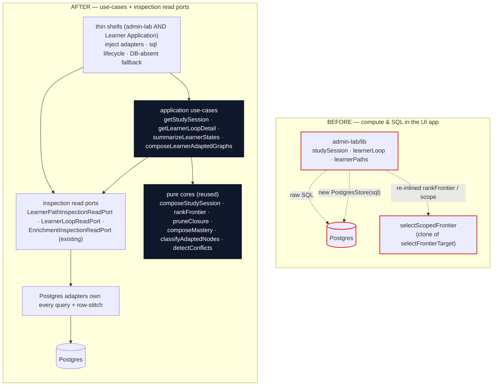

# refactor: Learner study/learner-loop/path surfaces behind use-cases + inspection read ports

## Summary

Move every learner-facing read in the Admin Lab off raw SQL and out-of-place adaptation compute,
onto the [ADR-0027](../adr/0027-serve-inspection-through-read-model-ports.md) split: **learner
projections become `application` use-cases that read through injected ports and add adaptation
compute; pure persisted reads become inspection read ports owned by the storage adapter.** The
deepened study projection (`getStudySession`) is the spine; the Learner Path and Learner Loop
surfaces follow the same discipline.

This is the explicit follow-up the calibration plan deferred: its KTD2 named the study loader as the
live ADR-0027 + rule-18 drift (the architecture review's Candidate 2) and "refused to add more"
without fixing it. The calibration sibling already demonstrates the target shape —
`composeCalibrationSession` in `packages/application/src/calibrationList.ts`, a thin
`apps/admin-lab/src/lib/calibrationSession.ts` shell. Study is the laggard; this plan brings it (and
the two raw-SQL learner surfaces) into line.

No learner behavior changes. Readiness, mastery, frontier selection, prune closure, and study
gating keep their exact current semantics — only their *home* moves, so one definition serves both
the Admin Lab and the forthcoming separate **Learner Application** that will consume the adapted
study graph and additional study-item types.

---

## Problem Frame

`apps/admin-lab/src/lib/studySession.ts`, `learnerLoop.ts`, and `learnerPaths.ts` contain **two
different ADR-0027 violations under one roof**, each demanding the opposite fix:

1. **Adaptation compute in the UI app.** `getStudySession` (`studySession.ts:147-268`) and
   `getLearnerAdaptedGraphs` (`learnerLoop.ts:354-384`) run prune-closure, mastery composition,
   node classification, goal-scoped frontier selection, per-node sheet gating, coexistence and
   restoration derivation. ADR-0027 places this behind an **application use-case**, not the UI.
2. **Raw SQL in the UI app.** `learnerPaths.ts:62-167` and the `SELECT … JOIN …` blocks in
   `learnerLoop.ts:236-330` stitch finished read models with hand-written SQL. ADR-0027 places this
   behind an **inspection read port** whose storage adapter owns the query and row-stitch.

The sharpest concrete cost is a rule-18 drift: `selectScopedFrontier` (`studySession.ts:85-99`) is a
hand-copied near-clone of `selectFrontierTarget` (`adaptivePathProjection.ts:55-76`), and because
`rankFrontier` (`adaptivePathProjection.ts:130-132`) is module-private, the hardest-first tie-break
was **re-inlined** in the UI. The path a learner walks and the ring an operator sees can silently
diverge. `studySession.ts:25-29` even declares `buildReadiness` "The SINGLE definition of 'what is
ready' (AGENTS rule 18)" while a second frontier ranking lives one package away.

A confirmed second consumer makes the seam real rather than hypothetical: a separate **Learner
Application** will render the adapted study graph, and new study-item types are coming. Under the
current shape, both apps would each re-stitch the reads and re-render each new item type. See origin:
`docs/brainstorms/2026-06-27-architecture-deepening-opportunities.md` (Candidate 2).

---

## Requirements Traceability

**Study projection (spine)**

- R1. `getStudySession` is an `application` use-case: it reads through injected ports and composes the
  adaptation, so one interface serves the Admin Lab and the Learner Application → U2.
- R2. Goal-scoped frontier selection reuses the application's single `rankFrontier` + scope notion;
  the re-inlined tie-break and `selectScopedFrontier`/`unmetPrerequisites`/`sheetContentFor` clones
  are deleted from the UI → U1.
- R3. The study side-sheet payload and study-item view types live in `application` and become a
  discriminated union keyed by item type; the projection owns the polymorphic *study-item → sheet
  payload* mapping, so a new item type is a localized add inherited by every surface → U1, U3.
- R4. The redundant `EnrichmentRunStorePort.getLayer` existence-read (`studySession.ts:158`, never
  consumed) is dropped; `getDerivedGraphDetail` already proves existence → U2.
- R5. The admin-lab study shell collapses to adapter injection + `sql` lifecycle + the
  `DATABASE_URL`-absent fallback; it runs no adaptation compute and no SQL → U3.

**Learner Path inspection**

- R6. The pure raw-SQL Learner Path reads move behind a `LearnerPathInspectionReadPort`; its
  read-model types live in `ports`; the storage adapter owns the SQL; the UI renders a finished
  model → U4.

**Learner Loop**

- R7. The learner-loop SQL (history, learner-state list, coverage stitch, paths) moves behind a
  `LearnerLoopReadPort`; the adapter owns the query and row-stitch → U5.
- R8. The learner-loop folds (`detectConflicts`, `buildMasteryMap`, `summarizeResponseSources`,
  `summarizeLearnerStates`, `dedupeEnrichmentScopes`) and the adapted-graph classify
  (`getLearnerAdaptedGraphs`) move into `application` as projection use-cases reused by both apps → U5.

**Cross-cutting / trust**

- R9. No learner-surface UI module imports a Postgres store, opens `withClient`, or embeds SQL for a
  read; the only persistence touch is adapter injection in a thin shell and the existing write
  actions → U3, U4, U5.
- R10. Every learner projection stays projection-only: no graph-version or Derived-Graph-Layer write
  port is reachable from the use-cases (structurally — none imported) → U1, U2, U5.
- R11. CONTEXT.md gains a **Study Session** term and the deepened module is named after it → U6.
- R12. The pure projection cores gain a real data-in/data-out test surface and the use-cases a
  port-fake test surface, replacing today's "verified only by the U7 real-use run" gap in
  `studySession.test.ts` → U1, U2, U5.

---

## Key Technical Decisions

- **KTD1 — Seam shape (B): injected-ports use-case, not pure-compose + shell wiring.** During
  grilling the recommendation flipped from pure-compose (A) to injected-ports use-case (B) on one
  fact: the **Learner Application is a confirmed second consumer**. "One adapter = hypothetical seam;
  two adapters = real seam." Under (A) both apps replicate the read orchestration (open client →
  instantiate four stores → call the inspection read → feed the compute) — the shallow seam stamped
  out twice. Under (B) `getStudySession({…refs, ports})` lives once in `application`; each app injects
  its adapters. This matches the established `computeLearnerPath` shape
  (`packages/application/src/computeLearnerPath.ts`). **Reversal logged here for review.**

- **KTD2 — Split the projection into a pure core (U1) and a reading use-case (U2).** Mirrors
  calibration's `projectCalibrationList` (pure) / `composeCalibrationSession` (compose) split. The
  pure `composeStudySession(data) → StudySession` is replay-testable with plain data (no fakes); the
  `getStudySession({…ports})` use-case is the thin reader tested with port fakes. The Learner
  Application reuses both unchanged.

- **KTD3 — The use-case consumes the `DerivedGraphDetail` inspection read model as graph input.**
  A learner projection may *read* a finished inspection model and add compute — ADR-0027 forbids
  serving a projection *through* a read port, not consuming one as input. `DerivedGraphDetail`
  already carries node id/label/difficulty and edge endpoints/`uncertain` in the exact shape the
  projection needs (`packages/ports/src/index.ts:685-693`), so taking `EnrichmentInspectionReadPort`
  avoids re-stitching the derived graph and lets U2 drop the redundant `getLayer` (R4). The pure core
  (U1) accepts minimal *structural* node/edge slices, so it is not coupled to the inspection type and
  a future caller could feed a `DerivedGraphLayer` instead.

- **KTD4 — `SheetContent` becomes a discriminated union keyed by item type; the projection owns the
  mapping (resolves the "more study-item types" requirement).** Today `option_select` leaks into the
  shape (`studySession.ts:167` filter, the single `option_select` sheet kind, `StudyOptionSelectView`).
  The projection will expose a per-node study-item view union and map each item type to its sheet
  payload in one place, so adding a type is "add a `kind` + a mapper in `application`" and both the
  Admin Lab and the Learner Application render it without re-learning. This does **not** implement a
  new item type now (option-select stays the only one, CONTEXT.md:147) — it shapes the interface for
  one.

- **KTD5 — One frontier ranking and one scope notion (the rule-18 fix).** Export `rankFrontier` and a
  goal-scoped frontier selector from `adaptivePathProjection.ts` and have the study projection call
  them. `selectScopedFrontier`, `unmetPrerequisites`, and the inlined `.sort(... || localeCompare)`
  are deleted. The selector consumes the whole-layer classification's states (frontier =
  ready+unmastered already computed) while sharing the same tie-break, so the overlay ring and the
  projected path cannot drift.

- **KTD6 — Presentation-contract and pure-graph helpers ride down with the projection; cytoscape
  stays in the UI.** `SheetContent`/`StudyOptionSelectView` move into `application` (dependency
  direction: `application` cannot import `apps/admin-lab`), exactly as `CalibrationListRow` lives in
  `calibrationList.ts`. The pure `derivedGraph.ts` helpers the projection uses (`labelFor`,
  `filterDetailToVisible`, foundational-root detection) move with it; `buildDerivedGraphView`,
  `nodeRenderAttrs`, and `DerivedGraphView` (cytoscape rendering) stay in admin-lab. `studyView.ts`
  keeps the sheet-interaction helpers (`shouldAcceptSheetOpenChange`, `nextStudyTarget`).

- **KTD7 — Learner-loop history/coverage is a *projection*, not pure inspection, so it splits.** It
  computes mastery folds and conflict detection — adaptation compute by ADR-0027's own wording. The
  raw SQL (joined history rows, learner-state rows, coverage stitch, path rows) becomes a
  `LearnerLoopReadPort` (inspection); the folds + adapted-graph classify become `application`
  use-cases over that port plus the existing `ResponseLogStorePort`/`CalibrationVerdictStorePort`.
  Infrastructure depends on `ports`/`domain-core` only, so the folds cannot live in the adapter —
  they belong in `application`, which is also where both apps reuse them.

- **KTD8 — No new ADR; this *applies* ADR-0027 and AGENTS rule 18.** The only durable-doc change is
  the CONTEXT.md **Study Session** term (R11). Calibration's shell stays shape (A) for now;
  realigning it to (B) is a noted fast-follow (U7), not a blocker — both learner projections should
  share one shape before the Learner Application is built.

---

## High-Level Technical Design

The bet is **one orchestration boundary per learner surface, injected adapters at the edge, pure
compute below it** — so the Admin Lab and the Learner Application are two thin shells over the same
`application` use-cases, and the storage adapter is the only place a query lives.

The study spine (U1–U3) is independently shippable and is exactly what the Learner Application needs
first; the Learner Path (U4) and Learner Loop (U5) surfaces complete the ADR-0027 sweep. Directional
guidance — exact function signatures are an execution detail.

---

## Implementation Units

### U1. Pure study-session projection core + shared frontier primitives

**Goal:** A pure `application` module that turns the loaded graph + study items + response rows +
verdicts into the finished `StudySession`, owning the view types and the polymorphic item→sheet
mapping, and reusing one frontier ranking — so the UI clones disappear (KTD2, KTD4, KTD5, KTD6).

**Requirements:** R2, R3, R10, R12.

**Dependencies:** none (reuses `pruneClosure`, `composeMastery`, `classifyAdaptedNodes`,
`suggestRestorations`, `prerequisiteAncestors`).

**Files:**
- `packages/application/src/adaptivePathProjection.ts` — export `rankFrontier` (currently private,
  `:130-132`) and add/export a goal-scoped frontier selector that consumes an
  `AdaptedNodeClassification` (the logic now in `selectScopedFrontier`), so one ranking + one scope
  notion serve the path and the overlay.
- `packages/application/src/studySessionProjection.ts` (new) — `composeStudySession(...)`,
  the `StudySession` type, the `SheetContent` discriminated union, the per-node study-item view
  union (generalizing `StudyOptionSelectView`), `unmetPrerequisites`, `adaptedHiddenNodeIds`, and the
  item→sheet mapper. Pure: data-in/data-out, no port or store import.
- `packages/application/src/studySessionProjection.test.ts` (new) — absorbs the pure-helper tests
  from `apps/admin-lab/src/lib/studySession.test.ts`.
- `packages/application/src/index.ts` — export the new module and `rankFrontier`/selector.
- Pure helpers consumed by the projection move from `apps/admin-lab/src/lib/derivedGraph.ts`
  (`labelFor`, `filterDetailToVisible`, foundational-root detection) into `application` (or a shared
  pure module) so the projection and the Learner Application reuse them; cytoscape view-building
  (`buildDerivedGraphView`, `nodeRenderAttrs`, `DerivedGraphView`) stays in admin-lab.

**Approach:** Mirror `calibrationList.ts`: a pure function over already-loaded data. It accepts the
target id, learner ref, structural node slices (`{ derivedNodeId, label, difficulty }`), structural
edges (`ReadinessEdge`), the study items, the response rows, and the verdicts; it returns the
`StudySession` shape currently built in `studySession.ts:252-267`. The goal-scoped frontier uses the
exported selector + `rankFrontier`. The sheet mapping is keyed by item type so option-select is one
arm of a union ready for siblings (KTD4). Trusted-edge filtering (`!uncertain`) stays exactly as
`pruneClosure`/`selectFrontierTarget` do.

**Patterns to follow:** `packages/application/src/calibrationList.ts` (pure, store-free, replayable,
same comment register); `composeMastery`/`pruneClosure` reuse already present in `studySession.ts:187-190`.

**Test scenarios:**
- A frontier node with an option-select returns an `option_select` sheet payload; without one returns `cardless`; a locked node names its unmet prerequisites; a mastered node returns the verdict-clearing review.
- Goal-scoped frontier equals the hardest ready+unmastered node *within the goal cone*, tie-broken by id identically to `selectFrontierTarget`; a fully-mastered cone returns `null`.
- A foundational-root goal (empty trusted cone) yields the single-node session shape.
- Calibration `known` closure prunes mastery, `adaptedHiddenNodeIds` excludes the goal even when the goal is marked known, and coexistence + restorations match the current `studySession.ts` outputs on a fixed fixture.
- The item→sheet mapper dispatches on item type (a synthetic non-option-select item routes to its own arm without touching option-select rendering) — guards KTD4 extensibility.

**Verification:** `tsx --test` green; the module imports no store/port/clock; `composeStudySession`
is deterministic and ordering-independent in its row/verdict inputs; the study fixture produces a
byte-identical `StudySession` to the pre-refactor loader.

---

### U2. `getStudySession` application use-case (injected read ports + compute)

**Goal:** One reading use-case that loads through injected ports and calls `composeStudySession`, so
the Admin Lab and the Learner Application share the whole study orchestration (KTD1, KTD3, R1, R4).

**Requirements:** R1, R4, R10.

**Dependencies:** U1.

**Files:**
- `packages/application/src/getStudySession.ts` (new) — `getStudySession({ enrichmentId,
  targetDerivedNodeId, learnerStateRef, enrichmentRead, studyItemStore, responseLog, verdictStore })`.
- `packages/application/src/getStudySession.test.ts` (new) — port fakes.
- `packages/application/src/index.ts` — export it.

**Approach:** Resolve `detail = enrichmentRead.getDerivedGraphDetail(enrichmentId)`; return
`undefined` when absent or when the target is not a node (the existence checks now from one read, R4
— the `getLayer` call is gone). Load study items, response rows, and verdicts through the injected
stores in parallel, map the detail's nodes/edges into the structural slices U1 expects, and return
`composeStudySession(...)`. No write port is imported (R10).

**Patterns to follow:** `packages/application/src/computeLearnerPath.ts` (use-case takes ports,
throws/returns on absence, owns no SQL); the parallel store reads currently in `studySession.ts:156-164`.

**Test scenarios:**
- Unknown enrichment / target-not-a-node returns `undefined`; no second existence read is issued (fake `getLayer` is never called — it is not a dependency).
- Given fake ports returning a fixed graph + items + rows + verdicts, the use-case returns the same `StudySession` U1 produces for that data.
- A learner with zero rows/verdicts yields the "knows nothing" session; a fully-calibrated learner yields the pruned/hidden session.

**Verification:** `tsx --test` green with fakes only (no DB); the use-case imports `@lrnki/ports`
and `@lrnki/application` internals only — no `@lrnki/infrastructure-postgres`, no `apps/*`.

---

### U3. Collapse the admin-lab study shell; retarget UI imports

**Goal:** `apps/admin-lab/src/lib/studySession.ts` becomes a thin shell that injects Postgres
adapters and calls `getStudySession`; the study UI imports the moved types from `application` (R5, R9).

**Requirements:** R3, R5, R9.

**Dependencies:** U1, U2.

**Files:**
- `apps/admin-lab/src/lib/studySession.ts` — reduce to `withClient` lifecycle + the
  `DATABASE_URL`-absent fallback + `new PostgresEnrichmentInspectionRead(sql)` and the three stores
  injected into `getStudySession`. Delete `unmetPrerequisites`, `sheetContentFor`,
  `selectScopedFrontier`, `adaptedHiddenNodeIds`, and the `StudySession` type (now in `application`).
- `apps/admin-lab/src/components/study/studyView.ts` — delete `SheetContent` and
  `StudyOptionSelectView`; keep `shouldAcceptSheetOpenChange`/`nextStudyTarget`; re-export the types
  from `@lrnki/application` (or update consumers to import from there).
- `apps/admin-lab/src/components/study/StudySession.tsx`, `StudySideSheet.tsx` — import sheet/view
  types from `@lrnki/application`.
- `apps/admin-lab/src/lib/derivedGraph.ts` — drop the helpers moved in U1; keep cytoscape view-building.
- `apps/admin-lab/src/lib/studySession.test.ts` — shrink to the shell's fallback/wiring; the pure
  tests now live in U1.

**Approach:** The shell is the calibration-shell shape (`calibrationSession.ts`) generalized to four
reads. The page (`study/[learnerStateRef]/page.tsx`) is unchanged — it still calls
`getStudySession(enrichmentId, target, ref)` and renders. The write actions (`study/actions.ts`) are
untouched (already mutate learner state only).

**Patterns to follow:** `apps/admin-lab/src/lib/inspection.ts` and `enrichments.ts` (thin
`withInspectionRead` shells); `calibrationSession.ts`.

**Test scenarios:**
- The shell returns `undefined` with `DATABASE_URL` unset (fallback preserved) and propagates real DB errors (no silent empty), matching the inspection shells.
- Study page renders an option-select session against a real enrichment identically to pre-refactor (real-use parity).

**Verification:** admin-lab type-checks; a grep shows `studySession.ts` contains no `sql<` template,
no adaptation compute, and imports no compute helper it used to own; the study surface studies an
option-select node end-to-end.

---

### U4. Learner Path inspection read port

**Goal:** The pure raw-SQL Learner Path reads move behind `LearnerPathInspectionReadPort`; the
adapter owns the SQL, the UI renders a finished model (R6, R9).

**Requirements:** R6, R9.

**Dependencies:** none (independent of the study spine).

**Files:**
- `packages/ports/src/index.ts` — add `LearnerPathInspectionReadPort` and move the read-model types
  (`LearnerPathSummary`, `LearnerPathNode`, `LearnerPathEdge`, `LearnerPathDetail`) from
  `apps/admin-lab/src/lib/learnerPaths.ts` into the Inspection Read Model block, beside
  `EnrichmentInspectionReadPort`.
- `packages/infrastructure-postgres/src/PostgresLearnerPathInspectionRead.ts` (new, + `.test.ts`) —
  owns the `listLearnerPaths`/`getLearnerPathDetail` SQL and row-stitch currently in `learnerPaths.ts:62-167`.
- `packages/infrastructure-postgres/src/index.ts` — export the adapter.
- `apps/admin-lab/src/lib/learnerPaths.ts` — collapse to a `withLearnerPathRead` thin shell.
- `apps/admin-lab/src/components/LearnerPathExplorer.tsx`, `paths/page.tsx`,
  `paths/[learnerPathId]/page.tsx` — import the read-model types from `@lrnki/ports`.

**Approach:** Pure inspection — paths are computed and persisted by the CLI, the UI only reads them
(rule 12). Mirror `PostgresEnrichmentInspectionRead`: `undefined` for not-found, real errors
propagate.

**Patterns to follow:** `packages/infrastructure-postgres/src/PostgresEnrichmentInspectionRead.ts`
and `apps/admin-lab/src/lib/enrichments.ts`.

**Test scenarios:**
- `listLearnerPaths` summary row counts/ordering match the current query; `getLearnerPathDetail`
  stitches steps + DAG nodes + edges with the same `inPath`/`isTarget`/`uncertain` flags on a seeded
  enrichment; unknown path id returns `undefined`.

**Verification:** the Paths list and detail render identically; `learnerPaths.ts` has no `sql<`
template.

---

### U5. Learner Loop read port + projection use-cases

**Goal:** The learner-loop SQL moves behind `LearnerLoopReadPort`; its folds and the adapted-graph
classify move into `application` use-cases reused by both apps (R7, R8, R9, KTD7).

**Requirements:** R7, R8, R9, R12.

**Dependencies:** U1 (shares `classifyAdaptedNodes` reuse; no hard ordering otherwise).

**Files:**
- `packages/ports/src/index.ts` — add `LearnerLoopReadPort` (history rows joined to label/question,
  learner-state rows, path rows, coverage-step rows) with its row-shaped read-model types.
- `packages/infrastructure-postgres/src/PostgresLearnerLoopRead.ts` (new, + `.test.ts`) — owns the
  three SQL reads now in `learnerLoop.ts:236-330`.
- `packages/infrastructure-postgres/src/index.ts` — export it.
- `packages/application/src/learnerLoopProjection.ts` (new, + `.test.ts`) — move `detectConflicts`,
  `buildMasteryMap`, `summarizeResponseSources`, `summarizeLearnerStates`, `dedupeEnrichmentScopes`,
  and the `getLearnerLoopDetail`/`listLearnerStates`/`getLearnerAdaptedGraphs` orchestration here as
  use-cases over the read port + `ResponseLogStorePort`/`CalibrationVerdictStorePort` +
  `EnrichmentInspectionReadPort`.
- `packages/application/src/index.ts` — export the use-cases + folds.
- `apps/admin-lab/src/lib/learnerLoop.ts` — collapse to a thin shell injecting the adapters; delete
  the SQL and the relocated folds.
- `apps/admin-lab/src/components/LearnerLoopReview.tsx`, `learner-loop/page.tsx`,
  `learner-loop/[learnerStateRef]/page.tsx` — import types from `@lrnki/application`/`@lrnki/ports`.
- `apps/admin-lab/src/lib/learnerLoop.test.ts` — pure-fold tests move to `learnerLoopProjection.test.ts`.

**Approach:** The read port returns rows (inspection); the use-case adds the conflict/mastery/summary
folds and the `classifyAdaptedNodes` overlay (projection). `getLearnerAdaptedGraphs` is the piece the
Learner Application most directly reuses. No write port imported (R10 preserved).

**Patterns to follow:** U2's use-case shape; the existing pure folds (already tested) relocate
unchanged.

**Test scenarios:**
- `detectConflicts`/`buildMasteryMap`/`summarizeLearnerStates` produce identical outputs post-move
  (the relocated tests pass unchanged).
- `getLearnerAdaptedGraphs` returns one classified graph per distinct enrichment scope, matching the
  current overlay on a seeded learner.
- The read port's coverage stitch reproduces the current fallback-reason behavior (persisted
  rejection vs grounding-origin guess).

**Verification:** the Learner Loop list, detail, and adapted-graph overlay render identically;
`learnerLoop.ts` has no `sql<` template and no fold logic.

---

### U6. Name the Study Session in CONTEXT.md

**Goal:** Add the **Study Session** term so the deepened module is named after a defined domain
concept (R11), per the skill's discipline.

**Requirements:** R11.

**Dependencies:** U1 (the name settles with the projection shape).

**Files:**
- `CONTEXT.md` — add **Study Session** near **Learner Path**/**Learner State**: a learner-stateful,
  goal-scoped projection over one Derived Graph Layer that gates each in-scope derived node into
  locked / frontier / mastered and carries its study payload. `_Avoid_`: study screen, lesson, quiz
  session.

**Approach:** Definition only; no behavior. Keep it consistent with the existing **Learner Path**
entry (a projection of one Derived Graph Layer for a target + Learner State).

**Verification:** the term is referenced by the U1 module comment; no other doc redefines it.

---

### U7. (Fast-follow, optional) Align the calibration shell to the use-case shape

**Goal:** Bring `composeCalibrationSession`/`calibrationSession.ts` onto the same injected-ports
use-case shape as study, so both learner projections share one boundary before the Learner
Application is built (KTD8).

**Requirements:** consistency (rule 18) — no new behavior.

**Dependencies:** U2 (establishes the pattern).

**Files:**
- `packages/application/src/calibrationList.ts` / a new `getCalibrationSession` use-case — wrap the
  verdict + enrichment reads behind injected ports.
- `apps/admin-lab/src/lib/calibrationSession.ts` — collapse to adapter injection.

**Approach:** Optional and separable; only worth doing once the Learner Application's calibration
needs are concrete. Listed so the divergence is tracked, not forgotten.

**Verification:** calibration surface renders identically; one learner-projection shape across both.

---

## Risks & Non-Goals

- **Non-goal: behavior change.** Readiness, mastery, prune closure, frontier selection, and gating
  keep exact semantics. Evidence is *parity*, not new quality — the rule-14 real-use pass here is
  "the study, paths, and learner-loop surfaces render identically against a real enrichment/learner,"
  not a quality re-measurement (a behavior-preserving refactor; AGENTS rule 14 applies lightly).
- **Non-goal: implement new study-item types or build the Learner Application now.** U1 only *shapes*
  the interface (KTD4) for them.
- **Risk: type-move churn across packages.** Moving `SheetContent`/`StudyOptionSelectView` and the
  Learner Path/Loop read-model types crosses package boundaries; land each unit keeping the workspace
  type-checking, removing a type's consumers before its old declaration (the execution note pattern
  from the calibration plan's U3).
- **Risk: the `getLayer` drop.** Confirm by grep that `layer` is referenced only as the existence
  guard before removing the read (it is, at `studySession.ts:165`).

---

## Acceptance

- All packages `tsc` green; `tsx --test` green, including the new pure-core and use-case tests (U1,
  U2, U5) and the relocated fold tests.
- Grep proof of R9: no `sql<` template literal and no `new Postgres*Store(` for a *read* remains in
  `apps/admin-lab/src/lib/studySession.ts`, `learnerLoop.ts`, `learnerPaths.ts`; only thin shells +
  the existing write actions touch persistence.
- Grep proof of R2/KTD5: `selectScopedFrontier` and the re-inlined frontier sort are gone; one
  exported `rankFrontier` is the sole hardest-first ordering.
- Real-use parity: Study, Paths, and Learner-Loop surfaces render the same against a real
  enrichment + seeded learner as before the refactor.
- `CONTEXT.md` defines **Study Session** (U6).
