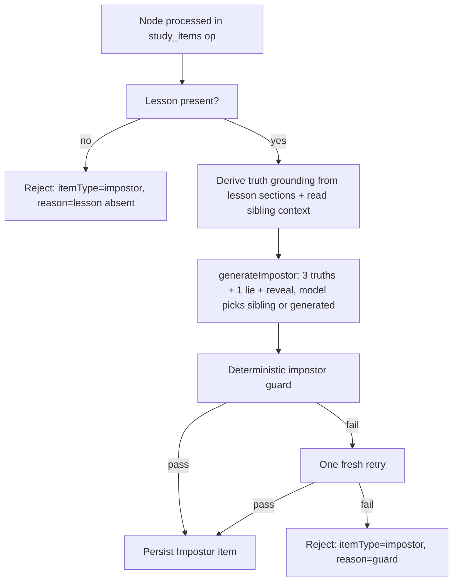
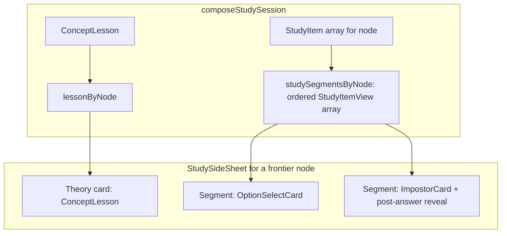

# feat: Impostor study item type

## Summary

Add the **Impostor** — a second study-item type where the learner reads four grounded
statements about a concept (three true, one planted lie) and selects the lie. The lie is
preferentially a true fact about a confusable graph sibling, mis-attributed to this node;
when no clean sibling lie exists the model mints a plausible misconception. It generates
inside the existing `study_items` operation, derives its truths from the node's Concept
Lesson (the single grounding source), is auto-graded into the existing 0.7 mastery fold,
and renders as the segment after option-select in a node's linear theory → items sequence.

---

## Problem Frame

The engine can teach (Concept Lesson) and test (option-select), but the study surface is a
quiz, not play — and AGENTS rule 22 makes game-like delight a first-class goal of every
learner-facing projection. Ordering concepts into their prerequisite chain was rejected
because the Learner App shows the graph, so the answer would be *readable off the arrows*.
A planted lie cannot be read off the map: it forces real concept discrimination, and the
graph's invisible asset — knowing which concepts are confusable neighbors — is exactly what
sources the lie (see origin: `docs/brainstorms/2026-06-30-impostor-game-study-item-requirements.md`).

---

## High-Level Technical Design

### Per-node generation: a third stage inside `study_items`

Impostor generation is Stage 3 of `generateStudyItemBank`, after the Concept Lesson (Stage 1)
and option-select (Stage 2). It reuses the lesson as the single truth-grounding source and the
existing sibling neighborhood as lie context. The hybrid sibling-vs-generated choice is made by
the model in **one call** (not a deterministic code branch), reported back as `lieSource`.

### Node surface: an ordered segment sequence

The projection stops assuming one item per node. It groups a node's items into an ordered
`studySegmentsByNode` list (canonical order: `option_select`, then `impostor`). The Admin Lab
side-sheet stacks theory (the lesson) above that list; each segment grades independently and
folds into the node's single mastery number.

Each card submits to its own server action; both reduce to one keyed-selection grader
(chosen === keyed → 1 else 0). The sheet holds its target node until that node's segments are
answered, then retargets to the next frontier node.

---

## Requirements

Carried from the origin brainstorm; numbering mirrors it for traceability.

**Mechanic and content**

- R1. The Impostor is a study item for one derived node: four statements, three true and exactly
  one false (the impostor), which the learner selects.
- R2. True statements derive from the node's Concept Lesson grounding; no study asset reads raw
  grounding once a lesson exists (AGENTS rule 18). The impostor is the only false statement.

**Lie sourcing**

- R3. Lie sourcing is hybrid: prefer a true fact about a confusable sibling presented as if about
  this node; fall back to a freshly generated plausible misconception when no clean sibling lie exists.
- R4. The sibling set is read from the existing Derived Graph Layer. Generation creates no node, edge,
  or fake sibling; the impostor is item content only and never a graph entity.

**Grounding and honesty**

- R5. True statements carry source-grounded provenance (`source_cep` / `source_mentioned`, or
  `generated` for generated-origin nodes) with verbatim citations; the impostor carries `generated`
  provenance with no source citation and never masquerades as a source quote. Reuses the
  `StudyItemCitation` contract (ADR-0026).
- R6. Every item carries a required post-answer reveal naming the impostor and why it is false — for a
  sibling-sourced lie, that it is actually true of the named sibling. A wrong guess must never leave a
  misconception unresolved.

**Generation and guard**

- R7. Impostor items generate within the existing `study_items` operation through a forced named tool
  schema on a DeepSeek-family model, carrying a dedicated LiteLLM spend tag distinct from option-select
  and lesson generation (ADR-0029).
- R8. A deterministic guard accepts or rejects on structural and provenance guarantees only: exactly one
  impostor; every true statement verifies verbatim against its cited lesson passage; the impostor is
  labeled `generated` with no source citation; the impostor is distinct from every true statement; the
  reveal and `lieSource` are present. Semantic quality is judged by real-use inspection, not the guard
  (AGENTS rule 16).
- R9. When no groundable impostor can be produced for a node, it is recorded impostor-absent with a
  reason rather than a placeholder, mirroring rejected-item handling.

**Study Session integration**

- R10. A node's study surface is an ordered linear sequence of segments — theory, then each study item
  type — rendered one after another with no item-picker. The Impostor renders after option-select.
- R11. Adding the type is a localized union extension: one new arm of the typed study-item union plus its
  view and sheet mappings, inherited by both the Admin Lab and the future Learner App.

**Grading, state, and boundaries**

- R12. Answering an Impostor is auto-graded from the server-keyed impostor and appends a graded,
  append-only Response Log entry, exactly like option-select. The node's mastery folds across all its
  graded observations at the 0.7 threshold.
- R13. The item type is learner-neutral: graph facts and grounded content only. Points, levels, streaks,
  and game juice live solely in downstream projections (AGENTS rule 22) and are out of scope; generation
  imports no graph or enrichment write port (AGENTS rule 3).

---

## Key Technical Decisions

- KTD1. **Fixed four statements (three true + one impostor).** Matches option-select's reading load and
  1-in-4 guess baseline and keeps the guard, schema, and UI count-free. A node whose lesson cannot supply
  three verbatim-citable truths is recorded impostor-absent (R9) rather than padded. Truths may cite the
  same passage with different substrings, so even a thinly-grounded lesson can usually supply three.
  Scaling the count with grounding is deferred.

- KTD2. **Single-call hybrid lie-sourcing; the model chooses.** The prompt instructs the model to prefer a
  sibling-sourced mis-attribution given the sibling context and fall back to a fresh misconception,
  returning `lieSource: "sibling" | "generated"` and the `siblingLabel` it drew from. "Is a clean sibling
  lie available?" is a semantic judgment, so it lives in the model, not a deterministic availability branch
  (AGENTS rule 16). One call mirrors how option-select already consumes siblings as context.

- KTD3. **Reuse the lesson as the single truth-grounding source.** Generalize the existing
  `optionSelectGroundingFromLesson` to a shared `studyItemGroundingFromLesson` that both option-select and
  impostor truth-sourcing consume (AGENTS rule 18). The verbatim chain holds transitively: a truth's
  citation traces to a lesson section's already-verified source quote.

- KTD4. **Extend `StudyItemGenerationPort` with `generateImpostor`; no new port or worker wiring.**
  Option-select and impostor are one auto-graded-selection family, so they share the "Study Item generation"
  port and its existing `LiteLlmStudyItemGenerationAdapter`. (The Concept Lesson got its own port because
  teaching ≠ testing; that split does not apply here.) The worker already constructs that adapter, so it
  needs no change.

- KTD5. **A dedicated `impostor_statements` table; `study_items` columns untouched.** The option-select
  `study_item_options` / `study_item_citations` pair does not fit: impostor inverts `is_correct` vs
  provenance and needs a citation *per true statement*, not one per item. The new table carries each
  statement with inline provenance + nullable citation columns and, on the impostor row only, the reveal /
  `lie_source` / `sibling_label`, all enforced by one CHECK. Only the `study_items.item_type` CHECK widens.

- KTD6. **One keyed-selection grader for both item types.** Generalize `appendOptionSelectOutcome` to a
  neutral `appendGradedSelectionOutcome(chosenId, keyedCorrectId, item)` reused by option-select (chosen
  vs correct option) and impostor (chosen vs impostor statement). The grading logic is already
  provenance-agnostic; this deletes the option-select-specific name (AGENTS rule 18).

- KTD7. **Node surface is an ordered `studySegmentsByNode` list; the Admin Lab stacks the cards.** The
  projection exposes the ordered segment list (durable, transfers to the Learner App); the Admin Lab renders
  theory + each segment card in the open sheet, each independently answerable, and holds the target until a
  node's segments are answered. Gated one-at-a-time "play, reveal, advance" sequencing and game juice are
  deferred to the Learner App, where the brainstorm parks the render shape.

- KTD8. **Impostor-absent reuses `rejected_study_items` keyed per item type.** Add `item_type` to that
  table (UNIQUE becomes `(derived_node_id, item_type)`) and to the `RejectedStudyItem` type, so a node can
  be rejected for impostor independently of having an option-select item (R9).

---

## Implementation Units

### U1. Domain union arm, draft, and stage tag

**Goal:** Make the typed study-item union and stage-tag vocabulary aware of the impostor.

**Requirements:** R1, R5, R6, R7, R8 (types only), R11.

**Dependencies:** none.

**Files:**
- `packages/domain-core/src/index.ts` — add `ImpostorStatement`, `ImpostorItem` (extends `StudyItemBase`
  with `question`, `statements`, `reveal`, `lieSource`, optional `siblingLabel`); widen
  `StudyItem = OptionSelectItem | ImpostorItem`, `StudyItemType = "option_select" | "impostor"`,
  `StudyItemDraft`; add `ImpostorStatementDraft` / `ImpostorItemDraft`; add `itemType: StudyItemType` to
  `RejectedStudyItem`; add `STAGE_TAGS.impostorGeneration = "impostor-generation"`.
- `CONTEXT.md` — update the **Study Item Bank** entry: `itemType` is now `option_select | impostor`.
- `docs/adr/0026-typed-study-item-bank.md` — replace "`option_select` is the only implemented payload" with
  the two-arm union and the grading-neutral fold.

**Approach:** Pure type additions plus two doc edits made in the same change (AGENTS rule 18). The
`RejectedStudyItem.itemType` addition is a contract change consumed in U5/U6; default nothing — every
producer sets it explicitly.

**Patterns to follow:** the existing `OptionSelectItem` / `OptionSelectItemDraft` / `StudyItemCitation`
definitions in the same file.

**Test scenarios:** Test expectation: none — pure type and constant additions; behavior is exercised by
U3–U8. A typecheck across the workspace is the completeness signal.

**Verification:** `pnpm run typecheck` is green; every `RejectedStudyItem` literal in the tree now needs
`itemType`, surfaced as type errors to fix in U5/U6.

### U2. Persistence schema for impostor statements and per-type rejection

**Goal:** Persist impostor items and impostor-absent records in the single initial migration.

**Requirements:** R1, R5, R6, R8, R9.

**Dependencies:** U1.

**Files:**
- `packages/infrastructure-postgres/src/migrations/0000_initial_lrnki_schema.sql` —
  (a) widen `study_items.item_type` CHECK to `IN ('option_select','impostor')`;
  (b) add `impostor_statements` (four rows per item: `ordinal` 0–3, `statement_text`, `is_impostor`,
  `provenance`, inline citation columns mirroring `study_item_citations`, and impostor-row-only
  `reveal_text` / `lie_source` / `sibling_label`) with a CHECK enforcing the truth-vs-impostor column
  discipline and a partial unique index `WHERE is_impostor`;
  (c) add `item_type` to `rejected_study_items` and change its UNIQUE to `(derived_node_id, item_type)`;
  (d) extend the `artifact_study_items` view with `statement_count` from `$.statements.size()` (existing
  `option_count` becomes null for impostor rows).

**Approach:** Greenfield single migration, hard reset (AGENTS rules 8–9). The CHECK is the structural
honesty backstop behind the application guard: a `source`-cited impostor statement is unrepresentable.

**Patterns to follow:** `study_item_options` (ordinal + partial-unique-correct), `study_item_citations`
(provenance CHECK), and `concept_lesson_section_citations` (inline nullable source/generated columns).

**Test scenarios:** Test expectation: none — DDL; exercised by U6 live-Postgres store tests (the CHECK and
unique index are asserted there).

**Verification:** A fresh `setup`/reset applies the migration cleanly; inserting a source-cited impostor row
or a second impostor per item is rejected by the constraints.

### U3. Impostor generation: port method, adapter, and forced-tool schema

**Goal:** Generate a pre-verification impostor draft through a domain-neutral forced tool schema.

**Requirements:** R3, R5, R6, R7, R8.

**Dependencies:** U1.

**Files:**
- `packages/ports/src/index.ts` — add `generateImpostor` to `StudyItemGenerationPort`, taking the same
  `node` / `groundingProvenance` / `groundingPassages` / `siblings` inputs as `generateOptionSelect` and
  returning `ImpostorItemDraft`.
- `packages/infrastructure-litellm/src/studyItemGenerationAdapters.ts` — implement `generateImpostor` on
  `LiteLlmStudyItemGenerationAdapter` (tool `submit_impostor_item`, tag `STAGE_TAGS.impostorGeneration`).
- `packages/infrastructure-litellm/src/toolSchemas.ts` — add `impostorValidator` / `impostorSchema`
  (`statements` array of `{ text, isImpostor, citationPassageId, citationEvidenceQuote }`, plus `reveal`,
  `lieSource` enum, nullable `siblingLabel`) and register `impostorValidator` in `toolValidators`.
- `packages/infrastructure-litellm/src/studyItemGenerationAdapters.test.ts` — add impostor cases.
- `packages/infrastructure-litellm/src/toolSchemas.test.ts` — extend the registry/domain-neutrality sweep.

**Approach:** Mirror the option-select adapter. The prompt instructs: produce exactly three true statements
each citing a grounding passage by `passageId` with a verbatim substring, and exactly one impostor —
preferring a true fact about one provided neighbor concept rewritten as if about this node, else a fresh
plausible misconception — labeled generated with no citation, plus a reveal explaining the lie and (for a
sibling lie) naming the neighbor. Domain-neutral rubric language only; no fixture concepts (AGENTS rule 17).
The adapter never decides final provenance — the guard re-derives it (U4).

**Patterns to follow:** `LiteLlmStudyItemGenerationAdapter.generateOptionSelect`, `optionSelectValidator`,
`passageCitation`, and the `conceptLessonValidator` nullable-scalar dialect for the optional `siblingLabel`.

**Test scenarios:**
- Happy path: a draft with three cited truths + one generated impostor maps to `ImpostorItemDraft` with
  `lieSource` and `siblingLabel` set when sibling-sourced.
- `lieSource: "generated"` returns `siblingLabel` absent/undefined.
- The forced-tool schema is strict and domain-neutral: references no fixture concept and lists no exemplars
  (registry sweep).
- A malformed tool argument (missing `reveal`, wrong statement count) fails closed under validation.

**Verification:** adapter and schema suites green; `submit_impostor_item` appears in the permanent tool
registry test.

### U4. Deterministic impostor guard

**Goal:** Promote a draft to a persistable `ImpostorItem` only on provable structural/provenance guarantees.

**Requirements:** R1, R5, R6, R8.

**Dependencies:** U1.

**Files:**
- `packages/application/src/impostorGuard.ts` (new).
- `packages/application/src/impostorGuard.test.ts` (new).

**Approach:** Mirror `optionSelectGuard.ts`. Accept iff: exactly four statements; exactly one `isImpostor`;
each of the three truths verifies verbatim against a cited grounding passage via `evidenceQuoteMatches`,
with the resolved citation taken from the matched passage (fail-closed labeling, never the draft's claim);
the impostor carries provenance `generated` and **no** citation; the impostor text is distinct from every
truth after the shared `normalizeOptionText` collapse; `reveal` is non-empty; `lieSource` is present and
`siblingLabel` is non-empty iff `lieSource === "sibling"`. Reject with a distinct reason otherwise. The
guard mutates nothing and imports no graph/enrichment write port (R13). Failing it is not a run failure.

**Patterns to follow:** `validateOptionSelectItem` — its `OptionSelectGrounding` passage shape, matched-passage
provenance resolution, and reason strings.

**Test scenarios:**
- Covers AE3. Happy path: three verbatim-cited truths + one generated impostor → `ok: true`, the built item
  has exactly one impostor and the truths' citations resolve from the matched passages.
- Covers AE3. A "true" statement whose quote does not verify verbatim → rejected.
- An impostor carrying a source citation → rejected (honesty inversion blocked).
- Two impostors, or zero → rejected with the count in the reason.
- Impostor text equal to a truth after normalization → rejected.
- Empty `reveal`, or `lieSource: "sibling"` with no `siblingLabel` → rejected.
- A truth citing a generated lesson passage (generated-origin node) verifies and is labeled `generated`.

**Verification:** `impostorGuard.test.ts` green; no graph/enrichment import reachable from the module.

### U5. Impostor generation stage in the orchestrator

**Goal:** Run impostor generation as Stage 3 per node and record items or impostor-absent.

**Requirements:** R2, R3, R4, R7, R8, R9, R13.

**Dependencies:** U1, U3, U4.

**Files:**
- `packages/application/src/generateStudyItemBank.ts` — generalize `optionSelectGroundingFromLesson` to a
  shared `studyItemGroundingFromLesson` (KTD3); add Stage 3 after the option-select stage: for each node
  with a lesson, derive truth grounding, read `selectSiblingContext`, call `generateImpostor`, run the guard
  with one fresh retry, and push an `ImpostorItem` or a `RejectedStudyItem` with `itemType: "impostor"`;
  set `itemType` on the existing option-select rejections too.
- `packages/application/src/generateStudyItemBank.test.ts` — add impostor-stage cases.
- `apps/kg-worker/src/knowledgeGraphWorker.ts` — no change expected (the existing
  `LiteLlmStudyItemGenerationAdapter` now implements `generateImpostor`); confirm during execution.

**Approach:** A new bracketed stage tagged `STAGE_TAGS.impostorGeneration`, structured exactly like the
option-select stage (bounded `mapWithConcurrency`, per-node heartbeat, fail-soft retry). The impostor truths
draw from the same `studyItemGroundingFromLesson` passages the option-select stage uses, so both derive from
the one lesson substrate (AGENTS rule 18). A lesson-absent node yields an impostor rejection with that reason.

**Patterns to follow:** the option-select Stage 2 block in the same file — `generateForNode`,
`OPTION_SELECT_GENERATION_ATTEMPTS`, the `studyStage(...)` bracket, and per-node flatten in input order.

**Test scenarios:**
- Covers AE1. A node with siblings produces an impostor whose draft `lieSource` is `sibling` and whose guard
  passes; the persisted item carries the `siblingLabel`.
- Covers AE2. A node where the model returns `lieSource: "generated"` produces a generated-labeled impostor.
- Covers AE2. A node whose draft fails the guard twice is recorded impostor-absent with the guard reason and
  `itemType: "impostor"`; the run does not fail.
- A lesson-absent node yields an impostor rejection (`reason` = lesson absent), independent of its
  option-select outcome.
- Both stages run: a node can carry both an option-select item and an impostor item; rejections are keyed per
  item type.
- `studyItemGroundingFromLesson` feeds identical passages to both stages for the same node (rule-18 anchor).

**Verification:** `generateStudyItemBank.test.ts` green; the operation timeline shows the
`impostor-generation` stage between `study-item-generation` and `persist`.

### U6. Study Item Bank store: persist and hydrate impostor; load all types

**Goal:** Round-trip impostor items and per-type rejections, and stop hard-coding `option_select` on read.

**Requirements:** R5, R6, R9, R12.

**Dependencies:** U1, U2.

**Files:**
- `packages/infrastructure-postgres/src/PostgresLearnerLoopStores.ts` — in `PostgresStudyItemBankStore`:
  dispatch `assertPersistable*` on `itemType`; persist `impostor_statements` rows (statements + inline
  citations + impostor reveal metadata) inside the existing transaction; hydrate impostor items; write
  `item_type` on `rejected_study_items` inserts; change `listStudyItemsForEnrichment` to load **all** item
  types (drop the `item_type = 'option_select'` filter) and hydrate per type.
- `packages/infrastructure-postgres/src/PostgresLearnerLoopStores.test.ts` — add live impostor cases.

**Approach:** Mirror the option-select persist/hydrate, replacing the option/citation pair with
`impostor_statements`. Regeneration stays replace-by-enrichment (delete cascades statements). The
`supportedItemTypes` `SELECT DISTINCT` already generalizes once impostor rows exist.

**Patterns to follow:** the existing `persist` / `insertCitation` / `hydrate` methods and
`assertPersistableOptionSelectItem` in the same file.

**Test scenarios:**
- Covers AE3. Persist then read an impostor item: four statements, exactly one impostor (`generated`, no
  citation), three truths each with a resolved citation, plus reveal / `lieSource` / `siblingLabel`.
- `listStudyItemsForEnrichment` returns both option-select and impostor items for a node that has both,
  ordered deterministically.
- Regenerating an enrichment replaces prior impostor statements (no orphan rows).
- A per-type rejection round-trips: a node impostor-absent but option-select-present persists one rejection
  row keyed `(derived_node_id, 'impostor')`.
- The DB CHECK rejects a source-cited impostor and a second impostor per item (negative cases).

**Verification:** live-Postgres store suite green with `DATABASE_URL` loaded from `.env`.

### U7. Study Session projection: segment sequence and shared grader

**Goal:** Expose a node's ordered study segments and grade an impostor through one shared grader.

**Requirements:** R10, R11, R12.

**Dependencies:** U1, U6.

**Files:**
- `packages/application/src/studySessionProjection.ts` — add the `impostor` arm to `StudyItemView`,
  `SheetContent`, `studyItemToView`, and `studyItemViewToSheet`; add a `StudyImpostorView` shape; group
  items into `studySegmentsByNode: Record<string, StudyItemView[]>` in canonical order (option_select,
  then impostor) as the frontier surface's ordered item list. Scope `sheetByNode` to state-gating only
  (locked / mastered / cardless and the badge) so a frontier node's items render from `studySegmentsByNode`
  and never twice; review the existing `optionItemsByNode` field and delete it if the segment list
  supersedes its consumers (AGENTS rule 18).
- `packages/application/src/optionSelectOutcome.ts` → rename/generalize to `appendGradedSelectionOutcome`
  (`chosenId` / `keyedCorrectId`), deleting the option-select-specific name (AGENTS rule 18).
- `packages/application/src/index.ts` — update the barrel export for the renamed grader and any new view types.
- `packages/application/src/studySessionProjection.test.ts`, `optionSelectOutcome.test.ts` (renamed) — update
  and extend.
- `CONTEXT.md` — note the **Study Session** surface is an ordered segment sequence.

**Approach:** `studyItemToView` gains an `impostor` arm returning a serializable statement view (statement
ids, text, `isImpostor`, provenance, the reveal, `lieSource`, `siblingLabel`); the impostor's keyed answer
is the impostor statement id, server-side only — the view exposes `isImpostor` for the post-answer reveal,
not as a pre-answer hint the renderer should key on. The grader change is mechanical: both callers pass a
chosen id and a keyed-correct id.

**Patterns to follow:** the existing `option_select` arms in `studyItemToView` / `studyItemViewToSheet`, and
`appendOptionSelectOutcome`'s `outcomeFor`.

**Test scenarios:**
- Covers AE4. Grading an impostor where chosen = impostor statement appends a `graded(auto)` row, score 1;
  choosing a truth appends score 0.
- Covers AE4. A node with both items contributes two graded observations that fold into one mastery number at
  the 0.7 threshold.
- `studySegmentsByNode` lists a node's segments in canonical order (option_select before impostor); a node
  with only one type lists one segment.
- `studyItemToView` maps an impostor item to a view exposing statements, reveal, `lieSource`, `siblingLabel`.
- The shared grader serves option-select unchanged (regression of the existing outcome cases).

**Verification:** application suite green; `appendOptionSelectOutcome` no longer exists (rule-18 sweep).

### U8. Admin Lab: impostor card, stacked segment sheet, submit action

**Goal:** Render theory + the segment sequence and grade each segment, with the required reveal.

**Requirements:** R6, R10, R11, R12.

**Dependencies:** U5, U6, U7.

**Files:**
- `apps/admin-lab/src/components/study/ImpostorCard.tsx` (new) — four tappable statements; after answer,
  mark the real impostor and render the reveal (always, regardless of correctness).
- `apps/admin-lab/src/components/study/StudySideSheet.tsx` — render the lesson, then each segment in
  `studySegmentsByNode` order; route each card's submit; keep the target node until its segments are answered.
- `apps/admin-lab/src/components/study/studyView.ts` — re-export the impostor view type from
  `@lrnki/application`.
- `apps/admin-lab/src/app/admin/lab/study/actions.ts` — add `submitImpostor` (look up the server-keyed
  impostor statement id, call the shared grader); the existing `submitOptionSelect` switches to the renamed
  grader.
- `apps/admin-lab/src/components/study/StudySession.tsx` — drive the stacked segments and per-segment submit;
  retarget only when the node's segments are answered.
- `apps/admin-lab/src/lib/studySession.test.ts` — extend the sheet-interaction/advance cases.

**Approach:** `ImpostorCard` mirrors `OptionSelectCard`'s answered/pending state machine. The side-sheet's
single-card block becomes an ordered map over the node's segments above the existing skip affordance; the
advance guard generalizes "answered → retarget" to "no unanswered segments → retarget". `submitImpostor`
resolves the keyed impostor statement with a small SQL read keyed by `study_item_id` (mirroring the
`submitOptionSelect` correct-option lookup), never trusting a client-sent key.

**Patterns to follow:** `OptionSelectCard.tsx`, the `content?.kind === "option_select"` block and
`StateBadge` in `StudySideSheet.tsx`, `submitOptionSelect` in `actions.ts`, and `nextStudyTarget` /
`shouldAcceptSheetOpenChange` in `studyView.ts`.

**Test scenarios:**
- Covers AE5. Answering the impostor with a true statement (a miss) still renders the reveal marking the real
  impostor — the learner does not leave reinforcing the misconception.
- A frontier node with both segments renders the lesson, then the option-select card, then the impostor card,
  in order; answering one does not retarget while the other is unanswered.
- `submitImpostor` grades against the server-keyed impostor; a client-sent statement id cannot change the key.
- A node with only an impostor segment renders lesson + impostor; a node with only option-select is unchanged.
- Test expectation for `ImpostorCard` pure render state: answered state disables further taps and shows the
  reveal (component/state test where the harness supports it).

**Verification:** admin-lab build and `studySession.test.ts` green; manual render shows the stacked sequence.

---

## Acceptance Examples

- AE1. **Sibling-sourced lie.** Covers R3, R5, R6. Given a node with a confusable sibling whose true fact
  reads as plausibly-but-falsely about this node, when the item generates, then the impostor is that
  sibling fact labeled `generated`, and the reveal states it is actually true of the named sibling.
  *(U5 sibling case; U6 round-trip; U8 reveal.)*
- AE2. **Generated fallback and absence.** Covers R3, R9. Given a node with no clean sibling lie, when the
  item generates, then a freshly generated misconception is used and labeled `generated`; and if no
  groundable impostor can be produced, the node is recorded impostor-absent with a reason. *(U5.)*
- AE3. **Honesty invariant at the guard.** Covers R5, R8. Given a generated item, when the guard runs, then
  every true statement verifies verbatim against its cited lesson passage and the impostor carries no source
  citation; an item whose "true" statement fails verbatim verification is rejected. *(U4; U6 DB CHECK.)*
- AE4. **Grading and mastery fold.** Covers R12. Given the learner answers the Impostor, when it is graded,
  then a graded Response Log row is appended and folds into the node's mastery at the 0.7 threshold alongside
  the option-select observation. *(U7.)*
- AE5. **Wrong-guess reveal.** Covers R6. Given the learner picks a true statement and misses the impostor,
  when the answer is submitted, then the reveal still clearly marks the real impostor and why it is false.
  *(U8.)*

---

## Scope Boundaries

### Deferred for later

- The metagame — points, XP, levels, the world-map, the "choose what to master" picker, unlock juice. The
  linear segment sequence is its interim (origin Scope Boundaries).
- Gated one-at-a-time within-node flow (play one segment, reveal, advance) and the polished Learner App render
  shape (tap targets, animation). The Admin Lab stacks the cards; the projection's ordered segment list is the
  durable seam the Learner App will consume (KTD7).
- Build-the-chain and other candidate mechanics; build-the-chain may return as a hidden-map capstone.
- Per-section theory segmentation (swipeable lesson cards). Theory stays a single segment.
- Confidence-gated synthesis for generated lies (ADR-0030, Proposed). Generated misconceptions are produced
  unconditionally this iteration.
- Scaling the statement count with available grounding (KTD1 fixes four).

### Outside this product's identity

- Points, streaks, and game juice never enter the learner-neutral core; they live only in downstream
  projections (AGENTS rule 22). The impostor never becomes a graph node or edge (R4).

---

## Risks & Dependencies

**Risks**

- **Truth supply on thin lessons.** A lesson with few citable passages may not yield three distinct verbatim
  truths, raising the impostor-absent rate. Mitigation: truths may cite the same passage with different
  substrings; absence is honest and already handled (R9). Measured at the rule-14 gate, not assumed.
- **Lie plausibility is neural quality.** The guard cannot enforce that a sibling fact reads as
  plausibly-but-falsely or that the reveal teaches (AGENTS rule 16). Judged by real-source inspection across
  ≥2 domains (success criteria), never by a lexical gate.
- **Honesty inversion.** The impostor is the "correct pick" yet is `generated` — the natural place to leak a
  source citation. Both the guard (U4) and the DB CHECK (U2) make a source-cited impostor unrepresentable.
- **Domain-neutral prompts.** The schema and prompt must carry no fixture concepts or expected outcomes
  (AGENTS rule 17); enforced by the registry domain-neutrality sweep (U3).

**Dependencies**

- Concept Lesson substrate as the single truth-grounding source (ADR-0031, shipped).
- The Derived Graph Layer's confusable-sibling neighborhood via `selectSiblingContext` (shipped); the
  option-select generator already consumes `siblings` read-only.
- Grading and Response Log model (ADR-0026, shipped) and operation-stage spend tags (ADR-0029, shipped).

---

## Documentation / Operational Notes

- ADR-0026 and `CONTEXT.md` change in the same PR as the contract (AGENTS rule 18): the Study Item Bank is a
  two-arm union (`option_select | impostor`) and the Study Session surface is an ordered segment sequence.
- New spend tag `impostor-generation` is separately attributable in the bottleneck report; expect a per-node
  cost increase from the third LLM call, visible at the rule-14 gate (mirrors the lesson stage's note in
  ADR-0031).
- **Milestone gate (AGENTS rules 13–14):** after U8, run real extraction across at least two domains with
  production DeepSeek calls and inspect that lies are plausible, truths are true and verbatim-grounded, and
  reveals teach the distinction; confirm the honesty invariant on inspected output and byte-identical graph
  state before/after generation (zero graph mutation). A green suite is not quality evidence. On completion,
  fold the outcome into `docs/plans/TODO.md` and delete this plan (plans README).

---

## Sources / Research

- `packages/application/src/studySessionProjection.ts` — the typed study-item union and its
  `studyItemToView` / `studyItemViewToSheet` mappings; today they assume one item per node (the segment-list
  change, U7).
- `packages/application/src/generateStudyItemBank.ts` — the per-node two-stage orchestrator and
  `optionSelectGroundingFromLesson` (the helper U5 generalizes).
- `packages/application/src/optionSelectGuard.ts` — the deterministic guard pattern U4 mirrors.
- `packages/application/src/selectSiblingContext.ts` — the sibling neighborhood the lie reuses.
- `packages/ports/src/index.ts` — `StudyItemGenerationPort` (extended in U3) and the
  `StudyItemBankStorePort` contract.
- `packages/infrastructure-litellm/src/studyItemGenerationAdapters.ts`, `toolSchemas.ts` — the forced-tool
  adapter and zod-derived schema pattern.
- `packages/infrastructure-postgres/src/PostgresLearnerLoopStores.ts` — `PostgresStudyItemBankStore`
  persist/hydrate and the `listStudyItemsForEnrichment` hard-coded `option_select` filter to fix (U6).
- `packages/infrastructure-postgres/src/migrations/0000_initial_lrnki_schema.sql` — `study_items`,
  `study_item_options`, `study_item_citations`, `rejected_study_items`, `artifact_study_items`.
- `apps/admin-lab/src/components/study/StudySideSheet.tsx`, `OptionSelectCard.tsx`,
  `app/admin/lab/study/actions.ts` — the sheet render, card, and submit-action patterns U8 mirrors.
- ADR-0026 (typed Study Item Bank, grading), ADR-0031 (Concept Lesson substrate), ADR-0029 (operation-stage
  spend tags), ADR-0030 (confidence-gated synthesis, Proposed — deferred).
