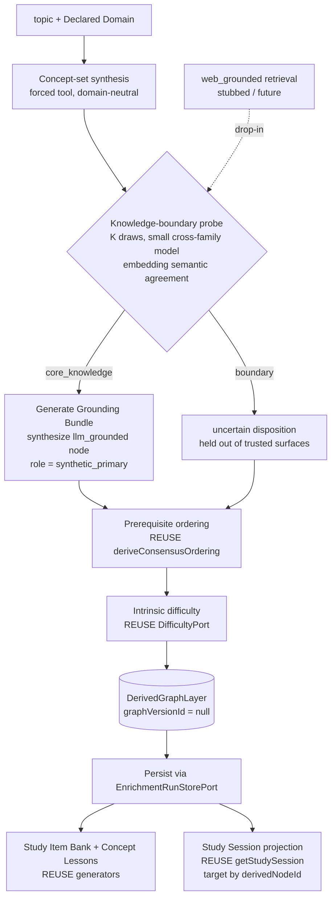

# feat: Synthetic topic generation arm

## Summary

Add a second pipeline arm: a topic plus a Declared Domain produces a free-standing, anchor-less
Derived Graph Layer of `llm_grounded` Concepts, gated per-concept by a small cross-family
knowledge-boundary probe, and fed into the existing study and projection stack. The asserted graph
stays source-pure; web retrieval is stubbed as a future drop-in. This prepares the substrate for the
later "type a topic, get a course" product without building that product.

---

## Problem Frame

Every Processing Journey today begins with a curated source parsed into a `StructuredDocument`, and
every quote downstream is verified verbatim against its blocks. There is no entry point that produces
a learnable graph from a topic alone, so any topic without a good curated source cannot be covered.
The grounding-origin model already reserves a home for source-absent content (the derived layer,
`llm_grounded`); this work activates that home from the front instead of as Graph Enrichment's
by-product. See origin: `docs/brainstorms/2026-06-30-synthetic-topic-generation-requirements.md`.

---

## Key Technical Decisions

- KTD1. **Synthetic content is a free-standing, anchor-less Derived Graph Layer**, produced by a new
  operation — not an Extraction Run, not a Graph-Version Build, and not Graph Enrichment (which is
  parasitic on a published asserted base). The asserted graph is never written. ADR-0019 currently
  names Graph Enrichment the *only* creator of derived facts, so this plan amends ADR-0019 to admit
  the synthetic operation as a second derived-fact producer.

- KTD2. **Nullable published-version link** (call-out C1). Relax `graph_version_id` from
  `NOT NULL` to nullable on the normalized tables the synthetic path writes (`graph_enrichments`,
  `study_items`, `rejected_study_items`, `concept_lessons`, `lesson_absent_nodes`), and relax
  `DerivedGraphLayer.graphVersionId` to `string | null`. Synthetic layers store a null link. This
  keeps `graph_versions` purely asserted — no synthetic sentinel rows pollute the asserted-version
  registry. Applied by editing the single initial migration and resetting the DB (AGENTS rules 8, 9).

- KTD3. **Generalize the `llm_grounded` node** (call-out C2). Add a `synthetic_primary` value to the
  enrichment node's `role` and make `mintingReason` optional, rather than adding a sibling node type.
  Downstream consumers key on `groundingOrigin: "llm_grounded"` and the presence of a
  `groundingBundle`, not on `role`, so the verbatim floor, difficulty, study-item, and lesson
  generation need no new branches. The existing minting path keeps writing `role: "prerequisite"` +
  `mintingReason` unchanged.

- KTD4. **Knowledge-boundary probe via self-consistency over a small cross-family model.** A
  dedicated small-parameter LiteLLM alias, independent from the synthesizer, answers a pointed
  factual question about each concept K times at moderate temperature. Semantic agreement across the
  K draws is measured with the **existing embedding port** (`NodeEmbeddingPort` /
  `qwen3-embedding-8b`) — a similarity use that ADR-0012 permits — not lexical overlap and not a new
  judge. High agreement → `core_knowledge`; dispersion → `boundary`. This reuses the
  `deriveConsensusOrdering` shape (K draws → aggregate → route uncertain) and sharpens ADR-0030,
  which is moved from Proposed toward Accepted for the probe half with **moderate** temperature
  replacing its "low temperature" (low temperature masks confident hallucination).

- KTD5. **`boundary` → `uncertain` disposition; web retrieval stubbed at the same seam.** A
  `boundary` verdict routes the node to an `uncertain`-style disposition: retained in the layer,
  inspectable, excluded from trusted learner-facing surfaces. The synthesis stage emits grounding
  origin as a per-node property, so the future `web_grounded` retrieval branch replaces the stub
  (and takes the place of the `uncertain` route on `boundary`) without restructuring.

- KTD6. **Reuse the downstream derived machinery unchanged**, fixing only one source-grounded
  assumption. Prerequisite ordering, intrinsic difficulty, study-item generation, Concept Lesson
  generation, and the Study Session projection all key on `derivedNodeId` and already tolerate
  `llm_grounded` nodes. The lone fix: learner-path/study-session **target resolution** resolves a
  target by finding `nodeKind === "anchor"`, which an anchor-less layer has none of — so synthetic
  targets resolve by `derivedNodeId` directly.

- KTD7. **Concept-set synthesis is the source-less analog of Candidate Discovery**, launched by a new
  worker command. It generates a bounded concept set from `topic + declaredDomain` in one forced-tool
  call; the set is generated, not gated for coverage or grain (deferred). All new prompts stay
  domain-neutral and untuned with expected topics (AGENTS rule 17).

---

## High-Level Technical Design

The synthetic operation is a sibling to `runGraphEnrichment`: a different front half (synthesize +
probe + ground) that produces the same `DerivedGraphLayer` artifact, then hands off to the identical
reused back half (ordering, difficulty, study assets, projections).

---

## Requirements

These mirror the origin requirements; this plan implements all of them. See origin for the canonical
statements.

**Synthetic generation operation**

- R1. A new operation takes `topic` + `declaredDomain` and produces a free-standing Derived Graph
  Layer, running no Extraction Run and no Graph-Version Build.
- R2. The operation generates the concept set from `topic` + `declaredDomain` alone; the set is not
  gated for coverage or grain in this build.
- R3. Every synthetic node is `llm_grounded` with a Generated Grounding Bundle and records
  `not_applicable_by_grounding`; no node claims source-verbatim provenance.
- R4. The layer carries no anchor projections and never writes to the asserted graph or
  `graph_versions`.
- R5. Prerequisite ordering and intrinsic difficulty run over the synthetic layer via the existing
  machinery.

**Confidence / safety probe**

- R6. Each synthesized concept is probed by a dedicated small-parameter LiteLLM alias, cross-family
  from the synthesizer.
- R7. The probe samples K times at moderate temperature and aggregates semantic agreement into a
  structured verdict returned via a forced named tool.
- R8. `core_knowledge` synthesizes from parametric knowledge; `boundary` routes the node to an
  `uncertain`-style disposition — retained, inspectable, excluded from trusted learner surfaces.

**Learner-facing reuse**

- R9. Study Item Bank and Concept Lesson generation run over the synthetic layer keyed to
  `derivedNodeId`, reusing the existing generators.
- R10. The Study Session projection renders over the synthetic layer with no new primitive; target
  resolution works on an anchor-less layer.

**Coexistence and the future web seam**

- R11. The source-grounded arm is unchanged; a Processing Journey is either source-grounded or
  synthetic, and both coexist.
- R12. Web retrieval is stubbed; the synthesis stage decides grounding origin as an emitted property
  so `web_grounded` and its retrieval branch replace the stub without restructuring.
- R13. No asserted "synthetic" grounding origin is introduced, and generated text is never registered
  as a curated source.

---

## Implementation Units

### U1. Schema and domain-type foundation

- **Goal:** Make an anchor-less, version-less synthetic layer and a synthetic node representable.
- **Requirements:** R3, R4 (representability); enables KTD2, KTD3.
- **Dependencies:** none.
- **Files:**
  - `packages/infrastructure-postgres/src/migrations/0000_initial_lrnki_schema.sql` — relax
    `graph_version_id` to nullable on `graph_enrichments`, `study_items`, `rejected_study_items`,
    `concept_lessons`, `lesson_absent_nodes`.
  - `packages/domain-core/src/index.ts` — `DerivedGraphLayer.graphVersionId: string | null`; widen
    the `llm_grounded` node `role` to include `"synthetic_primary"`; make `mintingReason` optional.
  - `packages/domain-core/src/groundingModel.test.ts` — node-shape coverage.
  - `docs/adr/0023-grounding-origin-model-and-cross-family-generated-node-judge.md` — admit
    `synthetic_primary` role and anchor-less derived layers; reaffirm `web_grounded` reserved.
- **Approach:** Pure schema + type widening, no behavior. Keep the existing minting path emitting
  `role: "prerequisite"` + `mintingReason`; the new role/optional field are additive. DB reset
  applies the edited single migration (AGENTS rules 8, 9).
- **Patterns to follow:** existing grounding-origin model in `domain-core/src/index.ts` lines ~595,
  768–809. Note: that file carries a non-text byte — `grep` needs `-a`; the Edit/Read tools handle it
  normally.
- **Test scenarios:**
  - A `synthetic_primary` `llm_grounded` node with no `mintingReason` is a valid `DerivedGraphNode`.
  - An existing minted `prerequisite` node with `mintingReason` still type-checks unchanged.
  - Test expectation: schema nullability is proven by the U5 round-trip; this unit covers the type
    shapes only.
- **Verification:** Workspace typecheck green; a fresh DB reset applies cleanly with the relaxed
  columns.

### U2. Synthesis and probe ports, aliases, and adapters

- **Goal:** Provide the LLM access seams for concept-set synthesis and the knowledge-boundary probe.
- **Requirements:** R1, R6, R7.
- **Dependencies:** U1.
- **Files:**
  - `packages/ports/src/index.ts` — `ConceptSetSynthesisPort` (`{ topic; declaredDomain }` →
    candidate concepts) and `KnowledgeBoundaryProbePort` (one draw: `{ conceptLabel; declaredDomain }`
    → a structured factual answer). Extend `GroundingGenerationPort` input to carry topic context for
    the anchor-less case (empty `scaffoldedAnchors`).
  - `litellm/config.yaml` — add aliases `kg-concept-synthesis` (synthesizer family, e.g. DeepSeek) and
    `kg-knowledge-boundary-probe` (small cross-family, e.g. `meta-llama/llama-4-scout` or
    `mistral-small`).
  - `packages/infrastructure-litellm/src/syntheticGenerationAdapters.ts` (+ `.test.ts`) — adapters for
    both, forced-tool schemas single-sourced from zod (ADR-0006).
- **Approach:** The probe adapter returns ONE answer per call; the K-draw loop and aggregation live in
  the application (U3), mirroring how `runGraphEnrichment` owns `orderingSampleCount` rather than the
  ordering adapter. Restart `lrnki-litellm` after editing aliases.
- **Patterns to follow:** existing adapters in `packages/infrastructure-litellm/src/extractionAdapters.ts`
  and `LiteLlmStudyItemGenerationAdapter`; the registry-sweep test cases.
- **Test scenarios:**
  - Synthesis adapter parses a forced-tool concept-set payload into candidate concepts.
  - Probe adapter parses a forced-tool factual-answer payload.
  - Registry-sweep includes the two new aliases.
  - **Covers no AE directly** — adapter-level.
- **Verification:** infra-litellm suite green; the chosen probe model is **empirically confirmed to
  support forced `tool_choice`** (some models cannot — verify before locking the alias).

### U3. Knowledge-boundary probe aggregation

- **Goal:** Turn K probe draws into a `core_knowledge` / `boundary` verdict.
- **Requirements:** R7, R8.
- **Dependencies:** U2.
- **Files:**
  - `packages/application/src/knowledgeBoundaryProbe.ts` (+ `.test.ts`).
- **Approach:** Call `KnowledgeBoundaryProbePort` K times at moderate temperature, embed the K answers
  via the existing `NodeEmbeddingPort` (ADR-0012 permits embeddings for similarity), and score
  semantic agreement (mean pairwise cosine or cluster count). Above an agreement threshold →
  `core_knowledge`; below → `boundary`. K, temperature, and threshold are config knobs with shipped
  defaults, calibrated in U8 (never assumed — mirror `orderingSampleCount`).
- **Patterns to follow:** `packages/application/src/deriveConsensusOrdering.ts` (K-draw aggregation,
  route-to-`uncertain`); `mapWithConcurrency.ts` for the bounded draw fan-out.
- **Test scenarios:**
  - K near-identical answers → high agreement → `core_knowledge`.
  - K divergent/contradictory answers → low agreement → `boundary`.
  - Covers AE1, AE2 (verdict branches).
  - A single stray divergent draw at large K does not flip a robust `core_knowledge` to `boundary`.
  - Embedding-port failure fails safe (treat as `boundary` — never silently `core_knowledge`).
- **Verification:** application suite green; verdict thresholds are config-driven, not hard-coded.

### U4. Synthetic generation operation

- **Goal:** Orchestrate topic → assembled, anchor-less `DerivedGraphLayer`.
- **Requirements:** R1–R5, R8, R12.
- **Dependencies:** U1, U2, U3.
- **Files:**
  - `packages/application/src/runSyntheticGeneration.ts` (+ `.test.ts`).
  - `docs/adr/0019-graph-enrichment-derived-layer.md` — amend the "only operation that creates derived
    facts" clause to admit the synthetic operation.
  - `docs/adr/0030-confidence-gated-synthesis-with-web-grounding.md` — probe half → Accepted; moderate
    temperature; web-retrieval half still deferred.
- **Approach:** Synthesize the concept set → probe each concept (U3) → for `core_knowledge`, generate a
  Grounding Bundle and assemble a `synthetic_primary` `llm_grounded` node; for `boundary`, record an
  `uncertain` disposition (web retrieval stubbed at this exact seam) → run prerequisite ordering and
  difficulty over the assembled node set (reuse) → assemble a `DerivedGraphLayer` with
  `graphVersionId: null`. Wrap stages in `bracketStage` with its own spend tags (ADR-0029) and an
  operation tag.
- **Patterns to follow:** `packages/application/src/runGraphEnrichment.ts` (stage bracketing, config
  hash, ordering/difficulty reuse, layer assembly); `enrichmentNodeMinting.ts` and `selectNodeGrounding.ts`
  for grounding-bundle assembly.
- **Test scenarios:**
  - A topic yields a layer of `llm_grounded` `synthetic_primary` nodes, zero anchors, null version.
  - A `boundary` concept appears as an `uncertain` disposition, not a trusted node. Covers AE2.
  - No node carries a source citation; every node carries a Grounding Bundle. Covers AE3.
  - Prerequisite ordering and difficulty populate over the synthetic node set.
  - Stage failure marks the operation failed with a readable timeline (no whole-body try).
- **Verification:** application suite green; a fake-port run produces a well-formed anchor-less layer.

### U5. Persist synthetic layers

- **Goal:** Round-trip a synthetic layer through Postgres with a null version link.
- **Requirements:** R3, R4.
- **Dependencies:** U1, U4.
- **Files:**
  - `packages/infrastructure-postgres/src/PostgresEnrichmentStores.ts` (+ test).
- **Approach:** `persist` writes `graph_enrichments` + `derived_graph_nodes` with `graph_version_id`
  NULL and the `synthetic_primary` role; `getLayer` hydrates it. Confirm the `enrichment_run`
  JSON_TABLE view tolerates a null `graph_version_id`.
- **Patterns to follow:** existing enrichment persist/hydrate and the impostor-item round-trip suite.
- **Test scenarios:**
  - Persist + hydrate a synthetic layer: null version and `synthetic_primary` nodes survive verbatim.
  - A node with no `mintingReason` round-trips.
  - Mixed `core_knowledge` nodes + `uncertain` dispositions hydrate correctly.
  - The JSON_TABLE inspection view returns the synthetic layer with a null version.
- **Verification:** infra-postgres DB-backed suite green (DATABASE_URL from `.env`).

### U6. Worker command to launch a synthetic journey

- **Goal:** A CLI entry point that runs the synthetic operation.
- **Requirements:** R1, R11.
- **Dependencies:** U4, U5.
- **Files:**
  - `apps/kg-worker/src/knowledgeGraphWorker.ts` — add `generate-synthetic-layer <topic> <declaredDomain>`
    to the `switch (command)` dispatch; wire ports, adapters, store, reporter.
- **Approach:** Mirror `enrichGraphVersion`'s wiring and logging; print a summary
  (`nodes core/uncertain`, ordering edges, difficulty count). The source-grounded commands are
  untouched (R11).
- **Patterns to follow:** the `enrich-graph-version` case and `enrichGraphVersion` in the same file.
- **Test scenarios:** Test expectation: light — argument parsing and a missing-argument error path;
  the orchestration is covered in U4.
- **Verification:** `generate-synthetic-layer` runs end-to-end against the real stack in U8.

### U7. Study assets and Study Session over the synthetic layer

- **Goal:** Generate study items + Concept Lessons and render a Study Session over a synthetic layer.
- **Requirements:** R9, R10 (call-out C3).
- **Dependencies:** U5.
- **Files:**
  - `packages/application/src/getStudySession.ts` (+ test) — resolve a synthetic target by
    `derivedNodeId` when the layer has no anchor (the KTD6 fix).
  - `packages/application/src/generateStudyItemBank.ts`, `assembleConceptLesson.ts` — confirm they run
    over a synthetic layer; adjust only if they assume a non-null version.
  - `apps/admin-lab/src/lib/studySession.ts`, `apps/admin-lab/src/app/admin/lab/study/[learnerStateRef]/page.tsx`
    (+ `studySession.test.ts`) — render a synthetic layer's session.
- **Approach:** Reuse the generators and the `studySegmentsByNode` projection; the only behavioral
  change is anchor-less target resolution. Study items + lessons over synthetic nodes are
  `generated`/`llm_grounded` by construction — no source-citation arm.
- **Patterns to follow:** the impostor/Concept-Lesson study-session work and the existing
  `getStudySession` segment-sequence projection.
- **Test scenarios:**
  - A Study Session targets a synthetic node by `derivedNodeId` and gates in-scope nodes
    (locked/frontier/mastered). Covers R10.
  - Study items + lessons generate over synthetic nodes with `generated` provenance only. Covers R9.
  - A `boundary`/`uncertain` node is excluded from the trusted session surface. Covers AE2.
  - The Admin Lab study screen renders a synthetic session without an anchor.
- **Verification:** application + admin-lab suites green; Admin Lab production build passes.

### U8. Real-use gate and documentation consolidation

- **Goal:** Prove the arm on real model calls and land the durable docs.
- **Requirements:** all (validation); R12 seam documented.
- **Dependencies:** U6, U7.
- **Files:**
  - `docs/plans/TODO.md` — fold the completed outcome + the latest validation; add the follow-up item
    (below).
  - `CONTEXT.md` — add vocabulary for the synthetic operation / synthetic concept / anchor-less layer.
  - `docs/adr/README.md` — reflect the ADR-0019/0023/0030 amendments.
- **Approach:** Run two synthetic topics across mixed domains end to end on a freshly reset DB with
  production calls; inspect that concept sets are sane, `core_knowledge` grounding is plausible,
  `boundary` concepts route to `uncertain`, no source citations leak, and a Study Session renders.
  Calibrate K / temperature / agreement threshold here. Record the trail under `tmp/`.
- **Patterns to follow:** prior rule-14 trails (e.g., the impostor validation in `TODO.md`).
- **Test scenarios:** Test expectation: none (real-use inspection per ADR-0013, not unit tests).
- **Verification:** AGENTS rule 14 PASS recorded with extraction/enrichment-style run IDs, inspected
  output, and the honesty invariant (0 source citations on synthetic nodes; 0 asserted-graph writes).

---

## Scope Boundaries

**Deferred for later** (from origin)

- Web search / `web_grounded` activation and the retrieval branch.
- A set-quality gate over the generated concept set (coverage, grain, redundancy).
- The full learner-facing "type a topic, get a course" product.

**Outside this product's identity** (from origin)

- Synthetic content never enters the asserted graph; ADR-0002 / CONTEXT stay unchanged.
- No new asserted "synthetic" grounding origin.
- No treating generated text as a curated source to route synthetic content through the
  source-grounded arm.

**Deferred to Follow-Up Work** (plan-local)

- Validate and adapt the remaining learner-facing projections for anchor-less synthetic layers: the
  Learner Paths view, the deferred adaptive path, and any other anchor-based target resolution beyond
  the Study Session covered in U7. Captured as a TODO item; the projections are wired today but were
  validated only on source-grounded layers.

---

## Risks & Dependencies

- **Probe model forced-tool support.** The small cross-family alias must support forced `tool_choice`
  (ADR-0006); some models do not. Mitigation: U2 verifies empirically before locking the alias.
- **Probe calibration is empirical.** K, temperature, and the agreement threshold ship with defaults
  and are calibrated by real-use inspection in U8, not assumed (ADR-0013, ADR-0028).
- **Generalizing the `llm_grounded` node touches enrichment minting.** Mitigation (KTD3): the
  existing minting path keeps emitting `role: "prerequisite"` + `mintingReason`; the synthetic role
  and optional field are purely additive, and no downstream consumer branches on `role`.
- **DB reset destroys existing data.** Allowed during development (AGENTS rule 9); the single
  migration is edited in place (rule 8).
- **ADR governance.** ADR-0019 (sole derived-fact creator), ADR-0023 (node roles / anchor-less
  layers), and ADR-0030 (probe half, temperature) are amended in the same change that introduces the
  behavior (AGENTS rule 18).

---

## Acceptance Examples

- AE1. **Covers R7, R8.** Given a concept the probe scores `core_knowledge`, when the layer is built,
  then the node is `llm_grounded` `synthetic_primary`, synthesized from parametric knowledge, and
  eligible for trusted surfaces.
- AE2. **Covers R8, R10, R12.** Given a concept the probe scores `boundary` (web retrieval stubbed),
  when the layer is built, then the node is recorded as an `uncertain` disposition — inspectable,
  excluded from trusted learner paths, never confidently taught.
- AE3. **Covers R3, R4.** Given any synthetic node, when its grounding is inspected, then it carries
  `not_applicable_by_grounding`, cites no source block, and produced no asserted Concept, edge, or
  `graph_versions` row.

---

## Open Questions

**Deferred to Planning** — resolved here:

- Representability (origin) → KTD2: nullable version link, no migration beyond the single-schema edit.
- Probe semantic-agreement mechanism (origin) → KTD4: existing embedding port, not lexical, not a new
  judge.

**Deferred to Implementation:**

- When a `boundary` node is a necessary prerequisite of a `core_knowledge` node, does excluding it
  leave an acceptable gap or should the path stop short? Resolve by the existing `uncertain`-edge
  handling plus U8 real-use inspection.
- Final probe alias/model (pending the U2 forced-tool check) and the calibrated K / temperature /
  threshold (U8).
- Exact concept-set size/grain bounding in the synthesis prompt, kept domain-neutral.

---

## Sources / Research

- **Problem class (AGENTS rule 21):** knowledge-boundary / hallucination detection; self-consistency
  (SelfCheckGPT) and semantic entropy as recognized signals — both need sampling diversity, hence
  moderate (not low) temperature. Selective retrieval is the conventional `web_grounded` branch.
- **Code seams:** `packages/application/src/runGraphEnrichment.ts` (operation template),
  `deriveConsensusOrdering.ts` (K-draw aggregation), `generateStudyItemBank.ts` /
  `assembleConceptLesson.ts` / `getStudySession.ts` (reused generators + projection),
  `packages/infrastructure-postgres/src/PostgresEnrichmentStores.ts` (layer persistence),
  `apps/kg-worker/src/knowledgeGraphWorker.ts` (command dispatch).
- **Schema:** `graph_version_id` is `NOT NULL` on `graph_enrichments`, `study_items`,
  `rejected_study_items`, `concept_lessons`, `lesson_absent_nodes` (the U1 relaxation targets);
  `artifact_versions.graph_version_id` is already nullable.
- **Projection wiring:** Admin Lab routes `/admin/lab/paths`, `/study`, `/learner-loop`, and the
  `DerivedGraphExplorer` confirm the projection layer is live; target resolution via
  `nodeKind === "anchor"` is the source-grounded assumption U7 fixes.
- **Gotcha:** `packages/domain-core/src/index.ts` contains a non-text byte; `grep` treats it as binary
  unless given `-a`.
