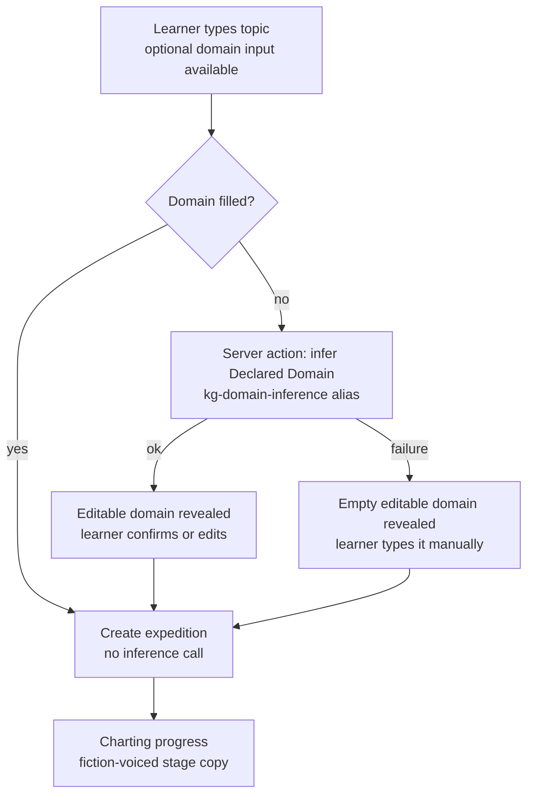
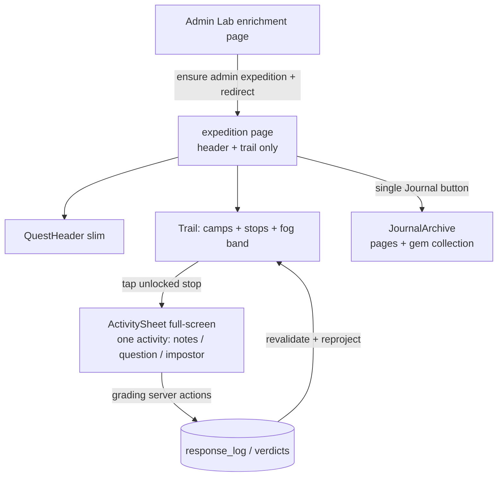

# feat: Learner App map-centered trail, activity sheet, and charting onboarding

## Summary

Rework the `/learn` Expedition Journal so the trail is the single fog-of-mastery home surface:
stops open one activity at a time in a full-screen sheet, the journal absorbs the map's souvenir
role, charting becomes a topic-first form with an inferred correctable Declared Domain, charting
progress speaks fiction-voiced copy, and the Admin Lab gains a one-click door into the Learn App as
learner `admin`.

---

## Problem Frame and Requirements

Requirements, key decisions, flows, and acceptance examples are owned by the origin brainstorm
([2026-07-04 map-center UX requirements](../brainstorms/2026-07-04-learner-app-map-center-ux-requirements.md),
R1–R14, F1–F3, AE1–AE6). This plan implements all of them; units cite the R/AE IDs they advance.
Game-UX policy: [ADR-0032](../adr/0032-keep-learner-app-in-flow-through-mastery-aligned-game-ux.md).

---

## Key Technical Decisions

- **Domain inference is a new forced-tool seam mirroring the intrinsic-difficulty judge.** New
  `DeclaredDomainInferencePort` in `packages/ports/src/index.ts`; zod validator single-sourced to a
  JSON schema via `toForcedToolSchema` in `packages/infrastructure-litellm/src/toolSchemas.ts`
  (ADR-0006); adapter class + system prompt + alias constant in one new adapter file; new
  `kg-domain-inference` alias in `litellm/config.yaml` targeting
  `deepseek/deepseek-v4-flash-no-thinking` (rule 5); new append-only `STAGE_TAGS` constant for
  spend attribution. Prompt and tool descriptions stay domain-neutral with a fixture-term leak test
  (rule 17).
- **Adaptive one/two-step charting form with a data-returning server action.** The repo has no API
  routes; the pre-submit inference call is a server action awaited from a client form component via
  `useTransition` (pattern: `submitLearnerOptionSelect` consumed in `ActivityCards.tsx`). Domain
  filled from the start → create directly, no inference call; blank → one inference call on button
  press reveals the editable domain, second press creates. No debounced infer-as-you-type.
- **Fog is a display transform of existing step states.** `trailView.ts` derives a fog boundary
  from the states the projection already emits (locked territory is fogged; the band sits above the
  pulsing next stop). No projection or persistence change — `getStudySession` is untouched (R3,
  R18 of the v1 surface).
- **The activity sheet is a client overlay keyed by the existing `stopId`.** `trailView.ts` already
  mints per-stop identity (`derivedNodeId:kind:studyItemId`); the sheet resolves one stop's single
  activity from the loaded session data and reuses the shipped grading server actions unchanged.
  The node-level `selectActivityNodeId` inline-screen selection is superseded and deleted with
  `ActivityScreen.tsx` (rule 18).
- **The admin door ensures the expedition row.** The expedition page 404s without a
  `learner_expeditions` row, so the Admin Lab link fires a server action that calls a new
  application use-case: return the existing `admin` row for the enrichment or create one with the
  top recommended target (reusing `targetCandidates.ts` selection), then redirect to
  `/learn/admin/expedition/[enrichmentId]`.
- **Stage copy is an append-only display map beside the learner vocabulary.** Keyed by the persisted
  stage identifiers with a generic fiction-voiced fallback for unknown ids; operation timelines and
  stage persistence are unchanged.

---

## High-Level Technical Design

Charting form decision flow (directional guidance, not implementation specification):

Learner surface composition after the rework:

---

## Implementation Units

### U1. Declared-domain inference seam

- **Goal:** A production-ready forced-tool LLM call that maps a learner topic to a Declared Domain.
- **Requirements:** R10.
- **Dependencies:** none.
- **Files:** `packages/ports/src/index.ts`;
  `packages/infrastructure-litellm/src/toolSchemas.ts`;
  `packages/infrastructure-litellm/src/domainInferenceAdapters.ts` (new) and
  `packages/infrastructure-litellm/src/domainInferenceAdapters.test.ts` (new);
  `packages/infrastructure-litellm/src/index.ts`;
  `packages/domain-core/src/index.ts` (`STAGE_TAGS`); `litellm/config.yaml`.
- **Approach:** Mirror `intrinsicDifficultyAdapters.ts`: exported alias constant
  (`kg-domain-inference`), exported system prompt, adapter class implementing the new port,
  `client.call` with forced tool name, schema, validator, and the new stage tag. Output schema is a
  single short field-of-study string with a `.describe()` that stays domain-neutral. Alias targets
  `deepseek/deepseek-v4-flash-no-thinking` in `router_settings.model_group_alias` with the
  conventional comment.
- **Patterns to follow:** `packages/infrastructure-litellm/src/intrinsicDifficultyAdapters.ts`,
  `forcedToolSchema.ts`, existing alias entries in `litellm/config.yaml:309-354`.
- **Test scenarios:**
  - Happy path: adapter returns the tool-call domain string; call carries the expected model alias,
    tool name, schema, and stage tag.
  - Fail-closed: malformed tool payload rejects (validator error), no partial result.
  - Domain neutrality: system prompt + serialized schema contain no fixture terms (replicate
    `intrinsicDifficultyAdapters.test.ts` leak scan).
  - Normalization: surrounding whitespace in the returned domain is trimmed; empty-string result is
    treated as failure, not a valid domain.
- **Verification:** `@lrnki/infrastructure-litellm` tests green; a manual call through the alias
  returns a plausible domain for a real topic (requires `lrnki-litellm` container restart after the
  config edit).

### U2. Topic-first charting form

- **Goal:** The chart-a-course form leads with one topic input plus an optional domain input, and
  settles the domain (learner-typed, inferred-then-confirmed, or manually entered on inference
  failure) before creation.
- **Requirements:** R9, R10; AE3, AE6.
- **Dependencies:** U1.
- **Files:** `apps/admin-lab/src/components/learn/ChartCourseForm.tsx` (new, client) and
  `apps/admin-lab/src/components/learn/ChartCourseForm.test.tsx` (new);
  `apps/admin-lab/src/components/learn/ExpeditionEntry.tsx`;
  `apps/admin-lab/src/app/learn/[learnerStateRef]/actions.ts` (new data-returning
  `inferExpeditionDomain` action); `apps/admin-lab/src/lib/learnerCharting.ts` or a sibling helper
  for client construction; `apps/admin-lab/src/components/learn/vocabulary.ts` (labels, example
  topics).
- **Approach:** Extract the form into a client component using `useTransition`. Primary input asks
  what the learner wants to learn with concrete example topics as placeholder copy; the optional
  field-of-study input is visible but secondary. Button logic per the HTD flow; `startTopicExpedition`
  keeps its `topic` + `declaredDomain` contract. Delete the "Course data" / "Paste your course
  data, syllabus notes, or learning goal." copy in the same change (rule 18).
- **Test scenarios:**
  - Covers AE6: domain filled from the start → submit path fires create without calling the
    inference action.
  - Covers AE3: blank domain → inference action result rendered editable; edited value is what the
    create submission carries.
  - Inference failure → form reveals an empty editable domain input and stays submittable.
  - Guard: empty topic never fires inference or create.
- **Verification:** Rendering states assert via `renderToStaticMarkup` convention; a real charting
  run from the form (rule 14) produces a `learner_expeditions` row whose `declared_domain` matches
  the settled value.

### U3. Fiction-voiced stage copy

- **Goal:** Learners never see raw stage identifiers during charting.
- **Requirements:** R11; AE4.
- **Dependencies:** none.
- **Files:** `apps/admin-lab/src/components/learn/stageCopy.ts` (new) and
  `apps/admin-lab/src/components/learn/stageCopy.test.ts` (new);
  `apps/admin-lab/src/components/learn/ChartingProgress.tsx`.
- **Approach:** A display map keyed by the persisted stage ids — the LLM `STAGE_TAGS` values plus
  `NON_LLM_STAGES` (`packages/application/src/operationTimelineCatalog.ts`) — with fiction-voiced,
  domain-neutral copy (e.g. scouting/charting/field-notes verbs) and a generic fallback for unknown
  ids. `ChartingProgress` renders only mapped copy. Exact strings are settled at implementation.
- **Test scenarios:**
  - Covers AE4: every id in `STAGE_TAGS` and `NON_LLM_STAGES` maps to copy that differs from the
    raw id and contains no hyphenated identifier.
  - Unknown id → fallback copy, never the raw string.
  - ChartingProgress with an in-flight stage renders the mapped copy.
- **Verification:** During a real charting run the progress card cycles through only fiction-voiced
  labels.

### U4. Fog-of-mastery trail and slim expedition page

- **Goal:** The trail reads as territory: fogged beyond the frontier, fog lifting in place as
  mastery folds, on a page reduced to header plus trail.
- **Requirements:** R1, R2, R4, R6, R8; AE1 (fog half).
- **Dependencies:** none (lands before U5, which removes the inline activity screen).
- **Files:** `apps/admin-lab/src/components/learn/trailView.ts` and `trailView.test.ts`;
  `apps/admin-lab/src/components/learn/Trail.tsx`;
  `apps/admin-lab/src/components/learn/QuestHeader.tsx`;
  `apps/admin-lab/src/app/learn/[learnerStateRef]/expedition/[enrichmentId]/page.tsx`;
  `apps/admin-lab/src/components/learn/theme.css` (only if new tokens are needed —
  `--journal-fog` exists).
- **Approach:** `trailView` derives a fog boundary from existing stop/camp states (locked territory
  fogged; band just above the pulsing next stop). `Trail` renders the fog band with the
  `--journal-fog` token and a Motion transition when the boundary advances; stage-one visual is the
  soft band, no terrain art (R4). QuestHeader stays slim (target, progress, next stop). Phone-width
  single column is the baseline layout; the existing summit celebration behavior is preserved.
- **Test scenarios:**
  - Fog boundary derivation: locked cluster below the boundary is fogged; mastering the frontier
    concept advances the boundary past its cluster.
  - Covers AE2 (fog half): an incorrect answer leaves the boundary unchanged.
  - Exactly one stop carries the "next" marker in any rendered trail (R6).
  - Render test: fog band present above the next stop; page renders header and trail only.
- **Verification:** Real session on a seeded enrichment shows fog above the frontier at phone width;
  mastering a concept visibly lifts fog over its region.

### U5. One-activity sheet and tappable stops

- **Goal:** Tapping an unlocked stop opens its single activity full-screen; the inline
  lesson-plus-activities screen is deleted.
- **Requirements:** R3, R5, R6, R8, R14 (activity-screen part); AE1, AE2.
- **Dependencies:** U4.
- **Files:** `apps/admin-lab/src/components/learn/ActivitySheet.tsx` (new, client) and
  `apps/admin-lab/src/components/learn/ActivitySheet.test.tsx` (new);
  `apps/admin-lab/src/components/learn/StopCard.tsx`;
  `apps/admin-lab/src/components/learn/Trail.tsx`;
  `apps/admin-lab/src/components/learn/activityProgress.ts` and `activityProgress.test.ts`;
  `apps/admin-lab/src/components/learn/ActivityCards.tsx` (reused inside the sheet);
  delete `apps/admin-lab/src/components/learn/ActivityScreen.tsx`;
  `apps/admin-lab/src/app/learn/[learnerStateRef]/expedition/[enrichmentId]/page.tsx`.
- **Approach:** Unlocked stops become tappable (the next stop pulses); selection is client state
  keyed by the existing `stopId` (`derivedNodeId:kind:studyItemId`). The sheet resolves that stop's
  one activity from the loaded session: theory → lesson content; question/impostor → the matching
  graded card; capstone → gem state. Grading server actions are reused unchanged; finish/close
  returns to the trail and revalidation refreshes stop states and fog. Answered graded items render
  their recorded result. Prefer the existing shadcn `sheet.tsx` styled full-screen; Motion
  (`AnimatePresence`, greenfield in this repo — import from `motion/react`) only if the shadcn
  transition is insufficient. Replace the superseded node-level `selectActivityNodeId` selection
  with per-stop resolution and delete dead paths in the same change (rule 18).
- **Test scenarios:**
  - Per-stop resolution: a theory stopId yields the lesson segment; a question stopId yields
    exactly its option-select item; an impostor stopId yields its impostor item.
  - Covers AE2: closing the sheet without answering (or answering wrong) keeps the stop open and
    replayable; nothing else changes.
  - Covers AE1: answering the concept's last graded activity marks the stop done and returns to the
    trail (fog/gem assertions live in U4's view derivation).
  - Locked stops are not tappable; exactly one pulsing next affordance remains.
  - Answered item reopened → sheet shows the recorded graded result, not a fresh form.
- **Verification:** On a phone-width viewport a full study pass (notes → question → impostor → gem)
  works entirely through sheets; reference sweep finds no `ActivityScreen` imports.

### U6. Journal collapse and learner map deletion

- **Goal:** One journal surface behind one button; no learner-facing graph view.
- **Requirements:** R7, R13, R14 (map part).
- **Dependencies:** U4 (page nav is touched there).
- **Files:** delete `apps/admin-lab/src/components/learn/SurveyMap.tsx` and `SurveyMap.test.ts`;
  delete `apps/admin-lab/src/app/learn/[learnerStateRef]/expedition/[enrichmentId]/map/` route;
  `apps/admin-lab/src/app/learn/[learnerStateRef]/expedition/[enrichmentId]/page.tsx` (nav: single
  Journal button); `apps/admin-lab/src/components/learn/JournalArchive.tsx` (already renders gems +
  pages; adjust presentation only if needed).
- **Approach:** Pure collapse and deletion; Cytoscape remains a dependency of the admin
  `DerivedGraphExplorer` only.
- **Test scenarios:** Test expectation: none beyond existing journal tests — deletion unit; the
  render test in U4 already asserts the nav shape.
- **Verification:** Reference sweep over `apps` finds no learner `SurveyMap` or `/map` route
  references; admin enrichment graph view still renders.

### U7. Admin Lab door into the Learn App

- **Goal:** One click from an enrichment view opens its expedition as learner `admin`, creating the
  expedition row when missing.
- **Requirements:** R12; AE5.
- **Dependencies:** none.
- **Files:** `packages/application/src/ensureLearnerExpedition.ts` (new) and
  `packages/application/src/ensureLearnerExpedition.test.ts` (new);
  `packages/application/src/index.ts` (barrel export — the barrel stays pruned to consumed names);
  `apps/admin-lab/src/app/admin/lab/enrichments/[enrichmentId]/page.tsx`;
  `apps/admin-lab/src/app/admin/lab/enrichments/actions.ts` (new server action);
  `apps/admin-lab/src/app/learn/[learnerStateRef]/actions.ts` (refactor
  `chooseCandidateExpedition` onto the shared use-case where it removes duplication).
- **Approach:** Use-case input `{ learnerStateRef, enrichmentId, ports }`: return the existing row
  from `getByEnrichment` or create one with the top recommended target from the existing
  `targetCandidates.ts` selection over `getDerivedGraphDetail`, `kind: "topic"`, `status: "ready"`,
  `active: true`. The admin server action calls it with `learnerStateRef: "admin"` and redirects to
  the expedition route; when the enrichment has no target candidates it returns a no-target outcome
  and the admin page shows an inline message instead of redirecting.
- **Patterns to follow:** `chooseCandidateExpedition` in
  `apps/admin-lab/src/app/learn/[learnerStateRef]/actions.ts:42-70`;
  `packages/application/src/listExpeditionCandidates.ts`; application use-case tests with inline
  fake ports (`chartTopicExpedition.test.ts`).
- **Test scenarios:**
  - Covers AE5: no existing row → row created with the recommended target and the action redirects
    to the `admin` expedition route.
  - Idempotent: existing `admin` row for the enrichment is reused; no duplicate row.
  - No target candidates (graph-only enrichment) → no row written, no-target outcome returned,
    admin page renders the message.
  - Two learners: ensuring for `admin` never touches another learner's rows.
- **Verification:** From a real enrichment page the link lands on a playable expedition as `admin`;
  running it twice creates exactly one row.

---

## Scope Boundaries

Deferred items are owned by the origin brainstorm's Scope Boundaries (doc upload,
learner-background gathering, fog-triggered remediation, the terrain-art pass). Plan-local
deferrals to follow-up work:

- Full terrain rendering under the trail (stage two of the accepted direction) — this plan ships
  the fog band only.
- Extracting further shared expedition helpers beyond what U7's refactor removes as duplication.

---

## Risks & Dependencies

- **LiteLLM config edits need a `lrnki-litellm` container restart** before the new alias resolves;
  a forgotten restart looks like a broken adapter.
- **Inference quality is unmeasured.** A wrong inferred domain mis-scopes Concept identity for the
  generated course; the editable confirm step is the mitigation, and the real-use gate (rule 14)
  should inspect inferred domains across a few real topics.
- **U4/U5 touch the same page and trail files**; land them in order to avoid a window where neither
  the inline screen nor the sheet can answer activities.
- **`AnimatePresence` is greenfield** in this repo; if it fights the server-component page
  structure, the shadcn sheet transition alone is acceptable.

---

## Operational Notes

- After the charting-form milestone (U1–U3), run the rule-14 real-use gate: a real topic charted
  through production aliases with `.env` loaded, inspecting the inferred domain, stage copy during
  the run, and the resulting expedition; repeat the trail/sheet gate after U5 on a seeded
  enrichment.
- Database resets are allowed during development (rule 9); the `response_log` FK on study items has
  previously blocked regeneration — clear dev rows if regeneration is needed.

---

## Sources / Research

- Verified current state: grounding dossier quotes in the origin doc's Sources section; expedition
  page data requirements (`getByEnrichment` → `notFound()`) in
  `apps/admin-lab/src/app/learn/[learnerStateRef]/expedition/[enrichmentId]/page.tsx:13-35`;
  stop identity `stopId` minting in `apps/admin-lab/src/components/learn/trailView.ts:46`;
  node-level activity selection in `apps/admin-lab/src/components/learn/activityProgress.ts:12-27`.
- Forced-tool exemplar: `packages/infrastructure-litellm/src/intrinsicDifficultyAdapters.ts` with
  port in `packages/ports/src/index.ts:387`, schema single-sourcing in
  `packages/infrastructure-litellm/src/toolSchemas.ts`, aliases in `litellm/config.yaml:309-354`,
  stage tags in `packages/domain-core/src/index.ts:1607`.
- Data-returning server action pattern: `submitLearnerOptionSelect` in
  `apps/admin-lab/src/app/learn/[learnerStateRef]/actions.ts:83-130` consumed via `useTransition`
  in `apps/admin-lab/src/components/learn/ActivityCards.tsx:17-25`; no `app/api` routes exist.
- Test conventions: `node:test` via tsx, colocated; component rendering via `renderToStaticMarkup`
  (`apps/admin-lab/src/components/LocalDateTime.test.tsx`); adapter tests with stubbed client and
  fixture-term leak scan (`packages/infrastructure-litellm/src/intrinsicDifficultyAdapters.test.ts:22-73`);
  application use-case tests with fake ports (`packages/application/src/chartTopicExpedition.test.ts`).
- UI inventory: shadcn `sheet.tsx` exists in `apps/admin-lab/src/components/ui/`; `motion` package
  (imports from `motion/react`) used only in `Trail.tsx`; no `AnimatePresence` usage repo-wide;
  theme tokens consumed via Tailwind arbitrary values (`StopCard.tsx:10`), `--journal-fog` already
  defined in `apps/admin-lab/src/components/learn/theme.css`.
