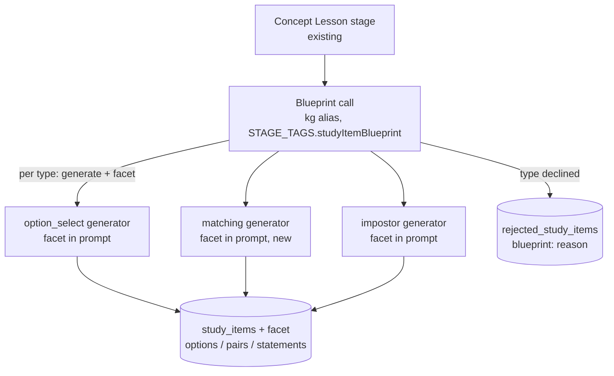
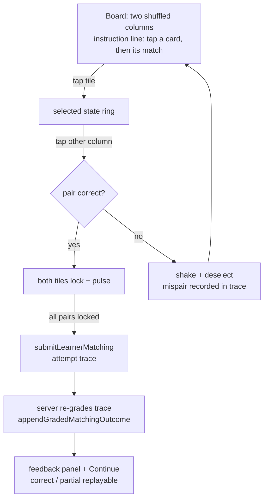

# feat: Learner game UX polish, item blueprint, and Matching Pairs mechanic

## Summary

Polish the Learner App expedition surface for mobile web (sticky condensed header over a scrollable
map, layout-derived fog, no hover-dependent affordances, per-attempt option shuffling, a compact
difficulty rating in the concept popover) and deepen the Study Item Bank: a per-node **item
blueprint** stage decides which item types each concept gets and assigns each a distinct assessed
facet with an anti-cueing criterion, and a new **Matching Pairs** keyed-selection mechanic
(Discovery/Sensation/Challenge under
[ADR-0032](../adr/0032-keep-learner-app-in-flow-through-mastery-aligned-game-ux.md)) joins
option-select and impostor, and study-session views stop serializing answer keys to the client for
all three types. Hard reset and full bank regeneration; no compatibility path.

---

## Problem Frame and Requirements

Decided in conversation (2026-07-05); this section owns them until completion.

- **R1 — Per-attempt answer-order randomization.** Option-select options and impostor statements
  are currently sorted by random UUID: random once, frozen forever, so retries leak the correct
  position. Shuffle client-side per attempt (every sheet open / retry re-shuffles); grading stays
  keyed by id. Applies to the Matching board's columns too.
- **R2 — Compact difficulty rating as game UX.** Surface the fused 0–1 intrinsic difficulty in the
  existing concept popover as a small learner-styled rating (no new surface, minimal space).
- **R3 — No difficulty threshold gate.** Considered and deferred; recorded in `TODO.md` item 1
  (signal untrustworthy for relation-like labels). The "too easy" symptom is answer leakage and is
  handled at generation (R4), not path projection.
- **R4 — Blueprint before items.** A per-node planning step decides which item types to generate
  (not every type for every concept) and assigns each a distinct assessed facet so option-select,
  matching, and impostor stop duplicating one salient fact. It carries an anti-cueing criterion: a
  facet whose question would be answerable by matching words with the concept label is not asked.
  Skipped types are recorded as inspectable absences. Prompts stay domain-neutral (rule 17); no
  deterministic lexical leakage gate (rule 16) — a dedicated leakage judge is added only if the
  rule-14 gate shows leakage surviving the blueprint.
- **R5 — Matching Pairs mechanic.** Tap-to-match 3–4 pairs (concept-side prompt ↔ example/
  scenario/description drawn from the lesson), deterministically auto-graded from the submitted
  attempt trace with partial credit, folding into the existing Response Log and mastery model.
  Pleasures: Discovery (recognize the concept in the wild), Sensation (tap-match feedback,
  clear-the-board pulse), Challenge (first-try accuracy graded).
- **R6 — Mobile-web-first sweep.** No tooltips or hover/cursor-dependent affordances on learner
  surfaces; tap affordances with visible selected states; safe-area-aware footer; commit the
  pending mobile-first amendment to ADR-0032. Target is mobile web now; PWA/native packaging waits
  for Learner App extraction into its own package (out of scope).
- **R7 — Fog is layout-derived.** Replace the fixed-size absolutely-positioned fog pill
  (`h-10 w-20`) with fog styling derived from stop layout/state — no magic sizes or offsets.
- **R8 — Fixed heading, scrollable map.** The expedition heading stays visible (sticky, condensed)
  while the checkpoint map scrolls beneath it.
- **R9 — Hard reset and real-use gate.** Edit the single initial migration in place, reset the DB,
  regenerate lessons + bank, and pass the rule-14 real-use evaluation on the seeded expedition at a
  390px viewport.
- **R10 — No client-serialized answer keys.** Deepening research found `isCorrect` / `isImpostor`
  ride into the client payload today. Grading is already server-authoritative (actions re-resolve
  the key via SQL, never trusting the client) and the client already renders feedback from the
  grading result's `keyedCorrectId`, so the flags are unused dead weight — removing them closes an
  answer-visible-in-devtools self-cheat vector, not a grading-integrity bug. Strip the key flags
  from the option-select and impostor study views; matching ships keyless from day one. Feedback
  UIs keep consuming the server grading result, never a client-held key.

Acceptance examples:

- **AE1:** Re-opening an already-failed question shows the options in a different order than the
  failed attempt (statistically; seed-free shuffle per mount).
- **AE2:** A concept whose lesson has fewer than 3 distinct examples gets no matching item, and its
  absence row names the blueprint reason.
- **AE3:** For a relation-like concept (e.g. a "…relationship" label), no generated question can be
  answered purely by matching the concept label's words to one option — verified by human
  inspection in the rule-14 pass, not a lexical gate.
- **AE4:** On the matching board, a wrong pair shakes and deselects (both tiles stay in play); a
  correct pair locks with a success pulse; clearing the board with one mispair grades `partial`
  with score `correctFirstTry / pairCount`; clearing with zero mispairs grades `correct` and
  completes the stop.
- **AE5:** At 390px, the expedition heading remains visible while scrolling the map; the grounded
  provenance badge opens its label on tap; no learner affordance requires hover.
- **AE6:** The serialized study session delivered to the learner client contains no `isCorrect`,
  `isImpostor`, or pair-key field for any item type; the correct answer becomes knowable only from
  the server grading response.

---

## Key Technical Decisions

- **Blueprint is a stage inside the existing `study_items` operation, not a new operation.** One
  forced-tool call per node (ADR-0006) as a new `studyStage(STAGE_TAGS.studyItemBlueprint, …)`
  bracket between the lesson-persist bracket and the option-select stage in
  `generateStudyItemBank.ts` (the in-memory `lessonByNode` map is its input): lesson content +
  concept label + sibling labels in; for each supported item type `{ generate, facet?, reason }`
  out. New `StudyItemBlueprintPort` in `packages/ports`, adapter beside
  `studyItemGenerationAdapters.ts`, reusing `STUDY_ITEM_GENERATION_MODEL`, new append-only
  `STAGE_TAGS.studyItemBlueprint`. Because `STAGE_TAGS` is a closed vocabulary and
  `OPERATION_TIMELINE_CATALOG.study_items` gates the spend⋈stage cost join, both registries (and
  the learner `stageCopy` map) must gain the new stages or their cost silently vanishes from the
  bottleneck/journey rollups. On blueprint failure after one retry, fall back to generating all
  types whose grounding exists (status quo behavior — a flaky call must not strip coverage).
- **Blueprint skips reuse the existing absence surface, routed through the one persist
  transaction.** A type the blueprint declines becomes a `rejected_study_items` row with a
  `blueprint:`-prefixed reason — no new table, and never a direct table write: `persist` deletes
  and re-inserts the enrichment's rejections inside its single transaction, and the table's
  `UNIQUE (derived_node_id, item_type)` would abort the whole bank write on a duplicate. The stage
  therefore feeds one rejection collector keyed by (node, type) — a guard rejection overwrites a
  blueprint reason if a mid-run fallback generated the type anyway — passed as `persist`'s
  `rejected` input. Regeneration stays a single whole-enrichment `persist` call (all surviving
  items + all rejections); per-type partial regeneration is out of contract, which is what
  guarantees a blueprint-dropped type's prior item gets superseded rather than lingering current.
  The assigned facet lives on the domain `StudyItem` type (so the artifact payload and the new
  nullable `study_items.facet` column derive from one source, rule 18) and flows into each
  generator's prompt in memory. Blueprint skips have no UI reader; the rule-14 protocol inspects
  them by SQL over `rejected_study_items`, where the `blueprint:` prefix keeps them mechanically
  separable from guard rejections.
- **The bank config hash bumps to `study-item-bank-v2` in one shared constant.** Blueprint, facet,
  and matching change what the hash describes; today `STUDY_ITEM_BANK_CONFIG_HASH` is duplicated in
  `apps/kg-worker/src/knowledgeGraphWorker.ts` and `apps/admin-lab/src/lib/learnerCharting.ts` —
  unify it into one exported constant consumed by both callers (rule 18).
- **Matching grading is a deterministic server re-grade of the submitted attempt trace.** The
  client submits the ordered list of pair attempts `{promptId, chosenMatchId}`; the server grades
  each attempt against the keyed pairs and appends ONE Response Log row per completed board:
  `judged_outcome` `correct` (zero mispairs) / `partial` (board cleared with mispairs) with
  `graded_score = firstTryCorrect / pairCount`, trace JSON in `submitted_answer`. The existing
  `response_log` schema already supports `partial` + fractional score — no log schema change. A new
  `appendGradedMatchingOutcome` sibling in `gradedSelectionOutcome.ts` owns outcome/score
  derivation, builds the row **without** `attemptSeq`, and routes through
  `ResponseLogStorePort.append` — the store's advisory-lock append path is the only race-safe seq
  allocator. The board disarms auto-submit after first fire so a client re-render cannot append a
  duplicate board row.
- **`partial` semantics are stated, not discovered.** Mastery folds read `judgedOutcome` only:
  `outcomeToMastery` maps `partial` to a flat 0.5 (below the 0.7 adaptive threshold) and the
  fractional `graded_score` is inspection/IRT-sufficiency data, behaviorally inert. The client
  `StudyItemOutcome` stays binary — the projection collapses `partial` to `incorrect`, which is
  what keeps the stop replayable (AE4); this collapse is intended and documented, not a bug.
  `struggledNodes` counts only `incorrect`, so a partial board never triggers a restoration nudge.
  Consequence accepted: because the fold is latest-row-wins, replaying a board on an
  already-mastered node can regress node mastery below the threshold — the same honest-signal
  behavior an incorrect option-select retry already has today, and consistent with ADR-0032's
  mastery alignment. U9 tests this explicitly rather than leaving it to be found in the field.
- **No study view serializes an answer key (R10).** `StudyOptionSelectView.options[].isCorrect`
  and `StudyImpostorView.statements[].isImpostor` are removed from the projection views; the
  matching view exposes prompt/match tiles with ids only. Grading feedback consumes the server
  action's `LearnerGradingResult` (`keyedCorrectId` already returned today); the impostor reveal
  metadata (`reveal`, `lieSource`, `siblingLabel`) stays on the view — it explains the lie but is
  not the key. Server actions already re-resolve keys via SQL, so no grading path changes.
- **Matching pairs get the impostor-statement persistence idiom, with the SQL-vs-guard split
  named.** New `matching_pairs` table: `prompt_text`, `match_text`, inline provenance/citation
  columns with one CHECK enforcing the two legal shapes (source-cited vs generated-grounded),
  cascade to `study_items`. The DB carries what row-scoped SQL can prove: `ordinal BETWEEN 0 AND
  3`, `UNIQUE (study_item_id, ordinal)`, and `CHECK (prompt_text <> match_text)`. The deterministic
  guard (`matchingGuard.ts`, mirroring `optionSelectGuard.ts`) owns the rest: 3–4 pair count,
  pairwise-distinct **normalized** texts on both sides (duplicating the TS normalizer into SQL
  would violate rule 18), and citation verification — provable structure only, never semantic
  opinion (rule 16). Unlike option/impostor there is no "exactly one keyed row" partial index (the
  key is the pairing itself), so the pair-count invariant has no structural backstop — the
  `assertPersistableItem` arm in the store is load-bearing, not belt-and-braces.
  `study_items.item_type` and `rejected_study_items.item_type` CHECKs gain `'matching'`, and the
  `artifact_study_items` JSON_TABLE view gains `pair_count` and `facet` columns — it is the rule-14
  inspection surface for facet de-duplication, and its column list is closed, so omitting them
  silently under-reports the new type.
- **`generateMatching` is a third method on the existing `StudyItemGenerationPort`, not a new
  port.** Same adapter file, same forced-tool idiom, new `STAGE_TAGS.matchingGeneration` tag and
  catalog entry.
- **Canonical segment order becomes theory → option_select → matching → impostor.**
  `STUDY_ITEM_TYPE_ORDER` in `studySessionProjection.ts` gains matching between recall and
  discrimination; the impostor remains the node's closing challenge.
- **Shuffle is a client display transform.** A shared Fisher–Yates helper applied in a `useState`
  initializer per mounted activity body (bodies are keyed by stop, so every sheet open or retry
  remounts = reshuffles). Persisted `ordinal` and projection id-sort stay as the stable server
  order; grading is id-keyed and untouched.
- **Difficulty rating rides the existing popover.** `trailView.ts` copies the stateful path step's
  fused 0–1 `difficulty` onto `TrailCluster`; `ConceptMarker` renders it as a compact 1–5 diamond
  rating (`round(score * 4) + 1`) with an accessible label from `vocabulary.ts`. Display only — no
  behavioral consumer (TODO item 1 unchanged).
- **Fog and header are pure layout work.** Fog: delete the fixed pill; the boundary row renders a
  full-width gradient band and fogged stops render dimmed/desaturated via the `isFogged` flag the
  view already computes. Header: expedition page becomes a sticky slim `QuestHeader` (target, gems,
  next stop) above the naturally scrolling map; the back-nav collapses into the header row.
- **Tooltip dies on learner surfaces.** `GroundedBadge` swaps its hover `Tooltip` for the tap
  `Popover` already used elsewhere; a sweep confirms no remaining hover-only affordance under
  `components/learn` + `app/learn`. The uncommitted ADR-0032 mobile-first paragraph ships with this
  change (R6).

---

## High-Level Technical Design

Bank generation with the blueprint stage (per node, inside the `study_items` operation):

Matching board interaction (client) and grading (server):

---

## Implementation Units

**Release sequencing (independently shippable slices).** The unit numbers are labels; the
`Dependencies:` fields are the real graph. Three slices can be verified and landed on their own,
ahead of the blueprint/matching build, so a rule-14 failure on the riskiest new surface does not
strand finished low-risk work:

- **Mobile polish (U1–U4)** — R2/R6/R7/R8/R1: no schema change; each is browser-verifiable at 390px
  on its own. U9's end-of-plan gate re-checks them under the reset, but they do not depend on it.
- **Answer-key strip for existing item types (U5)** — R10 for option-select/impostor: a live
  client-side key leak fix that needs none of the matching schema, guard, or generation work.
  Lands ahead of, and independently of, the Matching Pairs chain (U6–U9).
- **Blueprint + Matching Pairs (U6–U9)** — the deepening build that carries the new-mechanic risk.

The single hard-reset + rule-14 gate (U10) is the whole-release checkpoint; it does not preclude
verifying the three slices as they complete.

### U1. Trail map shell: sticky header and layout-derived fog

- **Requirements:** R7, R8; AE5 (heading half). **Dependencies:** none.
- **Files:** `apps/admin-lab/src/app/learn/[learnerStateRef]/expedition/[enrichmentId]/page.tsx`;
  `apps/admin-lab/src/components/learn/QuestHeader.tsx`, `CheckpointPath.tsx`, `trailView.ts` (only
  if the band needs a derived flag beyond `isFogged`).
- **Approach:** Slim `QuestHeader` into one sticky row (back link, truncated target, gems badge);
  delete the separate nav block. In `CheckpointPath`, delete the `h-10 w-20` pill
  (`CheckpointStopRow`); render the fog as a full-width gradient band on the boundary row plus
  dim/desaturate styling on rows whose stop `isFogged`.
- **Test scenarios:** trailView flags unchanged (existing tests); visual check at 390px — band
  spans the map width, aligns to the boundary row at every winding offset, header stays put.
- **Verification:** admin-lab tests + build; browser screenshots desktop/390px.

### U2. Mobile-web sweep and ADR-0032 amendment

- **Requirements:** R6; AE5 (tap half). **Dependencies:** none.
- **Files:** `apps/admin-lab/src/components/learn/GroundedBadge.tsx`, `vocabulary.ts` (+ its key
  test); `ActivitySheet.tsx` (footer `env(safe-area-inset-bottom)` padding);
  `docs/adr/0032-…game-ux.md` (commit pending edit).
- **Approach:** `GroundedBadge` → tap `Popover` (pattern: `ConceptMarker`); rename the
  `groundedTooltip` term; sweep `components/learn` + `app/learn` for `Tooltip`/`onMouseEnter`/
  hover-only styling and fix stragglers; confirm interactive tiles/buttons meet ~44px touch size.
- **Test scenarios:** vocabulary key test updated; no `Tooltip` import remains under learner paths.
- **Verification:** grep sweep clean; tap-open badge label verified in browser at 390px.

### U3. Difficulty rating in the concept popover

- **Requirements:** R2. **Dependencies:** none.
- **Files:** `apps/admin-lab/src/components/learn/trailView.ts` (+ test), `ConceptMarker.tsx`,
  `vocabulary.ts`.
- **Approach:** Copy `difficulty` from the stateful path step onto `TrailCluster`; render 1–5
  filled/hollow diamonds on the existing state/stops line of the popover with an `aria-label`
  ("Difficulty 3 of 5"). No new popover, no layout growth beyond one inline row segment.
- **Test scenarios:** mapping 0→1, 0.5→3, 1→5; cluster carries the step's score.
- **Verification:** unit tests; popover screenshot.

### U4. Per-attempt answer shuffle

- **Requirements:** R1; AE1. **Dependencies:** none (U9 consumes the helper).
- **Files:** `apps/admin-lab/src/components/learn/shuffle.ts` (new, + test); `ActivityCards.tsx`.
- **Approach:** Small unseeded Fisher–Yates over ids; `OptionSelectBody`/`ImpostorBody` order their
  rows via a `useState(() => shuffle(ids))` initializer so every mount (sheet open, retry) draws a
  fresh order while grading/feedback stays id-keyed. Server order (projection id-sort) unchanged.
- **Test scenarios:** shuffle is a permutation (same members, length); component renders all
  options exactly once and grades the chosen id correctly regardless of order.
- **Verification:** unit tests; manual retry in browser shows reordered options.

### U5. Strip client-serialized answer keys from existing item types

- **Requirements:** R10 (option-select + impostor half); AE6 (existing-types half). **Dependencies:**
  none. Ships ahead of the Matching Pairs chain — depends on none of the new schema, guard, or
  generation work.
- **Scope note (verified 2026-07-05).** This is payload hygiene, not a grading-integrity fix.
  Grading is already server-authoritative: `actions.ts` derives `keyedCorrectId` from SQL
  (`JOIN study_item_options … AND sio.is_correct`; impostor `impostor_statement_id`), never from the
  client. `ActivityCards.tsx:35,91` already renders the post-answer highlight from
  `result.keyedCorrectId` and reads the payload `isCorrect`/`isImpostor` flags nowhere. So the flags
  are already unused dead weight on the client; removing them closes an answer-visible-in-devtools
  self-cheat vector only.
- **Files:** `packages/application/src/studySessionProjection.ts` (+ test: remove
  `StudyOptionSelectView.options[].isCorrect` and `StudyImpostorView.statements[].isImpostor`, and
  drop them from the `:150/:167` mappers). `ActivityCards.tsx` needs no logic change — confirm a
  clean compile once the fields leave the view types (it never referenced them).
- **Approach:** Remove the two key flags from the projection view types and their mappers; the
  impostor reveal metadata (`reveal`, `lieSource`, `siblingLabel`) stays — it explains the lie but
  is not the key, and the which-statement highlight already comes from `keyedCorrectId`. No grading
  path changes.
- **Test scenarios:** the serialized session for option-select and impostor contains no `isCorrect`/
  `isImpostor` field (AE6, existing-types half); option-select/impostor feedback still marks the
  correct row using only the grading result (unchanged behavior).
- **Verification:** application + admin-lab tests compile and pass with the fields removed; network
  payload inspection shows no key flags for the two existing types.

### U6. Blueprint seam (port, adapter, stage)

- **Requirements:** R4; AE2, AE3 groundwork. **Dependencies:** none (U8 consumes facets;
  matching becomes plannable only after U7/U8 — the blueprint schema includes `matching` from the
  start and the stage simply finds no matching generator until U8 lands in the same release).
- **Files:** `packages/ports/src/index.ts`; `packages/domain-core/src/index.ts` (`STAGE_TAGS`,
  blueprint types, `facet` on the domain `StudyItem`);
  `packages/infrastructure-litellm/src/studyItemBlueprintAdapters.ts` (new, + test),
  `toolSchemas.ts`, `index.ts`; `packages/application/src/generateStudyItemBank.ts` (+ test);
  `packages/application/src/operationTimelineCatalog.ts` (+ test);
  `packages/infrastructure-postgres` study-item store + migration (`facet` column and
  `artifact_study_items` `facet` view column); `apps/kg-worker/src/knowledgeGraphWorker.ts` and
  `apps/admin-lab/src/lib/learnerCharting.ts` (blueprint port wiring; unified
  `study-item-bank-v2` config-hash constant); `apps/admin-lab/src/components/learn/stageCopy.ts`
  (+ test); `litellm/config.yaml` only if a distinct alias is warranted (default: reuse
  `STUDY_ITEM_GENERATION_MODEL`).
- **Approach:** Mirror `intrinsicDifficultyAdapters.ts` (forced tool, zod→JSON schema, fixture-leak
  test, stage tag). Prompt: given lesson sections + concept label + sibling labels, decide per item
  type whether a non-duplicative, non-label-cued question exists; assign one facet each (short
  free-text like "definition recall", "application recognition", "misconception discrimination");
  decline with a reason otherwise. Stage wiring: new `studyStage` bracket between the
  lesson-persist bracket and the option-select stage, consuming the in-memory `lessonByNode` map;
  thread `{ facet }` into each generator's prompt; feed declined types into the single rejection
  collector keyed by (node, type) that `persist` receives (guard reasons overwrite blueprint
  reasons on collision — never a direct `rejected_study_items` write); persist `facet` via the
  domain type so the artifact payload and the relational column share one source. Register the
  stage in `OPERATION_TIMELINE_CATALOG.study_items` (after `conceptLessonGeneration`) and give it
  learner-facing `stageCopy`. Fallback after one retry = plan all supported types, no facet. Both
  production callers (kg-worker command, learner charting context) wire the new port.
- **Test scenarios:** declined type → exactly one rejection row via `persist`, no generation call
  for it; a node whose type is blueprint-declined AND guard-rejected in one run (mid-run fallback)
  persists exactly one rejection row with the guard reason; facet reaches the generator prompt and
  the persisted item; blueprint failure falls back to all types; catalog test covers the new stage
  so its spend joins the `study_items` rollup; prompt/schema fixture-term leak scan (rule 17).
- **Verification:** application + litellm + kg-worker tests; one real blueprint call over a seeded
  lesson returns a plausible plan; the operations/bottleneck pages attribute blueprint spend to the
  `study_items` operation.

### U7. Matching Pairs domain, schema, and guard

- **Requirements:** R5 (structure half). **Dependencies:** none.
- **Files:** `packages/domain-core/src/index.ts` (`StudyItemType` + `MatchingItem`/draft types);
  `packages/infrastructure-postgres/src/migrations/0000_initial_lrnki_schema.sql`
  (`matching_pairs` table, `item_type` CHECKs, `artifact_study_items` view);
  `packages/application/src/matchingGuard.ts` (new, + test);
  `packages/infrastructure-postgres/src/PostgresLearnerLoopStores.ts` (persist/read/supersede).
- **Approach:** Follow the impostor idiom end-to-end: draft type from the model, guard promotes to
  a persistable item only on provable structure (3–4 pairs; both columns pairwise-distinct after
  `normalizeOptionText`; every pair's grounded side carries a citation that verifies against the
  node's grounding passages, provenance re-derived from the matched passage, fail-closed);
  `matching_pairs` CHECKs make an ungrounded source claim and an identical prompt/match pair
  unrepresentable, per the SQL-vs-guard split in Key Technical Decisions. Store work touches four
  symbols in `PostgresLearnerLoopStores.ts`: a `persist` type branch, an `insertMatchingPair`
  sibling of `insertImpostorStatement`, a third id-split + child batch-load in `hydrate`, and a
  third `assertPersistableItem` arm (load-bearing for pair count). While there, harden `hydrate`
  from fall-through-to-option-select to exhaustive dispatch that throws on an unknown `item_type` —
  today a matching row would silently hydrate as a broken option-select. Extend the
  `artifact_study_items` view with `pair_count`. Regeneration supersedes, never deletes (Response
  Log references).
- **Test scenarios:** guard accepts 3 and 4 pairs, rejects 2/5, duplicate texts (either column),
  identical prompt/match text, unverifiable citations; `listStudyItemsForEnrichment` over a mixed
  three-type bank hydrates every type correctly; regeneration where the new blueprint drops a type
  the prior generation had → old item superseded and its rejection row present; `hydrate` throws on
  an unknown persisted `item_type`.
- **Verification:** domain/application/postgres tests; DB reset applies the edited migration; the
  `artifact_study_items` view reports `pair_count` and `facet` for a matching row.

### U8. Matching generation stage

- **Requirements:** R5 (content half), R4 (facet-conditioned); AE2. **Dependencies:** U6, U7.
- **Files:** `packages/infrastructure-litellm/src/studyItemGenerationAdapters.ts` (+ test,
  matching draft call + forced-tool schema in `toolSchemas.ts`); `packages/ports/src/index.ts`
  (`generateMatching` third method on `StudyItemGenerationPort`); `packages/domain-core/src/index.ts`
  (`STAGE_TAGS.matchingGeneration`); `packages/application/src/generateStudyItemBank.ts` (+ test);
  `packages/application/src/operationTimelineCatalog.ts` (+ test, stage entry between
  `studyItemGeneration` and `impostorGeneration` matching the canonical segment order);
  `apps/admin-lab/src/components/learn/stageCopy.ts`; `apps/kg-worker/src/knowledgeGraphWorker.ts`
  (summary printer gains a matching branch for rule-14 inspection output).
- **Approach:** Blueprint-gated stage beside option-select/impostor: prompt asks for 3–4
  prompt↔match pairs drawn from the lesson's examples/applications/scenarios under the assigned
  facet, each grounded side citing a lesson passage; anti-cueing instruction (match texts must not
  restate the prompt's words); two attempts through the guard, absence recorded per type through
  the U6 rejection collector. Reuse `studyItemGroundingFromLesson`.
- **Test scenarios:** guarded happy path persists; guard rejection on second attempt → rejection
  row; stage tag on the call; fixture-leak scan.
- **Verification:** tests; one real generation over a seeded node yields an inspectable item.

### U9. Matching gameplay, grading action, and projection

- **Requirements:** R5 (play half), R1 (board shuffle), R10 (matching half); AE4, AE6 (matching
  half). **Dependencies:** U4, U5, U7, U8. (U5 already stripped the existing-type keys; this unit
  adds the matching view keyless from the start.)
- **Files:** `packages/application/src/studySessionProjection.ts` (+ test: `StudyMatchingView`,
  `STUDY_ITEM_TYPE_ORDER`; the existing-type key-flag removal landed in U5),
  `gradedSelectionOutcome.ts` (+ test: `appendGradedMatchingOutcome`);
  `apps/admin-lab/src/app/learn/[learnerStateRef]/actions.ts` (`submitLearnerMatching`);
  `apps/admin-lab/src/components/learn/MatchingBoard.tsx` (new, + test), `ActivityCards.tsx`,
  `ActivitySheet.tsx`, `activityProgress.ts` (two-arm ternary → exhaustive switch),
  `CheckpointCircle.tsx` (icon + aria arms for `matching`), `trailView.ts`, `vocabulary.ts`.
  `getStudySession.ts` needs no change — pairs ride inside the domain `StudyItem` from
  `listStudyItemsForEnrichment` exactly like options/statements.
- **Approach:** Projection exposes prompt/match tiles with ids only — the matching view is keyless
  from the start (U5 already removed the two existing-type key flags and switched `ActivityCards.tsx`
  feedback onto the grading result's `keyedCorrectId`). `appendGradedMatchingOutcome` derives
  outcome/score from the
  trace, fills `submittedAnswer` with the trace JSON, omits `attemptSeq`, and appends through
  `ResponseLogStorePort.append` (advisory-lock path). `MatchingBoard`: two columns shuffled via
  U4's helper, tap-select with visible ring, cross-column tap attempts the pair — correct locks
  with a `motion` pulse, wrong shakes and deselects (Duolingo pattern; instruction line fixes the
  known affordance gap), trace accumulates client-side; board completion auto-fires
  `submitLearnerMatching` once (submit disarms after first fire), an active-expedition-guarded SQL
  join like the other two actions; feedback panel + Continue reuse the sheet footer flow.
  `vocabulary.ts` gains the learner term (e.g. "Match the pairs") and stop copy.
- **Test scenarios:** Covers AE4: outcome derivation (0 mispairs → correct/1.0; some →
  partial/fraction; partial stop stays replayable via the documented partial→incorrect collapse).
  Covers AE6 (matching half): the serialized matching view carries no pair-key field (the
  existing-type flags are covered by U5). Server grades only
  against current active-expedition items; a partial-board replay on an already-mastered node
  regresses node mastery below 0.7 (documented honest-signal behavior, asserted so it never
  changes silently); double-fired submit appends nothing twice (client disarm) and, if forced,
  two rows with distinct `attempt_seq` (store lock); board locks pairs and completes;
  option-select/impostor feedback still marks the correct row using only the grading result.
- **Verification:** application + admin-lab tests; full board play in browser at 390px; network
  payload inspection shows no key flags (AE6).

### U10. Hard reset, regeneration, docs, and real-use gate

- **Requirements:** R9; AE1–AE5. **Dependencies:** U1–U9. (Whole-release checkpoint; U1–U4 and U5
  are independently browser-/test-verifiable as they land, per Release sequencing above — this gate
  re-checks them under the reset but does not block their earlier verification.)
- **Files:** `CONTEXT.md` (Study Session segment order, Learner State keyed-selection wording,
  Study Item Bank); `docs/adr/0026-typed-study-item-bank.md` (matching type, blueprint policy,
  partial-credit response identity); `docs/plans/TODO.md`; this plan (delete on completion).
- **Approach:** Reset the DB onto the edited single migration (rules 8–9), run the full seed
  (`scripts/seed-demo.sh` — unchanged; step 7's worker command picks up the U6 wiring) with
  production aliases, then apply `.agents/skills/real-use-quality-evaluation/SKILL.md`: query the
  `artifact_study_items` view for per-node facet distinctness and `pair_count` (the AE2/AE3
  evidence surface), inspect blueprint skips by SQL over `rejected_study_items` filtering the
  `blueprint:` prefix (they have no UI reader — this is the named inspection route), run the AE3
  leakage check on relation-like concepts, play the seeded expedition on a 390px viewport through
  theory → question → matching → impostor including a partial matching board, and record the trail
  under `tmp/`. Fold durable decisions into ADR-0026/CONTEXT, update TODO, delete this plan.
- **Verification:** `pnpm run check` exit 0; rule-14 PASS recorded in `TODO.md` VALIDATION.

---

## System-Wide Impact

- **Callers of `generateStudyItemBank` (both must wire the new port or U6/U8 do not compile
  end-to-end):** `apps/kg-worker/src/knowledgeGraphWorker.ts` (`generateStudyItemsCommand`; its
  per-item summary printer's option-select/impostor if-else also type-breaks on the third union
  member) and `apps/admin-lab/src/lib/learnerCharting.ts` (the live learner charting path via
  `chartTopicExpedition`). Both duplicate `STUDY_ITEM_BANK_CONFIG_HASH` today — unified and bumped
  in U6.
- **Type-dispatch surfaces.** Loud (strict TS forces extension): `studyItemToView`,
  `STUDY_ITEM_TYPE_ORDER`, `StudyItemView`/`SheetContent` unions in `studySessionProjection.ts`;
  the kg-worker printer. Silent (runtime fall-through, must be made exhaustive): `hydrate` in
  `PostgresLearnerLoopStores.ts` (falls through to the option-select arm — hardened in U7),
  `activityProgress.ts`'s two-arm ternary, `CheckpointCircle.tsx`'s icon/aria if-chains,
  `ActivitySheet.tsx`'s kind if-chains (all in U9). `assertPersistableItem` already throws loudly
  on unknown types — the safe backstop idiom the silent sites are aligned to.
- **Stage vocabulary and cost attribution.** `STAGE_TAGS` is a closed vocabulary
  (`isStageTag` classifies unregistered tags as unknown) and
  `OPERATION_TIMELINE_CATALOG.study_items` gates `spendStageBelongsToOperation`, which the
  operations, bottleneck, and journey pages plus `bottleneckReport.ts` all join through. Both new
  stages register in both places (U6/U8) or their LLM spend silently disappears from the
  `study_items` rollup — directly corrupting the TODO item that targets this operation's cost.
  `stageCopy.ts` has a safe generic fallback but gets real expedition copy for both stages.
- **Learner-state readers of `partial`.** `outcomeToMastery` (flat 0.5, latest-row-wins),
  `latestOutcomeByStudyItemId` (collapses to `incorrect`, keeping stops replayable),
  `struggledNodes` (counts only `incorrect`, so partial boards never trigger restoration nudges) —
  semantics stated in Key Technical Decisions and asserted by U9 tests.
- **Untouched surfaces (verified, not assumed):** `getStudySession.ts` read path,
  `scripts/seed-demo.sh` (type-agnostic), the synthetic-response seeding step (verdict-only), and
  the RDF export (no study-item surface exists there).

---

## Risks & Dependencies

- **Blueprint cost lands on the pipeline's known bottleneck.** One extra LLM call per node joins
  the `study_items` operation that the corrected bottleneck reports already rank as a top
  cost/wall-clock contributor (repo TODO item 4). Contained by: one call per node (not per type),
  the cheap production alias, per-node concurrency already in place, and the new stage tag making
  the added cost first-class measurable in the same reports that would indict it.
- **Blueprint-skip rows share a table with guard rejections under a UNIQUE constraint.** Handled
  structurally in U6 (single collector, guard-over-blueprint precedence, persist-transaction
  routing); the residual risk is a future caller writing rejections directly — the plan pins
  "never a direct table write" as contract.
- **The matching pair-count invariant has no schema backstop.** Unlike option/impostor's partial
  unique indexes, nothing in SQL can veto a 2-pair item; the store assert and guard tests are the
  only line. U7 marks the assert load-bearing and tests it explicitly.
- **Matching content may be trivially word-matchable.** The anti-cueing prompt instruction and the
  blueprint's askability decision are the defense; per the R4 decision, no deterministic lexical
  gate (rule 16). Contingency if the rule-14 gate still finds leakage: a cross-family judge
  criterion via the existing `kg-independent-judge` seam — explicitly deferred, not designed here.
- **Mastery regression on board replay is accepted behavior.** A partial replay on a mastered node
  drops it below the 0.7 threshold (latest-row-wins fold). This matches the existing semantics of
  an incorrect option-select retry and ADR-0032's mastery alignment; U9 asserts it so a future
  change is deliberate. If real-use play shows it feels punitive, the revisit is a fold-policy
  change (e.g., max-of-recent), owned by learner-state — out of scope here.
- **Hard reset dependency.** U10's gate needs a full reseed with production LLM calls (DeepSeek
  balance, LiteLLM container restart after any alias edit — known gotcha).

---

## Out of Scope

- Difficulty threshold gating and the intrinsic-difficulty judge fix (`TODO.md` item 1).
- A dedicated answer-leakage judge (added only if the rule-14 gate shows leakage surviving R4).
- PWA/native packaging and Learner App package extraction.
- New LeBlanc mechanics beyond Matching Pairs; timed/stakes orchestration layers.
