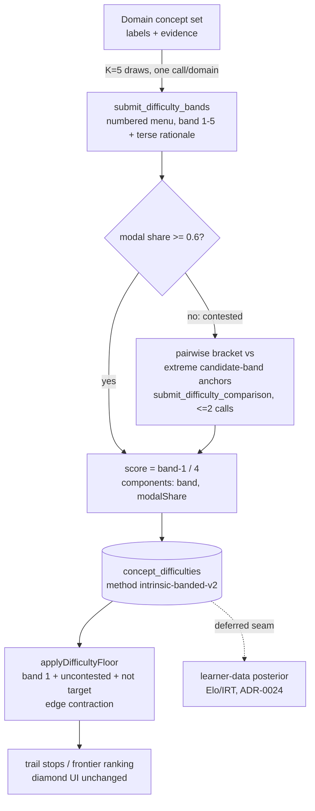

# fix: comparative banded intrinsic difficulty and a minimal trail-inclusion floor

## Summary

Fix the intrinsic-difficulty distortion named in `TODO.md` item 1: broad or relation-like labels
with sparse evidence (e.g. "Compositional relationship") get over-weighted scores, so difficulty
cannot yet gate the trail. Root problem class: **pointwise absolute LLM-as-judge scoring** — with no
reference frame, scale-use bias lets an abstract-*sounding* label score high. The recognized fix is
**comparative (listwise) judging over the set**, the same pointwise→listwise pivot this project
already made for prerequisites. Replace the per-node absolute judge with one K-sampled
whole-domain-set **banding** call (bands 1–5, relative to the Declared Domain's concept set), route
contested bands through bounded **pairwise calibration**, delete the unmeasured structural fusion,
and land the deferred **trail-inclusion difficulty floor** as the fix's first behavioral consumer.
Learner-data posterior calibration (Elo/IRT) stays deferred under
[ADR-0024](../adr/0024-learner-neutral-intrinsic-difficulty.md); this plan only preserves its seam.

---

## Problem Frame and Requirements

Decided in conversation (2026-07-05); this section owns them until completion.

- **R1 — Comparative banded neural prior replaces pointwise scoring.** One forced-tool call per
  Declared Domain bands every concept **1–5 relative to that domain's set** (numbered menu-pick,
  same evidence as today's judge). The call is K-sampled per
  [ADR-0028](../adr/0028-measure-non-deterministic-quality-with-non-deterministic-methods.md);
  consensus is the modal band; the persisted 0–1 score is `(band − 1) / 4` — the exact inverse of
  the existing diamond mapping `round(score × 4) + 1`, so the UI is untouched.
- **R2 — Dispersion is signal; contested bands get bounded pairwise calibration.** A concept whose
  modal band holds fewer than 60% of the K draws is **contested**. Contested concepts are resolved
  by at most two "which is harder" pairwise comparisons against uncontested anchor concepts of the
  extreme candidate bands (bracketing rule in Key Technical Decisions). Unresolvable concepts keep
  the modal band and record `calibrationUnresolved` in components.
- **R3 — Neural-primary: the structural fusion is deleted.** The `0.55/0.45` fusion, the four
  normalized structural terms (topo depth, transitive ancestors, fan-in, evidence density), and
  `dagDepthDifficulty` are removed in the same change (rule 18). Rationale: depth/ancestors/fan-in
  re-encode the prerequisite structure that already gates the path (double counting), evidence
  density confounds source salience with difficulty, and hand-weighted linear fusion of an
  unvalidated feature vector with a judged score is exactly the deterministic-proxy pattern
  ADR-0028 rejects. Structural facts stay derivable from the persisted DAG; they become candidates
  for the future learner-data posterior, not parts of the prior.
- **R4 — Staged calibration seam, not implementation.** The signal's lifecycle is: banded LLM prior
  (this plan) → pairwise calibration for uncertain cases (this plan) → learner-data posterior via
  Elo/IRT once real graded responses exist (**deferred**, ADR-0024 unchanged on this point). The
  plan preserves the seam only: `method` versioning on `ConceptDifficulty` plus persisted
  band/dispersion components as the prior's interface.
- **R5 — Minimal trail-inclusion floor.** A node whose consensus band is 1 **and** uncontested is
  excluded as a trail stop: it contributes no steps or activity segments, and its prerequisite
  gating is preserved by contracting its edges (its prerequisites wire directly to its dependents).
  Exempt: the learner's chosen target node, contested nodes, and nodes without a difficulty row
  (fail-open — only a confident signal gates, per rule 16's spirit: this is a downstream
  projection policy under [ADR-0032](../adr/0032-keep-learner-app-in-flow-through-mastery-aligned-game-ux.md),
  never a veto on graph content). Floored node ids are inspectable on the projection.
- **R6 — Domain-neutral prompts (rule 17).** Banding and comparison prompts describe generic
  difficulty factors and the relative-to-set frame; never fixture concepts or expected outcomes.
- **R7 — ADR-0024 amended in the same change.** Its "combines neural + structural components"
  definition is superseded by the comparative banded prior; the staged-calibration lifecycle and
  the confident-floor consumer are recorded; the learner-data-posterior deferral stands.
- **R8 — Measure-first on two markdown fixtures only.** Baseline and rule-14 gate run on
  `rust-book-ch04-01` (software engineering) and `aira-dojo-2507-02554v1-md` (machine learning
  systems) — not the full manifest. There is no saved score/rationale dump, so U1 regenerates the
  baseline with the current judge before any behavior change.

Acceptance examples:

- **AE1:** The U1 baseline dump annotates each broad/relation-like/evidence-thin label with its
  current score and rationale; after the change, no such label sits in a top band unless its
  banding rationale is grounded in its evidence — verified by human inspection in the rule-14
  pass, never by a lexical gate (rule 16).
- **AE2:** A contested concept (modal share < 0.6) records its pairwise comparisons in
  `components`; an uncontested concept records zero comparisons.
- **AE3:** For every persisted difficulty row, `round(score × 4) + 1` equals `components.band`;
  the ConceptMarker diamond count equals the band with no UI change.
- **AE4:** A confident band-1 node between two stops disappears from the trail; its dependent stays
  locked until the contracted prerequisite chain is mastered; choosing that same node as the
  expedition target keeps it playable.
- **AE5:** A single-concept domain still enriches successfully — banding degenerates to an
  absolute judgment for that set and is accepted, not special-cased.

---

## Key Technical Decisions

- **The banded call mirrors the whole-set prerequisite-ordering idiom.** Numbered concept menu,
  position→`derivedNodeId` mapping fail-closed, and an exact-coverage validator (every concept
  banded exactly once — missing or duplicate numbers get one informed re-prompt, then the
  `intrinsic-difficulty` stage fails, failing the enrichment as it does today). Nodes are grouped
  by Declared Domain exactly as ordering groups them; each draw is one call per domain. Each
  banded entry carries a terse per-concept rationale; the persisted `neural_rationale` is taken
  from the first draw that voted the final band (the bracketing rule below only ever selects a
  voted band, so one always exists).
- **K = 5 draws, its own config knob.** Band consensus needs fewer draws than per-edge direction
  votes (ordering's K = 8): bands are 5 coarse buckets, not O(n²) directed decisions. New
  `difficultySampleCount: 5` beside `orderingSampleCount` in the enrichment config. Modal band
  wins; a modal tie takes the **lower** band (conservative: prefer under-claiming difficulty), and
  a tie is contested by construction. Contested iff modal share < 0.6.
- **Pairwise calibration is a two-comparison bracket.** Candidate bands = the distinct bands the
  draws voted, `L` lowest and `H` highest. Anchors = per candidate band, the uncontested same-domain
  concept with the highest modal share in that band (tie-break: label sort). Compare the contested
  concept against `H`'s anchor and `L`'s anchor ("which is harder", forced tool, same judge alias):
  harder than `H`'s anchor → band `H`; easier than `L`'s anchor → band `L`; otherwise the bracket
  confirms the middle → keep the modal band. If a needed anchor does not exist, keep the modal band
  and set `calibrationUnresolved: 1`. Bounded: ≤ 2 comparisons per contested concept, 0 per
  uncontested concept.
- **`components` carries the prior's full interface, numbers only.**
  `{ band, kDraws, modalShare, contested (0/1), pairwiseComparisons, calibrationUnresolved (0/1) }`.
  No schema change: `concept_difficulties.score/method/components/neural_rationale` already fit.
  `method` becomes `intrinsic-banded-v2`; `difficulty_method` on `graph_enrichments` rides through.
- **`DifficultyPort.score` drops `prerequisiteEdges`.** With the structural terms gone the edges
  input is dead weight (rule 18); `runGraphEnrichment` step 5 and `runSyntheticGeneration` stage 5
  stop passing it. `IntrinsicDifficultyJudgmentPort` is reshaped from single-node `judge` to
  `bandDomainSet` + `compareHarder`; the old pointwise prompt, `intrinsicDifficultySchema`, and
  validator are deleted with it. `dagDepthDifficulty` loses its last consumer and is deleted;
  `prerequisiteAncestors` stays (the adaptive projection uses it).
- **Both new call kinds keep the existing `STAGE_TAGS.intrinsicDifficulty` tag.** Banding draws and
  pairwise comparisons run inside the one existing enrichment stage bracket, so the spend⋈stage
  cost join and `OPERATION_TIMELINE_CATALOG` need no new entries and no cost silently vanishes.
  Same judge alias: `kg-independent-judge`.
- **`enrichmentConfigHash` bumps to `banded-difficulty`.** The hash names the enrichment config
  epoch (convention set by the `k-sample-ordering` bump); banding changes enrichment behavior, so
  layers regenerate. One constant, all callers (worker + learner charting) — verify no duplicate
  literal survives.
- **The floor lives in the Study Session projection as a pure helper.** New
  `applyDifficultyFloor({ nodes, edges, difficulties, targetId })` →
  `{ includedNodeIds, contractedEdges, flooredNodeIds }`, applied in `studySessionProjection.ts`
  before path/segment composition. Contraction wires every prerequisite of a floored node to every
  dependent (uncertain flag OR-ed), so gating transitivity survives; floored nodes never reach
  `statefulLearnerPath` or `trailView`, so no UI change. `flooredNodeIds` is exposed on the
  projection for inspection. Floor constant `TRAIL_DIFFICULTY_FLOOR_BAND = 1`.
- **Score quantization is a stated consequence, not a surprise.** Persisted scores collapse to
  `{0, 0.25, 0.5, 0.75, 1}`. Downstream this is benign and verified rather than changed: the
  `DerivedGraphExplorer` difficulty-as-size rendering becomes five discrete sizes; hardest-first
  sorts (`rankFrontier`, calibration list) see more ties, which their existing deterministic
  id/label tie-breaks already absorb. Persistence (`concept_difficulties`) and the Admin Lab
  rationale/score displays need no change. A 2026-07-05 sweep found no other consumer of the fused
  fields outside the files this plan already deletes or rewrites.
- **The enrichment detail read model exposes `band` and `contested`.** The projection reads node
  difficulty as a bare score today; the floor needs confidence, so
  `PostgresEnrichmentInspectionRead` surfaces the two component fields (nullable) on the detail
  node shape. Single source stays the `concept_difficulties` row (rule 18).

---

## High-Level Technical Design

---

## Implementation Units

U1 is the measure-first baseline and must land before any behavior change. U2→U3 build the judge;
U4 needs U3's components; U5 (docs) rides with U3; U6 is the whole-release gate.

### U1. Baseline capture with the current judge

- **Requirements:** R8; AE1 baseline half. **Dependencies:** none — no code change.
- **Approach:** Reset the DB (rule 9), register/extract/build/enrich **only** the two R8 markdown
  fixtures through the existing worker commands with the current fused judge (`.env` loaded per
  rule 14). Dump per-node `canonical_label`, `score`, `components`, `neural_rationale` ordered by
  descending score to `tmp/2026-07-05-difficulty-baseline/`, one file per domain, and annotate
  which labels are broad/relation-like/evidence-thin and whether their placement is distorted.
- **Verification:** Both dumps exist and are annotated; the distorted-label list is written down
  before U2 starts.

### U2. Judgment port reshape and LiteLLM adapter

- **Requirements:** R1, R2 (call shapes), R6. **Dependencies:** none (U3 consumes).
- **Files:** `packages/ports/src/index.ts`; `packages/domain-core/src/index.ts` (banded-entry
  type beside `WholeSetPrerequisiteEdge`);
  `packages/infrastructure-litellm/src/intrinsicDifficultyAdapters.ts` (+ test),
  `toolSchemas.ts`, `index.ts`.
- **Approach:** Replace `IntrinsicDifficultyJudgmentPort.judge(node)` with
  `bandDomainSet({ declaredDomain, nodes })` → per-number `{ conceptNumber, band, rationale }` and
  `compareHarder({ declaredDomain, first, second })` → `{ harder: "first" | "second" }`. New forced
  tool schemas `submit_difficulty_bands` (exact-coverage validator: every listed number exactly
  once, band ∈ 1..5) and `submit_difficulty_comparison`; delete `intrinsicDifficultySchema`, its
  validator, and the pointwise system prompt in the same change. Prompts state the relative-to-set
  frame and the generic factors (abstraction, technical density, background load, integration
  burden), and explicitly instruct that a label's abstract phrasing is not evidence of difficulty —
  band from the evidence shown.
- **Test scenarios:** coverage validator rejects missing/duplicate/out-of-range numbers; adapter
  maps numbers→ids by position fail-closed; prompts contain no fixture terms (existing
  fixture-leak test idiom).
- **Verification:** litellm package tests + typecheck.

### U3. Consensus, calibration, and fusion deletion

- **Requirements:** R1, R2, R3, R4; AE2, AE3, AE5. **Dependencies:** U2.
- **Files:** `packages/application/src/intrinsicDifficulty.ts` (+ test, rewrite),
  `prerequisiteDag.ts` (delete `dagDepthDifficulty`), `runGraphEnrichment.ts`,
  `runSyntheticGeneration.ts`, `index.ts`; `packages/ports/src/index.ts` (`DifficultyPort.score`
  signature); `apps/kg-worker/src/knowledgeGraphWorker.ts`,
  `apps/admin-lab/src/lib/learnerCharting.ts` (wiring + config-hash constant).
- **Approach:** `createIntrinsicDifficultyPort` groups nodes by Declared Domain, draws K = 5 bands
  per domain, computes modal band (tie → lower), marks contested at modal share < 0.6, runs the
  two-comparison bracket for contested concepts, and emits
  `score = (band − 1) / 4`, `method = "intrinsic-banded-v2"`, the R4 components, and the
  final-band rationale. Delete `structuralTerms`, `zeroTerms`, the fusion, and
  `dagDepthDifficulty`; drop `prerequisiteEdges` from `DifficultyPort.score` and both callers.
  Bump `enrichmentConfigHash` to `banded-difficulty` and add `difficultySampleCount: 5`.
- **Test scenarios:** modal/tie/contested arithmetic at K = 5; bracket placement (harder-than-H,
  easier-than-L, middle, missing anchor → unresolved); score↔band round-trip (AE3);
  single-concept domain passes through (AE5); a failed coverage re-prompt fails the stage.
- **Verification:** application tests + typecheck; worker + admin-lab typecheck.

### U4. Minimal trail-inclusion floor

- **Requirements:** R5; AE4. **Dependencies:** U3 (components).
- **Files:** `packages/infrastructure-postgres/src/PostgresEnrichmentInspectionRead.ts` (+ test:
  detail node difficulty gains nullable `band`/`contested`);
  `packages/application/src/applyDifficultyFloor.ts` (new, + test),
  `studySessionProjection.ts` (+ test).
- **Approach:** Pure helper computes floored ids (band = 1, uncontested, not target, difficulty
  present) and the contracted edge set; the projection composes path, frontier, and segments from
  the contracted view and exposes `flooredNodeIds`. No trail/UI component changes — floored nodes
  simply never reach the views.
- **Test scenarios:** contraction preserves gating through a floored middle node (AE4); target
  exemption; contested and missing-difficulty nodes untouched; empty floor set is a no-op
  identical to today's projection.
- **Verification:** application + infrastructure-postgres tests; admin-lab tests still green.

### U5. ADR-0024 amendment and doc links

- **Requirements:** R7. **Dependencies:** U3 decisions final.
- **Files:** `docs/adr/0024-learner-neutral-intrinsic-difficulty.md`; `docs/plans/README.md`,
  `docs/plans/TODO.md` (item 1 links this plan with a status note).
- **Approach:** Rewrite the ADR's decision in place: intrinsic difficulty is a K-sampled
  comparative in-set banded prior with pairwise calibration for contested bands; the structural
  fusion definition is deleted (rule 18); consumers may gate trail inclusion only on a confident
  floor band; population calibration (Elo/IRT posterior) remains deferred until real
  learner-response data exists — that paragraph stands unchanged.
- **Verification:** No other doc restates the superseded fusion definition (grep).

### U6. Hard reset and rule-14 real-use gate (two fixtures)

- **Requirements:** R8; AE1–AE5 end-to-end. **Dependencies:** U1–U5.
- **Approach:** Reset the DB, re-seed the same two markdown fixtures through real production LLM
  calls, and dump the new per-domain difficulty tables beside the U1 baseline in
  `tmp/2026-07-05-difficulty-baseline/`. Human-inspect: (a) each U1 distorted label's new band and
  rationale (AE1); (b) contested concepts and their recorded comparisons (AE2); (c) score↔band and
  diamond display (AE3, browser); (d) the floor on the seeded expedition — floored stops absent,
  gating intact, target exemption (AE4, browser + projection JSON). Run `pnpm run check`. Write
  the comparison report; a green suite is not quality evidence (rule 14).
- **Verification:** Rule-14 PASS recorded with the report path; on completion fold durables per
  `docs/plans/README.md` and delete this plan.
