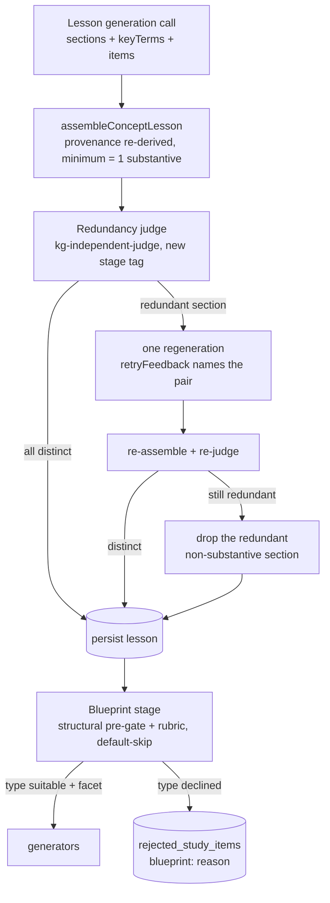
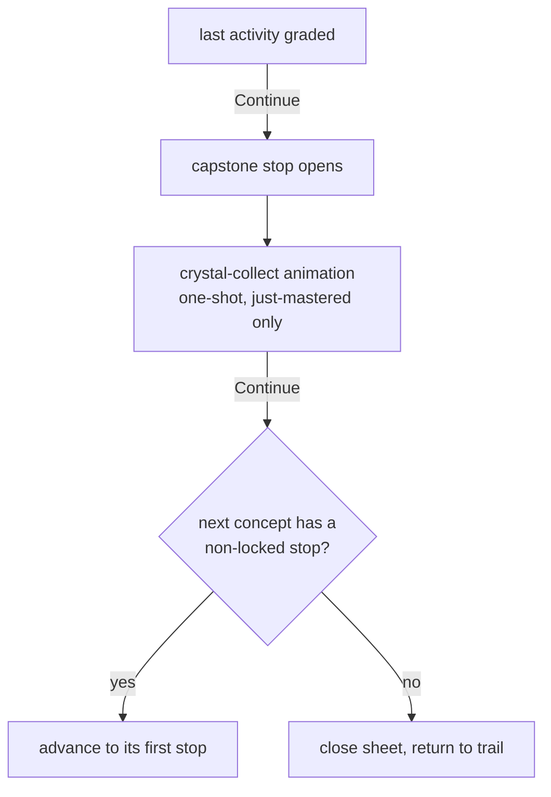

# feat: Learner theory quality, sparse item blueprint, and game-flow polish

## Summary

Make theory worth the learner's time and the game flow continuous: lesson sections gain generator-
emitted key terms and list-structured examples/applications, a fail-closed redundancy check kills
the "In a nutshell restates Definition" defect, the item blueprint becomes a real per-type
suitability decision that allows sparse item sets (with a mastery path for theory-only nodes), the
learner's name is remembered on-device, the matching board gets a mobile-first relayout, and
concept completion routes through an animated crystal-collect capstone whose Continue advances to
the next concept. Hard reset and full regeneration; the plan also absorbs the doc close-out debt of
the shipped game-UX plan `2026-07-05-001`.

---

## Problem Frame

Real play of the shipped expedition surface (2026-07-05) surfaced eight UX defects. Theory reads as
undifferentiated paragraph blobs (`LessonSections.tsx` renders every section as one `
`; nothing
in the pipeline emits emphasis or list structure). The gist duplicates the definition even though
the generation prompt already forbids it — prompt-tuning is empirically exhausted, so the fix needs
a fail-closed check at the assembly boundary. The blueprint stage ships but is permissive: its
prompt has no per-type suitability rubric and its failure fallback generates every type, which is
how a confusable concept (Self-Love / Self-Interest) got an uncompletable matching board. The
matching board's two-column grid squeezes long texts at 390px. The learner retypes their name every
visit. And finishing a concept's last activity closes the sheet (`ActivitySheet.tsx:94` skips any
`:capstone:` stop), so the crystal — the reward beat — is never seen and the learner is dumped back
on the map instead of flowing into the next concept.

---

## Requirements

**Theory content quality**

- R1. Lesson sections carry generator-emitted key terms (at most 3 per section); the renderer
  emphasizes their verbatim occurrences so the learner's eye lands on what matters.
- R2. `examples` and `applications` sections are list-structured at generation (2–4 items each);
  the renderer shows them as lists, not paragraphs.
- R3. A lesson whose gist (or intuition/applications) merely rephrases another section is caught by
  a fail-closed redundancy check: one regeneration with named feedback, then the redundant
  non-substantive section is dropped. A published lesson never shows two sections carrying the same
  information.

**Item blueprint**

- R4. The blueprint is a genuine per-type suitability decision: a deterministic structural pre-gate
  vetoes what is provably impossible, and a per-type neural rubric (depth, distinguishability,
  facet non-duplication, anti-cueing) decides the rest with a default-skip posture. A shallow or
  confusable concept ends up with a sparse item set, recorded as inspectable absences.
- R5. A node with zero current study items remains masterable: persisting its lesson read completes
  it, so sparse nodes never deadlock the trail.

**Game flow**

- R6. The learner's name is remembered on-device; a returning learner sees "Continue as X" and a
  switch affordance instead of retyping.
- R7. The matching board uses a mobile-first layout: compact prompt chips above a full-width
  stacked match list, replacing the two-column squeeze.
- R8. Completing a concept's final activity advances into the capstone stop, which plays a
  crystal-collect animation — the capstone is never silently skipped.
- R9. The capstone's Continue advances to the next concept's first available stop; at expedition
  end it returns to the trail.

**Close-out**

- R10. Hard reset onto the edited single migration, full lesson + bank regeneration, and the
  rule-14 real-use gate at 390px.
- R11. Doc debt cleared: plan `2026-07-05-001`'s durable decisions (matching, blueprint, facet,
  keyless views) fold into ADR-0026 and CONTEXT.md, this plan's lesson changes amend ADR-0031, and
  the stale plan file is deleted.

---

## Key Technical Decisions

- **Redundancy is judged, not thresholded (R3).** Problem class (rule 21): semantic near-duplicate
  detection in generated text. Conventional options are generation-time constraints (already in the
  prompt, empirically insufficient), an embedding-similarity threshold, and an LLM judge. A cosine
  threshold is a heuristic surface gate over neural output — rule 16 demands a measured module and
  removal on false negatives, and paraphrase distance does not map cleanly onto one cosine cut. A
  cross-family judge fits ADR-0028 and the existing judge idiom (`kg-independent-judge`, the cheap
  production judge alias). One call per lesson: sections in, per-non-substantive-section verdict
  out (`distinct` or `redundant with <kind>`). Embeddings-as-proposer adds nothing at
  one-lesson-per-call scale.
- **The judge extends the existing lesson retry seam; the terminal fallback drops the section.**
  `generateStudyItemBank.ts` already retries lesson generation once with `retryFeedback`
  (`shouldRetryLesson`/`lessonRetryFeedback`). Redundancy becomes a second retry trigger with the
  judge's verdict as feedback. If the retry is still redundant, the redundant non-substantive
  section (gist, intuition, or applications — never a cited substantive section) is dropped before
  persist. Losing a hook beats wasting learner time on a duplicate.
- **The lesson minimum relaxes to one substantive section (ADR-0031 amendment).** Today's R3
  minimum in `assembleConceptLesson.ts` requires gist + application + substantive. A
  redundancy-dropped gist or applications section must not turn a good lesson into a
  `LessonAbsentNode`. The generation prompt keeps asking for the compact gist-first shape; the
  assembler only *requires* ≥1 substantive section.
- **Section structure is generated, not parsed (R1, R2).** `ConceptLessonSection` gains optional
  `keyTerms: string[]` and, for `examples`/`applications`, `items: string[]` (the forced-tool wire
  shape stays flat-nullable per the existing schema idiom). The renderer emphasizes a key term only
  where it occurs verbatim in the section text — a provable substring match, no markdown parser, no
  heuristic. A term that does not occur is silently unhighlighted (fail-safe). Citation semantics
  are untouched: a section still cites one grounding passage; items are display structure inside
  the section's text budget.
- **Blueprint = deterministic floor + neural rubric, and the failure fallback shrinks (R4).** The
  pre-gate vetoes only provable impossibility (rule 16): matching needs at least 3 distinct
  grounded fragments (list items + cited passages) to build 3 pairs; impostor needs at least 2
  grounded truth statements. Everything semantic — concept depth, near-synonym distinguishability
  of match sides, facet duplication, label-cueing — lives in the strengthened prompt rubric with an
  explicit default-skip instruction ("a sparse item set is correct for a shallow concept").
  Blueprint call failure after retry now falls back to the pre-gate survivors, not all types — the
  old generate-everything fallback contradicts the sparse posture the redesign exists for.
- **Theory-only nodes master through the lesson read, computed in the projection (R5).** Node
  mastery today comes only from graded responses or calibration, so an item-less node would sit at
  mastery 0 forever and deadlock its dependents. The Study Session projection treats a node whose
  current bank has zero items as mastered once `lessonReadByNode` holds it. No Response Log write —
  the log stays graded-only (ADR-0026); a node with neither lesson nor items is treated as mastered
  (nothing exists to learn from it) so it can never block the trail.
- **The learner name lives in `localStorage` (R6).** The learner identity is deliberately a
  name-ref; there is no auth to integrate with (and none is planned — mock-don't-build applies).
  The landing page becomes a client surface: stored ref → "Continue as X" primary action plus a
  "use a different name" reveal; submit stores and navigates.
- **Capstone advance replaces capstone skip (R8, R9).** `ActivitySheet`'s `continueAfterRefresh`
  drops the `:capstone:` early-out and advances into the capstone stop like any other. The capstone
  body plays a one-shot collect animation (`motion/react`, already a dependency) when it opens in
  the just-mastered state; its footer becomes Continue → next concept's first non-locked stop,
  falling back to close at expedition end. Re-opening an already-collected capstone from the map
  renders the collected state without replaying the animation.
- **Matching relayout keeps the mechanic and the trace contract (R7).** Prompt tiles become
  compact selectable chips in a wrapping row; match tiles become full-width stacked rows beneath.
  Selection, trace accumulation, grading, and `submitLearnerMatching` are unchanged — this is a
  presentation change inside `MatchingBoard.tsx` only.
- **One config-hash bump.** Lesson shape, blueprint semantics, and generation prompts all change:
  `STUDY_ITEM_BANK_CONFIG_HASH` bumps to `study-item-bank-v3` in
  `packages/application/src/studyItemBankConfig.ts` (single constant, both callers already import
  it).

---

## High-Level Technical Design

Lesson generation with structure and the redundancy gate (per node, `study_items` operation):

Concept completion flow (client, replaces the capstone skip):

---

## Implementation Units

Three independent slices: **theory quality (U1–U3)** needs the reset before its content is
real; **blueprint + sparse mastery (U4–U5)** is the behavior-risk slice; **game flow (U6–U8)** is
browser-verifiable immediately with no schema change. U9 is the whole-release checkpoint.

### U1. Structured lesson sections end-to-end

- **Goal:** `keyTerms` and list `items` ride the lesson from generation to projection (R1, R2
  data half).
- **Requirements:** R1, R2. **Dependencies:** none.
- **Files:** `packages/domain-core/src/index.ts` (`ConceptLessonSection`/`...Draft` +
  `keyTerms`/`items`); `packages/infrastructure-litellm/src/toolSchemas.ts` (+ test) and
  `packages/infrastructure-litellm/src/conceptLessonGenerationAdapters.ts` (prompt: emit 2–4 list
  items for examples/applications, ≤3 key terms per section, terms must occur verbatim in the
  section text);
  `packages/application/src/assembleConceptLesson.ts` (+ test: carry the new fields; drop key
  terms that do not occur verbatim in their section text);
  `packages/infrastructure-postgres/src/migrations/0000_initial_lrnki_schema.sql`
  (`concept_lesson_sections` gains `key_terms` and `items`; `artifact_concept_lessons` view gains
  both — its column list is closed, so omitting them hides the rule-14 inspection surface);
  `packages/infrastructure-postgres/src/PostgresLearnerLoopStores.ts` (+ test: persist/hydrate);
  `packages/application/src/studySessionProjection.ts` (+ test: `ConceptLessonSectionView` gains
  the fields); `packages/application/src/studyItemBankConfig.ts` (bump to `study-item-bank-v3`).
- **Patterns to follow:** the flat-nullable wire→nested-optional translation already in
  `conceptLessonGenerationAdapters.ts:92-101`; the closed-view-column note from plan 001.
- **Test scenarios:** assembler keeps a verbatim key term and drops a non-occurring one; items
  survive persist→hydrate→projection round-trip; a section without items/terms round-trips absent
  (no empty arrays materialized); prompt/schema fixture-term leak scan (rule 17).
- **Verification:** domain/litellm/application/postgres tests; DB reset applies the edited
  migration; one real generation shows list items and key terms in the artifact view.

### U2. Lesson redundancy judge, retry, and terminal drop

- **Goal:** no published lesson carries a section that rephrases another (R3).
- **Requirements:** R3. **Dependencies:** none (composes with U1 in the same release).
- **Files:** `packages/ports/src/index.ts` (`ConceptLessonRedundancyJudgmentPort`);
  `packages/infrastructure-litellm/src/conceptLessonRedundancyAdapters.ts` (new, + test; alias
  `kg-independent-judge`); `packages/domain-core/src/index.ts`
  (`STAGE_TAGS.lessonRedundancyJudgment`); `packages/application/src/generateStudyItemBank.ts`
  (+ test: judge after assembly, redundancy as a second retry trigger, terminal drop of the
  redundant non-substantive section); `packages/application/src/assembleConceptLesson.ts` (+ test:
  minimum relaxes to ≥1 substantive section); `packages/application/src/operationTimelineCatalog.ts`
  (+ test) and `apps/admin-lab/src/components/learn/stageCopy.ts` (+ test) — the new stage
  registers in both or its spend silently vanishes from the `study_items` cost rollup;
  `apps/kg-worker/src/knowledgeGraphWorker.ts` and `apps/admin-lab/src/lib/learnerCharting.ts`
  (wire the new port in both production callers).
- **Patterns to follow:** `LiteLlmImpostorLieValidityJudgmentAdapter` (fail-closed judge with
  informed retry) in `packages/infrastructure-litellm/src/studyItemGenerationAdapters.ts`.
- **Test scenarios:** redundant gist → one regeneration with feedback naming the pair; still
  redundant → lesson persists without gist and is not recorded absent; judge failure → lesson
  persists unjudged (fail-open on infrastructure error — a flaky judge must not strip lessons);
  substantive sections are never dropped; a lesson missing gist but holding a definition passes
  the relaxed minimum; catalog/stageCopy carry the new stage; fixture-term leak scan.
- **Verification:** application + litellm tests; one real judged lesson inspected; the bottleneck
  page attributes judge spend to `study_items`.

### U3. Lesson renderer: lists and key-term emphasis

- **Goal:** theory reads scannable — emphasized terms, listed examples/applications (R1, R2
  display half).
- **Requirements:** R1, R2. **Dependencies:** U1.
- **Files:** `apps/admin-lab/src/components/learn/LessonSections.tsx` (+ test).
- **Approach:** sections with `items` render a `<ul>` (`applications` may use `<ol>` when order
  reads as progression — pick one and keep it); `text` stays the lead-in line. Key terms wrap
  matched substrings in a styled `<mark>`/`<strong>` using first-occurrence verbatim matching —
  no regex over user-visible text beyond literal matching, no markdown parsing.
- **Test scenarios:** section with items renders one list item per entry; key term occurring twice
  emphasizes at least the first occurrence; term absent from text renders untouched text; section
  without new fields renders exactly as today.
- **Verification:** admin-lab tests; browser screenshots desktop/390px of a real lesson.

### U4. Blueprint redesign: structural pre-gate, suitability rubric, sparse fallback

- **Goal:** the blueprint genuinely decides per-type generation; shallow/confusable concepts get
  sparse item sets (R4).
- **Requirements:** R4. **Dependencies:** U1 (pre-gate counts list items).
- **Files:** `packages/application/src/generateStudyItemBank.ts` (+ test: deterministic pre-gate
  before the blueprint call; fallback = pre-gate survivors);
  `packages/infrastructure-litellm/src/studyItemGenerationAdapters.ts`
  (`LiteLlmStudyItemBlueprintAdapter` prompt rubric: per-type suitability criteria — concept depth
  beyond its label, mutual distinguishability of matching sides against near-synonym
  siblings, facet distinctness across planned types, anti-cueing — plus default-skip posture)
  with schema untouched unless the rubric needs a per-type confidence field (default: no).
- **Patterns to follow:** rule 16's split as practiced in `matchingGuard.ts` — deterministic gates
  carry only provable structure; meaning stays neural.
- **Test scenarios:** node with 2 grounded fragments → matching pre-gated off with a
  `blueprint:`-prefixed rejection row and no generation call; blueprint call failure after retry →
  only pre-gate survivors generate; all-types-declined node produces zero items and one rejection
  row per type; facet still reaches surviving generators' prompts; fixture-term leak scan.
- **Verification:** application + litellm tests; a real blueprint run over a seeded confusable
  concept declines matching with a meaningful reason (inspected, not asserted lexically).

### U5. Theory-only nodes master through the lesson read

- **Goal:** sparse nodes complete and never deadlock the trail (R5).
- **Requirements:** R5. **Dependencies:** none (U4 makes it common; correct today regardless).
- **Files:** `packages/application/src/studySessionProjection.ts` (+ test);
  `apps/admin-lab/src/components/learn/trailView.ts` and
  `apps/admin-lab/src/components/learn/activityProgress.ts` (+ tests) only if the stop/progress
  display needs an item-less arm.
- **Approach:** in the projection's mastery composition, a node whose current bank holds zero
  items is mastered when `lessonReadByNode` holds it; a node with neither lesson nor items is
  mastered unconditionally. Calibration and graded mastery for item-bearing nodes are untouched.
- **Test scenarios:** item-less node with lesson read → mastered, its dependents unlock; same node
  unread → frontier with theory as the only segment; node with neither lesson nor items never
  blocks its dependents; item-bearing node's mastery unchanged by lesson reads.
- **Verification:** application tests; browser: reading a theory-only stop collects its concept.

### U6. Remember the learner name on-device

- **Goal:** no retyping; returning learners flow straight in (R6).
- **Requirements:** R6. **Dependencies:** none.
- **Files:** `apps/admin-lab/src/app/learn/page.tsx`;
  `apps/admin-lab/src/components/learn/LearnerNameGate.tsx` (new client component, + test).
- **Approach:** client component reads `localStorage`; stored ref renders "Continue as X" primary
  plus a "use a different name" reveal of the existing input; submit stores the raw ref and
  navigates to `/learn/<encodeLearnerStateRef(ref)>`. The server action form remains the no-store
  fallback path.
- **Test scenarios:** stored ref → continue button with the name visible; no stored ref → form
  only; switching stores the new ref; an empty/whitespace ref never navigates (mirrors
  `encodeLearnerStateRef` emptiness rule).
- **Verification:** admin-lab tests; browser: revisit lands on "Continue as X" at 390px.

### U7. Matching board relayout

- **Goal:** the board reads and plays comfortably on mobile (R7).
- **Requirements:** R7. **Dependencies:** none.
- **Files:** `apps/admin-lab/src/components/learn/MatchingBoard.tsx` (+ test).
- **Approach:** prompt tiles → compact selectable chips in a wrapping row (locked chips check +
  dim); match tiles → full-width stacked rows beneath; keep shake/deselect on mispair, lock pulse,
  the instruction line, trace accumulation, and one-shot submit exactly as shipped. Progress line
  ("2 of 4 matched") replaces nothing — it is additive.
- **Test scenarios:** chip select → row tap attempts the pair; locked chip untappable; board with
  3 and with 4 pairs renders all tiles; completion still fires the grading callback once.
- **Verification:** admin-lab tests; full board play in browser at 390px with long match texts.

### U8. Crystal capstone: collect animation and next-concept advance

- **Goal:** the reward beat is seen, and the flow continues into the next concept (R8, R9).
- **Requirements:** R8, R9. **Dependencies:** none.
- **Files:** `apps/admin-lab/src/components/learn/ActivitySheet.tsx` (+ test),
  `apps/admin-lab/src/components/learn/GemCapstone.tsx` or a capstone body component,
  `apps/admin-lab/src/components/learn/vocabulary.ts` (Continue/collect copy).
- **Approach:** remove the `:capstone:` early-out in `continueAfterRefresh` so the sheet advances
  into the capstone; the capstone body plays a one-shot `motion/react` collect animation (scale +
  gem fill) when opened just-mastered, static collected state otherwise; capstone footer becomes
  Continue → next concept's first non-locked stop via the existing `nextStopId()` walk, closing
  only when none exists. Map-side `GemCapstone` stays the static collected marker.
- **Test scenarios:** finishing a concept's last activity advances to its capstone (not close);
  capstone Continue advances to the next concept's first non-locked stop; last concept's capstone
  Continue closes the sheet; re-opening a collected capstone from the map shows the collected
  state without the animation gate blocking interaction.
- **Verification:** admin-lab tests; browser run through two consecutive concepts at 390px.

### U9. Hard reset, regeneration, docs close-out, and real-use gate

- **Goal:** the release ships regenerated content, honest docs, and rule-14 evidence (R10, R11).
- **Requirements:** R10, R11. **Dependencies:** U1–U8.
- **Files:** `docs/adr/0026-typed-study-item-bank.md` (fold plan-001 debt: matching type,
  blueprint policy + this redesign's suitability posture, facet, partial-credit identity, keyless
  study views); `docs/adr/0031-concept-lesson-teaching-substrate.md` (list items, key terms,
  relaxed minimum, redundancy policy); `CONTEXT.md` (Study Session segment order gains matching;
  Concept Lesson wording); `docs/plans/README.md`, `docs/plans/TODO.md`; delete
  `docs/plans/2026-07-05-001-feat-learner-game-ux-matching-and-mobile-polish-plan.md` and this
  plan on completion.
- **Approach:** reset the DB onto the edited migration (rules 8–9), run the full seed with
  production aliases, then apply `.agents/skills/real-use-quality-evaluation/SKILL.md`: inspect
  real lessons for list structure, key-term quality, and gist-definition distinctness; inspect
  blueprint skip rates and reasons by SQL over `rejected_study_items` (`blueprint:` prefix) —
  both extremes are failures (near-zero skips = rubric inert; majority skips = over-pruning);
  play a seeded expedition at 390px through name-remember → theory → matching (new layout) →
  capstone animation → next-concept advance, including a theory-only node collecting via lesson
  read; record the trail under `tmp/`.
- **Test scenarios:** none — this unit is the evaluation and documentation gate; evidence comes
  from inspected real output, not new tests (ADR-0013).
- **Verification:** `pnpm run check` exit 0; rule-14 PASS recorded in `TODO.md` VALIDATION; no
  document restates another's content (AGENTS documentation authority).

---

## System-Wide Impact

- **`study_items` operation cost.** The redundancy judge adds one cheap cross-family call per
  node to the pipeline's known cost bottleneck (repo TODO item 3). The new stage tag +
  `OPERATION_TIMELINE_CATALOG` entry make the added cost first-class measurable in the same
  reports that would indict it; redundancy-triggered retries add a second generation call only on
  defective lessons.
- **Lesson consumers.** `studyItemGroundingFromLesson` reads section citations and text — list
  items live inside the section and do not alter citation verification. The blueprint prompt reads
  section texts; U4 threads items into its rendered lesson context so the pre-gate and rubric see
  the same structure the learner does.
- **Closed vocabularies.** `STAGE_TAGS`, `OPERATION_TIMELINE_CATALOG.study_items`, learner
  `stageCopy`, and the `artifact_concept_lessons` view column list all gain the new members (U1,
  U2) or their facts silently vanish from cost rollups and inspection surfaces.
- **Mastery semantics.** U5 widens "mastered" to include read-only completion for item-less nodes.
  Readers: `classifyAdaptedNodes` gating, `struggledNodes`/restoration (unaffected — no graded
  outcome exists for item-less nodes), expedition progress rows (item counts already come from the
  bank, so sparse nodes report fewer activities, which is correct).
- **Untouched:** grading actions and server-authoritative key resolution, Response Log schema,
  `matching_pairs` schema and guard, difficulty banding and trail floor (plan 002, in progress on
  this branch), seed scripts.

---

## Risks & Dependencies

- **Blueprint sparseness could over-prune.** The default-skip rubric might strip item coverage
  broadly, thinning the game. Contained by: the deterministic pre-gate never vetoes on meaning,
  the rule-14 gate inspects skip rates and reasons across two real domains before ship, and
  absences are first-class rows an operator can audit.
- **Redundancy judge false positives.** A distinct-but-adjacent gist may be dropped; the failure
  direction (lose a hook) is accepted over the shipped failure (duplicate sections). Inspected in
  the gate; if real lessons lose good gists, the revisit is judge-prompt calibration, not a
  threshold.
- **Plan 002 shares this repo's difficulty surfaces.** Its U6 gate is pending on this branch; this
  plan touches none of the difficulty stack, but U9's reseed should land after or with plan 002's
  gate to avoid attributing one plan's regenerated content to the other's evaluation.
- **Hard reset needs production LLM balance** and the known LiteLLM container-restart-after-alias-
  edit gotcha (`kg-independent-judge` already exists; no alias edit is expected).

---

## Scope Boundaries

- Intrinsic-difficulty trust and the trail floor — shipped 2026-07-05 (comparative banded prior,
  [ADR-0024](../adr/0024-learner-neutral-intrinsic-difficulty.md)); not re-opened here.
- Auth or server-side learner identity; PWA/native packaging.
- New study mechanics; whole-bank leakage judging (still gated on rule-14 evidence per plan 001's
  deferred contingency).
- Cross-lesson deduplication (the same fact taught under two sibling concepts) — a different
  problem class (inter-document redundancy); revisit only if the gate shows it wasting real time.

---

## Acceptance Examples

- AE1. A generated lesson whose gist paraphrases its definition is regenerated once with feedback
  naming both sections; if still redundant it publishes without the gist, and the learner never
  sees "In a nutshell" repeating "Definition".
- AE2. An `examples` section renders as a list of 2–4 items at 390px; a lesson generated without
  list items renders exactly as today.
- AE3. A key term is visibly emphasized where it occurs verbatim; a term the generator emitted but
  that does not occur in the section text produces no highlight and no error.
- AE4. A concept whose matching sides would be near-synonym rephrasings gets no matching item; its
  `rejected_study_items` row carries a `blueprint:` reason naming the suitability failure; the
  concept remains completable.
- AE5. A theory-only node's concept is collected by reading its lesson; its dependent concepts
  unlock without any graded response existing for it.
- AE6. Completing a concept's final activity opens the capstone with the collect animation;
  Continue lands on the next concept's first available stop; on the expedition's last concept it
  returns to the trail.
- AE7. A returning learner on the same device sees "Continue as X" and enters with one tap; "use a
  different name" returns to the input.
