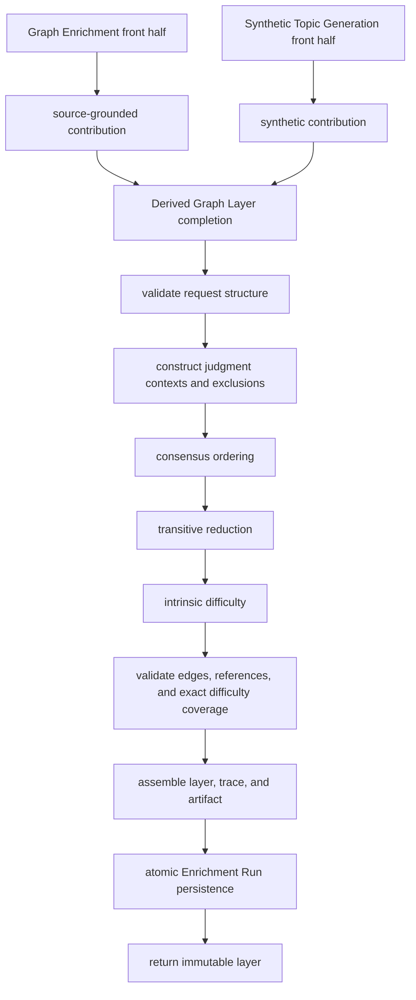

# Derived Graph Layer Completion - Plan

## Goal Capsule

- **Objective:** Replace the duplicated Derived Graph Layer completion back halves in Graph Enrichment and Synthetic Topic Generation with one deep application module that owns judgment preparation through atomic persistence.
- **Authority:** Follow `AGENTS.md`, the language in `CONTEXT.md`, the accepted Candidate 1 framing in `docs/brainstorms/2026-07-11-architecture-deepening-review.md`, and the durable decisions in `docs/adr/0001-adopt-greenfield-deep-module-architecture.md`, `docs/adr/0019-graph-enrichment-derived-layer.md`, `docs/adr/0024-learner-neutral-intrinsic-difficulty.md`, and `docs/adr/0028-measure-non-deterministic-quality-with-non-deterministic-methods.md`.
- **Execution profile:** Internal application-layer refactor with one intentional behavior tightening: provable structural violations fail before persistence. No compatibility path or migration is required.
- **Stop conditions:** Stop and revisit the plan if the shared seam requires producers to expose completed judgment contexts, changes either producer's operation lifecycle or public result, alters a neural prompt/model/stage descriptor, changes a persistence shape, or changes either current configuration hash for unchanged inputs.
- **Tail ownership:** The executor owns the shared module, both producer migrations, deletion of duplicated policy and redundant tests, deterministic verification, production-LLM real-use inspection of both producer variants, and final plan/TODO consolidation. The executor does not own Candidates 2-4 from the origin review.

---

## Product Contract

### Summary

Graph Enrichment and Synthetic Topic Generation will retain their distinct inputs and front-half behavior while handing prepared nodes and producer-specific evidence facts to one Derived Graph Layer completion module. That module will construct judgment contexts, derive and reduce prerequisite ordering, score intrinsic difficulty, assemble the complete trace and artifact, enforce structural guarantees, persist atomically, and return the immutable layer.

### Problem Frame

The two producers already reuse the low-level consensus-ordering and symbolic-reduction algorithms, but each still owns the same higher-level completion policy. Configuration fields, evidence preparation, ordering orchestration, difficulty coverage, common edge dispositions, artifact metadata, and terminal persistence therefore have two homes and can drift independently. The current producer tests repeat those shared assertions instead of testing one completion seam.

### Requirements

**Module boundary and ownership**

- R1. Introduce one constructed application module with one `complete` operation for both source-grounded and synthetic Derived Graph Layer completion.
- R2. Keep Graph Enrichment and Synthetic Topic Generation as distinct producers with their current front halves, operation-timeline shells, public return types, and summary hooks.
- R3. Make the completion module own prerequisite and difficulty context construction, evidence-free ordering exclusions, consensus ordering, symbolic transitive reduction, intrinsic difficulty, common trace dispositions, layer/artifact assembly, atomic persistence, and the returned layer.

**Inputs, configuration, and provenance**

- R4. Give the shared completion configuration one type and one default authority while preserving the existing flat fields in both producer configuration objects.
- R5. Preserve each producer's distinct full configuration type, Neural Stage Descriptor set, config-hash seed, and unchanged-input hash value.
- R6. Cross the completion seam with a discriminated source-grounded or synthetic contribution that makes invalid producer-specific trace-field combinations unrepresentable and gives the module enough facts to construct provenance-appropriate contexts.
- R7. Keep the completion module internal to `@lrnki/application`; do not add a public completion port or a second production adapter for an in-process seam with one implementation.

**Guarantees and compatibility**

- R8. Before persistence, reject duplicate derived-node IDs, contribution/`graphVersionId` mismatches, references that violate their trace field's lifecycle contract, prerequisite edges with unknown surviving endpoints, and difficulty output that does not cover every surviving derived node exactly once. Surviving-node fields must name surviving nodes; historical dispositions may name dropped or absorbed IDs only when their recorded outcome or merge proves that lifecycle.
- R9. A structural failure must reject the operation and call persistence zero times; the module must not normalize, drop, or semantically reinterpret well-formed neural output.
- R10. Preserve prompts, model aliases, sampling behavior, stage names and brackets, persistence schemas, artifact shape, producer version, operation summaries, and current successful outputs except for R8-R9.

**Test and quality evidence**

- R11. Make the completion interface the focused test surface for shared policy and structural failures; retain producer tests for distinct front-half behavior and one handoff contract per producer, and delete redundant shared-policy assertions from producer suites.
- R12. Preserve the existing Postgres source-grounded and synthetic persistence integration tests; no migration or adapter behavior change is part of this refactor.
- R13. After deterministic verification, run one curated-source Graph Enrichment and one Synthetic Topic Generation through production LiteLLM, inspect their stored layers and traces, and record concrete `PASS` or `FIX_FIRST` evidence under `tmp/`.

### Key Flows

- F1. Source-grounded completion
  - **Trigger:** Graph Enrichment finishes rescue, minting, grounding, and optional deduplication.
  - **Input:** Derived nodes, published concept evidence profiles, absorbed grounding, source-grounded dispositions, `graphVersionId`, shared completion config, and the current stage bracket.
  - **Outcome:** One structurally valid persisted Derived Graph Layer and complete source-grounded Enrichment Run trace are returned, or the operation fails with no persistence.
  - **Covers:** R1-R10.
- F2. Synthetic completion
  - **Trigger:** Synthetic Topic Generation finishes concept synthesis, Knowledge-Boundary Probe judgment, grounding, and verbatim-floor recording.
  - **Input:** Derived nodes, synthetic grounding facts, Knowledge-Boundary Probe dispositions, null `graphVersionId`, shared completion config, and the current stage bracket.
  - **Outcome:** One structurally valid persisted source-less Derived Graph Layer and complete synthetic Enrichment Run trace are returned, or the operation fails with no persistence.
  - **Covers:** R1-R10.
- F3. Structural rejection
  - **Trigger:** Either producer or a bound port supplies a shape that violates a provable completion invariant.
  - **Input:** A malformed request, prerequisite result, or difficulty result.
  - **Outcome:** The completion call throws before the persist stage and the Enrichment Run store observes no write.
  - **Covers:** R8-R9.

### Acceptance Examples

- AE1. Given two source-grounded nodes and published evidence for only one, when completion runs, then both nodes are sent to intrinsic difficulty, only the evidenced node participates in ordering, the other appears once in `nodeExclusions`, and one source-grounded layer/trace pair is persisted.
- AE2. Given a synthetic contribution with grounded nodes and Knowledge-Boundary Probe dispositions, when completion runs, then `graphVersionId` remains null, source-only trace arrays are empty, `syntheticProbeDispositions` is present, and one synthetic layer/trace pair is persisted.
- AE3. Given consensus certain, uncertain, weak-cut, cycle-routed, and transitively redundant edges, when completion runs, then the returned layer contains reduced certain edges plus uncertain edges and the trace records each common disposition exactly once with unchanged ordering-summary counts.
- AE4. Given difficulty output that omits a node, duplicates a node ID, or introduces an unknown node ID, when completion validates the result, then it throws and the store's persist call count remains zero.
- AE5. Given a source-grounded contribution with null `graphVersionId`, a synthetic contribution with non-null `graphVersionId`, a surviving-node field naming neither a final nor validly absorbed node, a historical field whose disposition does not justify an absent node, or an edge with an unknown surviving endpoint, when completion validates the request/result, then it throws before persistence without repairing the input. A dropped rescue/minting disposition, a boundary probe's null node, and an absorbed merge snapshot remain valid historical trace facts.
- AE6. Given the unchanged default Graph Enrichment and Synthetic Topic Generation configurations, when infrastructure computes their identities after the refactor, then the hashes remain `graph-enrichment-1886ba82e2e5` and `synthetic-topic-generation-978cefbca6ed` respectively.

### Success Criteria

- The ordering-to-persistence orchestration and common trace assembly exist in one application module and no equivalent producer-local copy remains.
- Both producers retain their current public exports and lifecycle behavior while delegating through the same completion interface.
- Shared configuration fields and defaults have one authority, and the two existing operation config hashes remain stable.
- Focused tests cover every structural guarantee and prove zero persistence on rejection.
- The two production-LLM real-use runs are independently judged useful, traceable, and structurally complete; any foundational `FIX_FIRST` defect blocks completion.

### Scope Boundaries

**Included**

- Candidate 1 from `docs/brainstorms/2026-07-11-architecture-deepening-review.md`, including its nine accepted grilling decisions.
- Internal application types and factory design needed to create one deep completion seam.
- Test relocation and deletion necessary to make that seam the shared policy authority.
- Real-use validation of both source-grounded and synthetic variants.

**Outside This Work**

- Candidates 2-4 from the origin review, including Learner Journal, Topic Expedition lifecycle, and Postgres inspection decomposition.
- Prompt, forced-tool schema, model alias, sampling, stage-vocabulary, or quality-policy changes.
- Changes to `EnrichmentRunTrace`, `DerivedGraphLayer`, ports, database schema, initial migration, Postgres store behavior, producer public return types, or worker summary hooks.
- General cleanup of either producer's distinct front half, splitting domain/ports files, or introducing a hypothetical completion adapter.

### Dependencies

- Existing application helpers: `packages/application/src/deriveConsensusOrdering.ts`, `packages/application/src/prerequisiteDag.ts`, and `packages/application/src/runProgressReporter.ts`.
- Existing ports: `PrerequisiteOrderingPort`, `DifficultyPort`, and `EnrichmentRunStorePort` in `packages/ports/src/index.ts`.
- Existing data contracts: `DerivedGraphLayer`, `EnrichmentRunTrace`, evidence profiles, node contexts, and producer-specific dispositions in `packages/domain-core/src/index.ts`.
- Production LiteLLM alias mapping in `litellm/config.yaml`, the curated Rust ownership source in `fixtures/manifest.json`, the repo-root `.env`, Postgres, and LiteLLM availability for R13.

---

## Planning Contract

### Key Technical Decisions

| ID | Decision | Consequence |
|---|---|---|
| KTD1 | Completion owns the back half through persistence. | Producers stop after preparing nodes and provenance facts; no compute-only result is exposed for callers to finish differently. |
| KTD2 | Completion constructs both prerequisite and difficulty contexts. | Evidence alignment, mention caps, exclusions, and full difficulty coverage stay behind the seam instead of becoming caller obligations. |
| KTD3 | Shared completion fields use one flat config type and one default constant. | Producer configs compose that type and spread the defaults without changing their runtime serialization or separate identity hashes. |
| KTD4 | One discriminated contribution carries producer-specific evidence and trace facts. | Source-only and synthetic-only fields cannot be mixed, while `EnrichmentRunTrace` remains the persisted canonical shape. |
| KTD5 | A factory binds the three existing ports and exposes one async `complete` operation. | The seam is easy to construct and test without inventing an application port or producer-specific methods. |
| KTD6 | The producer-owned `StageBracket` crosses the seam. | Existing operation and stage timelines remain unchanged even though the completion implementation moves. |
| KTD7 | Structural validation is fail-closed and side-effect ordered. | Request invariants are checked before neural work where possible; ordering output and difficulty coverage are checked before the single persistence call. |
| KTD8 | Tests move with policy ownership. | Completion tests prove shared behavior once; producer tests prove distinct front halves and the typed handoff only. |
| KTD9 | Real-use evidence covers both variants. | The non-null published-version path and null synthetic path both receive production-LLM and persisted-artifact inspection. |

### High-Level Technical Design

Create `packages/application/src/completeDerivedGraphLayer.ts` as the internal deep module. It defines `DerivedGraphCompletionConfig`, `DEFAULT_DERIVED_GRAPH_COMPLETION_CONFIG`, the discriminated contribution/request types, and `createDerivedGraphLayerCompletion({ prerequisiteOrdering, difficulty, enrichmentStore })`. The returned object exposes only `complete(request): Promise<DerivedGraphLayer>`.

The request carries common identity fields, completed nodes, the flat shared configuration, the caller's `StageBracket`, and one contribution variant. The source-grounded variant carries the published evidence profiles, absorbed grounding keyed by canonical node, grounding/rescue/rescued-definition/minting/merge dispositions, and non-null `graphVersionId`. The synthetic variant carries grounding and Knowledge-Boundary Probe dispositions with null `graphVersionId`. Prefer facts already produced by each front half over callbacks or partially assembled contexts/traces.

The completion module keeps the existing stage order: prerequisite ordering, symbolic disposal, intrinsic difficulty, then persistence. The discriminated contribution carries the producer-supplied summary hook and any front-half counts it needs. Completion invokes Graph Enrichment's ordering hook after consensus/reduction and before difficulty, and Synthetic Topic Generation's combined hook after difficulty and before persistence, preserving current callback timing and failure semantics while keeping console formatting in the worker. The public result remains only `DerivedGraphLayer`.

Validation must be explicit and deterministic. Use sets/maps to prove node identity and reference coverage according to the persisted types' lifecycle semantics: node exclusions, ordering traces, inferred edges, difficulties, and merge canonical IDs refer to surviving nodes; absorbed merge IDs refer to the captured non-surviving node; grounding, rescue, definition, and minting histories may refer to a surviving or validly absorbed node, while a dropped rescue/minting outcome may refer to a deliberately absent node; a boundary probe carries null and a core probe carries a surviving node. Validate contribution identity and request references before ordering where possible; validate inferred edge endpoints after ordering/reduction; validate exact difficulty coverage before artifact assembly. Throw descriptive application errors and never repair output. The existing callbacks retain their current pre-persistence positions, and the sole persistence side effect is the atomic `enrichmentStore.persist({ layer, artifact })` call inside `NON_LLM_STAGES.persist`.

### Sequencing and Deletion Strategy

1. Establish the shared config/interface and lock unchanged hashes before moving behavior.
2. Implement the full completion behavior and structural contract behind focused tests while producers still compile against their current paths.
3. Migrate Graph Enrichment, then delete its copied completion helpers/assertions.
4. Migrate Synthetic Topic Generation, then delete its copied completion helpers/assertions; at this point the new module becomes the single authority.
5. Run workspace verification and both real-use gates, record evidence, and consolidate active documentation.

Do not leave compatibility wrappers, old context builders, duplicated disposition assemblers, or producer-local copies after both callers migrate. Preserve the existing exports from `packages/application/src/index.ts`; the new completion module itself remains unexported from the package boundary.

### Risks and Mitigations

| Risk | Mitigation |
|---|---|
| A move subtly changes evidence construction or exclusion behavior. | Characterize source-grounded anchor, source-mentioned, generated, absorbed, capped, and evidence-free cases in completion tests before deleting producer assertions. |
| Shared defaults alter config serialization and cause false identity churn. | Compose producer types from the shared flat type, spread the shared defaults, and add exact hash regression assertions before migration. |
| The new seam changes stage timing or summary callback behavior. | Pass the existing producer-owned bracket, hooks, and required front-half counts explicitly; assert Graph's hook remains before difficulty and Synthetic's remains after difficulty but before persistence. |
| Structural validation accidentally becomes a heuristic semantic gate. | Limit checks to identity, variant, endpoint, reference, and exact-coverage proofs; do not inspect labels, rationales, confidence meaning, or evidence prose quality. |
| Source-grounded success hides a broken synthetic null-version path. | Keep deterministic variant tests and require separate production-LLM inspection for both producers. |
| Real-use calls are non-deterministic or expose a pre-existing quality defect. | Record concrete artifacts and classify each run independently; `FIX_FIRST` blocks completion rather than being explained away by green tests. |

---

## Implementation Units

### U1. Establish the shared completion configuration and interface

- **Goal:** Add the internal module contract and one authority for common configuration without changing either producer's runtime shape or identity.
- **Requirements:** R1, R4-R7, R10.
- **Files:** Create `packages/application/src/completeDerivedGraphLayer.ts`; modify `packages/application/src/runGraphEnrichment.ts`, `packages/application/src/runSyntheticGeneration.ts`, `packages/application/src/deriveConsensusOrdering.test.ts`, and `packages/infrastructure-litellm/src/configHashes.test.ts`.
- **Approach:** Define the shared config fields and defaults in the completion module. Express `GraphEnrichmentConfig` and `SyntheticGenerationConfig` as their producer-specific fields intersected with or extending the shared flat shape, and build both existing default objects by spreading the shared default. Define the factory, one-operation interface, common request fields, and discriminated contribution types, but do not export the module through `packages/application/src/index.ts`. Keep the existing public config/type export names unchanged.
- **Test scenarios:** Shared defaults equal the previous values; Graph Enrichment still owns its difficulty/minting/dedup fields; Synthetic Topic Generation still owns its probe/concurrency fields; the low-level consensus test reads the shared ordering defaults without depending on Graph Enrichment; exact graph and synthetic default hashes match AE6.
- **Verification:** `pnpm --filter @lrnki/application typecheck`; `pnpm --filter @lrnki/infrastructure-litellm test`; `pnpm --filter @lrnki/infrastructure-litellm typecheck`.
- **Dependencies:** None.

### U2. Implement completion policy and structural guarantees

- **Goal:** Make the new module the independently testable implementation of context construction, ordering, reduction, difficulty, trace/artifact assembly, validation, and persistence.
- **Requirements:** R1, R3, R6-R10, R11.
- **Files:** Modify `packages/application/src/completeDerivedGraphLayer.ts`; create `packages/application/src/completeDerivedGraphLayer.test.ts`.
- **Approach:** Move or generalize the existing context logic for anchors, source-mentioned nodes, LLM-grounded nodes, absorbed grounding, mention caps, and evidence-free exclusions. Bind the three existing ports in the factory. Preserve the current stage order and consensus/reduction behavior. Assemble common dispositions and the complete trace from the contribution variant. Add pre-persistence validation in the side-effect order defined by KTD7. Use a recording fake store and deterministic ordering/difficulty ports so the test suite observes complete requests, stage order, output, trace, artifact, and zero-write failures.
- **Test scenarios:** Source-grounded contexts preserve published definitions/assertions, cap mentions, append absorbed grounding, and exclude evidence-free nodes once; synthetic contexts use generated grounding and retain probe dispositions; same-domain grouping, zero-node input, and omitted optional hooks match current producers; certain edges are transitively reduced while uncertain edges remain; weak, uncertain, reduced, and kept dispositions are assembled once; artifacts keep producer metadata and version/null-version behavior; Graph and Synthetic summary hooks retain their exact stage-relative and pre-persistence timing, and a hook error propagates before persistence; duplicate node IDs fail; contribution/version mismatches fail; invalid surviving or historical trace references fail while dropped/absorbed histories remain valid; invalid prerequisite endpoints fail; missing, duplicate, and unknown difficulty IDs fail; ordering or difficulty port errors propagate and persist zero times; every validation failure persists zero times; a valid request persists exactly once and returns the same layer object shape.
- **Verification:** `pnpm --filter @lrnki/application test`; `pnpm --filter @lrnki/application typecheck`.
- **Dependencies:** U1.

### U3. Migrate Graph Enrichment to the completion seam

- **Goal:** Retain Graph Enrichment's source-grounded front half and lifecycle while deleting its local completion copy.
- **Requirements:** R2-R3, R6, R10-R11.
- **Files:** Modify `packages/application/src/runGraphEnrichment.ts` and `packages/application/src/runGraphEnrichment.test.ts`.
- **Approach:** Construct the completion module from the existing prerequisite-ordering, difficulty, and store inputs inside the current instrumented operation. After optional deduplication, pass nodes, profiles, absorbed grounding, non-null `graphVersionId`, source-grounded dispositions, current config, current `StageBracket`, and the existing ordering-summary hook through one `complete` call. Delete producer-local context/exclusion/ordering/reduction/difficulty/trace/artifact/persistence code and imports. Keep rescue, minting, grounding, deduplication, and all front-half summaries local. Replace repeated shared-policy tests with one narrow integration-style handoff assertion over recording ordering/difficulty/store ports: prove the source-grounded facts reach the completion seam without duplicating the completion module's policy matrix or adding a test-only production dependency.
- **Test scenarios:** Anchor-only and enriched front halves still prepare the same nodes and dispositions; optional rescue/minting/dedup behavior is unchanged; the handoff uses a source-grounded contribution with the published version and current bracket/config; `onOrderingSummary`, dedup, and minting hooks keep their current call semantics; the producer returns the layer supplied by completion; front-half failure never reaches completion.
- **Verification:** `pnpm --filter @lrnki/application test`; `pnpm --filter @lrnki/application typecheck`.
- **Dependencies:** U2.

### U4. Migrate Synthetic Topic Generation and remove the duplicate path

- **Goal:** Retain Synthetic Topic Generation's source-less front half and lifecycle while making the completion module the sole back-half authority.
- **Requirements:** R2-R3, R6, R10-R12.
- **Files:** Modify `packages/application/src/runSyntheticGeneration.ts` and `packages/application/src/runSyntheticGeneration.test.ts`; verify `packages/infrastructure-postgres/src/PostgresStores.test.ts` without changing its persistence contract.
- **Approach:** Construct the same completion module inside the current instrumented operation. Pass grounded nodes, null `graphVersionId`, grounding and Knowledge-Boundary Probe dispositions, current config, current `StageBracket`, front-half concept/core/boundary counts, and the producer-supplied `onSummary` hook as the synthetic contribution. Keep domain inference, concept synthesis, probe evaluation, grounding, verbatim-floor behavior, node-ID generation, and worker formatting local; completion invokes the hook at its current post-difficulty/pre-persistence point. Delete the synthetic context/ordering/reduction/difficulty/trace/artifact/persistence copy and redundant producer tests. Confirm no obsolete helper, constant, import, or second representation remains in either producer.
- **Test scenarios:** Explicit and inferred Declared Domains behave unchanged; concept deduplication, probe core/boundary handling, grounding, and verbatim-floor dispositions are unchanged; the handoff uses a synthetic contribution with null version and probe dispositions; `onSummary` reports the same front-half and returned-layer counts; the producer returns the completion layer; probe or grounding failure never persists; existing Postgres tests still cover both non-null source-grounded and null synthetic artifacts.
- **Verification:** `pnpm --filter @lrnki/application test`; `pnpm --filter @lrnki/application typecheck`; with `.env` loaded, `pnpm --filter @lrnki/infrastructure-postgres test` and `pnpm --filter @lrnki/infrastructure-postgres typecheck`.
- **Dependencies:** U3.

### U5. Verify both production paths and consolidate documentation

- **Goal:** Prove the refactor preserves real Derived Graph Layer usefulness and provenance for both producer variants, then close the active documentation loop.
- **Requirements:** R10-R13.
- **Files:** Create evidence only under `tmp/2026-07-11-derived-graph-layer-completion/`; update `docs/plans/TODO.md` and `docs/plans/README.md`; remove this plan and its linked origin brainstorm only after implementation and all gates are complete, per the repository documentation authority rules.
- **Approach:** Run the full deterministic gates first. Apply `.agents/skills/real-use-quality-evaluation/SKILL.md` because this milestone changes graph refinement orchestration. For Graph Enrichment, use the curated Rust ownership source from `fixtures/manifest.json` and a fresh production path through extraction/publication/enrichment where needed to avoid treating stale persisted output as evidence. For Synthetic Topic Generation, generate a focused Rust ownership topic in the Software engineering Declared Domain so both runs are inspectable without adding a fixture-specific prompt or gate. Use production LiteLLM aliases and load `.env` before every DB-touching command. Inspect the persisted layer and Enrichment Run artifact, not only worker stdout. Record separate required evaluation notes and concrete examples for each path.
- **Test scenarios:** Source-grounded inspection covers node usefulness, evidence-backed exclusions, prerequisite directions, uncertainty/reduction dispositions, exact difficulty coverage, non-null graph provenance, and source-specific trace arrays; synthetic inspection covers concept usefulness, probe boundary/core outcomes, prerequisite directions, exact difficulty coverage, null graph provenance, empty source-only arrays, and present synthetic probe dispositions; both artifacts use their unchanged config hashes; a foundational defect is classified `FIX_FIRST` and blocks documentation cleanup.
- **Verification:** `pnpm typecheck`; `pnpm test`; `pnpm lint`; `pnpm build`; the two real-use notes under `tmp/2026-07-11-derived-graph-layer-completion/` each report `PASS`, real model calls `yes`, useful examples, defects/caveats, and whether downstream work is safe.
- **Dependencies:** U4.

---

## Verification Contract

| Gate | Units | Command or method | Passing signal |
|---|---|---|---|
| Application type contract | U1-U4 | `pnpm --filter @lrnki/application typecheck` | Shared config composition, contribution discrimination, and both producer handoffs typecheck without casts that erase the seam. |
| Focused application behavior | U2-U4 | `pnpm --filter @lrnki/application test` | Completion guarantees and both producer front halves pass, with redundant shared assertions removed. |
| Config identity | U1, U5 | `pnpm --filter @lrnki/infrastructure-litellm test` | Exact default graph and synthetic hashes remain those in AE6 and descriptor ownership remains green. |
| Persistence integration | U4 | Load `.env`, then run `pnpm --filter @lrnki/infrastructure-postgres test` | Existing atomic source-grounded and null-version synthetic persistence cases pass without adapter/schema changes. |
| Workspace regression | U5 | `pnpm typecheck`, `pnpm test`, `pnpm lint`, `pnpm build` | The repository-wide deterministic gates pass; unrelated existing warnings are reported rather than hidden. |
| Source-grounded real use | U5 | Production worker path using `fixtures/manifest.json` Rust ownership source; inspect DB layer and trace | Required real-use note is `PASS`; nodes, edges, exclusions, difficulty, provenance, and source dispositions are useful and traceable. |
| Synthetic real use | U5 | Production `generate-synthetic-layer` path for a focused Rust ownership topic; inspect DB layer and trace | Required real-use note is `PASS`; concepts, probe dispositions, edges, difficulty, null provenance, and artifact shape are useful and traceable. |
| Duplication deletion | U3-U4 | Review `git diff` plus targeted `rg` for old context/disposition/persistence patterns | One completion implementation and one shared-default authority remain; no compatibility wrapper or copied producer back half survives. |

Database and real-use commands must load the repo-root `.env`; the shell and test runner do not do so automatically. Real-use success is based on inspected output, not command exit status or aggregate counts. Any `FIX_FIRST` result stops U5 until the established problem class is named, recognized best practice is researched, and a separately authorized fix is planned or made.

---

## Definition of Done

### Per-Unit Completion

- U1 is done when one shared flat config/default definition exists, public producer config exports remain stable, and both exact config-hash regressions pass.
- U2 is done when the one-operation completion module owns the agreed back half, every structural guarantee has a zero-persistence failure test, and a valid variant persists exactly once.
- U3 is done when Graph Enrichment delegates once through the source-grounded contribution, retains its front-half behavior and lifecycle, and its duplicate completion implementation/tests are deleted.
- U4 is done when Synthetic Topic Generation delegates once through the synthetic contribution, retains its front-half behavior and lifecycle, and no second completion path remains.
- U5 is done when workspace gates pass, both production-LLM evaluations are recorded as `PASS`, the persisted artifacts have been directly inspected, and active documentation is consolidated according to repository authority.

### Global Completion

- R1-R13 and AE1-AE6 are satisfied with traceable tests or real-use evidence.
- The final diff contains no prompt, model, descriptor, stage, port, domain contract, persistence schema, migration, or public producer-result change.
- `graph-enrichment-1886ba82e2e5` and `synthetic-topic-generation-978cefbca6ed` remain the unchanged default identities.
- Structural invalidity is the only intentional behavior change, is limited to provable lifecycle-aware guarantees, and always prevents persistence.
- Both producer variants persist one complete, internally consistent layer/trace pair through the existing store port.
- Abandoned approaches, temporary adapters, duplicate helpers, redundant assertions, unused imports/exports, and other dead-end code are absent from the final diff.
- No code implementation begins as part of this planning task; execution requires a separate explicit handoff.
