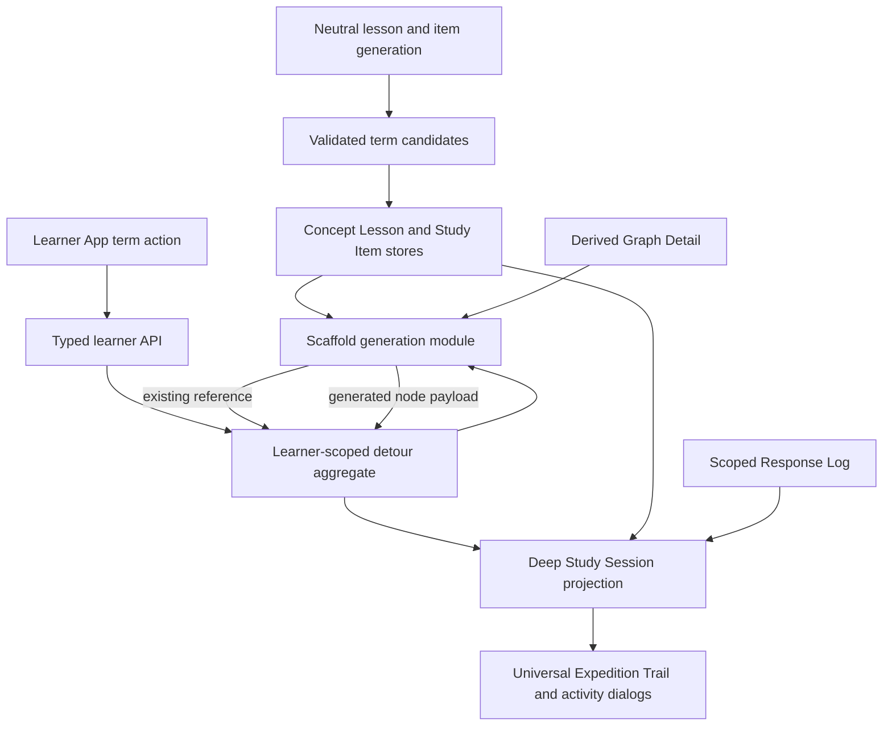
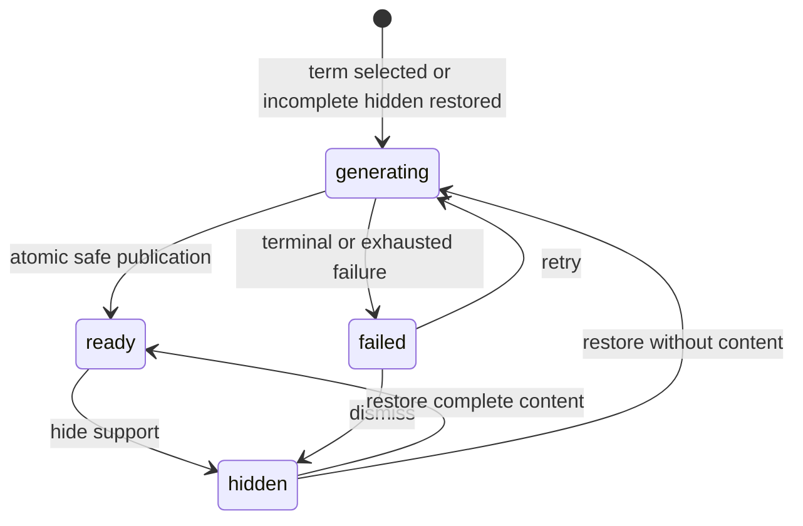
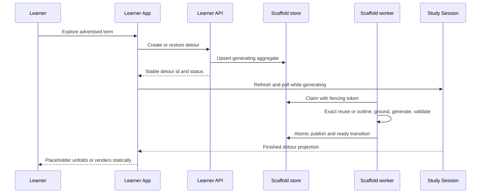
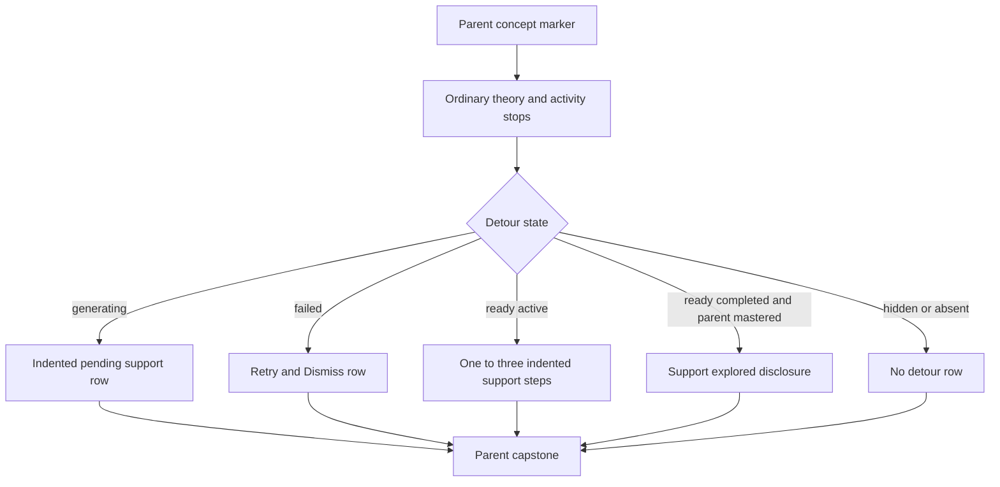

# Adaptive Learner Scaffold Detours - Plan

## Goal Capsule

- **Objective:** Let a learner turn an unfamiliar term in a lesson section or question stem into a durable, optional one-level support detour containing the smallest useful sequence of easier study steps.
- **Product authority:** The accepted behavior in this Product Contract governs UX and scope. [CONTEXT.md](../../CONTEXT.md) governs project language; [ADR-0032](../adr/0032-keep-learner-app-in-flow-through-mastery-aligned-game-ux.md) governs Learner App flow; [ADR-0019](../adr/0019-graph-enrichment-derived-layer.md), [ADR-0026](../adr/0026-typed-study-item-bank.md), and [ADR-0031](../adr/0031-concept-lesson-teaching-substrate.md) keep learner-scoped support outside neutral assets.
- **Execution profile:** Deep greenfield change across generated asset metadata, learner-scoped persistence, asynchronous generation, Study Session projection, typed API, and the universal Expo learner surface. Reset the development database after editing the single initial migration; do not add compatibility paths or backfills.
- **Stop conditions:** Do not mutate a published graph or Derived Graph Layer, write scaffold content into the neutral Study Item Bank, add recursive detours, or implement the deferred Boss Fight and learner-modeling work.
- **Tail ownership:** Implementation owns deterministic tests, real production-model quality inspection, web browser validation, and cleanup of superseded client policy modules. The existing physical Android pass remains separately tracked in [BLOCKERS.md](./BLOCKERS.md).

---

## Product Contract

### Summary

Add learner-requested support branches to the Expedition Trail without turning personalization into neutral graph knowledge. Generated term candidates stay visually quiet in an overflow action, while selecting one immediately creates a durable pending detour that can resolve to existing-node references or learner-scoped scaffold nodes.

### Problem Frame

Concept Lessons and questions sometimes introduce a specialized term that is necessary to understand the current block but unfamiliar to the learner. The current experience reveals correct answers after attempts, but it has no durable way to teach the missing sub-concept and let the learner study it as part of the expedition.

Text selection is not a reliable cross-platform trigger, permanent inline highlighting would make dense study content noisier, and automatic post-error prompts would duplicate feedback already shown after grading. The support must therefore be discoverable on demand, remain optional, and preserve the learner-neutral graph boundary.

### Actors

- A1. **Learner:** requests, studies, hides, restores, or ignores optional support while retaining access to the parent concept.
- A2. **Scaffold generator:** resolves exact reusable nodes, generates only missing learner-scoped support, applies grounding boundaries, and publishes a detour atomically.

### Requirements

**Term discovery and request**

- R1. Existing Concept Lesson generation emits zero to three lesson-wide candidates anchored to final section bodies, and each Study Item generator emits zero to three candidates from its final question stem.
- R2. A candidate is a specialized word or short phrase needed to understand the current block, absent from that block's explanation, and not merely the parent concept label.
- R3. Deterministic validation retains only distinct trimmed candidates of 1-80 Unicode code points that are exact substrings of the rendered body or stem, and drops invalid candidates without adding a heuristic semantic veto.
- R4. The current theory or question activity shows at most one accessible overflow action; opening it lists at most three `Explore “…”` actions without inline highlights or a general Explain action.
- R5. Selecting a term immediately creates or restores one idempotent learner-scoped detour for the learner, enrichment, parent node, and normalized term, then starts generation without confirmation. If creation is refused or unreachable, the current activity stays open with a retryable inline error.

**Detour shape and identity**

- R6. A detour contains the smallest useful ordered set of one to three support steps, is one level deep, and never exposes term actions from scaffold-generated content.
- R7. All ready support steps are playable immediately; order guides Continue but creates no lock, prerequisite claim, or scaffold difficulty score.
- R8. A unique usable exact label or alias match within the parent's own Derived Graph Layer and the parent node's Declared Domain becomes a reference to that existing node, not a copied scaffold node; other layers are never searched.
- R9. Existing-node reuse uses the existing lesson and option-select item, records their normal read and graded evidence, and leaves the node's full canonical mastery rule unchanged.
- R10. An exact existing match is usable only when it is not the parent, is not a locked included node, and already has a lesson plus option-select item; frontier, mastered, and confidently floored nodes may be referenced, while an unusable collision must be replaced by a genuinely lower-level scaffold concept rather than cloned.
- R11. Each generated scaffold node has a stable learner-scoped identity, a compact generated micro-lesson with one concrete example (citation-free, labeled generated), and one four-option option-select recall item with a stable identity.
- R12. A generated scaffold node is complete when its lesson is read and its option-select item's latest graded response is correct; this completion is separate from neutral node mastery.
- R13. The same term under the same parent reuses its detour, while different terms create separate immutable detours; the UI expands at most one detour at a time and groups completed detours behind `Support explored`.

**Lifecycle and flow**

- R14. A detour has exactly four durable lifecycle states: `generating`, `ready`, `failed`, and `hidden`.
- R15. Creation inserts one honest pending placeholder without predicting labels or node count; a progress dialog shows an indeterminate indicator and broad learner-facing phases while the learner may close it and continue elsewhere.
- R16. Generation publishes all surviving safe support steps atomically; a failed detour exposes Retry and Dismiss while the parent activity remains available.
- R17. When a pending detour becomes ready, its placeholder unfolds once into one to three steps and emphasizes the first suggested return; there is no auto-open or toast, and reduced motion renders the final state with an equivalent accessibility announcement.
- R18. A ready detour's overflow action offers `Hide this support`, which removes it from the active trail and future recall eligibility while preserving content and responses; failed detours use Dismiss, and generating detours can close their progress dialog but remain visible. Selecting a hidden term later restores the same ready detour or restarts generation when no complete content exists.
- R19. Parent availability, parent mastery, neutral prerequisite gating, expedition crystals, leaderboard points, and base progress do not depend on generated scaffold completion.
- R20. A completed detour under a mastered parent collapses behind `Support explored`; a ready detour that is not yet complete — unstudied or partially studied — remains available in a collapsed `Support available` row until completed or hidden.

**Grounding, durability, and measurement**

- R21. Scaffold generation reuses verified parent or layer grounding when sufficient and applies the existing Knowledge-Boundary Probe before synthesizing genuinely source-less scaffold concepts.
- R22. Boundary concepts are omitted before publication; generation succeeds with at least one complete safe step and fails when none survive.
- R23. Scaffold node identities, item identities, lesson reads, and append-only graded responses remain replayable so a later fixed-budget Boss Fight can sample completed visible detours without implementing that feature now.
- R24. Initial evaluation records request, latency, failure, hide, detour completion, subsequent parent response, and parent completion from durable state; no learning-effect claim is made before representative human traffic exists.
- R25. Every interaction remains mobile-first, keyboard and screen-reader reachable on web, touch-target compliant, and independent of hover.

### Key Flows

- F1. Request support
  - **Trigger:** A1 opens a lesson-section or question overflow action and chooses a term.
  - **Steps:** The server verifies the advertised candidate, idempotently creates or restores the detour, wakes generation, and returns its stable identity. The activity closes into a progress dialog over the trail and the pending placeholder is visible immediately.
  - **Outcome:** Durable `generating` support exists even if the dialog, page, or process closes.
  - **Covered by:** R1-R5, R14-R15, R25.

- F2. Resolve and publish support
  - **Trigger:** A2 claims a generating detour.
  - **Steps:** It checks exact reusable nodes, proposes the smallest missing lower-level outline, rejects duplicate or unsafe concepts, grounds generated nodes, validates their lesson and option-select payloads, and commits all surviving steps with a fenced terminal write.
  - **Outcome:** The detour becomes `ready` atomically or `failed` without a partial visible branch.
  - **Covered by:** R6-R12, R14, R16, R21-R22.

- F3. Study and return
  - **Trigger:** A1 opens any ready support step.
  - **Steps:** Existing references open the neutral lesson and option-select subset. Generated nodes open their learner-scoped micro-lesson and option-select. Continue follows suggested order but the learner may choose another step or return to the parent at any time.
  - **Outcome:** Support progress is durable and separate; only genuine existing-node evidence can contribute to neutral mastery.
  - **Covered by:** R7-R13, R17, R19-R20, R23.

- F4. Recover, hide, and restore
  - **Trigger:** Generation fails, A1 hides ready support, or A1 reselects a hidden term.
  - **Steps:** Retry reuses the detour identity; Dismiss or Hide sets `hidden`; reselection restores complete content or returns the same detour to `generating` when content never published.
  - **Outcome:** No duplicate detour is created and learner evidence remains inspectable.
  - **Covered by:** R5, R13-R18, R23.

### Acceptance Examples

- AE1. **Covers R1-R5.** Given a question stem advertises two valid terms, when the learner opens the activity overflow action, then exactly those two actions appear and selecting one creates a pending detour without confirmation.
- AE2. **Covers R1-R4.** Given a theory activity has no qualifying candidates across its section bodies, when it renders, then it has no term overflow control, highlighted text, or empty menu.
- AE3. **Covers R8-R10.** Given an advertised term uniquely matches a playable node in the parent's own layer and Declared Domain that has a lesson and option-select, when generation resolves, then the detour stores a reference and creates no learner-scoped node or copied content.
- AE4. **Covers R8-R11.** Given an exact match is locked or lacks the required payload, when generation resolves, then it is not cloned; a distinct lower-level concept is generated or the detour fails if no safe support survives.
- AE5. **Covers R14-R17.** Given a worker fails after drafting two of three steps, when the session refreshes, then no step is visible and the single placeholder offers Retry and Dismiss.
- AE6. **Covers R7, R11-R12, R19.** Given a ready three-step detour, when the learner opens step three first and answers it correctly, then that step records progress while the parent and other two steps remain accessible and unchanged.
- AE7. **Covers R17, R25.** Given a generating placeholder becomes ready while reduced motion is enabled, when the session refreshes, then the final static steps appear with an accessibility announcement and no animation, toast, haptic, or auto-open.
- AE8. **Covers R13, R18, R23.** Given a completed detour is hidden and its term is later selected again, when the request completes, then the same detour, node, item, and response identities return without regeneration.
- AE9. **Covers R9, R12, R19.** Given a reused node also has matching and impostor activities, when its detour lesson and option-select are complete, then the detour reference reads complete but the neutral node is mastered only after its remaining canonical activities are latest-correct.

### Success Criteria

- The primary behavioral signal is a learner completing support, returning to the parent, and completing the parent without a higher inactivity rate than comparable unsupported attempts.
- Generation latency and failure are inspectable from operation timelines and detour timestamps; requests, hides, reads, responses, and parent outcomes are derivable without a second analytics event model.
- Qualitative real-use inspection confirms that generated steps are genuinely easier, ordered coherently, grounded honestly, and helpful across mixed domains.

### Scope Boundaries

**Included**

- Term candidates from lesson-section bodies and question stems only.
- One-level learner-scoped detours with one to three support steps.
- Exact existing-node references and generated learner-scoped nodes.
- One micro-lesson and one option-select per generated node.
- Four lifecycle states, atomic publication, retry, dismiss, hide, and restore.
- Broad progress phases, pending-to-ready trail motion, and reduced-motion equivalence.
- Stable scoped responses and Study Session composition.

**Deferred to Follow-Up Work**

- Boss Fight recall challenge and its fixed-budget neutral-plus-scaffold sampler.
- Additional scaffold item types or replication of the full Study Item Blueprint.
- IRT, BKT, Elo, Bradley-Terry, scaffold difficulty scoring, and calibrated gating.
- Web retrieval or source acquisition for scaffold generation.
- Semantic deduplication between learner-scoped scaffold nodes.
- Candidate 3 from the [architecture deepening review](../brainstorms/2026-07-11-architecture-deepening-review.md): rebinding the full Topic Expedition generation lifecycle interface.

**Not part of this feature**

- Native phrase-selection callbacks, inline term highlighting, a general Explain action, section-wide explanation, automatic error prompts, compact explanation-only cards, or recursive `Break into steps` actions.
- Neutral graph mutations, inferred neutral prerequisite edges, Study Item Bank writes, extra crystals, leaderboard rewards, or base expedition progress for generated scaffold work.
- A detailed learner-facing operation-stage dashboard or completion toast.

### Dependencies and Assumptions

- Term candidates are regenerated through the normal asset workflow after the allowed hard database reset; existing rows receive no compatibility backfill.
- The Derived Graph Detail already carries node labels, aliases, domains, lessons, items, and learner-state classification needed for exact reuse.
- Existing operation timelines remain the internal observability source, but the learner projection maps them to broad phases and never exposes raw stage tags.
- Product Contract preservation: the accepted interview plus the 2026-07-12 grilling amendments — layer-scoped exact reuse (R8), citation-free generated labeling (R11), the not-yet-complete `Support available` rule (R20), and the recorded Flow Design Gate — including the final clarification that exact reuse creates a reference rather than a second node identity.

### Sources and Research

- [React Native Text](https://reactnative.dev/docs/text) exposes selectable native text but no portable selected-phrase callback or custom selection action, supporting generated term actions rather than selection-driven UX.
- [Expo UI Menu](https://docs.expo.dev/versions/latest/sdk/ui/drop-in-replacements/menu/) documents web limitations for menu actions, supporting an app-owned universal overflow disclosure instead of a native menu dependency.
- [Help seeking in intelligent tutoring systems](https://doi.org/10.1007/s40593-015-0089-1) supports learner-controlled help while warning that prompting alone does not solve help avoidance or misuse.
- [Glossing meta-analysis](https://www.frontiersin.org/journals/language-sciences/articles/10.3389/flang.2026.1815571/full) supports restrained clickable explanations as a useful aid while not justifying pervasive highlighting outside its studied contexts.

### Flow Design Gate (ADR-0032)

- **Player-visible goal:** unblock understanding of the current stop by exploring an unfamiliar term; it matches the learning goal (close the local prerequisite gap) by construction.
- **Distraction risks:** detour rabbit-holing and support-first play — contained by the one-level depth cap, at most three quiet actions, no crystals or points for scaffold work, and the `Support explored` collapse.
- **Challenge curve and expected skill growth:** support steps are deliberately easier than the parent; growth shows as the learner returning to and completing the parent.
- **Prioritized pleasures:** Challenge and Discovery; no narrative, collection, or social layer.
- **Focused runtime signals:** exactly the R24 set, derived from durable state — request, latency, failure, hide, detour completion, subsequent parent response, and parent completion.

---

## Planning Contract

### Key Technical Decisions

- KTD1. **Persist neutral term affordance metadata with the generated assets.** Add a maximum-three lesson-level list whose entries carry a section anchor, plus a maximum-three list on each Study Item question, within the existing generation calls. A shared pure validator enforces the 1-80-code-point envelope, exact substring, valid section anchor, distinctness, and parent-label exclusion; semantic qualification remains neural because lexical heuristics cannot prove it.
- KTD2. **Model a detour as a learner-owned aggregate of support steps.** The aggregate owns request identity, parent attachment, lifecycle, claim/fence data, and ordered steps. A step is either an existing-node reference or a generated scaffold node; the reference is not a concept identity and cannot be mistaken for a duplicate node.
- KTD3. **Reuse only one unambiguous, usable exact match.** Match `normalizeConceptLabel(term)` against the canonical labels and aliases of the parent's own Derived Graph Layer, filtered to the parent node's Declared Domain — cross-layer reuse is out of scope (it is the ADR-0015 semantic-identity problem, and the grading and lesson-read guards are enrichment-scoped). Reuse requires exactly one non-parent match, a Concept Lesson, and an option-select item; frontier, mastered, and confidently floored matches are usable, while a locked included node is not. Ambiguous or unusable matches cannot be cloned; the outline generator receives retry feedback to propose a distinct lower-level step, and generation omits or fails unresolved collisions.
- KTD4. **Use one scoped response observation model.** Generalize the append-only Response Log subject/item identity into a discriminated neutral-or-scaffold reference backed by mutually exclusive foreign keys: the neutral `study_item_id` + `derived_node_id` pair, or one `scaffold_step_id` referencing `learner_scaffold_steps`. Existing-node references keep neutral identities, so scaffold-scoped rows exist only for generated steps. Base mastery, leaderboard, duel, and expedition progress folds consume neutral observations only, while shared grading mechanics handle both scopes.
- KTD5. **Deepen Study Session before adding detour presentation.** Implement Candidate 4 from the architecture review: Study Session owns finished trail clusters, stops, per-stop completion, next-stop selection, section progress, crystal growth, activity lookup, and learner-scoped detour composition. Delete `trailView.ts` and `activityProgress.ts` once callers consume the finished projection.
- KTD6. **Use a deep asynchronous scaffold-generation module.** Bind outline, exact reuse, Knowledge-Boundary Probe, grounding, content generation, validation, and atomic persistence behind a request-shaped application interface. Keep outline/content seams internal except for their infrastructure-owned neural ports; do not pass the combined dependency union through the supervisor.
- KTD7. **Reuse durable job and operation patterns without copying a supervisor.** Add `scaffold` to the operation catalog; because scaffold generation reuses the Knowledge-Boundary Probe and grounding-generation descriptors unchanged, the catalog's ownership invariant relaxes from owned-exactly-once to owned-at-least-once with an explicit `SHARED_STAGES` set (exactly `knowledge-boundary-probe` and `grounding-generation`, claimed by `enrichment` and `scaffold`) — spend attribution stays exact through the existing `(operation_id, stage)` join, the accidental-claim guard survives for every other stage, and ADR-0034's descriptor-owns-its-tag principle is untouched. Extract only the existing process-level claim/top-up scheduler into a small reusable helper used by topic and scaffold queue adapters. Each claim mints a fresh operation ID that also acts as its fencing token, while the detour ID survives retries; claim, retry classification, and terminal writes stay in their owning application modules.
- KTD8. **Map internal stages to three broad learner phases.** The Study Session maps operation-stage progress to stable plain phase identifiers (`preparing`, `building`, `checking`); the Learner App vocabulary themes them (ADR-0033), and the UI renders one indeterminate bar and phase sentence, never counts or raw stage names.
- KTD9. **Publish scaffold payloads atomically.** Generate and validate all candidate steps in memory, drop boundary or otherwise unsafe steps, and commit the surviving ordered steps, lessons, items, and ready transition in one transaction guarded by the claim token. Failure leaves only the detour aggregate and operation evidence.
- KTD10. **Use two small forced-tool descriptors for new neural work.** One descriptor proposes the minimal one-to-three-step outline; one generates a compact lesson/example/option-select from approved grounding. Scaffold content is always labeled generated and carries no citations; the invariants that transfer from the neutral pipeline are the option shape (four options, exactly one server-keyed correct) and never presenting generated text as a source quote. Both descriptors route through the existing `kg-claim-extraction` alias (no `litellm/config.yaml` change), use forced named schemas, derive config hashes mechanically, remain domain-neutral, respect MiMo's schema-congruence constraints, and join the trailing-nullable congruence roster.
- KTD11. **Keep one term action per activity and keep it app-owned.** A More `IconButton` in the Activity Sheet header opens one inline disclosure containing at most three actions for the current theory or question. A successful selection closes the activity into a root-owned progress `Dialog`; a failed create stays in place with inline recovery.
- KTD12. **Derive measurement from durable domain state.** Detour and operation timestamps, lesson reads, scoped response order, and later neutral responses provide the v1 funnel. Do not add a parallel clickstream or analytics dashboard for signals already derivable from authoritative state.

### High-Level Technical Design

The diagrams are authoritative at the boundary level; the implementation may refine names while preserving ownership and data flow.

**Component and data flow**

**Lifecycle**

**Request and generation sequence**

**Trail composition**

### Sequencing

1. Land bounded term metadata so every request can be authenticated against server-owned content.
2. Establish the learner-scoped aggregate and scoped response identity before any generator or UI writes depend on them.
3. Implement and real-use-evaluate generation before exposing the action broadly.
4. Deepen Study Session and delete duplicated client completion policy before composing detours.
5. Add typed API commands and then the universal UX, polling, accessibility, and motion.
6. Finish durable documentation, production-model evaluation, browser proof, and hard-reset cleanup.

### System-Wide Impact

- **Neutral generation:** Concept Lesson and all three Study Item question generators gain bounded term metadata, but their study semantics and grounding remain unchanged.
- **Persistence:** The initial schema gains learner-scoped detour/content tables, a scaffold operation type, and mutually exclusive neutral/scaffold Response Log references. Development data is reset instead of migrated.
- **Mastery and rewards:** Neutral folds must explicitly ignore scaffold-scoped observations. Existing-node references remain neutral and therefore behave exactly like studying that node elsewhere.
- **Projection:** Study Session becomes the sole completion/trail authority and composes detours; raw completion maps stop leaking into Learner App policy modules.
- **API and client:** Hono remains a thin bearer/validation mapper and the Expo app continues deriving response types from `AppType`.
- **Operations:** Internal scaffold stages use existing timeline and spend infrastructure and remain directly inspectable by operation ID, while learner-facing phase copy remains a projection concern; a new Admin journey surface is not part of this plan.
- **Admin inspection:** Learner response inspection must identify neutral versus scaffold subjects without assuming every item joins `study_items`.

### Risks and Mitigations

- **Generated support is not easier or is pedagogically incoherent.** Require the outline to justify each distinct lower-level step, cap at three, inspect production outputs across mixed domains, and block UI completion until the real-use quality gate passes.
- **A scaffold accidentally becomes neutral knowledge.** Keep separate tables and discriminated identities, prohibit Derived Graph Layer and Study Item Bank writes in the use-case dependencies, and test persistence counts before and after generation.
- **Exact reuse causes identity or gating surprises.** Reuse only a unique playable/mastered match with complete payload; store a reference, preserve canonical mastery, and test multi-item existing nodes explicitly.
- **Response generalization changes base mastery or scores.** Make scope exhaustive in domain types and add negative regression tests for Study Session mastery, leaderboard points, duel pools, journal progress, and Admin inspection.
- **Async retries double-publish or spend after claim loss.** Reuse database claims, fencing tokens, bounded attempts, stale-operation handling, and atomic ready writes; test competing claims and retry restoration.
- **Term metadata clutters or fabricates affordances.** Render no control for an empty list, cap at three, exact-validate against final text, and inspect candidate quality as part of the production generation gate.
- **The feature expands into a second graph UI.** Render an indented detour inside the existing line-based trail and keep graph relationships internal to Study Session composition.

---

## Implementation Units

### U1. Generate and persist bounded term candidates

- **Goal:** Add server-owned, visually quiet term-action metadata to final neutral lesson sections and question stems without adding an extraction operation or UI highlight model.
- **Requirements:** R1-R4, R25; AE1-AE2.
- **Dependencies:** None.
- **Files:**
  - `packages/domain-core/src/index.ts`
  - `packages/domain-core/src/conceptLesson.test.ts`
  - `packages/application/src/explorableTerms.ts` (new)
  - `packages/application/src/explorableTerms.test.ts` (new)
  - `packages/application/src/assembleConceptLesson.ts`
  - `packages/application/src/assembleConceptLesson.test.ts`
  - `packages/application/src/optionSelectGuard.ts`
  - `packages/application/src/optionSelectGuard.test.ts`
  - `packages/application/src/matchingGuard.ts`
  - `packages/application/src/matchingGuard.test.ts`
  - `packages/application/src/impostorGuard.ts`
  - `packages/application/src/impostorGuard.test.ts`
  - `packages/ports/src/index.ts`
  - `packages/infrastructure-litellm/prompts/concept-lesson-generation.prompt`
  - `packages/infrastructure-litellm/prompts/study-option-select-generation.prompt`
  - `packages/infrastructure-litellm/prompts/study-matching-generation.prompt`
  - `packages/infrastructure-litellm/prompts/study-impostor-generation.prompt`
  - `packages/infrastructure-litellm/src/conceptLessonGenerationAdapters.ts`
  - `packages/infrastructure-litellm/src/conceptLessonGenerationAdapters.test.ts`
  - `packages/infrastructure-litellm/src/studyItemGenerationAdapters.ts`
  - `packages/infrastructure-litellm/src/studyItemGenerationAdapters.test.ts`
  - `packages/infrastructure-litellm/src/toolSchemas.ts`
  - `packages/infrastructure-litellm/src/toolSchemas.test.ts`
  - `packages/infrastructure-litellm/src/configHashes.ts`
  - `packages/infrastructure-litellm/src/configHashes.test.ts`
  - `packages/infrastructure-postgres/src/migrations/0000_initial_lrnki_schema.sql`
  - `packages/infrastructure-postgres/src/PostgresLearnerLoopStores.ts`
  - `packages/infrastructure-postgres/src/PostgresLearnerLoopStores.test.ts`
- **Approach:** Extend the lesson draft with a required zero-to-three list of term plus section-kind anchors, and every study-item draft with a required zero-to-three string array, all emitted in existing forced-tool calls. Validate lesson terms against only the referenced section `text` and item terms against only the item `question`; preserve exact rendered substrings and order, remove duplicates, and drop the parent label. Persist the lesson list on `concept_lessons` and the question list on `study_items`; hydrate them through neutral types and Study Session activity views. Keep the required arrays away from fatal trailing-nullable schema shapes and include descriptor changes in mechanical config hashes.
- **Patterns to follow:** Forced named schemas and validators in `packages/infrastructure-litellm/src/toolSchemas.ts`; authoritative assembly in `packages/application/src/assembleConceptLesson.ts`; current guard re-derivation in the three study-item guards; MiMo schema congruence coverage in `packages/infrastructure-litellm/src/forcedToolStage.test.ts`.
- **Test scenarios:**
  1. Covers AE1. A final question containing two advertised exact phrases round-trips them in order through adapter, guard, Postgres store, hydration, and projection.
  2. Covers AE2. Empty candidate arrays round-trip and produce no placeholder metadata.
  3. Candidates absent from the final text, duplicated after normalization, equal to the parent label, blank, longer than 80 Unicode code points, or beyond the first three are deterministically dropped without rejecting otherwise valid neural output.
  4. A lesson candidate must name a real section kind and match only that section's body text, not its list items; item candidates validate only against the question, not options, pairs, statements, explanation, or reveal.
  5. The descriptor/schema congruence suite accepts the MiMo-routed schemas and config hashes change mechanically when the prompt or schema changes.
- **Verification:** Freshly generated Concept Lessons and each Study Item type persist zero-to-three useful exact terms, while unchanged grading and lesson grounding suites remain green.

### U2. Add the learner-scoped detour aggregate and scoped response identity

- **Goal:** Establish durable identities, lifecycle, content ownership, and append-only learner evidence without bending neutral tables.
- **Requirements:** R5-R14, R18-R19, R23; AE3-AE4, AE6, AE8-AE9.
- **Dependencies:** U1.
- **Files:**
  - `packages/domain-core/src/learnerScaffold.ts` (new)
  - `packages/domain-core/src/learnerScaffold.test.ts` (new)
  - `packages/domain-core/src/index.ts`
  - `packages/ports/src/index.ts`
  - `packages/application/src/gradedSelectionOutcome.ts`
  - `packages/application/src/gradedSelectionOutcome.test.ts`
  - `packages/application/src/learnerLoopProjection.ts`
  - `packages/application/src/learnerLoopProjection.test.ts`
  - `packages/application/src/responseLogLearnerState.ts`
  - `packages/application/src/responseLogLearnerState.test.ts`
  - `packages/application/src/calibrationClosure.ts`
  - `packages/application/src/calibrationClosure.test.ts`
  - `packages/application/src/getWeeklyLeaderboard.ts`
  - `packages/application/src/getStudySession.test.ts`
  - `packages/application/src/studySessionProjection.ts`
  - `packages/application/src/studySessionProjection.test.ts`
  - `packages/application/src/expeditionJournal.ts`
  - `packages/application/src/expeditionJournal.test.ts`
  - `packages/infrastructure-postgres/src/migrations/0000_initial_lrnki_schema.sql`
  - `packages/infrastructure-postgres/src/PostgresLearnerScaffoldStore.ts` (new)
  - `packages/infrastructure-postgres/src/PostgresLearnerScaffoldStore.test.ts` (new)
  - `packages/infrastructure-postgres/src/PostgresLearnerLoopStores.ts`
  - `packages/infrastructure-postgres/src/PostgresLearnerLoopStores.test.ts`
  - `packages/infrastructure-postgres/src/PostgresLearnerLoopRead.ts`
  - `packages/infrastructure-postgres/src/PostgresLearnerLoopRead.test.ts`
  - `packages/infrastructure-postgres/src/index.ts`
- **Approach:** Introduce `learner_scaffold_detours` and ordered `learner_scaffold_steps` owned by learner plus enrichment and parent. The step row is the whole content home (payload-on-step): a generated step embeds its micro-lesson and single option-select item — stable scaffold node, item, and option identities inside — as one typed jsonb payload beside a mutable `lesson_read_at` column; a reference step carries `referenced_derived_node_id` and no payload; one CHECK enforces exactly-one-of. Steps are immutable once published, so the neutral tables' supersede lifecycle, partial unique indexes, and citation CHECKs are deliberately not mirrored; the option-shape invariants (four options, exactly one correct, server-only key) are enforced by the generation validator before the fenced atomic publish and re-checked at hydration. Enforce one detour per learner/enrichment/parent/normalized term. The detour keeps the latest generation operation pointer separately from its stable identity; retry clears the failed pointer and the next claim installs a fresh operation/fencing UUID. Generalize Response Log identity as an exhaustive neutral-or-scaffold union backed by mutually exclusive foreign keys per KTD4 (`scaffold_step_id` → `learner_scaffold_steps`, only ever for generated steps), retaining one append-only sequence per learner. A hidden row retains payload and evidence; restore chooses `ready` when complete payload exists and `generating` otherwise.
- **Execution note:** Change the single initial migration and reset the development database; do not create an additive compatibility migration or dual-read path.
- **Patterns to follow:** Learner-owned aggregate and claim methods in `packages/infrastructure-postgres/src/PostgresLearnerExpeditionStore.ts`; append sequence allocation in `PostgresResponseLogStore`; discriminated domain unions in `packages/domain-core/src/index.ts`.
- **Test scenarios:**
  1. Covers AE8. Repeating create for the same normalized term returns the same detour id; hiding and restoring preserves ready steps, item ids, reads, and responses.
  2. Different normalized terms under one parent create separate detours, while the same term under a different parent does not collide.
  3. The schema rejects a step that is both an existing reference and generated node, or neither, and rejects any lifecycle value outside the four accepted states.
  4. Neutral and scaffold response rows append through the same monotonic learner sequence and hydrate to exhaustive scoped types.
  5. A scaffold response cannot enter neutral mastery, calibration closure, points, journal progress, or neutral response summaries; a response through an existing-node reference remains a normal neutral observation.
  6. Concurrent idempotent creates and competing claims produce one detour and one active claim token; retry preserves the detour id but creates a fresh operation id whose timeline does not collide with the failed attempt.
- **Verification:** The reset schema enforces aggregate identity and mutually exclusive response references, with existing learner-loop inspection still resolving every response label and question.

### U3. Build durable, grounded, atomic scaffold generation

- **Goal:** Turn a claimed pending detour into one to three safe existing references or generated scaffold nodes through a bounded, observable, retryable deep module.
- **Requirements:** R6-R11, R14-R18, R21-R24; F2, F4; AE3-AE5, AE8.
- **Dependencies:** U2.
- **Files:**
  - `packages/application/src/learnerScaffoldGeneration.ts` (new)
  - `packages/application/src/learnerScaffoldGeneration.test.ts` (new)
  - `packages/domain-core/src/index.ts`
  - `packages/application/src/operationTimelineCatalog.ts`
  - `packages/application/src/operationTimelineCatalog.test.ts`
  - `packages/application/src/costTimingReport.test.ts`
  - `packages/application/src/rankBottleneckTargets.test.ts`
  - `packages/application/src/index.ts`
  - `packages/ports/src/index.ts`
  - `packages/infrastructure-litellm/prompts/learner-scaffold-outline-generation.prompt` (new)
  - `packages/infrastructure-litellm/prompts/learner-scaffold-content-generation.prompt` (new)
  - `packages/infrastructure-litellm/src/learnerScaffoldGenerationAdapters.ts` (new)
  - `packages/infrastructure-litellm/src/learnerScaffoldGenerationAdapters.test.ts` (new)
  - `packages/infrastructure-litellm/src/toolSchemas.ts`
  - `packages/infrastructure-litellm/src/toolSchemas.test.ts`
  - `packages/infrastructure-litellm/src/configHashes.ts`
  - `packages/infrastructure-litellm/src/configHashes.test.ts`
  - `packages/infrastructure-litellm/src/mimoDescriptorShape.test.ts`
  - `packages/infrastructure-litellm/src/LiteLlmSpendLogsReadAdapter.ts`
  - `packages/infrastructure-litellm/src/LiteLlmSpendLogsReadAdapter.test.ts`
  - `packages/infrastructure-litellm/src/index.ts`
  - `packages/infrastructure-postgres/src/migrations/0000_initial_lrnki_schema.sql`
  - `packages/infrastructure-postgres/src/PostgresRunProgressReporter.ts`
  - `packages/infrastructure-postgres/src/PostgresRunProgressReporter.test.ts`
  - `packages/infrastructure-postgres/src/PostgresOperationTimelineRead.ts`
  - `packages/infrastructure-postgres/src/PostgresOperationTimelineRead.test.ts`
  - `apps/learner-api/src/generationSupervisor.ts` (new)
  - `apps/learner-api/src/generationSupervisor.test.ts` (new)
  - `apps/learner-api/src/topicGenerationSupervisor.ts`
  - `apps/learner-api/src/scaffoldGenerationSupervisor.ts` (new)
  - `apps/learner-api/src/learnerScaffoldGeneration.ts` (new)
  - `apps/learner-api/src/index.ts`
- **Approach:** Create the detour before work begins, then let a bounded supervisor claim it and install a fresh operation/fencing UUID for that attempt. The application module first attempts direct selected-term reuse, otherwise requests a minimal outline. Each outline label passes the same exact-match rule; unusable collisions receive one distinct-concept retry and cannot be cloned. Generated steps reuse verified grounding when sufficient; genuinely source-less steps pass the Knowledge-Boundary Probe and existing grounding generation. Boundary steps are dropped. A dedicated compact-content descriptor produces lesson, example, question, explanation, and four options from approved grounding; the payload is citation-free and labeled generated end to end, with the four-option one-server-keyed-correct shape revalidated before publish (KTD10). The module publishes one to three surviving steps atomically with a fenced ready transition, or records failure/release according to existing classified retry policy. Extend the exhaustive operation type/stage catalog with a `scaffold` arm claiming the two new scaffold stage tags plus the reused `knowledge-boundary-probe` and `grounding-generation` stages, and change the catalog test's single-ownership assertion to owned-at-least-once over an explicit `SHARED_STAGES` set that names exactly those two reused stages (KTD7), so direct timeline and spend reads remain typed and do not fall through assumptions written for `study_items`.
- **Patterns to follow:** Claim fencing and transient failure handling in `packages/application/src/generateTopicExpedition.ts`; bounded supervisor top-up in `apps/learner-api/src/topicGenerationSupervisor.ts`; Knowledge-Boundary Probe and grounding ports wired in `apps/learner-api/src/learnerGeneration.ts`; forced-stage descriptors and mechanical hashes under `packages/infrastructure-litellm`.
- **Test scenarios:**
  1. Covers AE3. A unique usable selected-term match bypasses all new LLM calls and atomically publishes one existing-node reference.
  2. Covers AE4. A locked, parent, ambiguous, or payload-incomplete exact collision is never cloned; a distinct retry succeeds or no safe-step failure is recorded.
  3. An outline returning one, two, or three distinct safe concepts preserves order; zero or more than three fails schema validation, and the generator is instructed not to fill the limit.
  4. A mixed outline publishes safe exact references and generated nodes together, omitting boundary steps while retaining at least one complete step.
  5. Covers AE5. Content or grounding failure publishes no child rows, leaves the parent untouched, and exposes a retryable or terminal aggregate state as classified.
  6. A lost fence prevents terminal publication and additional spending; stale claims retry within the bounded attempt budget and exhausted claims fail once.
  7. Raw operation stages and spend tags are complete for `scaffold`; the catalog suite proves `SHARED_STAGES` is exactly `knowledge-boundary-probe` plus `grounding-generation` claimed by exactly `enrichment` and `scaffold`, while every other LLM stage keeps a single owner; probe and grounding spend recorded under a scaffold operation id is attributed to that operation's cost and timing reads; and the learner projection still exposes only broad phases.
  8. Production MiMo calls satisfy both forced-tool schemas without fixture-specific prompt wording or trailing-nullable decoder hazards.
- **Verification:** Deterministic lifecycle tests prove zero partial publication and claim safety. The real-use gate runs before U5 exposes creation through the API and is driven by a disposable tsx script under gitignored `tmp/` that invokes the application module directly with the production adapters and a disposable learner (the vehicle prior rule-14 gates used), inspecting generated support for multiple difficult terms across at least three domains.

### U4. Make Study Session the finished trail and detour projection

- **Goal:** Compose neutral and learner-scoped study into one authoritative Expedition Trail while deleting client-side completion policy duplication.
- **Requirements:** R7-R13, R15-R20, R23-R24; F3; AE5-AE9.
- **Dependencies:** U2, U3.
- **Files:**
  - `packages/application/src/studySessionTrail.ts` (new)
  - `packages/application/src/studySessionTrail.test.ts` (new)
  - `packages/application/src/studySessionProjection.ts`
  - `packages/application/src/studySessionProjection.test.ts`
  - `packages/application/src/getStudySession.ts`
  - `packages/application/src/getStudySession.test.ts`
  - `packages/application/src/weeklyLeaderboard.test.ts`
  - `packages/application/src/expeditionJournal.test.ts`
  - `packages/application/src/projection.ts`
  - `packages/application/src/index.ts`
  - `apps/learner-app/src/learn/trailView.ts` (delete)
  - `apps/learner-app/src/learn/trailView.test.ts` (delete)
  - `apps/learner-app/src/learn/activityProgress.ts` (delete)
  - `apps/learner-app/src/learn/activityProgress.test.ts` (delete)
  - `apps/learner-app/src/app/expedition/[enrichmentId].tsx`
  - `apps/learner-app/src/components/CheckpointPath.tsx`
  - `apps/learner-app/src/components/CheckpointCircle.tsx`
  - `apps/learner-app/src/components/ConceptMarker.tsx`
  - `apps/learner-app/src/components/CrystalVista.tsx`
  - `apps/learner-app/src/components/QuestHeader.tsx`
  - `apps/learner-app/src/components/SectionCrystalStrip.tsx`
  - `apps/learner-app/src/components/SectionOverview.tsx`
  - `apps/learner-app/src/components/ActivitySheet.tsx`
  - `apps/learner-app/src/components/ActivitySheet.test.tsx`
  - `apps/learner-app/src/learn/checkpointPresentation.ts`
  - `apps/learner-app/src/learn/checkpointPresentation.test.ts`
  - `apps/learner-app/src/learn/crystalVistaView.ts`
  - `apps/learner-app/src/learn/crystalVistaView.test.ts`
  - `apps/learner-app/src/learn/goalCopy.ts`
  - `apps/learner-app/src/learn/goalCopy.test.ts`
  - `apps/learner-app/src/learn/sessionFixture.ts`
- **Approach:** Load active learner-scoped detours and the operation facts for their in-flight runs alongside existing neutral assets. Move trail clusters, stop ids, per-stop state, section totals, next-stop choice, growth, capstone activity, and completion indicators behind the pure Study Session projection. Compose a detour under its parent after ordinary activity stops and before the capstone. Existing references point to the neutral lesson and one option-select stop without duplicating payload; their support completion is the subset result, while neutral mastery still evaluates the full node. A reference step renders under its parent even when the referenced node is also a visible cluster elsewhere on the trail — both surfaces read the same neutral evidence, so completion stays in lockstep with no dedup rule. Generated nodes use scoped reads/responses and never enter neutral classification. Map raw operation facts to broad phases. Return only non-hidden detours and group/collapse state; keep expanded-detour choice local to the UI.
- **Execution note:** Preserve the current event-bound mastery and crystal transition semantics while migrating consumers; add characterization tests before deleting the two client policy modules. Those modules have thirteen non-test importers (the expedition route, the checkpoint/marker/vista/header/section components, and the presentation, vista-view, and goal-copy policies, plus the shared session fixture) — all migrate to the projection-owned trail within this unit.
- **Patterns to follow:** Candidate 4 in `docs/brainstorms/2026-07-11-architecture-deepening-review.md`; finished learner projections in `packages/application/src/expeditionJournal.ts`; existing pure folds in `studySessionProjection.ts`.
- **Test scenarios:**
  1. Existing neutral sessions produce byte-equivalent visible stop order, completion, section counts, next stop, and growth after the client folds are removed.
  2. Covers AE5. Generating and failed detours project one placeholder row with broad phase or recovery actions and no speculative child labels.
  3. Covers AE6. Every ready support step is available regardless of ordinal and does not alter parent availability or neutral prerequisite classification.
  4. Covers AE9. A reused multi-item node can complete its detour lesson-plus-option subset without becoming neutrally mastered until all canonical activities complete.
  5. A generated scaffold response and completion never changes base mastery, crystal count, journal progress, leaderboard points, duel pool, or summit state.
  6. A hidden detour is absent but its stored completion remains; completed and not-yet-complete ready detours under a mastered parent project the correct collapsed group labels (`Support explored` vs `Support available`), including the partially studied case.
  7. Latest incorrect after latest correct reopens the generated option step, matching the neutral latest-outcome rule.
- **Verification:** No learner component imports or reconstructs raw mastery maps for stop completion, and projection tests are the sole policy proof for both neutral and scaffold trail states.

### U5. Expose authenticated idempotent scaffold commands through the typed API

- **Goal:** Add thin create/restore, retry, hide/dismiss, lesson-read, and shared option-select commands while preserving server-owned identity and grading.
- **Requirements:** R4-R5, R12, R14-R19, R23, R25; F1, F3-F4.
- **Dependencies:** U2-U4.
- **Files:**
  - `packages/application/src/requestLearnerScaffold.ts` (new)
  - `packages/application/src/requestLearnerScaffold.test.ts` (new)
  - `packages/application/src/gradeStudyResponse.ts`
  - `packages/application/src/gradeStudyResponse.test.ts`
  - `packages/application/src/index.ts`
  - `apps/learner-api/src/app.ts`
  - `apps/learner-api/src/app.test.ts`
  - `apps/learner-api/src/client.ts`
  - `apps/learner-app/src/lib/actions.ts`
  - `apps/learner-app/src/lib/api.ts`
  - `apps/learner-app/src/lib/queries.ts`
- **Approach:** The create use-case verifies the active ready expedition, parent membership, source block identity, and exact advertised term from server-owned neutral content before upserting the detour and waking the supervisor. Add typed routes for create/restore, retry, and hide/dismiss. Generalize lesson-read and option-select submissions with an explicit neutral/scaffold scope so both reuse one application grader while resolving from the correct store. Exact references submit neutral ids. Return reason codes from application and learner copy from the API/UI. Poll the expedition query only while its finished Study Session reports generating detours.
- **Patterns to follow:** `gradeStudyResponse` load-guard-grade-append composition; route validation in `apps/learner-api/src/app.ts`; typed Hono inference in `apps/learner-app/src/lib/queries.ts`; query invalidation in `apps/learner-app/src/lib/actions.ts`.
- **Test scenarios:**
  1. Covers AE1. An authenticated advertised term creates one durable pending detour and duplicate submissions return the same id.
  2. Arbitrary text, a stale source anchor, a term not advertised by the current asset, a node outside the active enrichment, or an inactive expedition is refused without a row or worker wake.
  3. Retry works only for the learner's failed detour; hide/dismiss and restore cannot address another learner's row.
  4. Neutral and scaffold option submissions return the same public correctness shape and append correctly scoped responses; a scope/id mismatch is refused.
  5. Scaffold lesson reads mark only learner-owned generated nodes; exact references use the existing neutral lesson-read path.
  6. Expedition polling runs while at least one detour generates and stops in ready, failed, or hidden-only sessions.
- **Verification:** Hono `AppType` carries every new request and response to the Expo client without handwritten wire aliases, and authorization tests prove learner isolation.

### U6. Add the quiet term menu, progress dialog, and indented detour UX

- **Goal:** Deliver the accepted low-clutter, mobile-first interaction with durable recovery, one-at-a-time disclosure, and event-bound readiness motion.
- **Requirements:** R3-R7, R11-R20, R25; F1, F3-F4; AE1-AE2, AE5-AE8.
- **Dependencies:** U5.
- **Files:**
  - `apps/learner-app/src/components/TermExplorationMenu.tsx` (new)
  - `apps/learner-app/src/components/TermExplorationMenu.test.tsx` (new)
  - `apps/learner-app/src/components/ScaffoldDetour.tsx` (new)
  - `apps/learner-app/src/components/ScaffoldDetour.test.tsx` (new)
  - `apps/learner-app/src/components/ScaffoldProgressDialog.tsx` (new)
  - `apps/learner-app/src/components/ScaffoldProgressDialog.test.tsx` (new)
  - `apps/learner-app/src/components/ActivitySheet.tsx`
  - `apps/learner-app/src/components/ActivitySheet.test.tsx`
  - `apps/learner-app/src/components/CheckpointPath.tsx`
  - `apps/learner-app/src/app/expedition/[enrichmentId].tsx`
  - `apps/learner-app/src/learn/vocabulary.ts`
  - `apps/learner-app/src/ui/motion.ts`
- **Approach:** Add one optional More `IconButton` to the Activity Sheet header and reveal its at-most-three term actions as an inline disclosure below that header, regardless of whether the body is theory, option-select, matching, or impostor. On a successful create, close the activity and open a root-owned progress dialog tied to its stable id; on request failure, keep the disclosure in place with retryable copy. Render pending, failure, and ready detour rows from the finished Study Session. Ready steps reuse existing Activity Sheet bodies and generated content is labeled generated. Keep one detour expanded locally, expose Retry/Dismiss on failure and Hide in ready-detour overflow, and never auto-open a step. Animate only the observed generating-to-ready transition with existing motion tokens; reduced motion uses static state plus an accessibility announcement.
- **Patterns to follow:** App-owned `IconButton`, `Dialog`, `Progress`, `FullScreenDialog`, and reduced-motion policy under `apps/learner-app/src/ui`; activity icon continuity in `ActivitySheet.tsx`; indented trail composition in `CheckpointPath.tsx`.
- **Test scenarios:**
  1. Covers AE1-AE2. Each eligible activity shows one 44px overflow action and up to three exact term actions; a multi-section lesson never shows more than one control or three actions, and empty metadata renders no control.
  2. Selecting a term fires once while busy; success closes the activity, opens progress for the returned id, and invalidates the trail query, while request refusal or network failure leaves the activity open with retryable inline copy.
  3. Covers AE5. A failed row offers Retry and Dismiss while the parent stop still opens; a duplicate press cannot launch two mutations.
  4. Covers AE6. All support steps are tappable, Continue follows ordinal order, returning to the parent is always possible, and only one detour disclosure expands at once.
  5. Covers AE7. Normal motion unfolds once only on a live ready transition; reload renders ready statically, and reduced motion announces readiness without a transform or haptic.
  6. Covers AE8. Hide removes the active row after refresh, and reselecting restores the same completed content and visual completion.
  7. Keyboard focus, Escape/back behavior, screen-reader labels, busy dismissal rules, long generated phrases, and phone-width wrapping work on web and native renderers.
- **Verification:** Jest interaction tests cover every lifecycle presentation, and browser validation confirms the term action, closable progress dialog, background study, ready reveal, study loop, collapsed history, and hide/restore flow at a phone viewport with no console or accessibility errors.

### U7. Consolidate durable policy and run the real-use release gate

- **Goal:** Make the new boundary canonical, prove actual pedagogical usefulness, and leave no stale implementation or planning authority behind.
- **Requirements:** R1-R25; all acceptance examples.
- **Dependencies:** U1-U6.
- **Files:**
  - `CONTEXT.md`
  - `docs/adr/0026-typed-study-item-bank.md`
  - `docs/adr/0032-keep-learner-app-in-flow-through-mastery-aligned-game-ux.md`
  - `docs/adr/0037-persist-learner-scoped-scaffold-detours.md` (new)
  - `docs/adr/README.md`
  - `docs/plans/README.md`
  - `docs/plans/TODO.md`
  - `docs/plans/BLOCKERS.md`
- **Approach:** Verify the Scaffold Detour, Support Step, and Explorable Term definitions added to CONTEXT.md at grilling time against the implemented interfaces, and expand the existing Learner-Scoped Scaffold definition with detour/reference identity and non-prerequisite semantics without duplicating exact interfaces. Amend ADR-0032 so explicit learner-requested term support may start immediately while the support ladder remains the rule for automatic interventions, folding in the plan's recorded Flow Design Gate. Amend ADR-0026's learner-response-identity clause to cede the scaffold side to the new ADR, so response identity keeps one canonical definition. Add one ADR for the durable learner-scoped persistence, exact-reuse, scoped-response, and neutral-boundary decision. Record validation and grouped outcome in TODO, preserve the separate Android blocker, then delete this completed plan and remove its active registry link after durable content is consolidated.
- **Execution note:** Apply `.agents/skills/real-use-quality-evaluation/SKILL.md` after U1 term metadata, U3 generation, and U6 end-to-end UX. Stop downstream work if term candidates or scaffold lessons are not genuinely useful.
- **Patterns to follow:** Documentation ownership in `AGENTS.md`; current terminology style in `CONTEXT.md`; decision-only ADR style in `docs/adr/README.md`; grouped completion and validation format in `docs/plans/TODO.md`.
- **Test scenarios:** Test expectation: none -- this unit consolidates documentation and executes the Verification Contract after feature-bearing units have their own automated coverage.
- **Verification:** Durable docs contain one definition per fact; production-model evidence records concrete candidate and scaffold defects/caveats; all deterministic, database, browser, and cleanup gates pass before the active plan is removed.

---

## Verification Contract

| Gate | Applies to | Evidence required |
|---|---|---|
| Focused deterministic suites | U1-U6 | Domain, application, LiteLLM adapter/schema, Postgres, API, and learner-app tests cover every unit's enumerated scenarios. |
| Workspace type and lint boundary | U1-U6 | `pnpm typecheck` and `pnpm lint` pass; the learner surface keeps using app-owned UI primitives and the projection barrel remains client-safe. |
| Workspace regression | U1-U6 | `pnpm test` passes, including negative regressions for neutral mastery, journal progress, leaderboard, duel, and response inspection. |
| Build and universal web export | U4-U6 | `pnpm build` passes and Expo exports the expedition route without pulling Node-only code into the client bundle. |
| Hard-reset database integration | U1-U5 | With `DATABASE_URL` loaded from `.env`, the single initial migration initializes a clean database and Postgres integration tests prove idempotency, fencing, atomic publication, scoped FKs, restore, and append order. |
| Term-metadata real-use gate | U1 | Fresh production generation across mixed domains yields restrained, useful exact terms in lesson bodies and all question types; invalid or noisy candidates are recorded and fixed at the prompt/schema root before proceeding. |
| Scaffold-generation real-use gate | U3 | At least six difficult terms across at least three domains exercise direct reuse, generated one-step support, generated multi-step support, boundary omission, and failure. A human inspection records whether every surviving step is easier, necessary, coherent, grounded, and recallable. |
| Learner-flow browser gate | U6 | Serve the Expo web build over HTTP, authenticate a disposable learner, create and close a pending detour, study another stop, observe ready transition, complete support, return to and complete the parent, hide and restore support, and repeat with reduced motion at a phone viewport. |
| Persistence and neutrality audit | U2-U7 | Before/after inspection proves zero writes to Derived Graph Layer edges/nodes and neutral Study Item Bank from generated detours; hidden content and scoped responses remain, and scaffold responses do not change base rewards. |
| Cleanup gate | U7 | Superseded client policy modules and obsolete exports are deleted, no compatibility migration or duplicate response path remains, disposable learner state is removed, and generated evidence stays under gitignored `tmp/`. |

---

## Definition of Done

- Every R-ID and AE-ID is implemented or explicitly proven by the Verification Contract.
- A learner can discover up to three quiet term actions, create durable support immediately, leave while it generates, and recover from failure without losing the parent study flow.
- A ready detour contains one to three immediately playable support steps; generated steps have a micro-lesson, example, and option-select, while exact reusable concepts create references and no duplicate node identity.
- Four and only four detour lifecycle states persist, with idempotent restore, atomic publication, bounded retry, hide, and retained evidence.
- Study Session is the single trail/completion authority; `apps/learner-app/src/learn/trailView.ts` and `apps/learner-app/src/learn/activityProgress.ts` no longer exist.
- Neutral graph assets, prerequisite semantics, base mastery, crystals, leaderboard points, duel behavior, and expedition progress remain unaffected by generated scaffold work.
- Scoped Response Log observations preserve stable neutral and scaffold identities and remain inspectable for future Boss Fight design without implementing it.
- Production MiMo outputs and the real browser flow pass AGENTS rule 14 quality evaluation; a green suite alone is not accepted as completion.
- Reduced-motion, keyboard, screen-reader, touch-target, phone-width, retry, hide/restore, and process-restart paths are verified.
- Durable terminology and architecture decisions are consolidated, validation is recorded in TODO, this completed plan is deleted, and abandoned experimental code or duplicate modules are absent from the final diff.
