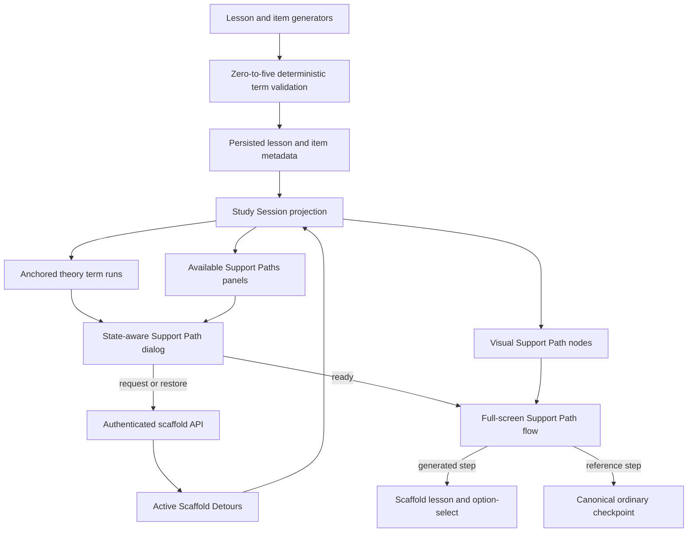

# Learner Support Path UX - Plan

## Goal Capsule

- **Objective:** Make unfamiliar terms discoverable in context and make each generated Scaffold Detour read as one compact, playable Support Path without duplicating content or obscuring the main expedition trail.
- **Authority:** Follow `AGENTS.md`, use the language in `CONTEXT.md`, preserve the learner-neutral boundary in ADR-0002 and ADR-0037, and keep the Learner App within ADR-0032 and ADR-0035.
- **Execution profile:** Standard cross-layer code change spanning generation metadata, the Study Session projection, React Native/NativeWind learner UI, shared overlays, and durable documentation. No persisted data shape changes are required.
- **Stop conditions:** Stop downstream UI work if real production generation no longer produces useful domain-neutral Explorable Terms, if active-detour correlation can duplicate or hide the wrong term, or if a Support Path can affect neutral mastery, gating, crystals, points, or the Study Item Bank.
- **Quality bar:** Deterministic tests prove contracts; real production LLM output and phone-sized browser flows prove usefulness. A green suite alone is not completion.

---

## Product Contract

### Summary

Keep generated in-app support as the canonical help experience, increase Explorable Term capacity from three to five, and replace the current overflow-and-text-list presentation with contextual highlights, compact Support Paths panels, one state-aware dialog, one visual side-path node, and a sequenced full-screen Support Path flow.

### Problem Frame

The current implementation separates unfamiliar terms from the prose that gives them meaning, repeats `Explore “…”` across full-width action rows, and renders each Support Step as a text row on the expedition map. The result reads as utility navigation rather than a playful side path.

The ready-state progress dialog also demonstrates the established **modal overflow and reflow-clipping** problem class: its bounded web content wrapper hides content, and the phone-sized real-use screenshot in `tmp/2026-07-12-scaffold-detours/shots/06-progress.png` crops the `Keep exploring` action. The conventional fix is a bounded dialog column with a shrinkable, scrollable body and an independently reachable action region.

Inline term discovery has the established **contextual-help versus discoverability** tradeoff. Inline text preserves reading context but creates smaller targets; a persistent post-content panel supplies the larger, scannable alternative. Both surfaces must use a non-color cue and an accessible name.

### Actor

- A1. A learner reading theory, answering a graded activity, or revisiting an expedition trail who may need optional prerequisite support without changing neutral progress.

### Requirements

**Term generation and availability**

- R1. Generated in-app support remains canonical; Wikipedia search, links, imported text, and other web-grounded support are outside this plan.
- R2. A Concept Lesson or Study Item question may advertise zero to five validated Explorable Terms, while one Scaffold Detour still contains one to three ordered Support Steps and generators continue to prefer fewer useful terms over padding.
- R3. An active detour in `generating`, `ready`, or `failed` state suppresses its normalized term from every Support Paths panel under the same parent node; a hidden detour makes the term available again so the existing create-or-restore request restores it.
- R4. Request handling remains server-authoritative and idempotent, so stale clients or concurrent presses cannot create a second detour for the learner, enrichment, parent node, and normalized term.

**Theory and activity discovery**

- R5. Theory prose highlights only the first non-overlapping occurrence of each term in its assigned section, preferring the longer term when ranges overlap; list items and generated Support Step prose do not gain nested term discovery in this plan.
- R6. An interactive theory term uses a dotted underline or equivalent non-color cue, exposes button semantics and the exact term in its accessible name, and opens the state-aware term dialog.
- R7. A persistent compact Support Paths panel follows the theory content. In graded activities it sits immediately below the question stem and before answer controls so support is reachable before the learner commits an answer; it lists only terms currently available for creation and disappears when none remain.
- R8. Each panel row presents the term as content and uses one 44px icon-only `GitBranchPlus` action with an accessible label that names the term; repeated `Explore “…”` button copy and the header-level disclosure are removed.

**Dialog and request flow**

- R9. Every highlighted-term tap opens one compact state-aware dialog: available offers `Add support path`, generating shows broad progress, failed offers recovery, and ready offers `Open support path`; generated lesson content never renders in this dialog.
- R10. After generation reaches ready, the dialog provides primary `Open support path` and secondary `Keep exploring` actions and never opens a lesson automatically.
- R11. Adaptive dialogs keep the header visible, allow body content to scroll at constrained heights, and keep all actions reachable on web and native-sized viewports.

**Trail and Support Path flow**

- R12. Each active Scaffold Detour appears as one always-visible compact visual side-branch node connected to its parent Concept Marker, using the term as its title plus state and progress glyphs; it has no chevron, expansion state, or per-step text rows on the map.
- R13. Tapping an incomplete ready Support Path resumes its first incomplete Support Step; tapping a completed path opens a visual step overview for selective review, and the in-flow progress header can always reach that overview.
- R14. Support Steps remain separate, ordered domain records inside one full-screen Support Path flow so each can retain its lesson, current option-select, completion, and a future extension point for additional study items without implementing those future items now.
- R15. A reference Support Step routes to the referenced concept's first incomplete ordinary checkpoint and continues to derive completion from normal neutral lesson and study-item evidence; it is never duplicated inside the Support Path flow.
- R16. Generating, failed, ready, partial, completed, hide, restore, retry, and reduced-motion states remain available without changing the four durable detour lifecycle states.

**Neutrality and portability**

- R17. Scaffold responses, reference evidence, neutral mastery, prerequisite gating, crystals, leaderboard points, duel inputs, graph assets, and the Study Item Bank retain the ADR-0037 boundary unchanged.
- R18. Learner UI remains application-owned React Native primitives styled with NativeWind; no shadcn, DOM-only component, or non-transferable mock UI enters the Learner App.

### Key Flows

- F1. Create support from theory
  - **Actor:** A1
  - **Trigger:** The learner taps a dotted-underlined Explorable Term or its panel action.
  - **Steps:** The state-aware dialog opens; the learner chooses `Add support path`; the server verifies the advertised term and returns the one durable detour; the dialog transitions to broad generation progress while the activity yields back to the trail.
  - **Outcome:** The learner can continue exploring or open the path when ready.
  - **Covered by:** R3-R11
- F2. Resume a generated Support Path
  - **Actor:** A1
  - **Trigger:** The learner taps an incomplete visual Support Path node or chooses `Open support path` from the ready dialog.
  - **Steps:** The full-screen path opens at the first incomplete step; lesson and option-select progress use existing scaffold-scoped writes; the progress header exposes the overview.
  - **Outcome:** Ordered support is playable without placing step text on the main map.
  - **Covered by:** R12-R14, R16-R17
- F3. Follow a reference step
  - **Actor:** A1
  - **Trigger:** The first incomplete Support Step references an existing neutral node.
  - **Steps:** The path identifies the map reference, closes, focuses the existing Concept Marker, and opens its first incomplete ordinary checkpoint.
  - **Outcome:** The learner studies one canonical neutral concept surface and its normal evidence completes the reference step.
  - **Covered by:** R14-R15, R17
- F4. Hide and restore support
  - **Actor:** A1
  - **Trigger:** The learner hides a ready path or dismisses a failed path from its overview/recovery surface.
  - **Steps:** The preserved detour becomes hidden; its term reappears in the relevant Support Paths panels; selecting it calls the existing idempotent request and restores the same detour.
  - **Outcome:** Hide remains reversible without duplicate generation.
  - **Covered by:** R3-R4, R16

### Acceptance Examples

- AE1. Given a lesson advertises six valid distinct terms, generation schemas and deterministic validation retain the first five, the UI can render all five without overflow actions, and no prompt asks the model to fill the limit.
- AE2. Given two overlapping anchored terms and repeated later occurrences, theory highlights the first accepted non-overlapping ranges only, the longer overlap wins, and plain surrounding text remains byte-for-byte readable.
- AE3. Given the learner already has an active detour for a normalized term under the parent node, that term is absent from both theory and graded Support Paths panels, while its inline theory occurrence remains tappable and opens the existing detour state.
- AE4. Given that detour is hidden, the term returns to the panel and selecting it restores the same detour id and published steps rather than starting generation again.
- AE5. Given the Support Path dialog reaches ready at a 320x568 or 390x844 viewport, including at 200% browser text zoom or equivalent large text scaling, `Open support path` and `Keep exploring` are both visible or scroll-reachable, keyboard-focusable on web, and never clipped.
- AE6. Given a ready three-step detour with one completed step, the map renders one connected `1/3` visual node with no step text rows; tapping it opens step two, while the overview still permits reviewing step one.
- AE7. Given the first incomplete step is a reference, opening the path routes to the referenced concept's first incomplete ordinary checkpoint and does not render copied neutral lesson theory in the Support Path sheet.
- AE8. Given zero available terms after active-detour filtering, the Support Paths panel renders nothing; theory's active inline terms still open their state-aware dialog.
- AE9. Given reduced motion, every dialog, path node, and full-screen flow renders its final state without relying on entrance or ready-transition animation to communicate status.

### Success Criteria

- No support-related control is clipped in phone-sized browser screenshots or unreachable by keyboard.
- The expedition map shows exactly one compact node per active detour and no Support Step text list.
- Available panels never offer an active detour's normalized term, while hidden detours remain restorable.
- Real mixed-domain generation yields useful zero-to-five terms without padding or domain-specific prompt tuning.
- Support work continues to produce no neutral progression or reward side effects.

### Scope Boundaries

**Included**

- Explorable Term cap, tool schemas, domain-neutral prompt text, deterministic validators, projection shapes, learner UI, overlay anatomy, support navigation, tests, real-use evaluation, and canonical docs.
- Greenfield deletion of superseded learner components and projection grouping fields in the same change that replaces them.

**Deferred to follow-up work**

- Additional generated study-item types or more than one option-select per generated Support Step.
- Evidence-driven decisions about grouping very large numbers of learner-created Support Paths under one parent; this plan keeps each created path visible and measures real use before adding a second disclosure layer.
- Physical Android and iOS runtime polish beyond the existing user-owned Android blocker in `docs/plans/BLOCKERS.md`.

**Outside this product change**

- Wikipedia or other external reference links, MediaWiki resolution, web-grounded support generation, citations for generated scaffold content, new neutral nodes, new rewards, new database tables, compatibility reads, and Admin Lab redesign.

### Sources and Research

- Project contracts: `CONTEXT.md`, `docs/adr/0032-keep-learner-app-in-flow-through-mastery-aligned-game-ux.md`, `docs/adr/0035-separate-learner-app-static-spa-typed-api.md`, and `docs/adr/0037-persist-learner-scoped-scaffold-detours.md`.
- Current implementation anchors: `packages/application/src/explorableTerms.ts`, `packages/application/src/studySessionProjection.ts`, `packages/application/src/studySessionTrail.ts`, `apps/learner-app/src/components/TermExplorationMenu.tsx`, `apps/learner-app/src/components/ScaffoldDetour.tsx`, and `apps/learner-app/src/ui/overlays.tsx`.
- Prior real-use evidence: `docs/plans/TODO.md` and the gitignored inspection report at `tmp/2026-07-12-scaffold-detours/EVALUATION.md`.
- Inline interaction and accessibility: [React Native Text](https://reactnative.dev/docs/text), [React Native Accessibility](https://reactnative.dev/docs/accessibility), [WCAG 2.2 Target Size (Minimum)](https://www.w3.org/WAI/WCAG22/Understanding/target-size-minimum), and [WCAG failure F73 for color-only links](https://www.w3.org/WAI/WCAG20/Techniques/failures/F73).
- Rejected external-link direction: [Expo Linking](https://docs.expo.dev/linking/into-other-apps/) and [MediaWiki Search API](https://www.mediawiki.org/wiki/API%3ASearch) show that Wikipedia would add external navigation and content resolution rather than replace the mastery-aligned support contract.

---

## Planning Contract

### Key Technical Decisions

- KTD1. **Attach learner support state in the Study Session projection.** Build a lightweight lookup directly from raw active detour aggregates by parent node plus `normalizeConceptLabel(term)`, use it while projecting lesson and item terms, and compose full detour views later when neutral completion evidence is available. Learner components consume the finished available/generating/failed/ready state instead of rebuilding detour policy.
- KTD2. **Preserve lesson anchoring through the projection.** Replace flattened theory term strings with typed term views that retain `sectionKind`; Study Item terms use the same support-state union without a section anchor.
- KTD3. **Resolve highlights with a pure range builder.** Build exact text runs by considering only terms assigned to the section, reserving longer ranges before shorter overlapping ranges, retaining one accepted occurrence per term, then rendering runs in source order. Do not use semantic, case-insensitive, or fuzzy matching at render time.
- KTD4. **Use a complementary discovery pair.** Inline theory terms provide context; the post-content Support Paths panel provides a full, large-target inventory. Both open one state-aware dialog and share one request callback.
- KTD5. **Make the dialog a single state machine with a staged overlay handoff.** One reusable dialog renders available, requesting, generating, failed, and ready states and never becomes another lesson surface. It may open above the current Activity Sheet so cancel restores reading focus; accepting a request or opening a path closes that nested instance and its activity before the root opens progress or Support Path state, avoiding competing overlay ownership.
- KTD6. **Aggregate on the map, separate in the learning flow.** One Scaffold Detour becomes one visual Support Path node. Its immutable ordered Support Steps remain distinct inside the full-screen flow, which preserves current evidence semantics and leaves a natural future home for additional step-scoped activities.
- KTD7. **Delete mastered-parent presentation grouping.** The always-visible compact node makes `ScaffoldDetourGroup`, `masteredParentNodeIds` input, expand/collapse state, and `support_available`/`support_explored` grouping copy obsolete. Project status, completed count, total count, and first incomplete step directly.
- KTD8. **Route reference steps back to canonical neutral activities.** Add an application-owned resolver for the first incomplete ordinary stop of a referenced node; do not embed or copy neutral activity content into the support flow.
- KTD9. **Give adaptive dialogs fixed structure rather than fixed content height.** Keep the header fixed, make the middle region `min-h-0` and scrollable, and keep actions within the bounded column. Refactor every centered-dialog consumer to the shared anatomy so the crop cannot recur in another dialog.
- KTD10. **Keep persistence unchanged.** The existing active-detour read and unique idempotency key already supply the required state. Hidden detours intentionally do not join the active projection and reappear as available; the request store restores them. No migration or compatibility branch is justified.
- KTD11. **Keep prompts domain-neutral and measure neural quality neurally.** Raise the capacity in forced-tool schemas and prompt instructions, retain `prefer fewer` and exact-substring validation, then inspect real production output across mixed curated domains under ADR-0013 and ADR-0028.
- KTD12. **Stay within the Expo learner component system.** Use `AppText`, `PressableSurface`, `IconButton`, `Dialog`, `FullScreenDialog`, NativeWind tokens, Lucide React Native icons, and the shared motion policy. The Admin Lab's shadcn system is not used on this surface.

### High-Level Technical Design



### Projection Shape

The exact exported names may follow local conventions, but the application boundary should provide this information rather than raw strings plus UI inference:

```ts
type ExplorableTermView = {
  term: string;
  sectionKind: ConceptLessonSectionKind | null;
  support:
    | { kind: "available" }
    | { kind: "generating"; detourId: string; phase: ScaffoldGeneratingPhase }
    | { kind: "failed"; detourId: string }
    | { kind: "ready"; detourId: string; complete: boolean };
};

type ScaffoldDetourView = {
  detourId: string;
  parentDerivedNodeId: string;
  term: string;
  status: ScaffoldDetourStatus;
  steps: ScaffoldStepView[];
  completedStepCount: number;
  totalStepCount: number;
  firstIncompleteStepId: string | null;
  complete: boolean;
  phase: ScaffoldGeneratingPhase | null;
};
```

This is directional type guidance, not a requirement to introduce a second representation. If an existing view can carry the same finished information more simply, extend it and keep one source of truth.

### State and Navigation Rules

| State | Panel | Inline theory term | Map node | Dialog/path action |
|---|---|---|---|---|
| No active detour | Listed | Highlighted | None | `Add support path` |
| Generating | Suppressed | Highlighted | Preparing node | Broad progress; close allowed |
| Failed | Suppressed | Highlighted | Failed node | Retry or dismiss |
| Ready, incomplete | Suppressed | Highlighted | Progress node | Resume first incomplete step |
| Ready, complete | Suppressed | Highlighted | Complete node | Open step overview |
| Hidden | Listed | Highlighted | None | Request restores preserved detour |

### Sequencing

1. Raise and verify the neural/deterministic term contract before building five-term surfaces.
2. Finish the application projection and navigation resolvers before rendering UI state.
3. Correct the shared dialog anatomy before adding the new state-aware dialog.
4. Replace discovery, trail, and step-sheet surfaces against the finished projection.
5. Run focused deterministic checks, then the required production generation gate and real browser flow before consolidating docs and deleting the active plan.

### System-Wide Impact

- Changing prompt files and forced-tool descriptions changes mechanically derived generation config hashes; fresh development generation must produce the new assets. Do not add dual-read or legacy config handling.
- Existing JSON columns already accept longer term arrays, so the initial migration remains unchanged. A development hard reset is used for real-use validation to remove stale three-term assets and learner state.
- Study Session composition gains an early raw-detour state-index pass for term correlation, then retains the existing later full detour composition after classification and neutral completion evidence exist. Keep both passes inside `@lrnki/application`; do not prematurely call `composeScaffoldDetours`, mutate views, or normalize terms in the Learner App.
- The request response already returns the durable detour's current status even for restore or an existing active row. Dialog orchestration must branch on that returned status rather than treating every `created: true` result as a new generating job.
- Polling remains tied to `StudySession.generatingDetours`; no new timer, queue, supervisor, or endpoint is required.
- The request endpoint remains authenticated and re-verifies expedition, source, parent membership, and advertised exact term. New presentation state does not broaden the trust boundary.

### Risks and Mitigations

- **Inline accessibility varies across React Native targets.** Keep the post-content panel as a large-target equivalent, use a visible non-color underline, expose button semantics, verify keyboard focus on web, and include a physical-device follow-up under the existing blocker.
- **Overlapping or repeated terms can corrupt text segmentation.** Isolate a pure deterministic run builder with Unicode and overlap tests; render the original text by slices so no characters are normalized or lost.
- **Five terms can become visual noise.** Keep generation's `prefer fewer` instruction, render no panel for zero available terms, wrap long labels without shrinking the action target, and inspect five-term panels plus accumulated paths rather than tuning prompts to fixtures.
- **A new path shell could duplicate neutral or scaffold activity policy.** Reuse `LessonSections`, keyed selection bodies, grading actions, and application resolvers; reference steps leave the shell for the canonical ordinary activity.
- **Dialog fixes can regress leaderboard or celebration overlays.** Move every centered-dialog consumer to the same body/footer anatomy and verify all of them at constrained height.
- **Overlay handoff can strand focus or open competing surfaces.** Permit the compact term dialog above the current Activity Sheet only for contextual inspection and cancellation. On request, progress, or path navigation, close the nested dialog and activity first, then open root-owned state on the following render; test cancellation focus restoration and every handoff.

### Assumptions

- `sectionKind` plus exact stored term text remains the authoritative theory anchor; no new offsets are persisted.
- The existing `(learner, enrichment, parent, normalized term)` uniqueness and hide/restore semantics remain correct.
- Question-level Support Paths panels render immediately below the question stem and before answer controls so support is discoverable before answering; no inline highlighting is added to question stems.
- Hiding and retrying live in the Support Path overview or failed-state dialog rather than as extra controls on the compact map node.
- The current user-owned physical Android validation remains deferred and does not block web completion, as defined in `docs/plans/BLOCKERS.md`.

---

## Implementation Units

### U1. Raise the Explorable Term contract to five

- **Goal:** Make zero-to-five domain-neutral Explorable Terms a single enforced generation and validation contract while keeping Scaffold Detours at one to three steps.
- **Requirements:** R1-R2, R18; AE1
- **Dependencies:** None
- **Files:**
  - `CONTEXT.md`
  - `packages/domain-core/src/index.ts`
  - `packages/application/src/explorableTerms.ts`
  - `packages/application/src/explorableTerms.test.ts`
  - `packages/infrastructure-litellm/src/toolSchemas.ts`
  - `packages/infrastructure-litellm/src/toolSchemas.test.ts`
  - `packages/infrastructure-litellm/prompts/concept-lesson-generation.prompt`
  - `packages/infrastructure-litellm/prompts/study-option-select-generation.prompt`
  - `packages/infrastructure-litellm/prompts/study-matching-generation.prompt`
  - `packages/infrastructure-litellm/prompts/study-impostor-generation.prompt`
- **Approach:** Change the shared deterministic cap and both lesson/item forced-tool arrays to five. Update domain-neutral descriptions and prompt calls from zero-to-three to zero-to-five while retaining exact-substring, parent-label exclusion, distinctness, and `prefer fewer; never pad`. Do not change the `.max(3)` scaffold-outline schema or `outline.steps.slice(0, 3)`.
- **Patterns to follow:** `validateItemExplorableTerms`, `validateLessonExplorableTerms`, forced named tool schemas under ADR-0006, and dotprompt-owned descriptions under ADR-0034.
- **Test scenarios:**
  - Covers AE1. Six valid ordered candidates retain exactly the first five for both a question and a lesson.
  - Five candidates are accepted by each forced-tool term schema; six are rejected.
  - Empty, invalid, duplicate, parent-label, wrong-section, and non-substring candidates retain current behavior.
  - Scaffold outline generation still rejects more than three Support Steps.
- **Verification:** `pnpm --filter @lrnki/application test` and `pnpm --filter @lrnki/infrastructure-litellm test`.
- **Real-use gate:** Apply `.agents/skills/real-use-quality-evaluation/SKILL.md` after this behavior-changing milestone. Generate fresh lessons/items through the production LiteLLM alias over a narrow mixed-domain subset of curated fixtures, inspect every emitted term for learner usefulness, exact anchoring, non-padding, and domain neutrality, record evidence under `tmp/2026-07-13-learner-support-path-ux/`, and stop with `FIX_FIRST` if the expanded capacity produces noisy lists.

### U2. Project anchored term state and path destinations

- **Goal:** Make the Study Session the single authority for term availability, detour state, progress, resume target, and reference-step destination.
- **Requirements:** R3-R4, R13, R15-R17; AE3-AE4, AE6-AE8
- **Dependencies:** U1
- **Files:**
  - `packages/application/src/studySessionProjection.ts`
  - `packages/application/src/studySessionProjection.test.ts`
  - `packages/application/src/studySessionTrail.ts`
  - `packages/application/src/studySessionTrail.test.ts`
  - `packages/application/src/projection.ts`
  - `packages/application/src/requestLearnerScaffold.ts`
  - `packages/application/src/requestLearnerScaffold.test.ts`
- **Approach:** Build a small normalized state index from raw active detours before lesson and item view conversion, retain lesson `sectionKind`, and attach finished support state to every projected term. Compose full detour progress later from response and neutral-completion evidence, replacing presentation grouping with completed/total counts and the first incomplete step. Export a resolver that chooses a referenced node's first incomplete ordinary stop, falling back to its review entry only when already complete. Keep the request use-case's server verification and idempotent upsert unchanged, adding regression coverage rather than a redundant duplicate-rejection path.
- **Patterns to follow:** Pure `composeStudySession` and `composeScaffoldDetours` policy, `buildTrailView`, `resolveStopActivity`, and `normalizeConceptLabel`.
- **Test scenarios:**
  - Covers AE3. An active same-parent normalized match is attached to both repeated lesson/question term views and is unavailable to panels; a different parent or normalized term remains available.
  - Covers AE4. Hidden detours are absent from the active read, project as available, and the request restores the existing id.
  - Generating, failed, partial-ready, complete-ready, and no-detour states project deterministically independent of input order.
  - The first incomplete step respects ordinal order; complete paths return no resume step.
  - Covers AE7. A reference destination chooses the first incomplete ordinary stop and never synthesizes a scaffold activity for the neutral node.
  - Repeated concurrent requests still return one detour identity and do not wake a new generation lifecycle in persistence.
- **Verification:** `pnpm --filter @lrnki/application test`.

### U3. Replace overflow discovery with accessible contextual support

- **Goal:** Deliver inline theory discovery, compact post-content panels, and one state-aware dialog without duplicating generated theory.
- **Requirements:** R5-R11, R18; F1; AE2-AE5, AE8-AE9
- **Dependencies:** U2
- **Files:**
  - `apps/learner-app/src/components/ExplorableTheoryText.tsx` (create)
  - `apps/learner-app/src/components/ExplorableTheoryText.test.tsx` (create)
  - `apps/learner-app/src/components/SupportPathsPanel.tsx` (create)
  - `apps/learner-app/src/components/SupportPathsPanel.test.tsx` (create)
  - `apps/learner-app/src/components/SupportPathDialog.tsx` (create)
  - `apps/learner-app/src/components/SupportPathDialog.test.tsx` (create)
  - `apps/learner-app/src/components/LessonSections.tsx`
  - `apps/learner-app/src/components/ActivitySheet.tsx`
  - `apps/learner-app/src/components/ActivitySheet.test.tsx`
  - `apps/learner-app/src/components/ActivityCards.tsx`
  - `apps/learner-app/src/components/ActivityCards.test.tsx`
  - `apps/learner-app/src/components/MatchingBoard.tsx`
  - `apps/learner-app/src/components/MatchingBoard.test.tsx`
  - `apps/learner-app/src/components/CheckpointPath.tsx`
  - `apps/learner-app/src/learn/vocabulary.ts`
  - `apps/learner-app/src/ui/index.ts`
  - `apps/learner-app/src/ui/overlays.tsx`
  - `apps/learner-app/src/ui/overlays.test.tsx`
  - `apps/learner-app/src/components/LeaderboardDialog.tsx`
  - `apps/learner-app/src/components/LeaderboardDialog.test.tsx`
  - `apps/learner-app/src/components/DuelUnlockDialog.tsx`
  - `apps/learner-app/src/components/TermExplorationMenu.tsx` (delete)
  - `apps/learner-app/src/components/TermExplorationMenu.test.tsx` (delete)
- **Approach:** Introduce a pure text-run builder and render accepted runs as nested `AppText` with dotted underline, button semantics, and focus-visible treatment. Render the compact panel after theory content; pass the same panel as a prompt-adjacent slot below graded question stems and before their answer controls. Include only `support.kind === "available"` terms and use an accessible `GitBranchPlus` `IconButton`. Replace the header disclosure. Generalize centered-dialog anatomy into fixed header, shrinkable scroll body, and reachable actions, then use it for the state-aware term/request/progress dialog and existing consumers. A compact dialog may sit above the Activity Sheet so cancel returns to the invoking term; accepting the request stages a handoff through `CheckpointPath`, closes both activity-level overlays, then opens root-owned progress or path state from the returned detour status.
- **Patterns to follow:** `AppText` nesting, `PressableSurface`, required-label `IconButton`, `OverlayHeader`, shared reduced-motion policy, and root-owned overlay state in `CheckpointPath`.
- **Test scenarios:**
  - Covers AE2. First exact occurrence only, longer overlap wins, later repeats remain plain, and concatenated output exactly equals the source text.
  - Unicode terms and punctuation boundaries render without character loss; no fuzzy or case-insensitive match is introduced.
  - A highlighted term announces its term-specific button label and opens the dialog from keyboard/touch input.
  - A five-row panel renders five term labels, including a long wrapping label, and five icon-only 44px actions; theory places it after content, graded cards place it between the stem and answers, and busy state prevents double submission.
  - Covers AE3/AE8. Active terms remain highlighted but are omitted from panels; an empty available list renders no panel.
  - Covers AE5. Available, requesting, generating, failed, and ready dialog states expose only valid actions at constrained height and large text scaling; ready provides both required actions and no generated lesson text.
  - A request returning an already-ready restored detour opens ready actions immediately; it never flashes or waits in generating state.
  - Shared dialog dismissal blocking, focus restoration, and existing leaderboard/duel content remain intact.
- **Verification:** `pnpm --filter @lrnki/learner-app test` and `pnpm --filter @lrnki/learner-app export:web`.

### U4. Replace text detours with visual Support Path nodes

- **Goal:** Render every active detour as one compact always-visible visual side branch without map-level Support Step rows or disclosure state.
- **Requirements:** R12, R16, R18; AE6, AE9
- **Dependencies:** U2
- **Files:**
  - `apps/learner-app/src/components/SupportPathNode.tsx` (create)
  - `apps/learner-app/src/components/SupportPathNode.test.tsx` (create)
  - `apps/learner-app/src/components/CheckpointPath.tsx`
  - `apps/learner-app/src/components/ScaffoldDetour.tsx` (delete)
  - `apps/learner-app/src/components/ScaffoldDetour.test.tsx` (delete)
  - `apps/learner-app/src/learn/vocabulary.ts`
- **Approach:** Attach a compact branch node beneath its parent Concept Marker using a subtle connector, a branch/route glyph, the term title, and non-text-only state/progress cues such as step dots plus `completed/total` accessibility copy. Generating and failed detours use the same node footprint. Remove expand/collapse state, per-step rows, group copy, and `Explore` prefixes. Tapping delegates to root state: progress/recovery dialog for non-ready nodes and Support Path flow for ready nodes.
- **Patterns to follow:** `CheckpointCircle`, `ConceptMarker`, `PressableSurface`, `CheckpointPath` trail offsets, and reduced-motion-safe state transitions.
- **Test scenarios:**
  - Covers AE6. A partial three-step detour renders one node with `1/3` state and no Support Step labels or disclosure chevron.
  - Five detours under one parent render as separate compact connected nodes without covering the main trail checkpoint, with long labels wrapping or truncating according to one documented node rule.
  - Generating, failed, ready, and completed states are distinguishable by icon/shape plus accessible text rather than color alone.
  - Pressing a generating/failed node opens progress/recovery; pressing a ready node requests path navigation.
  - Covers AE9. Reduced motion renders settled nodes and no semantic state depends on animation.
- **Verification:** `pnpm --filter @lrnki/learner-app test`.

### U5. Replace the single-step sheet with a Support Path flow

- **Goal:** Make one full-screen flow own ordered Support Step overview, resume, generated study, reference routing, hide, and review.
- **Requirements:** R10, R13-R18; F2-F4; AE4, AE6-AE7, AE9
- **Dependencies:** U2, U3, U4
- **Files:**
  - `apps/learner-app/src/components/SupportPathSheet.tsx` (create)
  - `apps/learner-app/src/components/SupportPathSheet.test.tsx` (create)
  - `apps/learner-app/src/components/CheckpointPath.tsx`
  - `apps/learner-app/src/components/ScaffoldStepSheet.tsx` (delete)
  - `apps/learner-app/src/components/ScaffoldStepSheet.test.tsx` (delete)
  - `apps/learner-app/src/components/ScaffoldProgressDialog.tsx` (delete after `SupportPathDialog` owns its states)
  - `apps/learner-app/src/components/ScaffoldProgressDialog.test.tsx` (delete)
  - `apps/learner-app/src/components/ActivitySheet.tsx`
  - `apps/learner-app/src/learn/vocabulary.ts`
- **Approach:** Open incomplete paths at their projected first incomplete step and completed paths at an overview. The fixed header shows term and visual step progress and can open the overview. Generated steps reuse `LessonSections`, `OptionSelectBody`, scaffold grading, lesson-read actions, and generated provenance. Reference steps show a concise map-reference transition, close the path, scroll/focus the referenced Concept Marker, and open the application-resolved ordinary stop. Place hide in the overview and retry/dismiss in the failed dialog. Preserve the existing one-at-a-time lesson-to-question behavior without designing future study-item schemas.
- **Patterns to follow:** `ActivitySheet` full-screen composition, `ScaffoldStepSheet` grading behavior before deletion, `buildTrailView` navigation, and `scrollToNode` ownership in `CheckpointPath`.
- **Test scenarios:**
  - Covers AE6. An incomplete path opens its first incomplete ordinal, completing it advances to the next incomplete step, and the progress header reaches the overview.
  - A completed path opens overview and can revisit a generated step without clearing completion.
  - Covers AE7. A reference step resolves and opens the referenced node's first incomplete ordinary stop; no copied lesson or scaffold response is produced.
  - `Open support path` from the ready dialog enters the same resume flow; `Keep exploring` closes to the trail with the node visible.
  - Hide removes the active node and returns its term to panels after refresh; reselection restores the same path.
  - Generated grading remains key-free on the client and scaffold-scoped in persistence.
  - Overlay transitions never leave the compact dialog and full-screen sheet open together.
- **Verification:** `pnpm --filter @lrnki/learner-app test`, `pnpm --filter @lrnki/application test`, and `pnpm --filter @lrnki/learner-api test`.

### U6. Prove the real learner flow and consolidate durable documentation

- **Goal:** Validate the finished experience with fresh production content and constrained browser flows, then leave one canonical implementation and documentation path.
- **Requirements:** R1-R18; F1-F4; AE1-AE9
- **Dependencies:** U1-U5
- **Files:**
  - `docs/adr/0037-persist-learner-scoped-scaffold-detours.md`
  - `docs/plans/README.md`
  - `docs/plans/TODO.md`
  - `docs/plans/2026-07-13-002-feat-learner-support-path-ux-plan.md` (delete after completion and consolidation)
  - `tmp/2026-07-13-learner-support-path-ux/` (gitignored evidence)
- **Approach:** Apply the real-use quality skill to the finished projection/UI milestone. Hard-reset development data, generate fresh assets through production aliases from a small mixed-domain curated fixture manifest, create representative generated and reference detours, and drive the complete flow in Playwright at phone and constrained-height viewports. Inspect screenshots, accessibility names, persisted response scope, active-term suppression, hide/restore identity, and neutral progress before declaring PASS. Amend ADR-0037's obsolete claim that inline highlighting is intentionally avoided, update the Explorable Term definition in `CONTEXT.md` through U1, summarize outcome/evidence in `TODO.md`, remove the active-plan link, and delete the completed plan per repository policy.
- **Execution note:** Load `.env` before every DB-touching command. Do not report `DATABASE_URL` as unavailable. Gate-created learners must be deleted with FK children first, and a `FIX_FIRST` result stops documentation completion.
- **Test scenarios:**
  - Covers AE1-AE2. Inspect real mixed-domain lesson/question outputs and rendered first-occurrence highlights, including at least one lesson with multiple terms; do not tune prompts to expected fixture concepts.
  - Covers AE3-AE4. Create a detour, observe same-parent suppression, hide it, observe term return, restore it, and verify the detour id and steps are unchanged.
  - Covers AE5. At 320x568 and 390x844, at normal and 200% browser text zoom or equivalent large text scaling, capture available, generating, ready, failed/retry where practical, leaderboard, and duel dialogs with all actions reachable and zero console errors.
  - Covers AE6-AE7. Capture one partial generated path node and one reference path; verify incomplete resume, completed overview, and canonical neutral routing. Also create every real advertised term available under one representative parent, inspect the accumulated always-visible nodes at 320x568, and stop with `FIX_FIRST` if they obscure the main trail or make it impractical to navigate.
  - Covers AE8-AE9. Verify empty panels and reduced-motion final states.
  - Query persisted responses and expedition projection before/after generated support to prove no neutral mastery, reward, graph, or Study Item Bank mutation.
- **Verification:** Full commands and evidence requirements are defined in the Verification Contract.

---

## Verification Contract

| Gate | Command or method | Applies to | Done signal |
|---|---|---|---|
| Application contracts | `pnpm --filter @lrnki/application test` | U1, U2, U5 | Term cap, support-state correlation, resume, reference destination, and neutrality regressions pass. |
| LLM schemas and prompts | `pnpm --filter @lrnki/infrastructure-litellm test` | U1 | Five-term schemas pass, six fail, and forced-tool descriptor tests remain green. |
| Learner component behavior | `pnpm --filter @lrnki/learner-app test` | U3-U5 | Highlights, panels, dialogs, path nodes, path flow, accessibility labels, and overlay transitions pass. |
| API request boundary | `pnpm --filter @lrnki/learner-api test` | U2, U5 | Auth and validation contracts remain hermetic; no new endpoint or trust expansion appears. |
| Type boundary | `pnpm run typecheck` | U1-U6 | All changed projection and component consumers compile without compatibility aliases. |
| Static learner export | `pnpm --filter @lrnki/learner-app export:web` | U3-U6 | Expo web export completes without DOM-only or import-cycle failures. |
| Full deterministic envelope | `pnpm run check` | U6 | Typecheck, all tests, lint, and both builds pass with no new warnings. |
| Production term quality | Apply `.agents/skills/real-use-quality-evaluation/SKILL.md` with production LiteLLM aliases after loading `.env` | U1 | Recorded `PASS`; terms are useful, exact, domain-neutral, zero-to-five, and unpadded across mixed curated domains. |
| Browser learner flow | Start learner API and Expo web, then run a gitignored Playwright flow at 320x568 and 390x844 at normal and 200% text zoom | U6 | AE3-AE9 pass, five-term/long-label panels and accumulated always-visible paths remain usable, screenshots and console logs are recorded, and no control is clipped or unreachable. |
| Persistence neutrality | Inspect `learner_scaffold_detours`, `learner_scaffold_steps`, `response_log`, Study Session output, graph rows, and Study Item Bank rows before/after the flow | U6 | Generated support affects only learner-scoped scaffold state/responses; reference work uses normal neutral evidence; no forbidden writes occur. |
| Cleanup | Delete gate learners and generated scratch state; keep only the gitignored evaluation report/screenshots needed for evidence | U6 | Shared development DB and weekly board contain no gate junk. |

For the production gate, load the environment and reset rather than claiming missing configuration or preserving stale three-term assets:

```bash
set -a
. ./.env
set +a
scripts/reset-db.sh
```

Create a narrow manifest under `tmp/2026-07-13-learner-support-path-ux/` from existing curated Rust, OpenStax biology, and economics fixtures, then run the existing generation entry points with the production alias mapping in `litellm/config.yaml`. Record the required real-use evaluation note with representative useful terms, defects, changes after inspection, and remaining caveats.

---

## Definition of Done

- R1-R18 and AE1-AE9 are satisfied with no launch-blocking open question.
- U1-U6 verification commands pass and the production generation plus browser quality gates are recorded as `PASS`, not inferred from tests.
- Theory has contextual first-occurrence highlights and a post-content Support Paths panel; graded activities have the compact panel without inline prompt highlighting.
- Active same-parent detours suppress panel actions, hidden detours restore through the existing identity, and stale requests remain idempotent.
- Every active detour is one always-visible visual Support Path node; no map-level Support Step text rows or expand/collapse state remain.
- Incomplete paths resume correctly, completed paths open overview, generated steps retain scaffold-scoped evidence, and reference steps route to canonical neutral checkpoints.
- Centered dialogs keep every action reachable at constrained heights, and ready support offers both `Open support path` and `Keep exploring` without automatic interruption.
- The Explorable Term capacity is five everywhere it is authoritative, while Support Step capacity remains three and prompts remain domain-neutral.
- `TermExplorationMenu`, `ScaffoldDetour`, `ScaffoldProgressDialog`, `ScaffoldStepSheet`, mastered-parent detour grouping fields, superseded tests, exports, copy, and unused imports are deleted; no abandoned alternative code remains.
- The initial migration is unchanged because persisted shapes did not change; development validation uses a hard reset with no compatibility path.
- ADR-0037 and `CONTEXT.md` express the shipped policy once, `TODO.md` records the outcome and real-use evidence, `docs/plans/README.md` no longer links the completed work, and this plan is deleted after consolidation.
- The existing physical Android/iOS caveat remains accurately tracked only in `docs/plans/BLOCKERS.md`.
