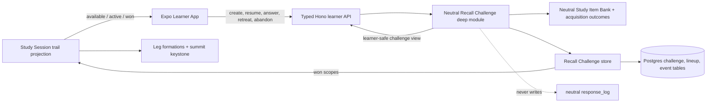
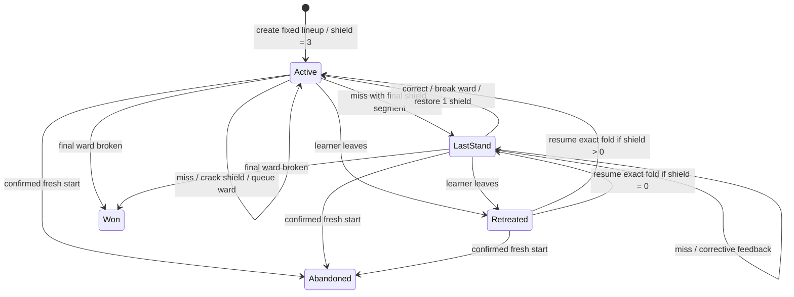
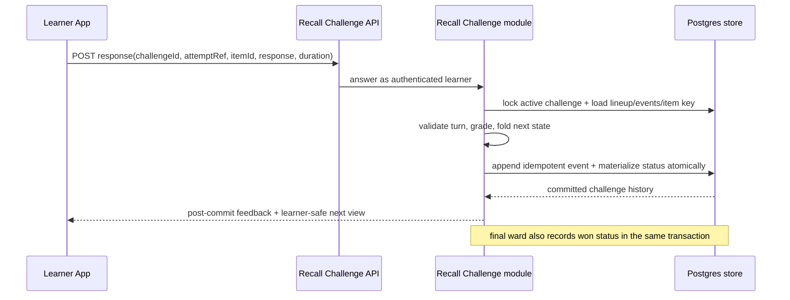

# Crystal Guardian Challenges Implementation Plan

## Goal

Implement the accepted [Crystal Guardian Challenges requirements](../brainstorms/2026-07-13-crystal-guardian-challenges-requirements.md)
as the Learner App's single durable recall-challenge path, then delete the superseded Crystal Duel.
The implementation must preserve the canonical learning contracts in [CONTEXT.md](../../CONTEXT.md),
the typed Study Item Bank in [ADR-0026](../adr/0026-typed-study-item-bank.md), learner-neutral core in
[ADR-0002](../adr/0002-define-learner-neutral-core-concept-graph.md), and the Flow design boundary in
[ADR-0032](../adr/0032-keep-learner-app-in-flow-through-mastery-aligned-game-ux.md).

## Status and scope

- **Readiness:** in progress — U1–U4 implemented and Gate A PASS 2026-07-13; [TODO](./TODO.md)
  carries the authoritative execution status and the remaining-unit handoff (U5–U6 next, after
  the native parity fix plan).
- **Predecessor:** complete the ready
  [Learner App native parity fix](./2026-07-13-004-fix-learner-app-native-parity-plan.md) first;
  Guardian presentation depends on its native UI-kit verification.
- **Primary actors/flows:** requirements A1–A2 and F1–F7.
- **Acceptance authority:** requirements AE1–AE9.
- **Coordination:** [TODO](./TODO.md) tracks current execution status; exact interfaces and persisted
  shapes become authoritative only in source types and the single initial migration.

## System design

The neutrally named application module, not the route or mobile screen, owns lineup eligibility,
coverage selection, turn validity, grading, recovery folding, and reward projection. The Learner
App receives a learner-safe, finished challenge view and maps it to Crystal Guardian presentation
through the existing app-owned UI boundary.

### Fight state

`Retreated` is a presentation/lifecycle event over an otherwise active durable challenge. The canonical
combat state is always re-derived from the immutable lineup and ordered events, so reconnects do not
depend on cached client state.

### Answer sequence

## Key technical decisions

### KTD1 — One neutral Recall Challenge deep module

Create one public application boundary, tentatively `createRecallChallenge`, that binds the narrow
read/store ports once and exposes use-case-shaped operations for scope status, create/rematch,
resume, answer, retreat, and confirmed abandon. Keep selection, grading dispatch, state folding, and
challenge-view projection internal to that module. Persisted, port, application, and API vocabulary
uses plain `recall challenge`, `section|enrichment` scope, and `active|recovery|won` state. Only the
Learner App maps those values to Guardian, Leg/Expedition, and Last Stand language. Routes perform
authentication and transport mapping; screens perform rendering and event dispatch only. This
enforces [ADR-0001](../adr/0001-adopt-greenfield-deep-module-architecture.md) and
[ADR-0033](../adr/0033-plain-identifiers-single-themed-vocabulary-mapping.md).

### KTD2 — Immutable lineup plus append-only challenge events

Persist three relational concepts in the single initial migration:

1. a challenge row with learner, enrichment, plain `section|enrichment` scope kind, stable scope
   anchor derived-node ID,
   lifecycle status, and timestamps;
2. immutable ordered lineup rows referencing the selected neutral Study Items; and
3. append-only, idempotent events for selection answers, Matching pair attempts, and lifecycle
   actions, including item-type response, correctness, recovery phase, and bounded response duration
   where applicable.

Materialize `active`/`won`/`abandoned` on the challenge row for indexed queries, but treat the lineup
and ordered events as the replayable authority for the miss buffer, unresolved items, recovery
queue, recovery mode, and resume state.
Use a client-created UUID attempt reference plus a uniqueness constraint for selection/Matching
retry safety, and an operation reference for idempotent lifecycle writes. Serialize response
transitions per challenge in one transaction, reject stale/out-of-turn item IDs, and enforce one
active challenge per learner/scope with a database constraint. Scope identity is the section
milestone node or enrichment summit node—not a mutable section ordinal. Retreat and resume are
state-edge operations: repeating retreat while already retreated or resume while already engaged is
a no-op, so refresh/poll behavior cannot inflate Flow evidence.

### KTD3 — Victory is the formation record

A won challenge is the single durable source of Leg fusion or Expedition keystone status. Do not add a
second award row or client-local fused-state authority. The trail projection joins won scopes into
its finished view. Device memory may remember only whether a particular victory celebration was
shown. Rematches create new challenges but projection collapses any prior win to the one permanent
formation. This keeps requirements R1, R2, R9–R11 mechanically aligned.

### KTD4 — Acquisition and challenge evidence never share a write path

Recall Challenge answers use the new event store and pure server-side graders; they never call
`gradeStudyResponse` or append `response_log`. Extract item-type grading into persistence-neutral
functions where the current acquisition and Crystal Duel paths contain reusable key resolution, but
keep acquisition persistence at its existing owner. A Recall Challenge may hydrate a superseded Study
Item by its referenced ID so a durable lineup remains resumable; normal session projections still
select only current bank items.

### KTD5 — Deterministic coverage-first selection

Build the eligible pool from the session's current neutral items and latest-correct acquisition fold
at challenge creation. Group by concept, reserve an eligible anchor, then round-robin distinct concepts
and—for Expedition scope—distinct Legs before repeats. Rank equally eligible candidates by least
prior challenge exposure and a stable server-side tie-break derived from challenge identity; never send
the pool to the client. Apply the R2 maxima of five/seven after coverage ordering. Persist the final
lineup before returning it.

### KTD6 — One unresolved unit per selected Study Item

The pure fold starts with `remainingMissBuffer = 3` and unresolved lineup items. Correct resolves the
current item. Miss retains it, decrements the buffer while above zero, and queues it behind other
unresolved items where possible. At zero, only a correct queued response restores one buffer unit
and leaves `recovery`; that same response resolves the item. The Learner App maps those neutral facts
to shield segments, wards, and Last Stand. For Matching, append every pair attempt idempotently,
preserve mid-board progress in the fold, and resolve the round when the final pair is matched. If any
attempt in that round was wrong, the completed round is one miss and recovery presents a reshuffled,
key-free board. This prevents a client from erasing a wrong pair from a later completion trace. No
deadline event exists.

### KTD7 — Typed, learner-safe, idempotent HTTP seam

Add authenticated typed endpoints under a neutral Recall Challenge resource for scope status/create,
challenge read, selection answer, Matching pair attempt, retreat/resume, and confirmed
abandon/rematch. Selection and Matching writes use an `attemptRef`, the expected `studyItemId`, and
strictly bounded item-type input; lifecycle writes use an `operationRef`; completed rounds may
include bounded `responseDurationMs`. Return one discriminated challenge view
(`active`, `recovery`, `won`) with current item, Matching sub-progress, `unresolvedItemCount`,
`remainingMissBuffer`, post-commit current-item feedback, and scope reward state; never return
pre-answer/future-item keys, raw keyed items, or raw store rows. The Learner App maps `recovery`,
unresolved items, and the miss buffer to Last Stand, wards, and the crystal shield. Ownership checks
use the authenticated learner reference on every operation.

### KTD8 — Flow timing is untrusted evidence

Start response timing only after the current prompt is rendered. Clamp or reject impossible values
at the HTTP/application boundary and label the persisted number client-observed. It participates in
later reporting only; no runtime branch may read it to grade, damage, select, unlock, or reward.

### KTD9 — App-native Guardian presentation

Create a route-addressable full-screen Guardian surface so exact resume and refresh are natural.
Reuse the existing Option Select, Matching, Impostor, overlay, text, button, motion, and haptic
primitives. Compose an abstract Guardian silhouette, wards, shield, Leg formations, and keystone
from `react-native-svg`/React Native geometry and existing crystal tokens. Keep animation
event-bound and render explicit static equivalents under reduced motion; do not add a raster asset,
canvas combat engine, or second component system.

### KTD10 — Hard-delete Crystal Duel and its award vocabulary

Guardian rematches subsume the global retrieval sprint. Remove the old application use case, API
routes, client route/screen/reducer, timer and simulated-rival coupling, unlock queries/splash,
menu/header entry, navigation memory, vocabulary, tests, and `duel_win` award/badge shape. Remove
the migration enum/check value and weekly-leaderboard badge projection while retaining weekly podium
behavior. Do not leave adapters, exports, comments, or compatibility aliases.

### KTD11 — Support Path inclusion requires a new evidence contract

Do not reinterpret the current inline generated Support Step option as a Guardian Study Item. The
future TODO must first establish a learner-scoped typed Study Item set and its passed-item semantics,
then extend fixed-budget selection as anticipated by [ADR-0037](../adr/0037-persist-learner-scoped-scaffold-detours.md).

## Implementation units

### U1 — Recall Challenge state machine and selection contract

**Goal:** Implement the pure domain behavior behind requirements R2–R8, before persistence or UI.

**Create:**

- `packages/application/src/recallChallenge.ts`
- `packages/application/src/recallChallenge.test.ts`

**Modify:**

- `packages/application/src/gradedSelectionOutcome.ts`
- `packages/application/src/gradedSelectionOutcome.test.ts`
- `packages/application/src/index.ts`
- `packages/application/src/projection.ts` only if the finished learner-safe view is client-safe

**Approach:** Define plain scope IDs, eligible-pool inputs, challenge lineup/events, the pure fold, item
grading adapters, coverage ordering, and learner-safe output unions. Keep one public module boundary and
internalize helper types that no consumer needs. Reuse item grading semantics without importing any
response-log writer. Lock the matching zero-mispair rule, five/seven maxima, three-segment shield,
Last Stand, stable history rotation, and zero-item unavailable result in table-driven tests.

**Test scenarios:** requirements AE2, AE3, AE6, and the selection portions of AE7–AE8; distinct
concepts before repeats; anchor present/missing; more Legs than Expedition budget; stale item turn;
duplicate attempt; all three item types; no timer transition.

**Verification:** focused application tests plus TypeScript build for `@lrnki/application`.

### U2 — Durable Recall Challenge store

**Goal:** Make the exact lifecycle replayable and transactional without touching acquisition state.

**Create:**

- `packages/infrastructure-postgres/src/PostgresLearnerRecallChallengeStore.ts`
- `packages/infrastructure-postgres/src/PostgresLearnerRecallChallengeStore.test.ts`

**Modify:**

- `packages/ports/src/index.ts`
- `packages/infrastructure-postgres/src/migrations/0000_initial_lrnki_schema.sql`
- `packages/infrastructure-postgres/src/index.ts`
- `packages/infrastructure-postgres/src/PostgresStores.ts`

**Approach:** Add the narrow Recall Challenge store port and normalized challenge/lineup/event tables
from KTD2.
Provide transactional create, owner-scoped load, answer transition, lifecycle append, prior-exposure
read, and won-scope read operations. Use foreign keys to the immutable enrichment/node/item
identities, partial/compound uniqueness for one active scope, attempt-reference idempotency, and
ordered events. Add an explicit by-ID item hydration path that includes a superseded item only when
an existing lineup references it. Hard-reset the development database; add no compatibility
migration.

**Test scenarios:** requirements AE4–AE6; concurrent create; concurrent answer; duplicate attempt;
wrong learner; stale item; abandoned challenge followed by fresh create; active lineup surviving Study
Item supersession; exact fold after a new store instance.

**Verification:** focused Postgres integration tests with `.env` loaded, migration reinitialization,
and an assertion that Recall Challenge writes leave `response_log` unchanged.

### U3 — Application orchestration and typed API

**Goal:** Expose one authenticated, server-owned Recall Challenge lifecycle satisfying R3–R9 and R17.

**Create or modify:**

- `packages/application/src/recallChallenge.ts`
- `apps/learner-api/src/recallChallenge.ts`
- `apps/learner-api/src/app.ts`
- `apps/learner-api/src/app.test.ts`

**Approach:** Bind current layer/session reads, acquisition outcomes, keyed Study Item hydration,
prior exposure, and the challenge store into the KTD1 factory once in
`apps/learner-api/src/recallChallenge.ts`, then inject it into the routes created by
`createLearnerApp`. Add the KTD7 schemas/routes, transactionally derive and commit each selection
answer or Matching pair attempt, and return a finished learner-safe view. Cap all response strings and
arrays, validate UUIDs and discriminants before the application boundary, and make the current
server turn authoritative. Distinguish `unavailable` with reason `no_eligible_items`, `available`,
`active`, and `won` scope states. Record explicit retreat/resume/abandon events without turning
polling reads into events. Treat a fresh start over an active challenge as a conflict until the
confirmed-abandon operation succeeds.

**Test scenarios:** unauthenticated calls; cross-learner challenge IDs; invalid scope anchor; unsupported
item payload; out-of-turn answer; idempotent network replay; retreat/resume; explicit abandon; win;
rematch; bounded timing and payloads; a Matching client attempting to omit a recorded wrong pair; no
pre-answer or future-item keys in any response; current-item corrective feedback only after commit.

**Verification:** learner API typecheck, DB-free route/auth tests, and database-backed end-to-end API
tests for create → miss → Last Stand → recovery → win.

### U4 — Study Session and reward projections

**Goal:** Make Recall Challenge availability and permanent formation server-owned while preserving
R9–R12.

**Modify:**

- `packages/application/src/getStudySession.ts`
- `packages/application/src/getStudySession.test.ts`
- `packages/application/src/studySessionProjection.ts`
- `packages/application/src/studySessionProjection.test.ts`
- `packages/application/src/studySessionTrail.ts`
- `packages/application/src/studySessionTrail.test.ts`
- `apps/learner-api/src/app.ts`

**Approach:** Extend the finished Study Session/trail projection with neutral section/enrichment
Recall Challenge scope views produced by the application module: stable anchor, state, active
challenge ID, eligible item count, and permanent victory identity. The Learner App maps these to Leg
and Expedition Guardian states. Derive Leg fusion only from a won section challenge and the summit
keystone only from a won enrichment challenge. Keep prerequisite navigation and Concept Mastery
wholly derived from neutral acquisition evidence. Surface zero-item unavailability explicitly
instead of auto-fusing.

**Test scenarios:** requirements AE1, AE5–AE8; a mastered Leg that is unfused; postponement with next
learning available; active challenge after refetch; won Leg after later acquisition miss; zero-item Leg
blocking Expedition Guardian; every Leg won unlocking it; rematch not duplicating reward.

**Verification:** focused projection tests and a snapshot/assertion proving the neutral mastery fold
is identical before and after arbitrary Guardian event history, followed by Rule-14 milestone Gate A
below.

### U5 — Full-screen Guardian duel

**Goal:** Deliver F2–F4 as a compact, accessible, stimulating mobile flow.

**Create:**

- `apps/learner-app/src/app/guardian/[challengeId].tsx`
- `apps/learner-app/src/components/GuardianFight.tsx`
- `apps/learner-app/src/components/GuardianFight.test.tsx`
- `apps/learner-app/src/components/CrystalGuardian.tsx`

**Modify:**

- `apps/learner-app/src/lib/actions.ts`
- `apps/learner-app/src/lib/queries.ts`
- `apps/learner-app/src/components/ActivityCards.tsx`
- `apps/learner-app/src/components/MatchingBoard.tsx`
- `apps/learner-app/src/learn/vocabulary.ts`
- existing UI/motion/haptic files only where a reusable semantic event is missing

**Approach:** Drive the surface only from the server challenge union. Render ward count, three-segment
shield, current neutral item, corrective feedback, recovery queue messaging, Last Stand, retreat,
and victory. Reuse activity controls while separating acquisition submissions from Guardian answer
actions. Send every Matching pair attempt through the challenge endpoint so server history, not a
client-composed final trace, owns whether the round was clean. Capture prompt-visible duration,
create an attempt UUID once per submission, and hold it across retries. A route read resumes the
exact challenge; lifecycle actions likewise hold one operation UUID across retries. Require
confirmation before abandoning for a fresh challenge. Implement KTD9 visuals and non-motion
equivalents; never expose raw answer data. Render explicit full-screen loading, a
reconnectable error with `Retry` and `Return to trail`, disabled in-flight actions, corrective reveal,
recovery, and won states. An ownership/not-found terminal response returns safely to the trail rather
than synthesizing local challenge state.

**Test scenarios:** requirements AE2–AE4 and AE9; each item type; initial loading; hard read error;
slow/error/retry answer; duplicate tap; offline return; retreat; confirmed abandon; reduced motion;
enlarged text; compact viewport; screen reader labels that describe state without color/animation.

**Verification:** component/unit tests, Expo web build, and targeted browser interaction at 390×844,
320×568, 200% text/zoom equivalent, keyboard navigation, and reduced motion.

### U6 — Arrival, trail nodes, formation, and summit

**Goal:** Integrate F1 and F5–F7 into the expedition flow and make reward state durable and visible.

**Create:**

- `apps/learner-app/src/components/GuardianArrivalDialog.tsx`
- focused tests beside new/modified presentation components

**Modify:**

- `apps/learner-app/src/components/ActivitySheet.tsx`
- `apps/learner-app/src/components/CheckpointPath.tsx`
- `apps/learner-app/src/components/CrystalVista.tsx`
- `apps/learner-app/src/components/CrystalVista.test.tsx`
- `apps/learner-app/src/learn/crystalVistaView.ts`
- `apps/learner-app/src/learn/crystalVistaView.test.ts`
- `apps/learner-app/src/lib/navMemory.ts`
- `apps/learner-app/src/lib/navMemory.web.ts`

**Approach:** After the last Leg capstone refreshes, offer the arrival dialog without blocking the
trail. Project a persistent Guardian node beside every mastered/unfused or active Leg and one at the
summit when every Leg formation exists; won nodes become rematch entries. Replace
mastery-equals-fusion and final-Leg-equals-keystone helpers with server-projected Guardian wins.
Retain client memory only for victory/arrival celebration acknowledgement, keyed by durable challenge
identity. Animate one-time formation/keystone events through existing primitives, with static
reduced-motion completion states.

**Test scenarios:** requirements AE1, AE6–AE9; face now/return to trail; resumed active node; next Leg
still actionable while unfused; no zero-item fusion; Expedition unlock and summit victory; reload on
another device; rematch celebration without reward duplication.

**Verification:** focused trail/vista tests and an end-to-end browser pass from final capstone through
Leg victory, later Expedition victory, reload, and rematch.

### U7 — Delete Crystal Duel, consolidate docs, and run the real-use gate

**Goal:** Leave one recall-challenge system and prove the complete flow on representative production
content.

**Delete:**

- `packages/application/src/crystalDuel.ts`
- `packages/application/src/crystalDuel.test.ts`
- `apps/learner-app/src/app/duel.tsx`
- `apps/learner-app/src/components/DuelEntryCard.tsx`
- `apps/learner-app/src/components/DuelScreen.tsx`
- `apps/learner-app/src/components/DuelUnlockDialog.tsx`
- `apps/learner-app/src/learn/duelMachine.ts`
- `apps/learner-app/src/learn/duelMachine.test.ts`
- tests dedicated to the deleted Duel components discovered by the implementation trace

**Modify:**

- `apps/learner-api/src/app.ts`
- `apps/learner-api/src/app.test.ts`
- `apps/learner-app/src/app/index.tsx`
- `apps/learner-app/src/components/LearnerMenuSheet.tsx`
- `apps/learner-app/src/components/JournalSplashCoordinator.tsx`
- `apps/learner-app/src/components/JournalSplashCoordinator.test.tsx`
- `apps/learner-app/src/components/LeaderboardBoard.tsx`
- `apps/learner-app/src/components/LeaderboardDialog.test.tsx`
- `apps/learner-app/src/learn/splashPriority.ts`
- `apps/learner-app/src/learn/splashPriority.test.ts`
- `apps/learner-app/src/learn/vocabulary.ts`
- `apps/learner-app/src/lib/actions.ts`
- `apps/learner-app/src/lib/queries.ts`
- `apps/learner-app/src/lib/navMemory.ts`
- `apps/learner-app/src/lib/navMemory.web.ts`
- `apps/learner-api/src/leaderboard.ts`
- `packages/application/src/weeklyLeaderboard.ts`
- `packages/application/src/weeklyLeaderboard.test.ts`
- `packages/application/src/getWeeklyLeaderboard.ts`
- `packages/application/src/getWeeklyLeaderboard.test.ts`
- `apps/learner-api/src/rivalSimulation.ts`
- `apps/learner-api/src/rivalSimulation.test.ts`
- `packages/ports/src/index.ts`
- `packages/infrastructure-postgres/src/PostgresLearnerRegistryStores.test.ts`
- `packages/infrastructure-postgres/src/migrations/0000_initial_lrnki_schema.sql`
- Duel/badge tests and API rival fixtures found by `rg`
- `CONTEXT.md`, affected ADRs, `docs/plans/TODO.md`, and this plan's lifecycle files at completion

**Approach:** Execute KTD10 as a hard cut, including `duel_win` award/badge storage and copy, while
preserving weekly podiums and the leaderboard's simulated-rival behavior; remove only Duel-specific
exports and fixtures from the shared rival module. Run `rg` across code/config/docs to prove no stale
Duel source remains. Then apply the repository's `real-use-quality-evaluation` skill to the complete
behavior change.
Start from a hard-reset shared production-like environment, generate a fresh mixed-domain Topic
Expedition through production LLM aliases, and play normal acquisition plus Guardian flows rather
than database-seeding the result. Record evidence in gitignored `tmp/`.

**Real-use scenarios:** complete at least one multi-item Leg Guardian using all available item types;
force three misses into Last Stand; retreat/reload/resume; win and inspect fusion; continue to the
next Leg before fighting another available Guardian; complete all legitimate Leg formations and the
Expedition Guardian; rematch; inspect a Support Path and prove it stays excluded. Exercise a sparse
Leg if the fresh expedition yields one; never patch around it with fake content.

**Quality assertions:** learner-facing copy and combat metaphor are comprehensible; challenge feels
stimulating rather than punitive; ward/shield state is legible at compact mobile dimensions;
corrective feedback is useful; lineup coverage is sensible; animations remain restrained; reduced
motion is equivalent; fresh reload resumes exactly; fusion/keystone happen only after victory;
`response_log`, mastery, points, and prerequisite access are unchanged by every Guardian answer;
rematches do not duplicate durable reward.

**Verification:** full repository test/typecheck/build commands from package scripts, real-use
evidence inspection under rule 14, and documentation consolidation under the ownership rules. At
completion, fold durable decisions into ADRs/CONTEXT, summarize validation in TODO, and delete this
plan and its accepted brainstorm as required by `docs/plans/README.md`.

## Rule-14 milestone gates

Apply `.agents/skills/real-use-quality-evaluation/SKILL.md` at both important behavior-changing
milestones. A green automated suite does not advance the plan past a failed real-use gate.

### Gate A — Durable contract and projection, after U4

Hard-reset the shared production-like database, load `.env`, generate a fresh production Topic
Expedition through the configured LiteLLM aliases, and complete neutral acquisition normally until a
section has an eligible Recall Challenge. Drive the authenticated API through create, every
available item type, a miss, retreat/resume, three-shield recovery, and victory. Inspect the persisted
lineup/events and finished Study Session projection. The gate passes only if scope coverage is
sensible, exact resume survives a new API/store instance, the reward appears only after victory,
prerequisite access is unchanged, and a before/after checksum of `response_log`, mastery, and points
is identical across challenge-only actions. Stop U5–U7 if this foundation is unusable.

### Gate B — Complete learner experience, after U7

Run the U7 real-use scenarios on fresh production content through the actual Learner App at compact
mobile dimensions, enlarged text, normal and reduced motion. Inspect recordings and database
evidence for stimulation, corrective usefulness, accessibility, exact resume, permanent singular
rewards, Support Path exclusion, and the absence of the superseded Duel. Record concrete defects and
caveats under a gitignored `tmp/2026-07-13-crystal-guardian-challenges/` evidence directory and fix
foundational defects before declaring completion.

## System-wide impact

### Interaction graph

- Neutral acquisition remains `Study Item response → response_log → Concept Mastery → prerequisite
  trail`.
- Recall Challenge play becomes `passed-item snapshot → challenge lineup/events → challenge fold → won scope →
  formation projection`.
- The two paths share read-only Study Item grading semantics but no persistence writer or reward
  fold.
- Study Session reads gain Recall Challenge scope state; Learner App Guardian entry, fight, trail,
  and Crystal Vista
  consume that one application projection.

### Error propagation and recovery

- Invalid/stale/out-of-turn answers return a typed client error and do not append an event.
- Duplicate `attemptRef` or lifecycle `operationRef` returns the already-committed resulting view.
- Infrastructure failure leaves the prior event fold authoritative; retry uses the same attempt ID.
- A superseded lineup item remains hydratable by FK identity until its challenge is abandoned or won.
- Missing eligible content produces `unavailable` / `no_eligible_items`, not a fabricated challenge
  or reward.

### Lifecycle and concurrency

- Fight creation and answer transition are serialized at the database boundary.
- One active challenge per learner/scope prevents divergent device sessions; both devices resume the same
  history.
- Won challenges are immutable reward facts; rematches are separate lifecycle rows.
- Hard database reset is expected because only the initial migration is retained.

### Observability

- Persisted events provide challenge starts/retreats/resumes/abandons/wins, answer outcomes,
  recovery depth, Last-Stand use, and bounded client-observed duration without a new analytics
  service.
- Content-coverage inspection reports scopes with zero eligible items and missing eligible anchors.
- Real-use reports compare Recall Challenge events with a before/after checksum of `response_log` and
  mastery/points projections.

### Security and privacy

- Every challenge operation is learner-owner scoped after bearer authentication.
- The server resolves correct keys and current turns; the client sees no pre-answer/future-item key
  or eligible pool, only post-commit correction for the attempted current item.
- Client timing is untrusted and bounded. Response payloads are limited to the existing typed Study
  Item shapes and contain no new PII. Matching correctness is derived from the server's append-only
  pair-attempt history, not a client-asserted clean trace.

## Dependency order

Complete the
[Learner App native parity fix](./2026-07-13-004-fix-learner-app-native-parity-plan.md) before
starting these units. Its native UI-kit verification is a direct prerequisite for the new Guardian
surface and avoids building U5–U6 on a known-broken presentation substrate.

1. **U1** fixes the pure semantics and learner-safe contracts.
2. **U2** persists those semantics and establishes concurrency/idempotency.
3. **U3** composes the module and exposes the typed server seam.
4. **U4** adds server-owned availability/reward projection.
5. **U5** builds the fight surface against the finished API.
6. **U6** integrates arrival, trail, formation, and summit rewards.
7. **U7** hard-deletes the superseded Duel and performs full real-use/documentation closure.

U4 may begin after U2's won-scope read is stable; U5 may build against U3's finished type while U4
is completed. U6 depends on both. Do not begin U7 deletion until Guardian entry and rematch are
working, but do not declare the plan complete with both recall paths present.

## Risks and mitigations

- **Sparse Study Item Banks can block rewards.** This is intentional under R2. Surface it honestly,
  measure it in the real-use gate, and improve neutral content coverage separately; do not generate
  a boss-only fallback or auto-award.
- **Matching semantics can feel harsher than other types.** Resolve feedback per wrong pair while
  applying only one shield hit at completed-round resolution; verify the reshuffled recovery round
  in real use.
- **Lineup supersession can break resume.** Keep the lineup's FK target and provide an owner-scoped
  historical hydration method used only by active/won challenge projection.
- **Network retries can double damage.** Client-stable attempt IDs, uniqueness, row locking, and
  already-committed response replay are completion requirements.
- **Projection coupling can reintroduce client policy.** Keep readiness, victory, and scope identity
  in the application projection; client helpers may format but cannot decide fusion or unlocks.
- **Duel deletion touches leaderboard presentation.** Remove only duel-win badge semantics and prove
  weekly podium calculation, Board splash, and rival simulation remain intact.
- **Combat effects can overwhelm learning.** Keep motion tied to meaningful answer/reward events,
  never use a correctness clock, and judge compact/reduced-motion recordings during the real-use
  gate.

## Definition of done

- Requirements R1–R17 and acceptance examples AE1–AE9 are covered by automated tests and the
  recorded real-use gate.
- Leg and Expedition Recall Challenges are durable, idempotent, owner-scoped, pre-answer-key-free,
  exactly
  resumable, and support Option Select, Matching, and Impostor.
- Three-shield recovery and Last Stand cannot cause death, reset, mastery change, points, or
  prerequisite gating.
- Fusion and keystone projections derive only from first victory; zero eligible content receives no
  reward; rematches cannot duplicate or revoke it.
- Guardian answer history leaves neutral `response_log` byte-identical and cannot alter Concept
  Mastery.
- Learner App entry, trail, fight, formation, summit, compact sizing, enlarged text, keyboard/screen
  reader semantics, reduced motion, and selective haptics pass verification.
- The Crystal Duel code/API/award/badge/vocabulary/navigation path and every stale reference are
  deleted; weekly podium behavior remains green.
- Support Path Guardian inclusion remains explicitly deferred until its typed learner-scoped Study
  Item contract exists.
- Rule-14 evidence is inspected and recorded, full repository validation is green, durable decisions
  are consolidated, and the completed plan/brainstorm lifecycle is closed per repository rules.

## Open questions

None.
