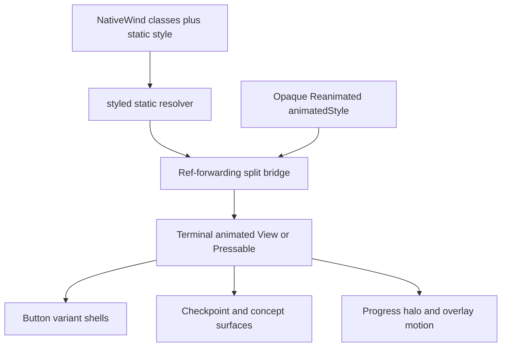

# Learner App Native and Web Parity Fix - Plan

## Goal Capsule

- **Objective:** Make the Android Learner App render and behave like the proven web build across checkpoint geometry, motion, dialogs, concept headers, and every button affordance, including the `Set out` and `Plan a new expedition` calls to action.
- **Authority:** Follow [ADR-0032](../adr/0032-keep-learner-app-in-flow-through-mastery-aligned-game-ux.md) for the app-owned interaction system and [ADR-0035](../adr/0035-separate-learner-app-static-spa-typed-api.md) for the single universal rendering layer.
- **Execution profile:** Diagnose at the shared `src/ui/` boundary first, then fix the smallest root cause that restores every reported native symptom without regressing web.
- **Stop conditions:** Stop and re-plan before adding consumer-specific platform forks, changing learner API or persisted contracts, suppressing Reanimated strict warnings, or changing the pinned styling/motion dependencies without evidence that the shared split boundary cannot work.
- **Tail ownership:** Finish with a physical Android preview-build pass, a web regression pass, the required real-use quality gate, and consolidation in `docs/plans/TODO.md`, `docs/plans/BLOCKERS.md`, and `docs/plans/README.md`.

---

## Product Contract

### Summary

Restore Android parity for the Learner App's shared NativeWind/Reanimated presentation layer.
The fix must cover the original trail and overlay defects plus the newly reproduced missing calls to action and link-like button shells.

### Problem Frame

The web build renders the intended interaction system, but a physical Android build loses presentation on animated surfaces.
The user has completely uninstalled the app, rebuilt it, and reproduced the same result, so a stale installed artifact is no longer a live root-cause hypothesis.

The new observations sharpen the failure boundary.
`Set out` on the signed-out registry gate and `Plan a new expedition` on the signed-in journal are both primary `Button` instances over `PressableSurface`.
Outline and secondary buttons retain readable dark labels but lose their container affordance, making them look like links.
This is consistent with NativeWind styles being dropped from the shared animated press surface while nested text styling survives.

The subsequent strict-log reproduction exposed the other half of the same boundary defect.
Styling `Animated.*` directly resolves classes but lets `react-native-css` recursively inspect an opaque Reanimated style handle during render, producing `Reading from value during component render` warnings.
Using `passThrough` keeps that handle opaque but leaves classes unresolved because the animated component is the terminal surface.

### Requirements

**Trail and overlay presentation**

- R1. Android renders checkpoint nodes as bordered circles with the guided-next halo.
- R2. Android plays press, entrance, halo, and disclosure motion without render-time shared-value warnings, while reduced-motion users receive settled visible states immediately.
- R3. Android dialogs show their header, body, and reachable actions, with long content scrolling on a small viewport.
- R4. Android concept headers render as one row with the label left and the glyph and chevron right.

**Calls to action and affordance**

- R5. The initial signed-out registry gate visibly renders both `Enter` and `Set out` as distinct button controls.
- R6. The signed-in journal visibly renders `Plan a new expedition` before the learner has any expeditions and while expeditions already exist.
- R7. Primary, secondary, outline, destructive, compact, and icon buttons preserve their intended background or border, radius, dimensions, padding, alignment, pressed state, disabled state, and busy state on Android.

**Parity and boundaries**

- R8. The same flows remain visually and behaviorally correct in the web build.
- R9. The fix stays inside `apps/learner-app` presentation and native build/runtime configuration, with dependency catalog changes allowed only when version alignment is the confirmed cause.
- R10. Native visual evidence, not Jest alone, is required because the test Babel environment deliberately leaves `className` inert.

### Acceptance Examples

- AE1. Given a fresh launch with no session, when the registry gate appears, then `Enter` and `Set out` are both visible as shaped controls and `Set out` can create an explorer.
- AE2. Given an authenticated explorer with either an empty or populated journal, when the main journal loads, then `Plan a new expedition` is visible as a primary button and opens its bottom sheet.
- AE3. Given a screen containing primary, secondary, outline, compact, and icon controls, when it renders on Android, then no control collapses to bare text and each pressable retains at least the semantic shell defined by its variant.
- AE4. Given a trail with an available next stop, when it renders and the learner opens a concept, then checkpoint geometry, halo motion, and the single-row concept header match web.
- AE5. Given Board, Support Path, and a long-content dialog, when each opens on Android, then content is visible without depending on an animation completing and footer actions remain reachable.

### Scope Boundaries

- **In scope:** `apps/learner-app/src/ui/`, affected learner components, NativeWind/Tailwind/Babel/Metro configuration, and the pinned Expo catalog entries when diagnosis proves version misalignment.
- **Out of scope:** learner projections, API behavior, persisted shapes, copy redesign, a general visual redesign, and iOS runtime validation.
- **Deferred:** the broader haptics and reduced-motion device matrix beyond the scenarios needed to prove this root cause remains tracked in `docs/plans/BLOCKERS.md` unless the final Android gate completes it.
- **Coordination:** This plan precedes [Crystal Guardian Challenges](./2026-07-13-003-feat-crystal-guardian-challenges-plan.md), whose new native surfaces depend on the same UI kit.

---

## Planning Contract

### Reported Symptom Ledger

| ID | Android symptom | Code-level signal |
|---|---|---|
| S1 | Expedition map has no circle nodes. | `CheckpointCircle` puts its circle geometry and surface colors on `PressableSurface` in `apps/learner-app/src/components/CheckpointCircle.tsx`. |
| S2 | Motion does not play. | Press feedback, overlay entrance, halo, and disclosure use Reanimated worklets through `apps/learner-app/src/ui/motion.ts` and animated surfaces. |
| S3 | Dialogs have no visible content. | `OverlayEntrance` in `apps/learner-app/src/ui/overlays.tsx` begins at zero opacity; `DialogBody` can also collapse under Yoga. |
| S4 | Concept headers occupy three left-aligned rows. | `ConceptMarker` assigns its row layout to a `PressableSurface`; losing that surface's classes stacks its three children. |
| S5 | The initial login page has no visible `Set out` button. | `LearnerNameGate` renders `Set out` as a primary `Button`; a missing `bg-trail` shell leaves its `on-accent` label white against the page. |
| S6 | The signed-in main page has no visible `Plan a new expedition` button. | `PlanExpeditionSheet` always renders this primary trigger inside `ExpeditionEntry`; it has the same invisible-primary failure shape as S5. |
| S7 | Simple white buttons look like links. | Outline and secondary variants keep dark nested labels while their border, background, radius, size, padding, and alignment classes live on the affected animated press surface. |

The symptoms are not independent.
Every reported element is either an animated component or a consumer of the shared styled/animated bridge in `apps/learner-app/src/ui/actions.tsx` and `apps/learner-app/src/ui/motion.ts`.

### Problem Class and Prior Art

The established problem class is **CSS-in-JS resolution crossing an opaque animated-value boundary during React render**, with the earlier class-drop symptom caused by bypassing resolution at a terminal component. Recognized guidance is to resolve static styles separately and pass the `useAnimatedStyle` result directly to the animated component:

- [reanimated#8329 — NativeWind classes not applied on Animated.View](https://github.com/software-mansion/react-native-reanimated/issues/8329)
- [nativewind#1181 — classes not applied on Animated.View](https://github.com/nativewind/nativewind/issues/1181)
- [nativewind#1709 — css-interop runtime and createAnimatedComponent refs](https://github.com/nativewind/nativewind/issues/1709)
- [nativewind#785 — NativeWind, Reanimated, and worklets plugin compatibility](https://github.com/nativewind/nativewind/issues/785)
- [NativeWind v5 `styled` API](https://www.nativewind.dev/v5/api/styled)
- [Reanimated `useAnimatedStyle` guidance](https://docs.swmansion.com/react-native-reanimated/docs/core/useAnimatedStyle/)

The repo pins Expo SDK 57, React Native 0.86 with the new architecture, `nativewind@5.0.0-preview.4`, `react-native-css@3.0.7`, `react-native-reanimated@4.5.0`, and `react-native-worklets@0.10.0` in `pnpm-workspace.yaml`.
The conventional root-cause remedy is a shared static/animated separation boundary, not duplicated consumer inline styles or logger suppression.

### Established Facts and Active Hypotheses

- **Established — stale artifact ruled out:** A full uninstall and rebuilt app reproduce S1-S7, so implementation must not spend a diagnosis cycle treating the installed APK as the likely cause.
- **Established — direct animated wrapping crosses the opaque boundary:** `styled(Animated.*)` resolves classes but merges the Reanimated handle inside `react-native-css`, whose render-time traversal reaches shared-value getters and triggers strict warnings.
- **Established — `passThrough` bypasses terminal resolution:** `passThrough` avoids that traversal but leaves class tokens unresolved because no later styled component exists, explaining the missing shells and geometry.
- **H-C — worklets inactive:** If motion still fails after the split boundary, inspect native worklet execution without weakening strict logging or changing versions pre-emptively.
- **H-D — Yoga-only dialog collapse:** After the shared split boundary is fixed, `DialogBody` may still collapse because its shrinkable scroll region is expressed for CSS rather than Yoga.
- **H-E — native CSS-variable resolution loss:** If the split boundary does not explain all colors and radii, the `var(--...)` theme emitted from `apps/learner-app/tailwind.config.js` may not resolve on native.

### Key Technical Decisions

- KTD1. **Accept the user's clean-install reproduction as evidence.** U1 starts with runtime inspection of the current failure instead of repeating uninstall/rebuild as a stale-artifact probe; development and preview builds remain necessary for fix iteration and final validation.
- KTD2. **Split static resolution from opaque animated styles at the shared boundary.** NativeWind `styled` targets a ref-forwarding bridge that receives `className` and static `style`; the bridge appends the separate `animatedStyle` handle only when rendering the terminal animated component.
  Do not use `passThrough`, suppress Reanimated strict logging, patch dependencies, or duplicate semantic classes as consumer inline styles.
- KTD3. **Button visibility is a system invariant.** A supported Android build may never render a primary button invisibly or degrade outline/secondary controls to indistinguishable bare links.
  The root fix must cover the central variant matrix and the two reported CTA consumers.
- KTD4. **Entrance animation fails visible.** Overlay content must begin from or synchronously reach a visible structural state independent of worklet completion, so animation failure degrades to no entrance motion rather than no content.
- KTD5. **Use one dialog anatomy on Yoga and CSS.** Keep the fixed header, shrinkable scrolling body, and fixed footer contract in `apps/learner-app/src/ui/overlays.tsx`; any platform fork stays inside the UI kit and names the engine behavior it compensates for.
- KTD6. **Native evidence joins the learner-app real-use gate.** Changes to `apps/learner-app/src/ui/` or animated presentation are not validated by web evidence alone.

### High-Level Technical Design

The shared boundary is authoritative.
Consumer checks prove reach, while fixes stay at the highest confirmed common cause.

### Sequencing

U1 determines whether U2 needs the shared split adapter alone or an additional proven theme/configuration correction.
U2 restores the static animated-surface shell through the split bridge before U3 verifies warning-free worklet motion and before U4 isolates any remaining dialog-only Yoga defect.
U5 validates the complete surface and consolidates documentation.

---

## System-Wide Impact

- `PressableSurface` is the shared base for buttons, checkpoint circles, disclosure rows, tiles, and other interactive learner surfaces, so U2 must sweep representative consumers beyond the two newly reported CTAs.
- NativeWind, Babel, Reanimated, or worklets changes affect every animated surface in the Expo bundle; the web export and native runtime must be validated from the same dependency/configuration state.
- No API, learner state, graph, or persisted data contract changes; Crystal Guardian work remains blocked only because it will add new consumers of this presentation boundary.

---

## Implementation Units

### U1. Reproduce and bisect the shared animated-surface failure

- **Goal:** Confirm whether S1-S7 are mounted-but-unstyled surfaces, inactive worklets, or an additional native layout failure.
- **Requirements:** R1-R7, R10; AE1-AE5.
- **Dependencies:** None.
- **Files:** Inspect `apps/learner-app/src/app/index.tsx`, `apps/learner-app/src/components/LearnerNameGate.tsx`, `apps/learner-app/src/components/ExpeditionEntry.tsx`, `apps/learner-app/src/components/PlanExpeditionSheet.tsx`, `apps/learner-app/src/ui/actions.tsx`, `apps/learner-app/src/ui/motion.ts`, `apps/learner-app/src/ui/overlays.tsx`, `apps/learner-app/babel.config.js`, `apps/learner-app/tailwind.config.js`, `apps/learner-app/package.json`, and `pnpm-workspace.yaml`; write evidence only under `tmp/2026-07-13-learner-app-native-parity/`.
- **Approach:** On the current Android failure, use the accessibility tree or React Native inspector to distinguish an absent element from a visually invisible press surface for `Set out` and `Plan a new expedition`.
  If either CTA is absent from the accessibility tree, trace the session and `journal.data` render gates before changing the styling boundary.
  Compare primary, secondary, and outline `Button`s against a plain styled `View`, then inspect press-scale and overlay entrance values to distinguish the shared style boundary from H-C.
  Investigate H-D only after the common styling and worklet failures are fixed or ruled out.
- **Patterns to follow:** Keep temporary probes outside production routes and remove all probe-only code before U2 lands, following rules 10 and 18 in `AGENTS.md`.
- **Test scenarios:**
  1. Launch signed out and verify that accessibility exposes both `Enter` and `Set out`; record whether each has a visible shell and readable label.
  2. Sign in with an empty journal and a populated journal; verify that accessibility exposes `Plan a new expedition` in both states and record its visual shell.
  3. Render primary, secondary, outline, compact, and icon controls; compare their native computed styles with the semantic classes declared by `Button`.
  4. Exercise press feedback and open one dialog; record whether Reanimated values advance and whether content is present beneath zero opacity.
- **Verification:** The evidence note names the confirmed hypothesis set and identifies the smallest shared boundary to change before implementation proceeds.

### U2. Restore animated-surface styling and button affordance

- **Goal:** Restore NativeWind styling on animated press surfaces so S1, S4, S5, S6, and S7 are fixed through one shared boundary.
- **Requirements:** R1, R4-R8, R10; AE1-AE4.
- **Dependencies:** U1.
- **Files:** `apps/learner-app/src/ui/actions.tsx`, `apps/learner-app/src/ui/motion.ts`, `apps/learner-app/src/ui/actions.test.tsx`, `apps/learner-app/src/components/LearnerNameGate.test.tsx`, `apps/learner-app/src/components/PlanExpeditionSheet.test.tsx`, `apps/learner-app/src/components/CheckpointCircle.test.tsx`, `apps/learner-app/src/components/ConceptMarker.test.tsx`, and only the confirmed configuration or catalog files among `apps/learner-app/babel.config.js`, `apps/learner-app/tailwind.config.js`, `apps/learner-app/package.json`, `pnpm-workspace.yaml`, and `pnpm-lock.yaml`.
- **Approach:** Apply KTD2 once in `createStyledAnimatedComponent`: NativeWind resolves `className` and static `style` on a ref-forwarding bridge, while the bridge renders the terminal animated component with `[resolvedStaticStyle, animatedStyle]`.
  `PressableSurface` keeps its public static `style` contract and sends only its scale handle through `animatedStyle`; progress and halo consumers do the same.
  Treat the full button variant shell as one contract so background, border, radius, size, padding, alignment, pressed, disabled, and busy presentation cannot diverge independently.
  Preserve refs, layout-animation props, accessibility state, and static-style precedence without `passThrough` or consumer forks.
- **Execution note:** Start with assertions for the variant and CTA contracts, while keeping native inspection as the styling authority because Jest does not execute NativeWind interop.
- **Patterns to follow:** Preserve the one app-owned component boundary in ADR-0032 and the catalog-owned dependency mapping in `pnpm-workspace.yaml`.
- **Test scenarios:**
  1. Covers AE3. Render each `Button` variant and size; assert the semantic shell classes, accessible role/name, and stable busy/disabled behavior remain attached to its press surface.
  2. Covers AE1. Render `LearnerNameGate`; assert `Enter` and `Set out` are mounted as buttons and each still submits only its own intent under rapid presses.
  3. Covers AE2. Render `PlanExpeditionSheet`; assert `Plan a new expedition` is mounted as the trigger and opens the sheet before topic submission.
  4. Render an available checkpoint and a concept disclosure; assert the interactive surfaces retain their accessible state, refs, class shells, and declared geometry/layout contract.
  5. Assert the styled wrapper targets the split bridge rather than `Animated.View` directly, and that static and animated styles reach the terminal component as separate entries for static-only, animated-only, combined, and layout-entrance-only surfaces.
  6. On Android, verify the two primary CTAs are visible and outline/secondary controls no longer resemble bare links; on web, verify the same screens remain unchanged.
- **Verification:** S1, S4-S7 pass on Android from the shared fix, the targeted component suites pass, and no consumer-specific platform style fork is introduced.

### U3. Restore native motion and fail-visible animated states

- **Goal:** Restore worklet execution for S2 and ensure presentation remains visible when motion is unavailable.
- **Requirements:** R2, R7, R8, R10; AE3-AE5.
- **Dependencies:** U2.
- **Files:** `apps/learner-app/src/ui/actions.tsx`, `apps/learner-app/src/ui/motion.ts`, `apps/learner-app/src/ui/overlays.tsx`, `apps/learner-app/src/ui/actions.test.tsx`, `apps/learner-app/src/ui/overlays.test.tsx`, `apps/learner-app/src/components/CheckpointCircle.test.tsx`, `apps/learner-app/src/components/ConceptMarker.test.tsx`, and, when H-C confirms transform/version changes, `apps/learner-app/babel.config.js`, `apps/learner-app/package.json`, `pnpm-workspace.yaml`, and `pnpm-lock.yaml`.
- **Approach:** Keep Reanimated strict logging enabled and verify the split boundary prevents render-time reads during repeated renders, presses, progress sweeps, halo emphasis, and overlay entrances.
  Align Reanimated, worklets, and Babel transforms only if H-C remains after the boundary is proven.
  Make settled visibility structural for overlay entrances and preserve the shared reduced-motion policy so state transitions never depend on animation completion.
- **Patterns to follow:** Use the event-bound motion and one reduced-motion source defined by ADR-0032.
- **Test scenarios:**
  1. Press an enabled control repeatedly on Android and verify scale and surface feedback run once per press without moving layout or logging a render-time shared-value read.
  2. Render a disabled or busy control and verify no worklet-driven press response or duplicate action occurs.
  3. Open an overlay with motion enabled and verify its entrance plays while content is visible throughout the transition.
  4. Enable reduced motion and verify checkpoint, disclosure, and overlay states render immediately in their settled visible form.
- **Verification:** Press scale, progress sweep, guided-next halo, chevron rotation, and overlay entrance visibly run on Android with zero `Reading from value during component render` warnings, while reduced-motion and simulated non-running animation paths remain fully readable.

### U4. Restore Android dialog content and scrolling

- **Goal:** Fix any remaining Yoga-specific dialog collapse after the shared styling and motion corrections.
- **Requirements:** R3, R8, R10; AE5.
- **Dependencies:** U2, U3.
- **Files:** `apps/learner-app/src/ui/overlays.tsx`, `apps/learner-app/src/ui/overlays.test.tsx`, `apps/learner-app/src/components/LeaderboardDialog.test.tsx`, `apps/learner-app/src/components/SupportPathDialog.test.tsx`, and `apps/learner-app/src/components/ActivitySheet.test.tsx` for long content.
- **Approach:** Preserve the fixed-header, shrinkable-scroll-body, fixed-footer anatomy while expressing body sizing consistently for Yoga and CSS.
  Keep any necessary engine-specific fork inside `Dialog` or `DialogBody` with a comment naming the measured engine behavior.
- **Patterns to follow:** Mirror the existing web layout-engine comments in `apps/learner-app/src/ui/overlays.tsx`; consumers continue to avoid bounded wrapper layouts.
- **Test scenarios:**
  1. Open the Board dialog and verify header, body rows, close action, and footer remain visible on a small Android viewport.
  2. Open `SupportPathDialog` in available, generating, failed, and ready states and verify the state-specific body and actions remain reachable.
  3. Open a long-content dialog and verify only the body scrolls while header and footer stay fixed.
  4. Re-run the same representative dialogs on web and verify the existing 85vh behavior remains intact.
- **Verification:** S3 passes on Android and web with no bounded-wrapper changes in consumers.

### U5. Run the native real-use gate and consolidate the result

- **Goal:** Prove the complete parity outcome on a physical Android preview build and make native evidence part of the durable learner-app validation record.
- **Requirements:** R1-R10; AE1-AE5.
- **Dependencies:** U2, U3, U4.
- **Files:** `docs/plans/TODO.md`, `docs/plans/BLOCKERS.md`, `docs/plans/README.md`, `docs/plans/2026-07-13-004-fix-learner-app-native-parity-plan.md`, and evidence under `tmp/2026-07-13-learner-app-native-parity/`.
- **Approach:** Build the preview APK with strict logging unchanged and run one real expedition through the signed-out gate, signed-in journal, trail, dialogs, repeated press feedback, progress sweep, halo, disclosure, reduced motion, haptics, and crystal growth.
  Apply `.agents/skills/real-use-quality-evaluation/SKILL.md` after the behavior-changing milestone and stop downstream work if the learner experience is still unusable.
  Re-probe the equivalent web flows, then resolve or narrow the Android blocker and consolidate the validation outcome in the canonical planning docs.
- **Patterns to follow:** Evidence belongs in gitignored `tmp/`; `docs/plans/TODO.md` owns the latest validation and `docs/plans/BLOCKERS.md` owns any remaining user action.
- **Test scenarios:**
  1. Covers AE1. Fresh preview install starts at a registry gate with visible `Enter` and `Set out` controls; create and enter flows remain functional.
  2. Covers AE2. Authenticated journal shows `Plan a new expedition` with both empty and populated expedition lists; the trigger opens its sheet and creates a scouting request.
  3. Covers AE3. Primary, secondary, outline, compact, and icon buttons remain visibly button-like across gate, journal, trail, and dialogs.
  4. Covers AE4 and AE5. A live expedition shows circular checkpoints, motion, single-row concept headers, and visible scrollable dialogs in normal-motion mode with no render-time shared-value warnings.
  5. The same expedition remains readable and operable with reduced motion, and equivalent web flows show no regression.
- **Verification:** Device screenshots or recordings cover every reported symptom, the real-use evaluation records concrete judgment, the Android blocker reflects the observed result, and superseded probe code or abandoned fixes are absent from the diff.

---

## Verification Contract

| Gate | Command or evidence | Proves | Units |
|---|---|---|---|
| Targeted learner tests | `pnpm --filter @lrnki/learner-app test` | Component behavior, accessibility contracts, and non-visual interaction invariants remain intact. | U2-U4 |
| Learner type safety | `pnpm --filter @lrnki/learner-app typecheck` | UI and configuration changes preserve the typed app boundary. | U2-U4 |
| Repository regression | `pnpm check` | Lint, tests, typecheck, Admin Lab build, and learner web export remain green. | U2-U5 |
| Android development probe | `pnpm build:android:dev` plus a physical-device or emulator inspection | The shared styling and worklet hypotheses are tested in the native runtime. | U1-U4 |
| Android preview gate | `pnpm build:android` plus physical-device evidence | The distributable build satisfies AE1-AE5 after a fresh install. | U5 |
| Real-use quality gate | `.agents/skills/real-use-quality-evaluation/SKILL.md` with evidence in `tmp/2026-07-13-learner-app-native-parity/` | The learner experience is useful and visually legible, not merely test-green. | U5 |

Jest does not execute NativeWind style resolution, but it does lock the split wiring, terminal style-array order, public props, refs, accessibility, and class contracts.
Green automated tests remain necessary regression evidence, not completion evidence for native pixels or strict runtime logging.

---

## Risks and Dependencies

- **Manual native observation:** Final physical-device evidence remains user-owned if the agent environment has no Android device or emulator.
  Batch manual work into one diagnosis checkpoint only if runtime inspection cannot proceed locally and one final preview gate.
- **Pinned preview runtime:** The app already uses the NativeWind v5 preview and `react-native-css`; keep the pinned versions while validating the app-owned bridge so dependency churn does not obscure the boundary result.
- **Upstream bug without a released fix:** A rule-21-recorded workaround may live in `apps/learner-app/src/ui/` only and must cover the full symptom ledger, not a single consumer.
- **False confidence from accessibility-only tests:** A control can remain mounted and accessible while being visually invisible.
  Native screenshots or recordings must pair accessibility checks with visual inspection.

---

## Definition of Done

- U1 records a confirmed root-cause set and no longer treats a stale installed artifact as a live hypothesis.
- U2 restores checkpoint geometry, concept-row layout, both reported CTAs, and the complete button-shell affordance through the shared UI-kit boundary.
- U3 restores native motion and guarantees visible settled content when animation is reduced or unavailable.
- Reanimated strict logging remains enabled and representative Android flows emit zero render-time shared-value-read warnings.
- U4 makes representative Android dialogs visible and scrollable without regressing web.
- U5 completes AE1-AE5 on a physical Android preview build, re-probes web, and records the real-use quality judgment.
- `pnpm check`, targeted learner tests, and native builds are green at the applicable gates.
- No consumer-specific platform fork, duplicate token source, dead probe code, abandoned dependency experiment, or superseded documentation remains.
- `docs/plans/TODO.md`, `docs/plans/BLOCKERS.md`, and `docs/plans/README.md` reflect the final outcome, and this active plan is removed when its work is fully consolidated.
