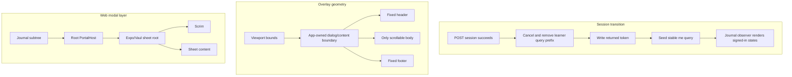

# Learner Runtime Reliability Fix - Plan

## Goal Capsule

- **Objective:** Make learner entry, asynchronous route states, Theory scrolling, Support Path generation dialogs, and the web expedition-planning sheet behave reliably on their affected runtimes.
- **Authority:** Follow [CONTEXT.md](../../CONTEXT.md), [ADR-0032](../adr/0032-keep-learner-app-in-flow-through-mastery-aligned-game-ux.md), [ADR-0035](../adr/0035-separate-learner-app-static-spa-typed-api.md), and [ADR-0037](../adr/0037-persist-learner-scoped-scaffold-detours.md).
- **Execution profile:** Repair the app-owned session, route-state, overlay, and sheet boundaries; delete redundant client state and avoid callsite-specific layout or z-index patches.
- **Stop conditions:** Stop and re-plan before changing learner API or persisted contracts, replacing the native Expo sheet, adding consumer-owned platform forks, weakening the overlay dismissal contract, or accepting automated evidence as proof of Android pixels and gestures.
- **Tail ownership:** Finish automated web QA and the required real-use evaluation, then leave one manual preview-APK and physical-Android gate in `docs/plans/BLOCKERS.md` until the user records the result.

---

## Product Contract

### Summary

Fix four observed runtime defects and remove the implicit states that let similar failures present as blank or inert UI.
Successful signup must enter the Journal on Android and web, every query-driven route must render explicit pending and failure states, Android Theory and Support Path overlays must remain usable, and the web planning sheet must fully cover and disable the page beneath it.

### Problem Frame

The current UI passes component tests and a prior web inspection while still failing on a physical Android device and in a real browser.
Android Theory content mounts but does not scroll, and the root-owned Support Path generation dialog collapses until only horizontal header/footer borders remain.
On web, opening `Plan a new expedition` renders its sheet above the page while some journal controls and Crystal Guardian surfaces paint above the backdrop.
On Android and web, a successful `Set out` response can leave the learner at the registry gate, especially after an earlier failed entry attempt.

These failures share one architectural shape: the app has correct consumer content but an unreliable boundary around it.
The durable fix belongs in session/query ownership and app-owned presentation primitives, not in the Concept Lesson, Scaffold Detour, Recall Challenge, or expedition consumers.

### Requirements

**Session and route state**

- R1. A successful `Enter` or `Set out` response makes that returned learner identity the active client session immediately, without requiring a reload or a second `/me` request.
- R2. A failed entry attempt cannot prevent a later successful signup from replacing an invalid or stale stored token.
- R3. A stored token rejected by `/me` is removed, learner-scoped cached data is purged, and the registry gate becomes the stable signed-out state.
- R4. The session query is the sole signed-in source of truth; the local `hasToken` state and the callback that toggles it are removed.
- R5. After authentication succeeds, a Journal fetch failure keeps the learner signed in and presents a retry plus sign-out recovery instead of returning to the registry gate.
- R6. Bootstrap, Journal, Catalog, Expedition, and Guardian query flows render explicit loading, error, unavailable, or data states as applicable; no route returns a blank frame for a pending or failed request.

**Android overlay usability**

- R7. A long Theory activity scrolls vertically on Android while its header and action footer remain fixed and reachable.
- R8. Closing a contextual Support Path dialog returns to the same Theory activity without resetting its reading position.
- R9. The centered Support Path dialog sizes naturally up to the safe viewport cap; only its body shrinks and scrolls while the header and footer remain visible.
- R10. Available, requesting, generating, failed, and ready Support Path states remain legible and operable on a small Android viewport, including the indeterminate generation progress state.

**Web modal layering**

- R11. The web expedition-planning sheet and its scrim render in the root overlay layer, above every journal, Browse, expedition, and Crystal Guardian surface.
- R12. While the web sheet is open, the underlying page is visually covered and cannot receive pointer or keyboard interaction; backdrop press, Escape, explicit close, and pan-down retain the existing dismissal contract.
- R13. Android and iOS retain Expo's native modal-sheet implementation, safe-area behavior, keyboard framing, pan-down behavior, and pending-mutation dismissal guard.

**Verification and scope discipline**

- R14. Web acceptance is automatic and exercises the production Expo web export in Chromium at phone and desktop viewports.
- R15. Android acceptance uses a manually built preview APK on a physical device after automated checks pass; iOS manual runtime validation is not a completion gate.
- R16. No learner API, database schema, extraction, Concept Lesson, Scaffold Detour lifecycle, or Recall Challenge domain contract changes.

### Acceptance Examples

- AE1. Given a stale stored token, when `/me` rejects it, a learner first attempts an invalid `Enter`, and then `Set out` succeeds, the registry gate disappears and the Journal renders immediately with the new token and identity.
- AE2. Given a successful session response followed by a failed Journal request, the learner sees a signed-in Journal error with Retry and Sign out; retry can recover without another login.
- AE3. Given delayed or failed requests on Bootstrap, Journal, Catalog, Expedition, or Guardian, each route shows its named status and relevant recovery actions rather than an empty screen.
- AE4. Given a Theory lesson taller than a phone viewport, an Android learner can drag from ordinary prose and from around an Explorable Term to reach the final section and fixed Continue action.
- AE5. Given an Explorable Term request that enters `generating`, the Android activity hands off to a centered `Preparing support` dialog whose title, progress content, close action, and footer remain visible; long body content alone scrolls.
- AE6. Given the web Journal contains Browse, ready-expedition, and Crystal Guardian surfaces, opening `Plan a new expedition` places one scrim above all of them, makes hit-testing resolve to the modal layer, and closes without activating an underlying control.
- AE7. Given the shared fixes, the previously restored Android button shells, checkpoint geometry, motion, and current Crystal Guardian challenge surfaces remain visually and behaviorally intact.

### Scope Boundaries

- **In scope:** `apps/learner-app` session/query ownership, route-state UI, overlay/sheet primitives, affected consumers and tests, a durable Playwright web suite, dependency cleanup for that suite, and the active planning ledger.
- **Out of scope:** authentication redesign, API response changes, persisted data changes, learner-content generation changes, sheet or dialog visual redesign, Crystal Guardian rules, and manual iOS validation.
- **Deletion:** Remove the redundant `hasToken` state and `LearnerNameGate.onEntered` transition, replace global query-cache clearing with scoped session operations, and replace the unused direct `playwright` development dependency with `@playwright/test` if the tracked code confirms no remaining direct consumer.
- **Data posture:** No migration is needed; development resets remain allowed only to prepare real-use fixtures or clear stale manual-test state.

---

## Planning Contract

### Resolved During Planning

| Decision | Resolution |
|---|---|
| Learner challenge terminology | Crystal Duel is removed; the affected page content is the current Crystal Guardian / Recall Challenge surface. |
| Collapsed Android surface | The affected generation surface is the root-owned Support Path `Preparing support` dialog. |
| Sheet runtime | The backdrop-layering defect is reproduced on web only; native modal sheets are regression surfaces, not redesign targets. |
| Signup runtime | The failed-login-then-signup defect is reproduced on Android and web and must be fixed in shared code. |
| Async-state scope | Normalize every query-driven Learner App route instead of repairing only the Journal transition. |
| Plan ownership | This plan supersedes the disproven native-parity plan and carries its unfulfilled physical-Android gate. |
| Acceptance ownership | Web is automated; the preview APK is built and verified manually on a physical Android device. |

### Problem Classes and Evidence

- **Session/cache coherence with duplicate truth.** `apps/learner-app/src/app/index.tsx` derives signed-in state from both `hasToken` and `me`, while `enterSession` calls `queryClient.clear()` and then reports success through a boolean callback. TanStack documents that `clear` removes connected caches, whereas `setQueryData`, `cancelQueries`, and `removeQueries` support targeted, observable transitions ([QueryClient reference](https://tanstack.com/query/latest/docs/reference/QueryClient)).
- **Unbounded or absolute-positioned native scroll geometry.** The full-screen dialog uses absolute content through the native portal, and Theory relies on class-based `flex-1` across the remaining chain. React Native requires every ScrollView ancestor to have bounded height and notes that other responders can block scroll acquisition ([ScrollView reference](https://reactnative.dev/docs/scrollview), [Gesture Responder System](https://reactnative.dev/docs/gesture-responder-system.html)).
- **Intrinsic flex collapse under a maximum-only constraint.** Commit history shows the centered dialog entrance and body changed from shrinkable natural-height children to `flex-1` children during the NativeWind v5 migration. In a max-height-only centered column, Yoga can satisfy those flex children at zero intrinsic height, matching the observed border-only dialog.
- **Nested web stacking context.** The installed Expo web sheet renders `Drawer.Overlay` outside `Drawer.Portal`, while the content is portaled. Because stacking contexts are atomic, a fixed overlay left under a transformed or positioned journal ancestor cannot out-rank unrelated siblings by increasing its child z-index ([Expo source](https://github.com/expo/expo/blob/main/packages/expo-ui/src/community/bottom-sheet/BottomSheet.tsx), [MDN stacking contexts](https://developer.mozilla.org/en-US/docs/Web/CSS/Guides/Positioned_layout/Stacking_context)). This is an inference from the package source and the reported elements; the browser acceptance test must prove it.
- **Implicit asynchronous state.** Bootstrap, Journal, Catalog, and Expedition currently return `null` for one or more pending/data-missing paths, so a network or cache transition can appear indistinguishable from failed navigation.

### Established Facts and Active Hypotheses

- **Established — no server signup gap:** `POST /session` already creates a session and returns `token`, `learnerStateRef`, and `displayName` for both successful intents; `/me` returns the same identity projection without the token.
- **Established — `clear()` can strand the observer:** `me` has infinite staleness, the gate callback only sets `hasToken` to `true`, and a stale-token launch can already have that boolean value before a later successful signup.
- **Established — one root portal host exists:** `apps/learner-app/src/app/_layout.tsx` renders `PortalHost` after the router stack and inside the safe-area and query providers.
- **Established — Expo owns native gestures:** `@expo/ui/community/bottom-sheet` delegates to native modal sheets on Android/iOS and Vaul on web ([Expo BottomSheet behavior](https://docs.expo.dev/versions/latest/sdk/ui/drop-in-replacements/bottomsheet/)).
- **H1 — native full-screen absolute positioning is the remaining Theory scroll break:** Prove with the physical Android pass after the app-owned primitive uses a bounded native flex chain.
- **H2 — reverting the centered middle region from flex growth to measured-cap shrink fixes the generation dialog:** Prove across every Support Path state and a small physical viewport.

### Key Technical Decisions

- KTD1. **Make the `me` query the session state machine.** The registry gate renders only for settled `null`, signed-in routes render only for identity data, and pending/error states have explicit UI. No second token-presence boolean or new auth store is introduced.
- KTD2. **Replace the session atomically without clearing subscribers.** All downstream query keys gain one learner-scoped prefix. Session replacement cancels and removes that prefix, writes the returned token, and synchronously seeds the stable `me` key from the successful response. Logout and a rejected stored token clear the same prefix and set `me` to signed out.
- KTD3. **Keep query-key ownership with query definitions.** Actions invalidate the exported Journal and Expedition query keys instead of reproducing string arrays. This makes the session purge prefix and mutation refresh paths one mechanical source of truth.
- KTD4. **Use one presentational route-status component, not a React Query wrapper.** Routes remain responsible for interpreting their own pending, error, unavailable, and data states; the app-owned component only renders consistent progress, message, and action anatomy.
- KTD5. **Express structural bounds in the overlay primitives.** Centered dialogs use one numeric viewport cap that updates with window size, natural-height shrinkable content, one scrolling middle, and fixed header/footer. Native full-screen content uses a bounded flex chain rather than an absolute scroll ancestor; the existing web focus-wrapper compensation stays inside `FullScreenDialog`.
- KTD6. **Preserve the current Support Path handoff.** Tapping an Explorable Term opens contextual state above the activity; accepting generation closes the activity before the root-owned progress dialog opens; closing contextual state returns to the unchanged activity and reading offset.
- KTD7. **Lift the existing Expo sheet on web, not replace it.** The app-owned `BottomSheet` mounts the primitive in the root portal layer only on web so the overlay escapes journal stacking contexts; native keeps the current in-place Expo component and its system-modal behavior. Expo remains responsible for Vaul and native gesture/modal semantics; no z-index escalation, node-module patch, or second sheet library is added.
- KTD8. **Make web modal and session regressions durable.** Add a checked-in `@playwright/test` suite over the production static export with deterministic API interception for state transitions and DOM hit-testing. Keep the real-use gate separate so mocked transport cannot be mistaken for UX evidence.
- KTD9. **Treat physical Android evidence as the final authority for native layout.** Jest locks component anatomy and state transitions, while the manually built preview APK proves scroll gestures, measured pixels, and dialog reachability.

### High-Level Technical Design

### Sequencing

U1 establishes session and query-key ownership before U2 renders the exhaustive route states that consume it.
U3 and U4 then repair the independent overlay and sheet boundaries.
U5 adds automatic browser acceptance over all completed web-facing work.
U6 runs real-use and manual native gates and consolidates the result.

---

## System-Wide Impact

- **Session lifecycle:** Every learner-scoped query and invalidation path participates in logout and learner replacement. A missed key could expose one learner's cached view to another, so query-key coverage is a data-isolation invariant even though no server auth contract changes.
- **Failure propagation:** `/me` unauthorized means signed out and clears the bad credential; network failure means session validation failed and offers retry without silently deleting a potentially valid credential. Journal failure occurs after authentication and must not change session state.
- **Overlay behavior:** `Dialog`, `FullScreenDialog`, `DialogBody`, and `BottomSheet` are shared by Board, activities, Support Paths, menus, celebrations, and planning. Representative consumers must prove there is no regression in focus restoration, Escape/back handling, backdrop behavior, reduced motion, safe areas, or pending-mutation dismissal guards.
- **Rendering parity:** The native and web engines may use different structural positioning only inside app-owned primitives. Consumers continue to use one component API and React Native primitives with NativeWind.
- **Dependencies:** The production runtime dependency set remains unchanged. The browser suite may replace the unused direct `playwright` development dependency with the cataloged `@playwright/test`; `pnpm-lock.yaml` changes mechanically.
- **Persistence and API:** No database reset, migration, route change, or typed transport change is part of implementation. A reset is permitted only for disposable real-use test state.

---

## Implementation Units

### U1. Make session replacement atomic and query-owned

- **Goal:** Eliminate the failed-login-then-signup race and prevent learner cache leakage without introducing another auth store.
- **Requirements:** R1-R5, R16; AE1-AE2.
- **Dependencies:** None.
- **Files:** `apps/learner-app/src/lib/session.ts`, `apps/learner-app/src/lib/queries.ts`, `apps/learner-app/src/lib/actions.ts`, `apps/learner-app/src/lib/guardianEntry.ts`, `apps/learner-app/src/app/index.tsx`, `apps/learner-app/src/app/index.test.tsx`, `apps/learner-app/src/app/guardian/[challengeId].tsx`, `apps/learner-app/src/components/LearnerNameGate.tsx`, `apps/learner-app/src/lib/session.test.ts`, and `apps/learner-app/src/components/LearnerNameGate.test.tsx`.
- **Approach:** Preserve the stable `me` key and move Journal, Catalog, Leaderboard, Expedition, and Challenge keys under one learner prefix. Export query definitions/factories as the only key source used by actions and Guardian cache commits. On a successful session response, cancel old learner reads, remove the prefix, replace the token, seed `me` with the returned identity, and let the mounted observer change the route. On logout or `/me` unauthorized, remove learner data and settle `me` to `null`; a transport failure remains an error rather than masquerading as signed out. Remove `hasToken`, the success callback, and `queryClient.clear()`.
- **Patterns to follow:** Mirror the Guardian route's existing successful-response `setQueryData` pattern and TanStack's targeted cache operations. Keep token storage behind the current native/web `tokenStore` seam.
- **Test scenarios:**
  1. Seed an invalid token and stale Journal/Expedition/Challenge cache, resolve `/me` unauthorized, and assert the token and learner-prefixed cache are gone while `me` settles to `null`.
  2. Reproduce AE1 with a failed `Enter` followed by a successful `Set out`; assert the new token is stored, the successful identity is in `me`, old learner data is absent, and the Journal appears without remounting the app.
  3. Resolve a successful `Enter` while old learner queries are in flight; assert cancellation prevents an old response from repopulating the new session.
  4. Log out from a populated session; assert the server revoke is attempted, local cleanup happens even on revoke failure, and the registry gate becomes stable.
  5. Exercise every action/Guardian invalidation and cache-commit path against the exported key definitions so no old unprefixed learner key remains.
- **Verification:** Session tests and the Journal integration test prove one observable state transition and scoped cleanup; repository search finds no `hasToken`, `onEntered`, `queryClient.clear()`, or duplicated raw learner query key.

### U2. Render exhaustive asynchronous route states

- **Goal:** Replace blank startup and query frames with consistent, recoverable learner-facing states.
- **Requirements:** R5-R6, R16; AE2-AE3.
- **Dependencies:** U1.
- **Files:** Add `apps/learner-app/src/ui/routeStatus.tsx` and `apps/learner-app/src/ui/routeStatus.test.tsx`; update `apps/learner-app/src/ui/index.ts`, `apps/learner-app/src/learn/vocabulary.ts`, `apps/learner-app/src/learn/vocabulary.test.ts`, `apps/learner-app/src/app/_layout.tsx`, `apps/learner-app/src/app/index.tsx`, `apps/learner-app/src/app/catalog.tsx`, `apps/learner-app/src/app/expedition/[enrichmentId].tsx`, `apps/learner-app/src/app/guardian/[challengeId].tsx`, and route tests added beside those routes.
- **Approach:** Build one presentational status surface from existing `Screen`, `Text`, `Button`, and `ActivityIndicator` primitives. Keep route-specific copy and actions at the route boundary. Render visible token hydration, session validation, and content loading; distinguish transport failure from a valid unavailable/empty response; preserve navigation actions. Journal error keeps the seeded session and offers Retry plus Sign out. Migrate Guardian's existing good loading/error behavior to the shared presentation without changing its durable challenge query semantics.
- **Patterns to follow:** Follow the current Guardian route's explicit pending/error/unavailable/data partition and ADR-0033's UI-owned learner vocabulary.
- **Test scenarios:**
  1. Delay token hydration and each route query; assert an accessible progress state is visible and no route returns an empty renderer.
  2. Fail session validation with a network error; assert Retry is offered and the stored token is retained.
  3. Fail Journal after successful signup; cover AE2 and verify Sign out works from the error state.
  4. Fail and then recover Catalog, Expedition, and Guardian reads; assert each retry keeps its route/navigation context and renders data after success.
  5. Return valid empty Catalog, unavailable Expedition, and ended/unknown Guardian results; assert each remains distinct from a transport error.
- **Verification:** Route and status tests cover every state partition, and no query-driven route or bootstrap branch uses `return null` for pending or failed work.

### U3. Restore bounded Android activity and dialog geometry

- **Goal:** Make long Theory content scroll and every Support Path dialog state render at a usable height on Android.
- **Requirements:** R7-R10, R13, R15-R16; AE4-AE5, AE7.
- **Dependencies:** None.
- **Files:** `apps/learner-app/src/ui/overlays.tsx`, `apps/learner-app/src/ui/overlays.test.tsx`, `apps/learner-app/src/components/ActivitySheet.tsx`, `apps/learner-app/src/components/ActivitySheet.test.tsx`, `apps/learner-app/src/components/SupportPathDialog.test.tsx`, and `apps/learner-app/src/components/LeaderboardDialog.test.tsx`.
- **Approach:** Replace the centered dialog's percentage/class dual cap with one window-derived numeric maximum. Restore natural-height shrink behavior through the entrance and `DialogBody`, keep header/footer non-shrinking, and let only the body scroll when the cap is reached. On native, make `FullScreenDialog` establish a bounded flex content chain instead of placing the activity ScrollView below an absolute-positioned content ancestor; preserve the existing absolute/fixed web compensation for Radix's focus wrapper inside the primitive. Give the activity ScrollView an explicit structural bound and retain its fixed footer. Do not add heights or platform checks to Support Path, Theory, or Board consumers.
- **Patterns to follow:** Keep one overlay anatomy and the dismissal/focus contract from ADR-0032. Structural inline styles may carry engine invariants; theme and visual styling remain NativeWind-owned.
- **Test scenarios:**
  1. Render a multi-section Theory fixture whose content exceeds a phone viewport; assert one bounded activity ScrollView sits between fixed header and footer and retains the Continue action.
  2. Open and close the contextual term dialog from scrolled Theory; assert the activity stays mounted and its reading offset is not reset.
  3. Render Support Path available, requesting, generating, failed, and ready states under a 320x568 frame; assert header, body, and footer/action anatomy remains mounted and only one `dialog-body` scroll region exists.
  4. Render long Board and Support Path content under the viewport cap; assert the body is shrinkable and the fixed close/footer controls are outside it.
  5. Re-run representative web dialogs and full-screen activities at phone, desktop, and 200%-zoom-equivalent viewports; assert the Radix wrapper seam remains bounded and focus/dismissal behavior is unchanged.
- **Verification:** Automated anatomy tests pass, web browser QA shows no regression, and U6's physical Android pass proves real drag scrolling and a non-collapsed generating dialog.

### U4. Move the web planning sheet into the root modal layer

- **Goal:** Ensure the sheet scrim and surface out-rank the whole Journal without changing native sheet behavior.
- **Requirements:** R11-R13, R16; AE6-AE7.
- **Dependencies:** None.
- **Files:** `apps/learner-app/src/ui/sheets.tsx`, `apps/learner-app/src/ui/overlays.test.tsx`, `apps/learner-app/src/components/PlanExpeditionSheet.test.tsx`, and `apps/learner-app/src/app/_layout.tsx` only if the existing root host needs an explicit sheet-layer contract.
- **Approach:** On web only, mount the open app-owned `BottomSheet` through the existing root `PortalHost` with a stable per-instance portal identity; render the existing primitive in place on native. Keep the Expo primitive, controlled open/close synchronization, safe-area padding, keyboard behavior, dynamic sizing, pan-down, and dismissal block unchanged. Avoid z-index changes in `ExpeditionEntry`, Browse, ready expeditions, or Guardian consumers; do not patch `node_modules`.
- **Patterns to follow:** Reuse the same app-owned root overlay boundary as RN Primitives dialogs while preserving Expo's documented native modal behavior.
- **Test scenarios:**
  1. Open and close multiple sheet instances sequentially; assert portal entries clean up and controlled state does not reopen a dismissed sheet.
  2. While creation is pending, assert close, backdrop, Escape/back, and pan-down cannot dismiss; after settlement, the same inputs close once.
  3. Confirm safe-area padding and keyboard-scrollable topic input remain inside the sheet after portal relocation.
  4. Cover AE6 in the browser with journal elements before and after the trigger and with a transformed/animated Guardian surface present; keyboard focus stays in the sheet and returns to its trigger after close.
- **Verification:** Component tests preserve the wrapper contract, Playwright hit-testing proves the modal layer is topmost, and no consumer z-index or alternate sheet implementation is added.

### U5. Add durable automatic web acceptance

- **Goal:** Turn the two reproduced web failures and the shared route-state contract into a repeatable production-export gate.
- **Requirements:** R1-R6, R11-R14, R16; AE1-AE3, AE6-AE7.
- **Dependencies:** U1, U2, U3, U4.
- **Files:** Add `apps/learner-app/playwright.config.ts`, `apps/learner-app/e2e/learner-runtime.spec.ts`, and focused e2e fixture helpers; update root `package.json`, `apps/learner-app/package.json`, `pnpm-workspace.yaml`, and `pnpm-lock.yaml`.
- **Approach:** Use `@playwright/test` against a locally served production Expo export. Intercept the typed API origin with deterministic response fixtures for session, Journal, Catalog, Expedition, and sheet scenarios; do not add a test-only production route or runtime flag. Run Chromium at a phone viewport and a desktop viewport, fail on uncaught page/console errors, and integrate the suite into the repository's automatic check. The learner package owns the browser-test and one-time Chromium-provisioning scripts; the root check invokes the learner browser test. The normal check must fail with an actionable setup command when the pinned browser is absent rather than downloading at test time. Remove the direct `playwright` catalog/dependency entry if tracked code no longer imports it.
- **Patterns to follow:** Stable test fixtures stay in the checked-in test tree; screenshots, traces, and reports go to gitignored `tmp/`. Browser mocks prove client behavior only and never count as the real-use gate.
- **Test scenarios:**
  1. Drive AE1 from stale `localStorage` through `/me` unauthorized, failed `Enter`, successful `Set out`, and immediate Journal render without reload.
  2. Drive AE2 with a successful session and failed-then-successful Journal response; assert the gate never returns and Retry recovers.
  3. Delay and fail representative Catalog, Expedition, and Guardian reads; assert the shared pending/error surfaces and recovery actions.
  4. Open `Plan a new expedition` over a populated Journal; use screenshot and `elementFromPoint`/pointer assertions to prove Browse, ready expeditions, and Guardian content are below the scrim and inert.
  5. Verify explicit close, backdrop, Escape, focus containment/restoration, and pan-down where Playwright can drive them, including the pending-mutation guard.
- **Verification:** The production export and both Chromium projects pass automatically with zero unexpected page/console errors, and `pnpm check` includes the durable web suite.

### U6. Run real-use and manual Android gates, then consolidate

- **Goal:** Judge the fixed experience in real use, obtain the user-owned native evidence, and leave the canonical planning ledger accurate.
- **Requirements:** R1-R16; AE1-AE7.
- **Dependencies:** U1, U2, U3, U4, U5.
- **Files:** `docs/plans/TODO.md`, `docs/plans/BLOCKERS.md`, `docs/plans/README.md`, this plan, and evidence under `tmp/2026-07-14-learner-runtime-reliability/`.
- **Approach:** Apply `.agents/skills/real-use-quality-evaluation/SKILL.md` after the complete behavior-changing milestone. Automatically drive the web flows against a disposable real learner and real ready expedition in the shared environment, reserving intercepted fixtures for the deterministic suite. Keep the learner PIN, bearer token, and authorization headers out of screenshots, traces, logs, and evaluation prose; delete or hard-reset the disposable learner after the gate. After automated gates pass, the user manually builds the preview APK and runs the Android scenarios on a physical phone. Record concrete defects and stop consolidation if Theory, the generation dialog, signup, or previously restored native controls remain unusable. When all gates pass, fold the final validation into `TODO.md`, clear the blocker, and delete this completed plan as required by `docs/plans/README.md`.
- **Patterns to follow:** Load `.env` for any DB-touching setup, keep disposable evidence in `tmp/`, use current Recall Challenge / Crystal Guardian vocabulary, and hard-reset only disposable development data.
- **Test scenarios:**
  1. Automatic web real use: failed entry followed by successful signup reaches a real Journal; all route states remain legible; the planning sheet covers and disables a populated page.
  2. Physical Android AE1-AE3: validate stale/failed entry recovery, immediate Journal transition, visible loading/error recovery, and logout in a preview build.
  3. Physical Android AE4: scroll a long real Theory lesson from top to final section, including drags beginning near ordinary prose and Explorable Terms; header/footer remain fixed.
  4. Physical Android AE5: request a real Support Path, inspect the generating dialog on a small viewport, dismiss/reopen it, and continue into ready/failed recovery as available.
  5. Physical Android AE7: sample button shells, checkpoint geometry/motion, current Crystal Guardian surfaces, reduced motion, and strict-runtime logs to carry forward the superseded parity gate.
- **Verification:** The evaluation note contains automatic web evidence and the user's physical-device result. The plan remains active and `BLOCKERS.md` remains unresolved until the manual Android gate passes.

---

## Verification Contract

| Gate | Command or evidence | Proves | Units |
|---|---|---|---|
| Learner component and route tests | `pnpm --filter @lrnki/learner-app test` | Session transitions, scoped query ownership, exhaustive route states, overlay anatomy, sheet control, and accessibility remain correct. | U1-U4 |
| Learner type safety | `pnpm --filter @lrnki/learner-app typecheck` | Query-key, route-state, and portal changes preserve the typed universal app boundary. | U1-U5 |
| Automatic production-web gate | The checked-in learner Playwright script against an Expo production export | AE1-AE3 and AE6 pass at phone and desktop viewports with top-layer hit-testing and no runtime errors. | U5 |
| Repository regression | `pnpm check` | Tests, lint, typecheck, Admin Lab build, learner export, and the automatic web gate are green together. | U1-U6 |
| Real-use quality gate | `.agents/skills/real-use-quality-evaluation/SKILL.md` with evidence in `tmp/2026-07-14-learner-runtime-reliability/` | A real learner/expedition experience is useful; deterministic API interception is not mistaken for quality evidence. | U6 |
| Manual Android preview gate | User-built `pnpm build:android` preview APK plus physical-device screenshots/recording and strict logs | Real Android scroll gestures, measured dialog layout, signup transition, and shared native regressions satisfy AE1-AE5 and AE7. | U6 |

Automated tests are necessary but cannot certify Android pixels, Yoga measurement, or touch-responder behavior.
The implementation may land with the manual gate recorded in `BLOCKERS.md`, but this plan cannot be declared complete or deleted until that gate passes.

---

## Risks and Dependencies

- **Physical-device ownership:** Android build and verification are manual and user-owned. Mitigation: batch all native checks into one preview build after automatic gates pass and keep exact scenarios in U6 and `BLOCKERS.md`.
- **False positive from class-only tests:** Jest leaves NativeWind classes inert and cannot perform a real scroll gesture. Mitigation: assert structural style/ancestry in tests and require the physical Android gate.
- **Session cache omission:** A forgotten raw query key could survive learner replacement. Mitigation: prefix every downstream query, route every invalidation through exported definitions, and add a repository search/test that rejects unprefixed keys.
- **Portal context loss:** RN Primitives' host renders the stored subtree at the root host rather than using a React DOM portal. Mitigation: limit relocation to web, keep the host inside SafeArea and Query providers, preserve closure-owned callbacks, and test safe-area, keyboard, focus, controlled-state, and multiple-instance behavior after relocation.
- **Browser provisioning:** `@playwright/test` does not make a usable Chromium executable universal across developer and CI hosts. Mitigation: provide one explicit pinned-browser setup script, keep downloads out of the normal check, and fail with a direct setup instruction when provisioning is missing.
- **Credential capture in evidence:** Browser traces and real-use logs can retain PINs or bearer headers. Mitigation: use a disposable learner, redact request secrets, avoid credential-bearing screenshots/logs, and remove the learner after evaluation.
- **Upstream sheet implementation changes:** Expo may later move its web overlay into Vaul's portal. Mitigation: own only root placement at the app boundary and test observable top-layer behavior rather than package internals.
- **Scope creep into auth or redesign:** The server session contract and visual language already satisfy the target. Mitigation: stop conditions prohibit API/schema changes, a new auth store, or replacement overlay libraries without new evidence.

---

## Definition of Done

- U1 removes duplicate session truth, global query-cache clearing, and raw duplicated learner query keys; failed entry followed by successful signup enters the Journal on Android and web.
- U2 gives Bootstrap and every query-driven route explicit, accessible pending/error/unavailable/data presentation with appropriate retry/navigation actions.
- U3 makes real Android Theory scroll and the Support Path generation dialog fully visible and reachable while preserving web, focus, dismissal, and reading position.
- U4 makes the web planning sheet's scrim and surface topmost and inerting without changing native Expo sheet behavior or adding consumer z-index fixes.
- U5 adds a checked-in automatic production-web suite, integrates it with the repository gate, and removes the redundant direct Playwright dependency when safe.
- U6 records a real-use quality judgment and a passing manually built physical-Android preview run covering the reported defects and carried-forward native parity surfaces.
- Targeted tests, learner typecheck, automatic browser QA, and `pnpm check` pass with zero unexpected runtime errors.
- Browser and real-use evidence contains no learner PIN, bearer token, authorization header, or retained disposable learner.
- No API, schema, content-generation, or Recall Challenge behavior changes; no test-only production route, abandoned experiment, node-module patch, duplicated module, or superseded plan remains.
- `docs/plans/TODO.md`, `docs/plans/BLOCKERS.md`, and `docs/plans/README.md` identify this plan and its manual gate until completion, then consolidate the result and delete the plan.
