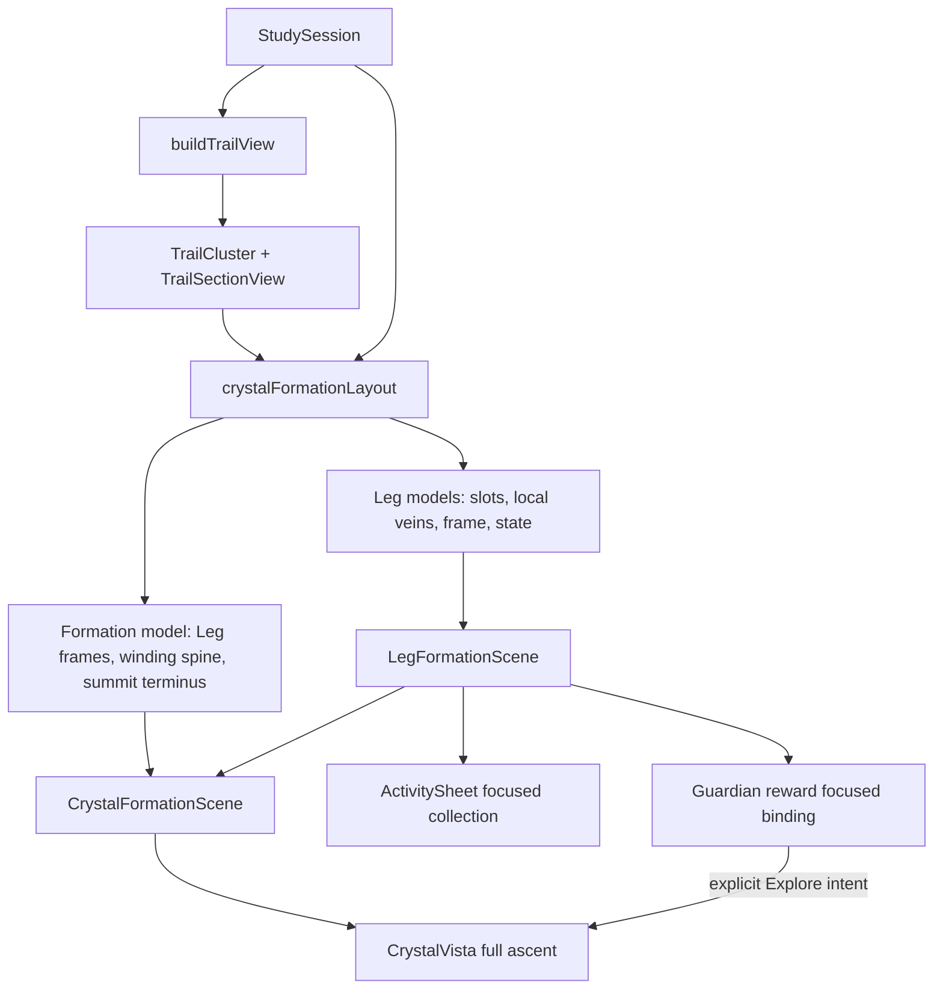
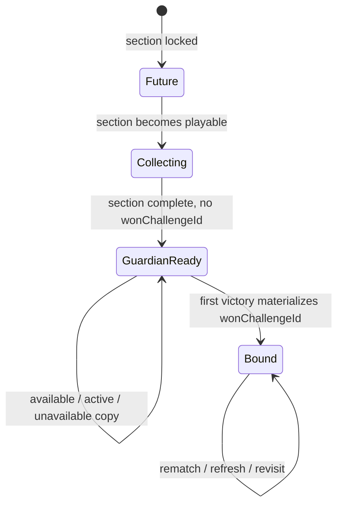
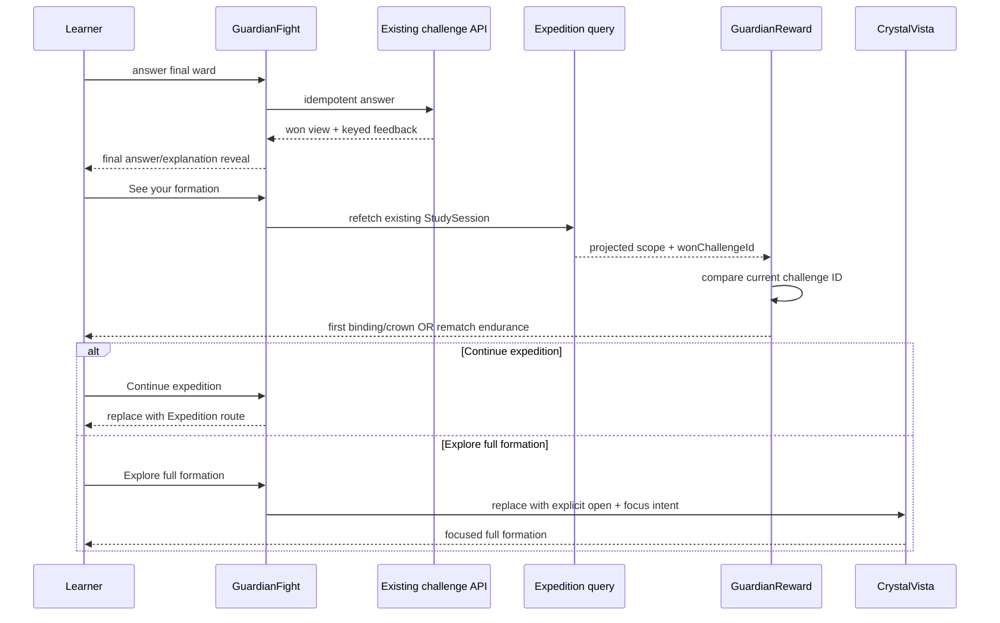

# Crystal Formation Reward UX - Plan

## Goal Capsule

- **Objective:** Make collecting a crystal, binding a Leg after a Crystal Guardian victory, and
  completing the Expedition summit read as one coherent, delightful Crystal Formation reward
  system—with legible progress, mineral-like specimens, clearly separated Leg clusters, honest
  rematch treatment, and event-bound animation.
- **Authority:** Follow [CONTEXT.md](../../CONTEXT.md),
  [ADR-0001](../adr/0001-adopt-greenfield-deep-module-architecture.md),
  [ADR-0002](../adr/0002-define-learner-neutral-core-concept-graph.md),
  [ADR-0013](../adr/0013-verify-quality-by-real-source-inspection.md),
  [ADR-0032](../adr/0032-keep-learner-app-in-flow-through-mastery-aligned-game-ux.md),
  [ADR-0033](../adr/0033-plain-identifiers-single-themed-vocabulary-mapping.md), and
  [ADR-0035](../adr/0035-separate-learner-app-static-spa-typed-api.md).
- **Execution profile:** Rebuild the learner-owned, code-native SVG presentation around a pure
  two-level formation layout and one shared Leg scene. Reuse the existing Sphere Grid algorithm
  independently inside each Leg, the existing Study Session/Recall Challenge projections, the
  app-owned motion/haptic/accessibility system, and the intercepted production-web Playwright gate.
- **Stop conditions:** Stop and re-plan before changing neutral graph meaning, persisting a cosmetic
  mineral choice, adding an API/table/migration, drawing cross-Leg prerequisite edges, guaranteeing
  planarity beyond measured inputs, introducing a rendering/layout dependency, adding ambient
  animation/audio, auto-opening Crystal Vista, or building share/export behavior.
- **Tail ownership:** Complete the shared scenes and reward flows, delete the superseded crystal
  renderer/strip/aura paths, inspect production-shaped phone and desktop screenshots, apply the
  real-use quality gate, fold the durable presentation rule into ADR-0032, and leave one active
  implementation/design authority.

---

## Product Contract

### Summary

The current crystal metaphor is fragmented. Small copies of a faceted glyph appear at sizes where
the distinguishing facets cannot be read, mastery assembles an isolated icon rather than placing a
reward into its Leg, Guardian victory repeats the Guardian with no formation payoff, and Crystal
Vista groups Legs with overlapping translucent gold ovals. The result conveys inventory more than
formation.

This work makes one progression grammar visible at three scales:

1. ordinary compact surfaces communicate exact progress with text, status icons, and the existing
   `Progress` primitive;
2. mastery places one new mineral specimen into a focused crop of its shared Leg formation; and
3. first Guardian victory closes that Leg's geode matrix and binds it to a winding Expedition spine,
   while the summit victory locks a unique golden crown into the formation's terminus.

The Crystal Formation is still a downstream projection of existing learner facts. Mineral habits,
matrix shapes, the winding spine, and animation are presentation only. Exact prerequisite veins may
appear inside a Leg, but the spine never claims a graph edge and no cross-Leg graph edge is rendered.

### Actors

- **A1 — Learner:** studies an Expedition, collects concept crystals, faces a Guardian, receives a
  permanent first-victory reward, rematches without duplicate rewards, and deliberately explores
  Crystal Vista.

### Requirements

**One formation language**

- R1. Render each Expedition as one vertically ascending Crystal Formation composed of visually
  disjoint Leg geode islands joined by one winding, nonsemantic binding spine and ending in a
  separate summit terminus.
- R2. Each Leg uses one irregular layered geode matrix with mineral bands and a shallow cavity. The
  spine enters and forks as an embedded branch; no translucent fusion ellipse, circular socket, or
  overlapping cluster aura remains. The matrix is noninteractive; only nameable minerals receive
  native touch targets.
- R3. The summit reward is a unique golden crown/keystone embedded in its own layered terminus matrix.
  It is not a fourth concept-mineral habit, does not float above the highest crystal, and positions
  from the Expedition terminus.
- R4. `LegFormationScene` is the single visual boundary for a Leg's slots, minerals, exact veins,
  matrix, state, and event-bound transitions. Capstone reward, Guardian reward, and Crystal Vista
  compose that boundary in explicit modes rather than maintaining parallel drawings.
- R5. The full formation is a vertical, scrollable ascent with readable fixed-size islands and no
  pinch zoom. Width fitting may reduce whitespace and lattice spacing, but a rendered specimen may
  not fall below 40 CSS/device-independent pixels; an exceptional wider Leg scrolls horizontally
  within its scene instead of shrinking the specimens further.

**Leg structure and topology**

- R6. A Leg has four structural states derived only from the existing projection: `future` when the
  section is locked; `collecting` when it is unlocked but incomplete; `guardian_ready` when its
  concepts are complete and no first victory exists; and `bound` when its Recall Challenge scope has
  a `wonChallengeId`.
- R7. Future Legs show a dashed shell, muted spine, and unnamed ghost slots. Collecting Legs show an
  open matrix seam, collected specimens plus ghosts, and exact accessible progress. Guardian-ready
  Legs show every earned specimen, a bright fractured seam, and scope copy that distinguishes
  `Guardian awaits`, `Guardian engaged`, or the honest zero-eligible-item unavailable case. Bound
  Legs show a closed layered matrix, an internal golden branch, and a lit spine segment.
- R8. A calibration-known concept remains a labeled ghost slot in every mode and never becomes a
  collected mineral. Progress copy distinguishes completed ground, crystals collected, and known
  ground so a Guardian-ready Leg never misleadingly claims that every slot is a crystal.
- R9. Reuse `layoutSphereGrid` once per Leg with every node in that invocation assigned one constant
  Leg-local domain. Feed only trusted (`uncertain === false`) graph edges whose two endpoints are in
  that Leg. Uncertain and cross-Leg edges remain available on their canonical inspection surfaces
  but do not enter this reward composition; the outer spine represents Expedition
  sequence/belonging only.
- R10. If Sphere Grid reports a flagged Leg, omit that Leg's exact prerequisite-vein overlay and
  retain its geode branch, minerals, state copy, and accessible progress. Surface the flag in
  test/development diagnostics. Never draw a known tangle or claim that arbitrary future graphs are
  planar.
- R11. Derive the outer Leg order from canonical section order and pack natural-size Leg frames on a
  deterministic alternating vertical ascent. Center the newly rewarded Leg on entry; do not persist
  pan/scroll position.

**Mineral Menagerie and compact progress**

- R12. Replace the leaf-like shard fan with exactly three code-native specimen habits: prismatic
  quartz, cubic fluorite, and rhombohedral calcite. Shape—not color alone—identifies the habit; all
  three share one facet, stroke, palette, highlight, and growth language.
- R13. Mineral habit is cosmetic and carries no domain, difficulty, mastery, correctness, rarity, or
  reward-value meaning. Assign habits with a pure balanced cycle using a section-stable offset plus
  `sectionPositionIndex`; seed minor facet/cluster variation from `derivedNodeId`. Identical
  projection inputs must render identically across reloads and input array ordering.
- R14. Render a distinct specimen only where its displayed size is at least 40 pixels. Replace 14–28
  pixel `CrystalGlyph` instances with a universal `Gem`/status icon, exact counts, and the app-owned
  `Progress` primitive as appropriate. A progress bar communicates completion; text separately names
  crystal and known-ground counts.
- R15. Delete `SectionCrystalStrip`; a Leg banner/overview uses an accessible completion meter and
  copy such as completed ground plus crystals collected rather than a row of miniature specimens.

**Collection and binding motion**

- R16. When ordinary mastery is earned in the Activity Sheet, keep the sheet in flow and render a
  focused crop of that concept's shared Leg scene. Only the new specimen rises/grows into its
  deterministic slot; existing specimens remain still. Do not fly a gem between screens. Fire the
  existing `mastery` haptic once at the state edge.
- R17. On a first Leg Guardian victory newly committed in the mounted fight, do not regrow its
  specimens. Close the open geode seam, seal the junction, light the Leg's spine segment, then expose
  the settled actions. Fire one `fusion` haptic at the seal. Target a restrained 900–1200 ms total
  sequence using existing `MOTION` tokens. Directly loading or refreshing an already-won first
  challenge renders the settled first-reward scene without replaying motion or haptic.
- R18. On a first Expedition Guardian victory, lock the summit crown into the terminus and send one
  light wave down already-bound Legs. Fire one `unlock` haptic. The completed result remains still.
- R19. A newly won rematch renders the already-bound Leg or crown, a brief restrained light sweep,
  and copy that the formation endures. It never replays growth/binding, changes the permanent reward,
  or fires a mastery/fusion/unlock re-award haptic. Directly loading an already-won rematch is static.
- R20. The shared reduced-motion policy replaces rise, seal, light-wave, and settling transforms with
  the immediate final state plus static emphasis and equivalent text. There is no ambient motion or
  audio after any event.

**Guardian entry and reward flow**

- R21. After a successful request to enter/resume a Guardian, close the Activity Sheet before route
  navigation. If entry fails, keep the sheet and current trail state intact so retry remains possible.
- R22. Preserve the final keyed answer/explanation reveal even when that answer changes the server
  view to `won`. Its continuation action becomes `See your formation`; only that action advances the
  same Guardian route into its reward stage.
- R23. At reward entry, refetch the existing Expedition query and compare the current challenge ID
  with the projected scope's first-victory `wonChallengeId`. Equality classifies the challenge as the
  permanent first victory; inequality classifies it as a rematch. Separately carry a route-local
  `just won` event from the answer commit through the final reveal; only that event may start reward
  motion or haptics. A missing matching scope or missing `wonChallengeId` is an inconsistent preview,
  not a rematch. Add no client reward write, persisted played flag, migration, or API contract.
- R24. A first Leg victory shows its focused binding scene; a first summit victory shows the full
  formation and crown sequence. Settled actions are `Continue expedition` and `Explore full
  formation`. Continue replaces the Guardian route with the Expedition route. Explore replaces it
  with the Expedition route plus explicit Vista/focus intent.
- R25. If the post-victory Expedition refetch fails, keep the committed victory visible, show an
  inline retry for the formation preview, and keep `Continue expedition` enabled. Never turn a
  presentation fetch failure—or a successful response missing the matching won scope—into a lost,
  guessed-rematch, or repeated victory.

**Crystal Vista**

- R26. Crystal Vista opens only through an explicit learner action. Reward-driven navigation may
  explicitly request it and focus the rewarded Leg/terminus; ordinary loading, query refresh, and
  mastery never auto-open it.
- R27. Focus priority is: explicit reward focus; the furthest-progressed unseen reward (summit first,
  otherwise greatest section index); current section; then first Leg. This is a deterministic
  progression-order proxy because the projection has no reward timestamps. Closing Vista consumes
  route intent so back/refresh cannot reopen it unexpectedly.
- R28. Preserve the ADR-0032 one-time Vista contextualization for a newly bound reward. When Vista is
  first explicitly opened after that reward, the focused already-bound Leg island settles into its
  global position and its spine segment lights; minerals do not regrow and no fusion haptic repeats.
  If several rewards are unseen, contextualize only the R27 focus target and mark the entire bound
  snapshot seen after Vista presents it, so stale animations do not queue. Represent the lossable
  memory as canonical reward keys (`leg:<sectionIndex>` and `summit`) scoped by learner and
  enrichment. If the learner first chooses Continue, contextualization remains pending until a later
  manual open.
- R29. Preserve the existing memory-door behavior and native minimum 44-pixel mineral touch targets.
  Unnamed future ghosts are not interactive; nameable minerals retain label/gist/Examine behavior.
- R30. The formation composition must be understandable as a still image in anticipation of a future
  share/export feature, but sharing and raster export are outside this plan.

**Quality, accessibility, and cleanup**

- R31. Every structural state, progress value, first-victory/rematch distinction, focused reward,
  and reduced-motion equivalent is announced through text/accessibility state; color, glow, and
  animation are never the sole signal.
- R32. Use React Native primitives, NativeWind, `react-native-svg`, Reanimated, and the app-owned UI
  boundary already present in the Learner App. Add no UI, graph-layout, 3D, canvas, or image asset
  dependency.
- R33. Delete the replaced glyph geometry, miniature strip, Vista fusion auras/circular sockets,
  floating keystone, and redundant size/difficulty constants in the same units that replace them.
- R34. Inspect the real rendered flow with Playwright at phone and desktop sizes, including normal
  and reduced motion. Semantic assertions and human/AGI screenshot judgment are authoritative; do
  not add brittle pixel-diff baselines.

### Flows

- **F1 — Read progress:** A1 sees exact progress on the trail/header, deliberately opens Vista, and
  understands future, collecting, Guardian-ready, and bound Legs without decoding tiny art.
- **F2 — Collect a crystal:** A1 completes the final ordinary activity for a concept, sees its new
  mineral enter the correct cavity in a focused Leg crop, then continues in the mastery flow.
- **F3 — Enter a Guardian:** A1 starts a Leg or summit challenge from the trail while a study surface
  is open; successful entry closes that surface and navigation reveals only the Guardian fight.
- **F4 — Receive or revisit a reward:** A1 reads final answer feedback, chooses `See your formation`,
  receives first-victory binding/crown motion or restrained rematch acknowledgment, then continues or
  explicitly explores Vista.
- **F5 — Explore the full formation:** A1 enters a focused, scrollable Crystal Vista, sees separated
  geode islands on one ascent, opens a nameable mineral's memory door, and exits without unexpected
  reopen behavior.

### Acceptance Examples

- AE1. Given a collecting Leg with two collected concepts, one known-skipped concept, and one
  incomplete concept, compact UI announces three of four ground complete, two crystals collected,
  and one known; the Leg scene shows two solid minerals and two distinct ghosts.
- AE2. Given the last ordinary activity becomes complete in an open Activity Sheet, only that
  concept's deterministic specimen animates into the focused shared Leg scene, the mastery haptic
  fires once, and reopening the capstone is static.
- AE3. Given Guardian entry succeeds while the Activity Sheet is open, the sheet closes before the
  route changes. Given entry fails, the same sheet remains usable and no challenge route is pushed.
- AE4. Given the final Guardian answer wins the challenge, its keyed correctness/explanation remains
  visible until A1 presses `See your formation`; the reward does not replace the answer immediately.
- AE5. Given `challengeId === wonChallengeId`, the Leg matrix closes once, the junction seals, one
  fusion haptic fires, and the settled view says `New permanent reward`. Given inequality, the bound
  scene only sweeps light, says the formation endures, and fires no re-award haptic.
- AE6. Given several real production-shaped Legs, each exact intra-Leg prerequisite overlay has zero
  reported crossings, geode frames do not overlap, no cross-Leg graph edge appears, and the winding
  spine remains visibly distinct from prerequisite veins.
- AE7. Given a known-skipped milestone or summit concept, its slot remains a ghost and the Leg's
  structural/Guardian state stays derived from the existing section/scope facts rather than visual
  crystal count.
- AE8. Given first summit victory, a golden crown seats in the terminus and one light wave traverses
  the bound formation. A summit rematch leaves the crown seated and uses only restrained endurance
  feedback.
- AE9. Given reduced motion is enabled, mastery, binding, Vista contextualization, and crown reward
  render their final focused states immediately with equivalent copy and no transform animation.
- AE10. Given reward-driven Explore, Crystal Vista opens focused on that Leg or summit exactly once;
  closing consumes the intent. Given ordinary Expedition entry or refresh, Vista remains closed.
- AE11. Given post-victory Expedition refetch fails or returns no matching won scope, victory copy
  and Continue remain available, formation preview exposes Retry/unavailable status, and no rematch
  or reward state is synthesized or written by the client.
- AE12. Given phone and desktop production-web screenshots, a reviewer can identify Leg boundaries,
  formation state, current reward, ascent direction, and crown without interaction, tiny mineral
  details, color alone, or overlapping ellipses.

### Scope Boundaries

- **In scope:** learner-owned mineral specimens; compact progress replacement; pure Leg and outer
  formation layouts; shared Leg/full-formation scenes; mastery collection; Guardian entry cleanup;
  first-victory/rematch reward stages; explicit Vista focus/contextualization; accessibility;
  intercepted browser screenshots; code/doc deletion and consolidation.
- **Out of scope:** Recall Challenge selection/combat/persistence changes; neutral graph or mastery
  changes; API/schema/migration work; cross-Leg graph exploration; pinch zoom; persisted camera
  position; Admin Lab/Cytoscape rendering; share/export; 3D/raster mineral assets; image generation;
  audio; ambient animation; new content generation or LLM evaluation.
- **Data posture:** Existing `StudySession`, `TrailView`, `RecallScopeStatus`, and first-win-wins
  `wonChallengeId` remain authoritative. The only projection addition is existing neutral ordering
  metadata (`sectionPositionIndex`) copied onto `TrailCluster`; all themed state stays in the learner
  app and nothing new is persisted.

---

## Planning Contract

### High-Level Technical Design

The data and component ownership is intentionally two-level:

`crystalFormationLayout.ts` is a pure learner-owned view-model module. For each section it filters
the canonical trail concepts and graph edges, calls the shared application `layoutSphereGrid` with a
constant local domain, flips/normalizes the returned lattice into a Leg-local coordinate system,
and computes an irregular matrix frame around those positions. A second pure pass packs Leg frames
on the winding ascent and computes spine/terminus geometry. The renderer consumes finished geometry;
it does not run graph logic during React render.

The shared application Sphere Grid remains unchanged unless implementation evidence exposes a defect.
Its established problem class is **clustered hierarchical graph drawing with crossing minimization**.
The conventional solution used here is layered layout inside disjoint cluster regions, not a global
force simulation. A production-shaped 59-node fixture currently partitions into 17 Legs (maximum ten
nodes) with zero within-Leg crossings, while a saved six-Leg Expedition also yields zero; a new
per-Leg regression locks that measured fit without making an arbitrary-planarity promise.

### Leg State Machine

`known` affects a slot's rendering and counts but does not create another structural state. The
Recall Challenge projection already owns whether a ready-looking completed Leg is available,
engaged, unavailable, or won. The formation view maps those facts; it never recreates eligibility or
victory policy.

### Guardian Reward Sequence

The reveal must render ahead of the `view.state === "won"` branch. This fixes the current ordering
defect without changing the server view: the route query cache may hold the won view while the local
answered-item reveal remains the immediate presentation authority until dismissed.

### Scene Modes and Motion

| Surface/mode | Framing | Event motion | Settled behavior | Haptic |
|---|---|---|---|---|
| Compact progress | No detailed specimen below 40 px | Optional existing door emphasis only | Count/status/Progress | None |
| Capstone collection | Focus crop around earned slot in its Leg | New specimen rises/grows; existing specimens still | Focused Leg crop | `mastery`, once |
| First Leg reward | Whole rewarded Leg | Seam closes, junction seals, spine lights | Bound Leg with actions | `fusion`, once at seal |
| Leg rematch | Whole already-bound Leg | Brief light sweep only | “Formation endures” | None |
| First summit reward | Full formation + terminus | Crown seats, one wave down bound Legs | Static crown/formation | `unlock`, once |
| Summit rematch | Crown-focused full formation | Brief terminus sweep only | Crown remains seated | None |
| Vista contextualization | Full ascent focused on unseen reward | Bound island settles and spine lights; no mineral growth | Static explorable Vista | None |
| Reduced motion | Same focus and final frame | Immediate state + static emphasis | Same copy/actions | Same one semantic first-event haptic unless OS haptics are unavailable |

Reward motion in this table requires the route-local win transition. A direct load or refresh of any
already-won challenge uses the corresponding settled frame and actions, even when its challenge ID is
the permanent first `wonChallengeId`.

### Assumptions Applied for the Remaining Questions

- **A1 — Cosmetic assignment:** quartz/fluorite/calcite are deliberately nonsemantic. Use a
  section-seeded balanced cycle and node-seeded minor geometry variation; do not expose rarity.
- **A2 — Compact honesty:** completion bars count completed ground, while adjacent text states actual
  crystal and known-ground counts. Do not use `crystals / total concepts` as a completion fraction
  when known-skipped slots exist.
- **A3 — Ordinary Vista focus:** after explicit reward, choose the summit or greatest section index
  from the unseen bound snapshot as the deterministic furthest-progressed proxy, then current section
  and first Leg; do not invent timestamps or persist camera state.
- **A4 — Vista one-time behavior:** retain ADR-0032's pending contextualization as one focused island
  settle plus spine light, not a second binding/regrowth event or haptic. Mark the opened bound
  snapshot seen together rather than queueing historical island animations.
- **A5 — Reward fetch failure:** preserve committed victory and navigation, with retry limited to the
  preview refetch.
- **A6 — Unexpected crossings:** suppress the affected Leg's optional exact graph-vein overlay,
  report the flag in test/development, and keep the always-readable geode branch/state.
- **A7 — Timing:** use an approximately 900–1200 ms first-binding/crown sequence built from current
  motion tokens; browser polish may tune within that range without creating a new token system.
- **A8 — Transferability:** implement specimens/matrix/spine as code-native SVG and React Native
  primitives. The served visual probes are composition sketches, not final art assets.
- **A9 — Boundary:** no API, persistence, Admin, Cytoscape, sharing, image-generation, 3D, audio, or
  new dependency work is necessary for this UX target.

### Key Technical Decisions

- **KTD1 — Bound geode islands on one Expedition ascent.** Each Leg is a non-overlapping geode
  island connected by a nonsemantic winding spine. `(session-settled: user-directed — chosen over a
  continuous unconstrained graph and overlapping aura clusters: it makes Leg rewards scannable and
  preserves one-Expedition belonging)`
- **KTD2 — Sphere Grid inside Legs only.** Reuse the established layered layout independently per
  Leg, render only trusted exact prerequisite veins within the Leg, and omit uncertain and cross-Leg
  graph edges from this reward composition.
  `(session-settled: user-approved — chosen over a global FFX-like grid or force layout: disjoint
  regions eliminate inter-Leg crossings by construction and keep semantics honest)`
- **KTD3 — Fixed-size scrollable ascent, no zoom.** Center the newly earned Leg and preserve mineral
  readability instead of fitting the whole Expedition at once. `(session-settled: user-approved —
  chosen over pinch zoom and a fully scaled overview: reward comprehension should be immediate on a
  phone)`
- **KTD4 — Mineral Menagerie at meaningful sizes.** Use quartz, fluorite, and calcite habits only at
  40 px or larger; compact surfaces use progress/count/status language. `(session-settled:
  user-directed — chosen over forcing one detailed glyph to remain recognizable at 14 px: exact
  progress can do that job better and frees the reward art to look mineral-like)`
- **KTD5 — One shared Leg scene.** Mastery, Guardian reward, and Vista compose one scene with mode
  inputs and event-specific transitions. `(session-settled: user-approved — chosen over three
  bespoke reward illustrations: the same crystal visibly enters and later binds in the same place)`
- **KTD6 — Collection and binding are separate events.** Mastery grows only the new specimen;
  Guardian victory closes the matrix and lights the spine without regrowing minerals.
  `(session-settled: user-approved — chosen over replaying a generic crystal assembly at every
  reward: it clarifies what the learner earned at each step)`
- **KTD7 — Final feedback precedes same-route reward.** The learner explicitly advances from the
  final keyed reveal to formation reward, then chooses Continue or explicit Vista exploration.
  `(session-settled: user-approved — chosen over immediate route exit, reward modal, or Vista
  auto-open: it preserves learning feedback and gives the permanent reward its own beat)`
- **KTD8 — First win and rematch are visibly honest.** Compare current challenge identity with the
  durable first `wonChallengeId`; only first victory binds/rewards, while rematch gets restrained
  endurance acknowledgment. Challenge identity classifies the reward; only the in-mount win edge
  starts motion, so refresh cannot replay it. `(session-settled: user-approved — chosen over
  replaying fusion and haptics on rematch: permanent singular rewards must not look duplicated)`
- **KTD9 — Matrix seam and summit crown replace circles.** The Leg has an irregular layered cavity;
  the summit has a unique embedded gold crown at the terminus. `(session-settled: user-approved —
  chosen over the translucent ellipse, gold socket circle, and floating fourth crystal: geology and
  hierarchy read more naturally)`
- **KTD10 — Four visible Leg states.** Future, collecting, Guardian-ready, and bound use shell/seam/
  spine structure plus text, with known-skipped slots always ghosted. `(session-settled:
  user-approved — chosen over encoding progress only in crystal opacity or Guardian icons: the
  formation itself explains what happens next)`

### System-Wide Impact

- **Application projection:** Copy existing `sectionPositionIndex` from each `ExpeditionSectionStep`
  onto `TrailCluster`. This is neutral ordering metadata already present in `StudySession`, not a
  themed contract or new source of truth. Update the application projection tests and public type
  export transitively.
- **Learner view model:** Replace the current one-pass global `crystalVistaView` placement with pure
  mineral-specimen and two-level formation modules. Preserve memory-door/nameability logic; move it
  onto the finished formation model rather than duplicating it in components.
- **Learner components:** One `CrystalSpecimen` owns the three mineral habits. One
  `LegFormationScene` owns a Leg. One `CrystalFormationScene` composes the full ascent. Activity,
  Guardian, and Vista pass explicit scene/event modes.
- **Navigation/query flow:** Guardian entry clears local overlay state after successful creation.
  GuardianFight carries an in-memory win-transition token across the final reveal; the route refetches
  the existing Expedition query for reward classification. Explicit Vista route params encode only
  open/focus intent and are consumed on close; ordinary query refresh has no navigation side effect.
- **Local navigation memory:** Rename the current fused-section memory to seen Vista bindings in both
  native and web implementations. On open, diff the server-projected bound snapshot, focus at most one
  furthest-progressed unseen reward, then record the whole displayed snapshot. Memory records only
  whether contextualization has been viewed, never whether the server reward exists; a hard-reset
  key rename may replay contextualization once and is acceptable in this greenfield app. Use the
  same `leg:<sectionIndex>`/`summit` reward-key representation in both platform files.
- **Error behavior:** Formation layout is total for empty/sparse Legs. Crossing flags remove only an
  optional semantic overlay. Reward refetch errors and missing matching scopes cannot hide victory,
  be classified as rematches, or block Continue.
- **Accessibility:** Generic compact icons retain semantic labels; every progress meter has an exact
  spoken value; mineral press targets remain at least 44 px; ghost/state/copy differences survive
  grayscale and reduced motion.
- **Performance:** Layout remains deterministic and synchronous over small per-Leg graphs. Memoize at
  the session/TrailView boundary if browser profiling shows repeated work; do not add a cache or
  worker speculatively.
- **Persistence/API/security/spend:** No schema, migration, API, authentication, database reset,
  neural generation, provider call, or learner data exposure changes.
- **Documentation:** This plan owns the active design. At completion, ADR-0032 owns the durable
  formation presentation/motion rule, TODO owns outcome/validation, and the completed plan is
  removed.

### Sources and Research

- Current production-shaped screenshots under
  `tmp/2026-07-15-crystal-formation-plan/screenshots/` show the repeated Guardian victory panel,
  overlapping Vista ellipses, and leaf-like shard silhouette that this plan replaces.
- The existing [Sphere Grid implementation](../../packages/application/src/sphereGridLayout.ts) and
  [real-shape fixture](../../packages/application/src/sphereGridLayout.realShapeFixture.ts) establish
  the repository's deterministic layered layout and crossing diagnostics. The conventional basis is
  Sugiyama et al.'s layered hierarchical drawing method
  ([IEEE record](https://doi.org/10.1109/TSMC.1981.4308636)).
- Quartz commonly forms hexagonal prisms with pyramidal terminations
  ([Smithsonian](https://naturalhistory.si.edu/education/teaching-resources/featured-collections/all-sorts-quartz));
  fluorite's cubic habit and calcite's rhombohedral cleavage/habit provide shape-distinct specimen
  families ([Mindat fluorite](https://www.mindat.org/min-1576.html),
  [Mindat calcite](https://www.mindat.org/min-859.html)). These references guide silhouette only;
  the app does not claim mineralogical simulation.
- React Native accessibility semantics and reduced-motion handling remain governed by the platform
  and existing app boundary ([React Native accessibility](https://reactnative.dev/docs/accessibility),
  [Reanimated accessibility](https://docs.swmansion.com/react-native-reanimated/docs/guides/accessibility/)).

### Risks and Dependencies

- **Art still reads as a sketch:** Code-native geometry can remain diagrammatic if facets, matrix
  depth, and spacing are not judged in the real browser. Mitigation: U6 is an iterative screenshot
  quality gate, not a one-pass test run; stop downstream work if the mineral metaphor remains weak.
- **Semantic confusion between spine and prerequisites:** Both are line structures. Mitigation: keep
  exact veins inside matrix bounds, use graph-state styling for uncertain veins, and give the outer
  spine a distinct weight/material/route with accessible copy that never calls it a prerequisite.
- **Unexpected dense Leg:** Future real data could exceed measured width or cross. Mitigation: retain
  40 px specimens, horizontally scroll the exceptional Leg instead of over-scaling, suppress a
  flagged exact-vein overlay, and keep diagnostics/tests visible.
- **Known-ground count mismatch:** Current `masteredCount` includes known-skipped nodes in some section
  summaries while crystal counts exclude them. Mitigation: centralize `formationProgress` derivation
  and test completed-ground, collected-crystal, and known-ground counts separately.
- **Victory/reveal race:** The route query commits `won` before local final feedback has been read,
  while challenge identity alone cannot prove that victory happened in the current mount.
  Mitigation: render the pending reveal first, preserve its answered item and an in-memory
  win-transition token, and require that token for motion/haptics; direct won-route loads stay static.
- **Refetch lag:** Scope projection may be stale immediately after victory. Mitigation: invalidate and
  explicitly refetch the existing Expedition query; show retry/error without writing local reward
  state or replaying haptics.
- **One-time Vista drift:** Renaming navigation memory or accumulating several unseen rewards could
  auto-open Vista, replay fusion, or produce an animation backlog. Mitigation: server
  `wonChallengeId` owns existence; memory owns only contextualization-seen; explicit open focuses one
  furthest-progressed reward and records the whole displayed snapshot; add native/web parity and
  route-intent consumption tests.
- **Nested scrolling:** A rare wide Leg inside a vertical Vista can create gesture ambiguity.
  Mitigation: fit measured fixtures within phone width first, activate horizontal scrolling only
  beyond the 40 px floor, and verify a wide synthetic case on web and Android component semantics.
- **Concurrent active plan:** The durable E2E plan also touches learner test infrastructure. Mitigation:
  add one isolated intercepted formation spec/scenario without changing its real-use/native scope or
  undoing its user-owned working-tree changes.

---

## Implementation Units

### U1. Establish Mineral Menagerie and honest compact progress

- **Goal:** Replace the one leaf-like glyph/miniature-strip system with three stable mineral habits at
  useful sizes and exact progress everywhere else.
- **Requirements:** R8, R12-R15, R31-R33; F1-F2; AE1-AE2.
- **Dependencies:** None.
- **Files:** Add `apps/learner-app/src/learn/mineralSpecimen.ts`,
  `apps/learner-app/src/learn/mineralSpecimen.test.ts`,
  `apps/learner-app/src/components/CrystalSpecimen.tsx`,
  `apps/learner-app/src/components/CrystalSpecimen.test.tsx`, and
  `apps/learner-app/src/components/QuestHeader.test.tsx`; update
  `packages/application/src/studySessionTrail.ts`,
  `packages/application/src/studySessionTrail.test.ts`,
  `apps/learner-app/src/components/QuestHeader.tsx`,
  `apps/learner-app/src/components/SectionOverview.tsx`,
  `apps/learner-app/src/components/SectionOverview.test.tsx`,
  `apps/learner-app/src/components/ConceptMarker.tsx`,
  `apps/learner-app/src/components/ConceptMarker.test.tsx`,
  `apps/learner-app/src/components/CheckpointCircle.tsx`,
  `apps/learner-app/src/components/CheckpointCircle.test.tsx`,
  `apps/learner-app/src/components/ActivitySheet.tsx`, and
  `apps/learner-app/src/components/CrystalGuardian.tsx`; delete
  `apps/learner-app/src/components/SectionCrystalStrip.tsx` after its banner/overview consumers
  migrate. Keep the legacy glyph/geometry temporarily for the larger Activity/Vista consumers that
  U3/U4 replace; U4 deletes them with the last consumer.
- **Approach:** Copy `sectionPositionIndex` onto `TrailCluster`. Build a pure habit/variant mapper and
  pure SVG path/polygon data for quartz, fluorite, and calcite; keep `CrystalSpecimen` responsible
  only for rendering/growth/ghost states. Use `derivedNodeId` only for stable cosmetic variation and
  section position for the balanced habit cycle. Replace sub-40 instances with Lucide `Gem` or the
  existing checkpoint status icon plus exact accessible values. Centralize a small learner-owned
  progress derivation so known ground cannot inflate the crystal count. Let the 40 px capstone
  checkpoint and larger reward scenes use real specimens. Replace the Guardian's old fan silhouette
  with a composed specimen group and remove its redundant difficulty constant.
- **Patterns to follow:** Pure geometry in `src/learn`, rendering/motion in `src/components`, app UI
  primitives for copy/progress, and no themed field in `@lrnki/application`.
- **Test scenarios:**
  1. Same enrichment/section position/node ID yields the same habit and variant across repeated calls
     and shuffled input arrays; three consecutive section positions form one of each habit.
  2. Quartz, fluorite, and calcite expose shape-distinct path/polygon structures in normal, ghost,
     partial-growth, and complete states without relying on color.
  3. A section with mastered, known-skipped, frontier, and locked concepts reports completed ground,
     collected crystals, and known ground independently and gives `Progress` the completion fraction.
  4. Quest header, section overview/divider, concept marker, and Activity header render no detailed
     specimen below 40 px and retain useful accessible labels.
  5. Known-skipped capstone renders a ghost and never triggers mineral assembly or a mastery haptic.
- **Verification:** Application and learner unit tests pass; repository search finds no
  `SectionCrystalStrip` or detailed crystal render below 40 px; every remaining legacy glyph
  consumer is explicitly owned by U3 or U4.

### U2. Build the pure two-level Crystal Formation model

- **Goal:** Produce deterministic, crossing-aware Leg geometry and non-overlapping Expedition ascent
  geometry before rebuilding any large surface.
- **Requirements:** R1-R3, R5-R11, R13, R31-R32; F1, F5; AE1, AE6-AE8.
- **Dependencies:** U1.
- **Files:** Add `apps/learner-app/src/learn/crystalFormationLayout.ts` and
  `apps/learner-app/src/learn/crystalFormationLayout.test.ts`; update
  `packages/application/src/sphereGridLayout.test.ts` using
  `packages/application/src/sphereGridLayout.realShapeFixture.ts`.
- **Approach:** Define finished learner types for mineral slots, local exact veins, matrix bounds/
  seam, structural/scope substate, formation progress, Leg frame, spine segments, and summit
  terminus. Partition by canonical section, filter to trusted same-Leg edges, invoke Sphere Grid per
  Leg with a constant local domain, then normalize the lattice into learner scene coordinates.
  Compute irregular matrix contours deterministically outside React. Pack Leg bounds alternately on
  the vertical ascent with guaranteed frame gaps; derive a distinct embedded terminus from the final
  frame. Omit exact veins for flagged Legs while retaining diagnostics and the nonsemantic matrix
  branch. Leave `crystalVistaView` unchanged as the still-live legacy Vista path until U4 switches
  its final consumer; do not add a second adapter or export between the two models.
- **Patterns to follow:** Reuse the application layout as-is and treat its crossing count as a
  provable diagnostic. Do not implement a second general graph algorithm in the learner app.
- **Test scenarios:**
  1. Future, collecting, Guardian-ready (available/active/unavailable), and bound model states map
     exactly from section/scope facts; known-skipped slots remain ghosts in all four.
  2. Cross-Leg and uncertain graph edges are excluded; every retained route is trusted and has both
     endpoints in the same section.
  3. Leg frames and matrix contours contain every specimen/touch-target bound, never overlap after
     outer packing, and connect only through the nonsemantic winding spine.
  4. First-victory Leg and summit identity derive only from `wonChallengeId`; complete mastery alone
     does not bind a Leg or seat the crown.
  5. A flagged synthetic Leg has no exact-vein overlay but retains slots, matrix branch, state, and a
     diagnostic; an empty/single-node Leg remains total and readable.
  6. Derive Legs from the 59-node real-shape fixture and assert each independent Sphere Grid result
     reports zero crossings. Repeat for the saved production-shaped Expedition fixture.
  7. At phone width every measured real Leg keeps specimens at least 40 px; an exceptional wider
     synthetic Leg selects overflow rather than further shrinkage.
- **Verification:** Pure tests pass without React/Cytoscape; real-shape per-Leg crossing regression is
  zero; repository search finds one learner formation layout authority.

### U3. Build the shared Leg scene and mastery collection reward

- **Goal:** Make the new specimen visibly enter the same Leg cavity that later binds in Guardian and
  Vista contexts.
- **Requirements:** R2, R4-R8, R12-R16, R20, R31-R32; F2; AE1-AE2, AE7, AE9.
- **Dependencies:** U2.
- **Files:** Add `apps/learner-app/src/components/LegFormationScene.tsx` and
  `apps/learner-app/src/components/LegFormationScene.test.tsx`; update
  `apps/learner-app/src/components/ActivitySheet.tsx` and
  `apps/learner-app/src/components/ActivitySheet.test.tsx`; add the initial collection case to
  `apps/learner-app/e2e/crystal-formation.spec.ts` with domain-neutral state builders in
  `apps/learner-app/e2e/scenarios/crystalFormation.ts`.
- **Approach:** Render layered matrix bands, cavity, optional exact veins, slots/specimens, seam, and
  embedded branch from the finished Leg model. Accept explicit `overview`, `collection`, and
  `binding` presentation inputs rather than infer animation from render changes. For capstone
  mastery, crop/translate the shared scene around the newly earned slot and animate only that
  specimen with Reanimated. Keep existing specimens and all completed scenes still. Preserve the
  sheet's current continue/return behavior and one mastery haptic. Reduced motion renders the final
  focused slot immediately with static highlight and complete copy. Treat U1-U3 together as the
  first behavior milestone: run the collection case at phone/desktop sizes, inspect its screenshots,
  and apply the real-use quality skill before expanding the scene into Vista.
- **Patterns to follow:** Use app-owned `AnimatedView`, `MOTION`, `useReducedMotion`, and
  `triggerHaptic`; effects key off explicit event identity so rerenders cannot replay them.
- **Test scenarios:**
  1. `collection` with a just-mastered ID marks exactly one specimen as entering; every other
     specimen receives a static state.
  2. Reopening an already-mastered capstone, rerendering the same event, and showing known ground are
     static and fire no additional haptic.
  3. Reduced motion skips transforms/timing and exposes identical final labels, focus, and progress.
  4. All structural states expose their text/state labels; ghosts and exact veins are
     distinguishable without color.
  5. The focused crop contains the full new specimen and its local cavity at phone and desktop
     dimensions without shrinking below 40 px.
- **Verification:** Focused component and Activity Sheet tests pass; capstone reward uses
  `LegFormationScene` and no isolated legacy glyph assembly remains. Milestone Gate A records a
  usable normal/reduced-motion collection scene under
  `tmp/2026-07-15-crystal-formation-reward-ux/milestone-a-collection/`; foundational defects stop U4.

### U4. Rebuild Crystal Vista around the full formation scene

- **Goal:** Replace overlapping reward circles with a readable full ascent while preserving deliberate
  Vista entry and memory-door exploration.
- **Requirements:** R1-R11, R18-R20, R26-R32; F1, F5; AE6-AE10, AE12.
- **Dependencies:** U3.
- **Files:** Add `apps/learner-app/src/components/CrystalFormationScene.tsx` and
  `apps/learner-app/src/components/CrystalFormationScene.test.tsx`; rewrite
  `apps/learner-app/src/components/CrystalVista.tsx` and
  `apps/learner-app/src/components/CrystalVista.test.tsx`; update
  `apps/learner-app/src/app/expedition/[enrichmentId].tsx`,
  `apps/learner-app/src/components/QuestHeader.tsx`,
  `apps/learner-app/src/lib/navMemory.ts`,
  `apps/learner-app/src/lib/navMemory.web.ts`, and affected mocks in
  `apps/learner-app/src/components/JournalSplashCoordinator.test.tsx`; delete
  `apps/learner-app/src/learn/crystalVistaView.ts`,
  `apps/learner-app/src/learn/crystalVistaView.test.ts`,
  `apps/learner-app/src/learn/crystalGeometry.ts`,
  `apps/learner-app/src/learn/crystalGeometry.test.ts`,
  `apps/learner-app/src/components/CrystalGlyph.tsx`, and
  `apps/learner-app/src/components/CrystalGlyph.test.tsx` after the last Vista consumer migrates.
- **Approach:** Compose natural-size `LegFormationScene` instances, the outer spine, and the summit
  terminus in a vertically scrollable `CrystalFormationScene`. Remove `FusionAuras`,
  `CelebratingAura`, `clusterBounds`, circular sockets, and the floating `SummitKeystone`. Retain
  native overlay touch targets and memory-door cards. Rename fused-section navigation memory to
  Vista-seen bindings; derive reward existence from projection and use memory only to choose the
  one-time island-settle contextualization. When several bindings are unseen, focus the summit or
  greatest section index, animate only that target, and record the full displayed bound snapshot.
  Store that snapshot as learner+enrichment-scoped `leg:<sectionIndex>`/`summit` keys with identical
  native/web behavior.
  Move the retained nameability/gist/memory-door selectors into the finished formation deep module
  rather than preserving `crystalVistaView` as a parallel authority.
  Read optional explicit Vista/focus route params, consume them on close, and implement the fixed
  focus priority. Ordinary header entry remains explicit. Expand the intercepted scenario through
  the four Leg states and multi-Leg Vista, inspect phone/desktop screenshots, and apply the real-use
  quality skill as Milestone Gate B before building Guardian reward handoff.
- **Patterns to follow:** Full-screen Vista dismissal contract from ADR-0032; route tests live under
  `src/components`, never under Expo Router's `src/app` tree.
- **Test scenarios:**
  1. Ordinary Expedition render/refresh leaves Vista closed; header action opens it at the current or
     first Leg; close clears local/route intent.
  2. Explicit rewarded Leg and summit focus open once at the correct scene target, then closing and
     refreshing do not reopen.
  3. An unseen bound Leg contextualizes once on first explicit Vista open, never regrows specimens or
     fires fusion haptics, and becomes seen in native and web navigation memory.
  4. Continue-before-Explore leaves contextualization pending until a later explicit open; storage
     loss may replay contextualization but cannot create/erase a server reward.
  5. Several unseen bound Legs and an unseen crown focus/contextualize only the
     furthest-progressed target, record the complete displayed snapshot, and do not queue historical
     animations on later opens.
  6. Native and web memory round-trip the same `leg:<sectionIndex>` and `summit` keys; malformed or
     unavailable storage falls back to an unseen snapshot without changing server reward existence.
  7. Memory doors preserve revealed/guarded naming, gist, Examine navigation, and minimum 44 px
     touch targets; unnamed future ghosts are inert.
  8. Reduced motion immediately focuses the bound Leg/crown with static emphasis.
  9. Full-formation static render shows separated frames, winding spine, state copy, and terminus at
     phone and desktop dimensions with no old ellipses/circles.
- **Verification:** Vista/component/route-memory tests pass; repository search finds no old aura,
  socket, or floating-keystone implementation; explicit-open behavior matches ADR-0032. Milestone
  Gate B records a readable separated ascent under
  `tmp/2026-07-15-crystal-formation-reward-ux/milestone-b-vista/`; foundational defects stop U5.

### U5. Add the post-Guardian formation reward and clean route handoff

- **Goal:** Preserve final learning feedback, close the study surface on entry, and give first victory
  or rematch the correct formation payoff before returning to the Expedition.
- **Requirements:** R17-R25, R31-R32; F3-F4; AE3-AE5, AE8-AE11.
- **Dependencies:** U4.
- **Files:** Add `apps/learner-app/src/components/GuardianReward.tsx`,
  `apps/learner-app/src/components/GuardianReward.test.tsx`, and a Guardian route behavior test under
  `apps/learner-app/src/components/GuardianRoute.test.tsx`; update
  `apps/learner-app/src/components/GuardianFight.tsx`,
  `apps/learner-app/src/components/GuardianFight.test.tsx`,
  `apps/learner-app/src/app/guardian/[challengeId].tsx`,
  `apps/learner-app/src/components/CheckpointPath.tsx`, add
  `apps/learner-app/src/components/CheckpointPath.test.tsx`, and update
  `apps/learner-app/src/app/expedition/[enrichmentId].tsx` plus learner vocabulary/tests as needed.
- **Approach:** Change GuardianFight render priority so a pending selection or matching-round reveal
  wins over the new `won` view. Its final continuation enters a local reward stage. The route owns
  invalidating/refetching the existing Expedition query and passes the refreshed section/summit
  model to `GuardianReward`. Match current challenge ID against the scope's permanent first
  `wonChallengeId` to choose first or rematch mode. Carry a route-local win-transition token from the
  successful answer through reveal dismissal; only that token enables first-binding/crown motion,
  rematch sweep, and semantic reward haptics. A direct or refreshed won-route load renders its
  classified reward statically. First Leg reward drives the shared binding scene; first summit reward
  drives the crown scene. Gate actions until normal motion settles, but make them immediately
  available under reduced motion. Continue/Explore use route replacement, with Explore carrying
  explicit Vista focus. On entry from the trail, clear the Activity Sheet only after
  `enterGuardianScope` succeeds and before pushing the route. Expand the intercepted scenario through
  final feedback, first Leg/summit victories, rematches, and refetch failure. Its stateful route
  controller must return the real challenge read/answer shapes and advance the intercepted Expedition
  from no `wonChallengeId` to the current first-win ID; rematch keeps that first ID while the current
  challenge differs. This drives the exported route/query handoff instead of mounting reward props
  directly. Inspect both viewports and apply the real-use quality skill as Milestone Gate C before
  final cross-flow polish.
- **Patterns to follow:** Existing server view and React Query cache remain authoritative; no local
  formation award state. Do not place `*.test.tsx` under `src/app` because Expo Router bundles it as
  a route.
- **Test scenarios:**
  1. Successful Guardian entry closes the selected Activity Sheet before route push; failed entry
     pushes nothing and leaves the sheet open/retryable.
  2. Final correct/incorrect selection and final matching round each retain keyed reveal content
     after `onCommit(wonView)`; `See your formation` alone advances to reward.
  3. Current challenge equals first `wonChallengeId`: Leg seam/junction/spine sequence or summit
     crown sequence runs once and fires the correct single haptic.
  4. Current challenge differs from first `wonChallengeId`: already-bound/crowned scene and endurance
     copy render, only a light sweep runs, and no reward haptic fires.
  5. Rerender/refetch cannot replay the consumed event; direct loading or refreshing either a first
     won challenge or a won rematch renders static reward/actions with no haptic.
  6. Continue replaces with plain Expedition route; Explore replaces with explicit Vista/focus
     intent; system retreat/back during an active fight retains existing behavior.
  7. Expedition refetch loading/error/success preserves victory, offers preview Retry on error, and
     never disables Continue or synthesizes a local reward.
  8. A successful Expedition read with no matching scope or no `wonChallengeId` shows an inconsistent
     preview state with Retry/Continue and is never classified as a rematch.
  9. Reduced motion exposes actions immediately with the same first/rematch labels and final scene.
  10. The intercepted first-win and rematch journeys cross the actual challenge answer, query-cache,
      Expedition refetch, reward, and route-intent boundaries; no browser case bypasses them with a
      component-only fixture.
- **Verification:** Guardian, route-wrapper, CheckpointPath, and navigation tests pass; a won challenge
  no longer jumps over final answer feedback or renders the old repeated-Guardian victory panel.
  Milestone Gate C records usable first/rematch reward flows under
  `tmp/2026-07-15-crystal-formation-reward-ux/milestone-c-guardian/`; foundational defects stop U6.

### U6. Exercise and polish the real reward UX in Playwright

- **Goal:** Judge whether the composed experience actually reads as mineral collection and Leg binding
  on production web output, then fix concrete visual/interaction defects before declaring success.
- **Requirements:** R1-R34; F1-F5; AE1-AE12.
- **Dependencies:** U5.
- **Files:** Complete `apps/learner-app/e2e/crystal-formation.spec.ts` and
  `apps/learner-app/e2e/scenarios/crystalFormation.ts`; update only shared intercepted fixture support
  needed to reach deterministic formation states. Store final evidence under
  `tmp/2026-07-15-crystal-formation-reward-ux/`.
- **Approach:** Extend the existing production-export Playwright harness with a domain-neutral
  scenario that covers collection, Guardian-ready, first win, rematch, multi-Leg Vista, and summit.
  Drive real learner UI, capture phone (390×844) and desktop (1280×800) screenshots, and repeat the
  key states with reduced motion. Inspect the images rather than relying on assertions alone; iterate
  specimen silhouettes, matrix depth, Leg spacing, focus framing, spine/vein differentiation, copy,
  and motion timing until the reward is clear. Apply
  `.agents/skills/real-use-quality-evaluation/SKILL.md` after this behavior-changing milestone and
  stop documentation/consolidation if the foundational metaphor or reward flow is unusable.
- **Patterns to follow:** Keep generated artifacts in `tmp/`; use roles/accessibility names and stable
  app-owned state selectors, never content-domain prose; retain the existing phone/desktop production
  export and no screenshot-baseline dependency.
- **Test scenarios:**
  1. Collecting Leg with solid, incomplete, and known-skipped ghost slots plus exact progress.
  2. Guardian-ready Leg with available, active, and zero-eligible substatus fixtures.
  3. Final-answer reveal followed by first Leg reward, settled actions, and focused Vista Explore.
  4. Leg rematch showing endurance without rebind/haptic.
  5. Bound multi-Leg Vista with disjoint geodes, readable specimens, winding spine, memory door, and
     no cross-Leg veins at both viewports.
  6. First summit crown reward and summit rematch.
  7. Normal and reduced-motion equivalents for collection, binding, contextualization, and crown.
  8. Formation preview refetch failure with retained victory, Retry, and enabled Continue.
- **Verification:** Semantic Playwright assertions pass, no unexpected page/console errors occur,
  screenshot review records concrete findings and fixes, and the real-use evaluation concludes that
  the formation is useful, legible, delightful, domain-neutral, and durable.

### U7. Consolidate the durable formation contract and remove active-plan duplication

- **Goal:** Leave the implementation, game-UX policy, and planning ledgers with one authority each.
- **Requirements:** R1-R34; F1-F5; AE1-AE12.
- **Dependencies:** U6.
- **Files:** Amend
  `docs/adr/0032-keep-learner-app-in-flow-through-mastery-aligned-game-ux.md`; update
  `docs/plans/TODO.md` and `docs/plans/README.md`; update `CONTEXT.md` only if implementation reveals
  a genuine terminology ambiguity; delete this plan after completion evidence is folded.
- **Approach:** Record the durable presentation rule in ADR-0032: one shared Leg scene; collection and
  binding as distinct event-bound rewards; four structural states; first-win versus rematch behavior;
  deliberate Vista contextualization; no ambient motion. Reconcile its broad statement that rematches
  may replay celebration with the locked restrained-sweep/no-re-award behavior. Do not duplicate
  geometry values, component APIs, or plan units in the ADR. Fold outcome and latest validation into
  TODO, remove the plan from the active index, then delete the completed plan.
- **Patterns to follow:** ADR owns durable policy/rationale, source owns interfaces and geometry,
  CONTEXT owns only project language, TODO owns status/validation, and completed plans do not remain.
- **Test scenarios:**
  1. ADR distinguishes permanent reward existence, mastery collection, first binding, rematch, Vista
     contextualization, and reduced motion without restating implementation internals.
  2. Repository search finds one mineral mapper, one Leg scene, one formation layout, one full scene,
     no old glyph/strip/aura/socket/floating-keystone path, and no superseded rematch wording.
  3. Active plan index and TODO link only genuinely active work; completion evidence and real-use
     result are recorded once.
- **Verification:** Documentation-authority audit passes and this completed plan is removed only after
  all implementation and quality gates pass.

---

## Verification Contract

| Gate | Command or evidence | Proves | Units |
|---|---|---|---|
| Application projection/layout | `pnpm --filter @lrnki/application test` | Trail ordering metadata remains neutral and every production-shaped Leg has zero measured Sphere Grid crossings. | U1-U2 |
| Learner unit suite | `pnpm --filter @lrnki/learner-app test` | Mineral determinism, state derivation, shared scene modes, reveal ordering, first/rematch behavior, navigation memory, and reduced-motion contracts hold. | U1-U5 |
| Learner type safety | `pnpm --filter @lrnki/learner-app typecheck` | New pure models, route params, scene modes, and application projection changes compose through typed boundaries. | U1-U5 |
| Milestone Gate A — collection | Focused intercepted Playwright case plus `.agents/skills/real-use-quality-evaluation/SKILL.md`; evidence under `tmp/2026-07-15-crystal-formation-reward-ux/milestone-a-collection/` | Compact progress and the shared mastery collection scene are visually useful before Vista builds on them. | U1-U3 |
| Milestone Gate B — Vista | Four-state/multi-Leg intercepted cases plus the real-use quality skill; evidence under `tmp/2026-07-15-crystal-formation-reward-ux/milestone-b-vista/` | Geode separation, fixed-size ascent, memory doors, focus, and contextualization work before Guardian integration. | U4 |
| Milestone Gate C — Guardian | First/rematch/summit/failure intercepted cases plus the real-use quality skill; evidence under `tmp/2026-07-15-crystal-formation-reward-ux/milestone-c-guardian/` | Final feedback and permanent reward handoff are useful and honest before final polish. | U5 |
| Intercepted production-web acceptance | `pnpm e2e:web` | Phone/desktop collection, Guardian reward, Vista, failure, and accessibility flows work in the exported app with no unexpected browser errors. | U4-U6 |
| Screenshot inspection | Images and review note under `tmp/2026-07-15-crystal-formation-reward-ux/` | Leg clusters, minerals, matrix, reward focus, spine, crown, and normal/reduced motion are visually useful—not merely test-green. | U6 |
| Real-use quality evaluation | `.agents/skills/real-use-quality-evaluation/SKILL.md` with the U6 scenario/evidence | The actual learner reward metaphor and flow are coherent, delightful, accessible, domain-neutral, and ready for downstream consolidation. | U6 |
| Repository regression | `pnpm check` | Typecheck, tests, lint, builds, and intercepted Playwright remain green after cleanup; no new default-gate or dependency regression was introduced. | U1-U7 |
| Deletion/authority audit | Repository searches plus ADR/TODO/plan links | Superseded renderer/aura modules and duplicated docs are gone; source and docs each own one fact. | U7 |

No database reset, migration, live API mutation, production LLM call, or fresh generated enrichment is
part of this verification. The intercepted scenario should use production-shaped domain-neutral
fixtures; screenshot quality is evaluated over multiple structural/reward states rather than one
idealized formation.

---

## Definition of Done

- Compact learner surfaces use exact progress/count/status language; no detailed mineral specimen is
  displayed below 40 px and known ground is never miscounted as a crystal.
- Quartz, fluorite, and calcite specimens are shape-distinct, deterministic, visually coherent, and
  rendered through one code-native component with no semantic/rarity meaning.
- Each Leg is a non-overlapping layered geode island with four readable structural states, an
  embedded branch/seam, honest known ghosts, and only intra-Leg exact prerequisite veins.
- The existing Sphere Grid runs independently per Leg; production-shaped regression fixtures report
  zero within-Leg crossings, cross-Leg graph edges never render, and flagged fallback never draws a
  known tangle.
- The full Crystal Formation is a readable vertical ascent with fixed-size Leg scenes, a distinct
  nonsemantic winding spine, no pinch zoom, and a terminus-owned golden summit crown.
- Mastery animates only the newly collected specimen into its shared Leg slot and fires one mastery
  haptic; reopened/known/completed scenes stay still and reduced motion shows the final state.
- Successful Guardian entry closes the Activity Sheet before navigation, while failed entry leaves
  it intact and retryable.
- Final Guardian answer/explanation always appears before reward. First victory binds the Leg or
  seats the crown once with one semantic haptic; rematch shows restrained endurance without regrowth,
  rebind, re-award copy, or haptic. Directly loaded/refreshed won routes are settled and never replay
  either first-victory or rematch event motion.
- Reward Continue returns cleanly to the Expedition, reward Explore explicitly opens/focuses Vista,
  ordinary refresh never auto-opens it, and preview refetch failure cannot hide victory or block
  Continue.
- Vista preserves memory-door behavior, native touch targets, and one-time pending reward
  contextualization without replaying specimen growth/fusion haptics; route intent is consumed on
  close.
- Legacy `CrystalGlyph`/geometry, `SectionCrystalStrip`, overlapping fusion auras/sockets, floating
  keystone, and redundant Guardian crystal constants are deleted with no parallel replacement path.
- Phone/desktop and normal/reduced-motion Playwright evidence covers collecting, Guardian-ready,
  first Leg reward, rematch, multi-Leg Vista, first summit reward, summit rematch, and refetch failure;
  screenshot inspection and the real-use quality gate pass with no foundational UX defect.
- Application tests, learner tests/typecheck, intercepted browser acceptance, and `pnpm check` pass;
  no API/schema/persistence/model-spend/new-dependency change exists.
- ADR-0032 owns the durable reward-presentation contract, TODO owns completion/validation, and this
  plan is deleted after its work is fully consolidated.
